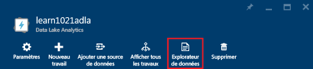
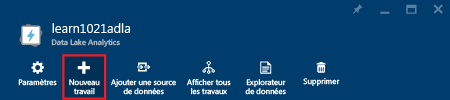
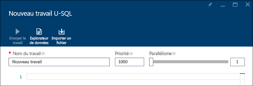
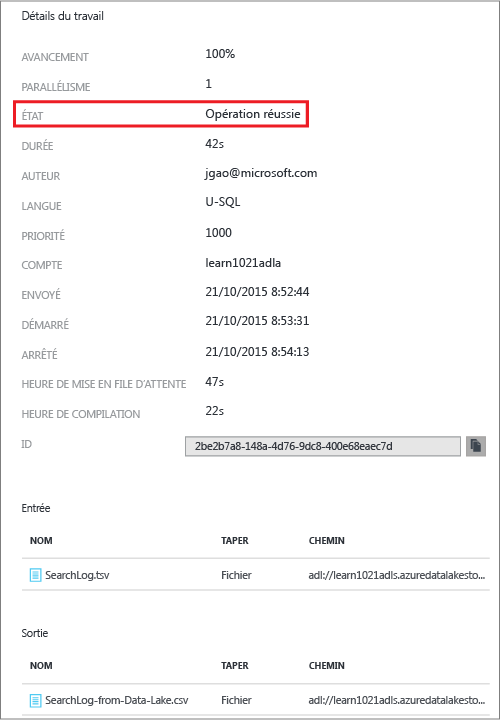
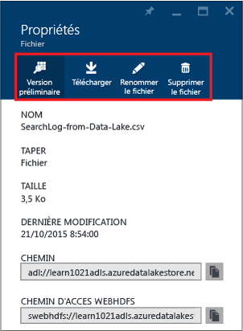

<properties 
   pageTitle="Prise en main d’Azure Data Lake Analytics à l’aide du portail Azure | Azure" 
   description="Découvrez comment utiliser le portail Azure pour créer un compte Data Lake Analytics, créer un travail Data Lake Analytics avec U-SQL et envoyer le travail. " 
   services="data-lake-analytics" 
   documentationCenter="" 
   authors="edmacauley" 
   manager="paulettm" 
   editor="cgronlun"/>
 
<tags
   ms.service="data-lake-analytics"
   ms.devlang="na"
   ms.topic="hero-article"
   ms.tgt_pltfrm="na"
   ms.workload="big-data" 
   ms.date="05/16/2016"
   ms.author="edmaca"/>

# Didacticiel : Prise en main du service Azure Data Lake Analytics à l’aide du portail Azure

[AZURE.INCLUDE [get-started-selector](../../includes/data-lake-analytics-selector-get-started.md)]

Découvrez comment utiliser le portail Azure pour créer des comptes Azure Data Lake Analytics, définir des travaux Data Lake Analytics dans [U-SQL](data-lake-analytics-u-sql-get-started.md) et envoyer des travaux à des comptes Data Lake Analytics. Pour plus d’informations sur Analytique Data Lake, consultez [Présentation d’Analytique Data Lake Azure](data-lake-analytics-overview.md).

Dans ce didacticiel, vous allez développer un travail qui lit un fichier TSV (valeurs séparées par des tabulations) et le convertir en fichier CSV (valeurs séparées par des virgules). Pour suivre ce didacticiel même à l'aide d'autres outils pris en charge, cliquez sur les onglets en haut de cette section. Une fois votre premier travail terminé, vous pouvez commencer à écrire des transformations de données plus complexes avec U-SQL.

[AZURE.INCLUDE [basic-process-include](../../includes/data-lake-analytics-basic-process.md)]

##Composants requis

Avant de commencer ce didacticiel, vous devez disposer des éléments suivants :

- **Un abonnement Azure**. Consultez la page [Obtention d’un essai gratuit d’Azure](https://azure.microsoft.com/pricing/free-trial/).

##Créer un compte Analytique Data Lake

Vous devez disposer d'un compte Data Lake Analytics avant de pouvoir exécuter des travaux quelconques.

Chaque compte Data Lake Analytics possède un compte [Azure Data Lake Store]() dépendant. Ce compte est désigné comme le compte Data Lake Store par défaut. Vous pouvez créer le compte Data Lake Store au préalable ou lorsque vous créez votre compte Data Lake Analytics. Dans ce didacticiel, vous allez créer le compte Data Lake Store avec le compte Data Lake Analytics.

**Pour créer un compte Analytique Data Lake**

1. Connectez-vous au nouveau [portail Azure Classic](https://portal.azure.com).
2. Cliquez sur **Nouveau**, **Données + Analyse**, puis sur **Data Lake Analytics**.
6. Tapez ou sélectionnez les valeurs suivantes :

    

	- **Nom** : nom du compte Analytics.
	- **Data Lake Store** : chaque compte Data Lake Analytics possède un compte Data Lake Store dépendant. Le compte Data Lake Analytics et le compte Data Lake Store dépendant doivent se trouver dans le même centre de données Azure. Suivez les instructions pour créer un compte Data Lake Store ou sélectionnez-en un existant.
	- **Abonnement** : choisissez l'abonnement Azure utilisé pour le compte Analytics.
	- **Groupe de ressources**. Sélectionnez un groupe de ressources Azure existant ou créez-en un. Azure Resource Manager (ARM) vous permet de manipuler les ressources de votre application sous la forme d'un groupe. Pour plus d'informations, consultez [Présentation d'Azure Resource Manager](resource-group-overview.md).
	- **Emplacement**. Sélectionnez un centre de données Azure pour le compte Data Lake Analytics.
7. Sélectionnez **Épingler au Tableau d'accueil**. Cela est nécessaire pour ce didacticiel.
8. Cliquez sur **Create**. Le Tableau d'accueil du portail s'affiche. Une nouvelle vignette est ajoutée au Tableau d'accueil indiquant « Déploiement d'Azure Data Lake Analytics ». La création d'un compte Data Lake Analytics prend plusieurs minutes. Lorsque le compte est créé, le portail ouvre le compte dans un nouveau volet dans le portail.

	

Après la création d'un compte Data Lake Analytics, vous pouvez ajouter des comptes Data Lake Store et des comptes Azure Storage supplémentaires. Pour obtenir des instructions, consultez [Gestion des sources de données du compte Data Lake Analytics](data-lake-analytics-manage-use-portal.md#manage-account-data-sources).

##Préparer les données source

Dans ce didacticiel, vous allez traiter des journaux de recherche. Le journal de recherche peut être stocké dans Data Lake Store ou dans le stockage d’objets blobs Azure.

Le portail Azure fournit une interface utilisateur pour la copie de fichiers de données d’exemple vers le compte Data Lake par défaut, y compris un fichier de journal de recherche.

**Pour copier des fichiers de données d'exemple**

1. À partir du portail Azure, cliquez sur **Microsoft Azure** dans le coin supérieur gauche.
2. Cliquez sur la vignette indiquant le nom de votre compte Analytique Data Lake. Elle a été épinglée ici lorsque le compte a été créé. Si le compte n'est pas épinglé ici, consultez [Ouvrir un compte Data Lake Analytics à partir du portail](data-lake-analytics-manage-use-portal.md#access-adla-account) pour ouvrir le compte.
3. Développez le volet **Essentials**, puis cliquez sur **Explorer les exemples de travaux**. Ceci ouvre un autre volet appelé **Exemples de travaux**.
4. Cliquez sur **Copier les exemples de données**, puis cliquez sur **OK** pour confirmer.
5. Cliquez sur **Notification** qui est une icône en forme de cloche. Vous devez voir un message de journal indiquant **Mise à jour des exemples de données terminée**. Cliquez n'importe où en dehors du volet de notification pour la fermer.
7. Dans le volet du compte Data Lake Analytics, cliquez sur **Explorateur de données** en haut.

	

    Ceci ouvre deux volets. L'un est l'**Explorateur de données** et l'autre est le compte Data Lake Store par défaut.
8. Dans le volet du compte Data Lake Store par défaut, cliquez sur **Exemples** pour développer le dossier, puis cliquez sur **Données** pour développer le dossier. Vous devez voir les fichiers et dossiers suivants :

    - AmbulanceData/
    - AdsLog.tsv
    - SearchLog.tsv
    - version.txt
    - WebLog.log
    
    Dans ce didacticiel, nous allons utiliser SearchLog.tsv.

Dans la pratique, vous programmerez vos applications soit pour écrire les données dans des comptes de stockage liés, soit pour télécharger les données. Pour le téléchargement de fichiers, consultez [Téléchargement de données vers Data Lake Store](data-lake-analytics-manage-use-portal.md#upload-data-to-adls) ou [Téléchargement de données vers le stockage d'objets Blob](data-lake-analytics-manage-use-portal.md#upload-data-to-wasb).

##Création et envoi de travaux Data Lake Analytics

Une fois que vous avez préparé la source de données, vous pouvez démarrer le développement d'un script U-SQL.

**Pour envoyer le travail**

1. Dans le volet du compte Data Lake Analytics du portail, cliquez sur **Nouveau travail**.

	

    Si le volet ne s'affiche pas, consultez [Ouvrir un compte Data Lake Analytics à partir du portail](data-lake-analytics-manage-use-portal.md#access-adla-account).
4. Entrez le **Nom du travail** et le script U-SQL suivant :

	

        @searchlog =
            EXTRACT UserId          int,
                    Start           DateTime,
                    Region          string,
                    Query           string,
                    Duration        int?,
                    Urls            string,
                    ClickedUrls     string
            FROM "/Samples/Data/SearchLog.tsv"
            USING Extractors.Tsv();
        
        OUTPUT @searchlog   
            TO "/Output/SearchLog-from-Data-Lake.csv"
        USING Outputters.Csv();

	Ce script U-SQL lit le fichier de données source avec **Extractors.Tsv()**, puis crée un fichier csv avec **Outputters.Csv()**.
    
    Ne modifiez pas les deux chemins d’accès, sauf si vous copiez le fichier source dans un autre emplacement. L’analyse de données Analytique Data Lake créera le dossier de sortie s’il n’existe pas encore. Dans ce cas, nous utilisons des chemins d'accès simples et relatifs.
	
	Il est plus simple d'utiliser des chemins d'accès relatifs pour les fichiers stockés dans les comptes Data Lake par défaut. Vous pouvez également utiliser des chemins d’accès absolus. Par exemple :
    
        adl://<Data LakeStorageAccountName>.azuredatalakestore.net:443/Samples/Data/SearchLog.tsv
      

    Pour en savoir plus sur U-SQL, consultez [Prise en main du langage U-SQL Azure Data Lake Analytics](data-lake-analytics-u-sql-get-started.md) et [Référence du langage U-SQL](http://go.microsoft.com/fwlink/?LinkId=691348).
     
5. Cliquez sur **Soumettre le travail** en haut. Un nouveau volet Détails du travail s’ouvre. Dans la barre de titre, l'état du travail est affiché.
6. Attendez que l'état du travail passe à **Réussi**. Lorsque le travail est terminé, le portail ouvre les détails du travail dans un nouveau volet :

    

    Dans la capture d'écran précédente, vous pouvez voir que le travail a pris environ 1,5 minutes à partir de l'état Envoyé à l'état Terminé.
    
    En cas d'échec du travail, consultez [Surveillance et dépannage des travaux Data Lake Analytics](data-lake-analytics-monitor-and-troubleshoot-jobs-tutorials.md).

7. En bas du volet **Détail du travail**, cliquez sur le nom du travail dans **SearchLog-from-Data-Lake.csv**. Vous pouvez afficher un aperçu, télécharger, renommer et supprimer le fichier de sortie.

    
8. Cliquez sur **Aperçu** pour afficher le fichier de sortie.

    

##Voir aussi

- Pour voir une requête plus complexe, consultez [Analyse de journaux des sites web à l'aide d'Azure Data Lake Analytics](data-lake-analytics-analyze-weblogs.md).
- Pour commencer à développer des applications U-SQL, consultez [Développer des scripts U-SQL avec Data Lake Tools pour Visual Studio](data-lake-analytics-data-lake-tools-get-started.md).
- Pour connaître U-SQL, voir [Prise en main du langage U-SQL d’Analytique Data Lake Azure](data-lake-analytics-u-sql-get-started.md).
- Pour les tâches de gestion, consultez [Gestion d’Azure Data Lake Analytics à l’aide du portail Azure](data-lake-analytics-manage-use-portal.md).
- Pour obtenir une vue d'ensemble de Data Lake Analytics, consultez [Vue d'ensemble de Data Lake Analytics Azure](data-lake-analytics-overview.md).
- Pour afficher le même didacticiel en utilisant d’autres outils, cliquez sur les sélecteurs d’onglet en haut de la page.
- Pour consigner les informations de diagnostic, consultez [Accès aux journaux de diagnostic d’Azure Data Lake Analytics](data-lake-analytics-diagnostic-logs.md).

<!---HONumber=AcomDC_0810_2016-->