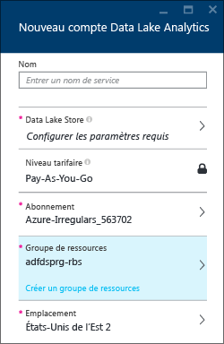
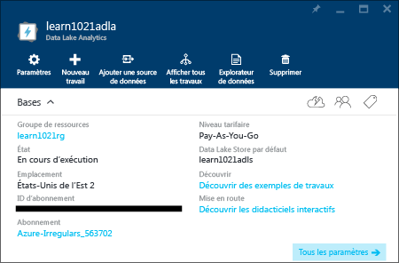
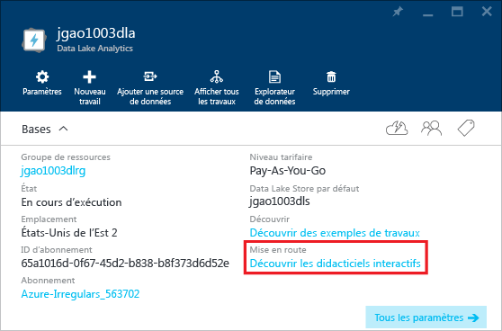

<properties 
   pageTitle="Découvrez Data Lake Analytics et U-SQL en utilisant les didacticiels interactifs du portail Azure | Azure" 
   description="Démarrage rapide avec Data Lake Analytics et U-SQL." 
   services="data-lake-analytics" 
   documentationCenter="" 
   authors="edmacauley" 
   manager="paulettm" 
   editor="cgronlun"/>
 
<tags
   ms.service="data-lake-analytics"
   ms.devlang="na"
   ms.topic="get-started-article"
   ms.tgt_pltfrm="na"
   ms.workload="big-data" 
   ms.date="02/11/2016"
   ms.author="edmaca"/>

# Utiliser les didacticiels interactifs Azure Data Lake Analytics

Le portail Azure fournit un didacticiel interactif pour vous familiariser avec Data Lake Analytics. Cet article vous montre comment parcourir le didacticiel pour l'analyse des journaux de sites web.

>[AZURE.NOTE] Si vous souhaitez suivre ce même didacticiel à l'aide de Visual Studio, consultez [Analyser les journaux des sites web à l'aide de Data Lake Analytics](data-lake-analytics-analyze-weblogs.md). D'autres didacticiels interactifs à ajouter au portail.

Pour les autres didacticiels, consultez :

- [Prise en main de Data Lake Analytics à l'aide du portail Azure](data-lake-analytics-get-started-portal.md)
- [Prise en main de Data Lake Analytics à l'aide d'Azure PowerShell](data-lake-analytics-get-started-powershell.md)
- [Prise en main de Data Lake Analytics à l'aide du Kit de développement logiciel (SDK) .NET](data-lake-analytics-get-started-net-sdk.md)
- [Développer des scripts U-SQL avec Data Lake Tools pour Visual Studio](data-lake-analytics-data-lake-tools-get-started.md) 

**Configuration requise**

Avant de commencer ce didacticiel, vous devez disposer des éléments suivants :

- **Un compte Data Lake Analytics**. Consultez [Prise en main d’Azure Data Lake Analytics à l'aide du portail Azure](data-lake-analytics-get-started-portal.md).

##Créer un compte Analytique Data Lake 

Vous devez disposer d'un compte Data Lake Analytics avant de pouvoir exécuter des travaux quelconques.

Chaque compte Data Lake Analytics possède un compte [Azure Data Lake Store](../data-lake-store/data-lake-store-overview.md) dépendant. Ce compte est désigné comme le compte Data Lake Store par défaut. Vous pouvez créer le compte Data Lake Store au préalable ou lorsque vous créez votre compte Data Lake Analytics. Dans ce didacticiel, vous allez créer le compte Data Lake Store avec le compte Analytics.

**Pour créer un compte Analytique Data Lake**

1. Connectez-vous au [portail Azure](https://portal.azure.com/signin/index/?Microsoft_Azure_Kona=true&Microsoft_Azure_DataLake=true&hubsExtension_ItemHideKey=AzureDataLake_BigStorage%2cAzureKona_BigCompute).
2. Cliquez sur **Microsoft Azure** dans le coin supérieur gauche pour ouvrir le Tableau d'accueil.
3. Cliquez sur la vignette **Marketplace**.  
3. Tapez **Azure Data Lake Analytics** dans la zone de recherche du volet **Tout**, puis appuyez sur **ENTRÉE**. Vous devez voir **Azure Data Lake Analytics** dans la liste.
4. Cliquez sur **Azure Data Lake Analytics** dans la liste.
5. Cliquez sur **Créer** figurant en bas du volet.
6. Tapez ou sélectionnez les valeurs suivantes :

    

	- **Nom** : nom du compte Analytics.
	- **Data Lake Store** : chaque compte Data Lake Analytics possède un compte Data Lake Store dépendant. Le compte Data Lake Analytics et le compte Data Lake Store dépendant doivent se trouver dans le même centre de données Azure. Suivez les instructions pour créer un compte Data Lake Store ou sélectionnez-en un existant.
	- **Abonnement** : choisissez l'abonnement Azure utilisé pour le compte Analytics.
	- **Groupe de ressources**. Sélectionnez un groupe de ressources Azure existant ou créez-en un. Les applications sont généralement constituées de nombreux composants, par exemple une application web, base de données, serveur de base de données, stockage et services tiers. Azure Resource Manager (ARM) vous permet de manipuler les ressources de votre application sous la forme d’un groupe, nommé groupe de ressources Azure. Vous pouvez déployer, mettre à jour, surveiller ou supprimer toutes les ressources de votre application dans le cadre d’une opération unique et coordonnée. Vous utilisez un modèle de déploiement pouvant fonctionner avec différents environnements (environnements de test, intermédiaire et de production). Vous pouvez clarifier la facturation pour votre organisation en visualisant les coûts cumulés pour l’ensemble du groupe. Pour plus d'informations, consultez [Présentation d'Azure Resource Manager](resource-group-overview.md). 
	- **Emplacement**. Sélectionnez un centre de données Azure pour le compte Data Lake Analytics. 
7. Sélectionnez **Épingler au Tableau d'accueil**. Cela est nécessaire pour ce didacticiel.
8. Cliquez sur **Create**. Le Tableau d'accueil du portail s'affiche. Une nouvelle vignette est ajoutée à la page d'accueil indiquant « Déploiement d'Azure Data Lake Analytics ». La création d'un compte Data Lake Analytics prend plusieurs minutes. Lorsque le compte est créé, le portail ouvre le compte dans un nouveau volet.

	

##Exécuter le didacticiel interactif d'analyse des journaux des sites web

**Pour ouvrir le didacticiel interactif d'analyse des journaux des sites web**

1. Dans le portail, cliquez sur **Microsoft Azure** dans le menu de gauche pour ouvrir le Tableau d'accueil.
2. Cliquez sur la vignette liée à votre compte Data Lake Analytics.
3. Cliquez sur **Explorer les didacticiels interactifs** à partir de la barre **Essentials**.

	

4. Si vous voyez un avertissement orange indiquant « Exemples non configurés, cliquez sur... », cliquez sur **Copier les exemples de données** pour copier les exemples de données vers le compte Data Lake Store par défaut. Le didacticiel interactif a besoin des données pour s'exécuter.
5. À partir du volet **Didacticiels interactifs**, cliquez sur **Analyse des journaux des sites web**. Le portail ouvre le didacticiel dans un nouveau volet de portail.
5. Cliquez sur **1 Introduction**, puis suivez les instructions.

##Voir aussi

- [Vue d'ensemble de Microsoft Azure Data Lake Analytics](data-lake-analytics-overview.md)
- [Prise en main de Data Lake Analytics à l'aide du portail Azure](data-lake-analytics-get-started-portal.md)
- [Prise en main de Data Lake Analytics à l'aide d'Azure PowerShell](data-lake-analytics-get-started-powershell.md)
- [Développer des scripts U-SQL avec Data Lake Tools pour Visual Studio](data-lake-analytics-data-lake-tools-get-started.md)
- [Analyser les journaux des sites web à l'aide d'Azure Data Lake Analytics](data-lake-analytics-analyze-weblogs.md)

<!---HONumber=AcomDC_0504_2016-->