# Contrôle d’accès dans Azure Data Lake Store
Data Lake Store met en œuvre un modèle de contrôle d’accès dérivé de HDFS et, de ce fait, du modèle de contrôle d’accès POSIX. Cet article présente les notions de base du modèle de contrôle d’accès pour Data Lake Store. Pour en savoir plus sur le modèle de contrôle d’accès HDFS, reportez-vous au [guide des autorisations HDFS](https://hadoop.apache.org/docs/current/hadoop-project-dist/hadoop-hdfs/HdfsPermissionsGuide.html).

## Listes de contrôle d’accès sur les fichiers et dossiers
Il existe deux types de listes de contrôle d’accès (ACL) : les **ACL d’accès** et les **ACL par défaut**.

* **ACL d’accès** : elles contrôlent l’accès à un objet. Les fichiers et les dossiers ont tous des ACL d’accès.
* **ACL par défaut** : « modèle » d’ACL associé à un dossier, qui détermine les ACL d’accès pour tous les éléments enfants créés dans ce dossier. Les fichiers n’ont pas d’ACL par défaut.

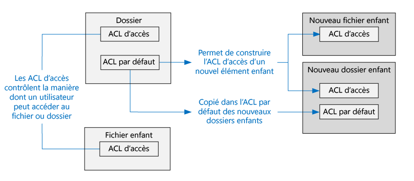

Les ACL d’accès et les ACL par défaut ont la même structure.

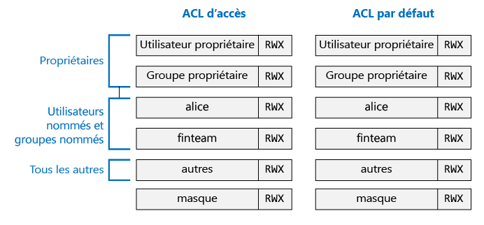

> [!NOTE]
> La modification de l’ACL par défaut d’un parent n’affecte pas l’ACL d’accès ni l’ACL par défaut des éléments enfants qui existent déjà.
> 
> 

## Utilisateurs et identités
Chaque fichier et dossier dispose d’autorisations distinctes pour ces identités :

* L’utilisateur propriétaire du fichier
* Le groupe propriétaire
* Les utilisateurs nommés
* Les groupes nommés
* Tous les autres utilisateurs

Les identités des utilisateurs et des groupes sont des identités Azure Active Directory (AAD). Par conséquent, sauf indication contraire, un « utilisateur », dans le contexte de Data Lake Store, peut correspondre soit à un utilisateur AAD, soit à un groupe de sécurité AAD.

## Autorisations
Les autorisations sur un objet de système de fichiers sont **Lecture**, **Écriture** et **Exécution**. Elles peuvent être utilisées sur les fichiers et les dossiers tel qu’indiqué dans la table ci-dessous.

|  | Fichier | Dossier |
| --- | --- | --- |
| **Lecture (R)** |Permet de lire le contenu d’un fichier |Requiert les autorisations **Lecture** et **Exécution** pour répertorier le contenu du dossier. |
| **Écriture (W)** |Permet d’écrire ou d’ajouter du contenu dans un fichier |Requiert les autorisations **Écriture et Exécution** pour créer des éléments enfants dans un dossier. |
| **Exécution (X)** |Ne signifie rien dans le contexte de Data Lake Store |Requis pour parcourir les éléments enfants d’un dossier. |

### Formes abrégées des autorisations
**RWX** sert à indiquer **Lecture + Écriture + Exécution**. Il existe une forme numérique plus condensée dans laquelle **Lecture = 4**, **Écriture = 2** et **Exécution = 1**. Les autorisations sont représentées par la somme de ces chiffres. Vous trouverez quelques exemples ci-dessous.

| Forme numérique | Forme abrégée | Signification |
| --- | --- | --- |
| 7 |RWX |Lecture + Écriture + Exécution |
| 5 |R-X |Lecture + Exécution |
| 4 |R-- |Lire |
| 0 |--- |Aucune autorisation |

### Les autorisations ne se transmettent pas en héritage
Dans le modèle de style POSIX utilisé par Data Lake Store, les autorisations d’un élément sont stockées sur l’élément lui-même. En d’autres termes, les autorisations d’un élément ne peuvent pas être héritées des éléments parents.

## Scénarios courants liés aux autorisations
Voici quelques scénarios courants pour comprendre les autorisations nécessaires pour effectuer certaines opérations sur un compte Data Lake Store.

### Autorisations nécessaires pour lire un fichier
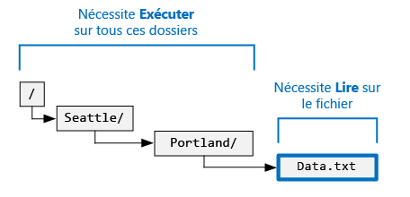

* Pour le fichier à lire : l’appelant doit disposer de l’autorisation **Lecture**
* Pour tous les dossiers dans la structure de dossiers contenant le fichier : l’appelant doit disposer de l’autorisation **Exécution**

### Autorisations nécessaires pour ajouter du contenu à un fichier
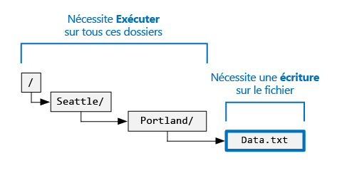

* Pour le fichier auquel ajouter du contenu : l’appelant doit disposer de l’autorisation **Écriture**
* Pour tous les dossiers qui contiennent le fichier : l’appelant doit disposer de l’autorisation **Exécution**

### Autorisations nécessaires pour supprimer un fichier
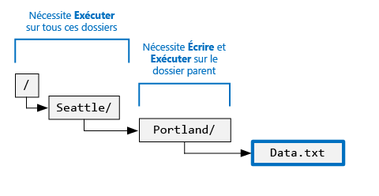

* Pour le dossier parent : l’appelant doit disposer des autorisations **Écriture + Exécution**
* Pour tous les autres dossiers du chemin du fichier : l’appelant doit disposer de l’autorisation **Exécution**

> [!NOTE]
> L’autorisation d’écrire sur le fichier n’est pas nécessaire pour supprimer le fichier, tant que les deux conditions ci-dessus sont remplies.
> 
> 

### Autorisations nécessaires pour énumérer un dossier
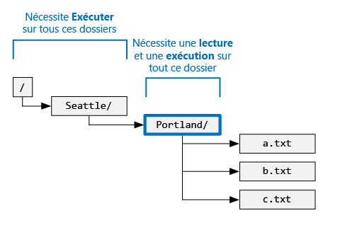

* Pour le dossier à énumérer : l’appelant doit disposer des autorisations **Lecture + Exécution**
* Pour tous les dossiers parents : l’appelant doit disposer de l’autorisation **Exécution**

## Affichage des autorisations dans le portail Azure
À partir du panneau **Explorateur de données** du compte Data Lake Store, cliquez sur **Accès** pour afficher les ACL pour un fichier ou un dossier. Dans la capture d’écran ci-dessous, cliquez sur Accès pour afficher les ACL pour le dossier **catalogue** du compte **mydatastore**.

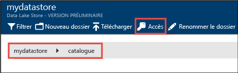

Ensuite, dans le panneau **Accès**, cliquez sur **Affichage simple** pour afficher une vue plus simple.

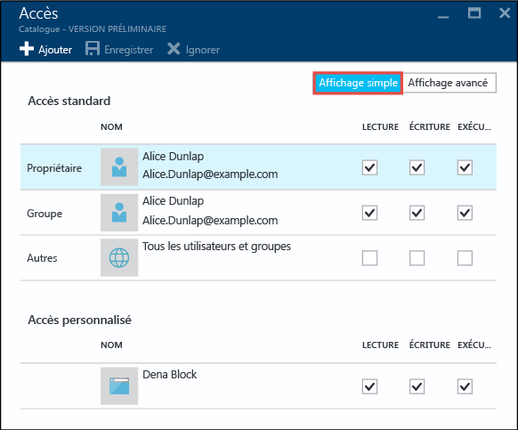

Cliquez sur **Affichage avancé** pour afficher une vue plus avancée.

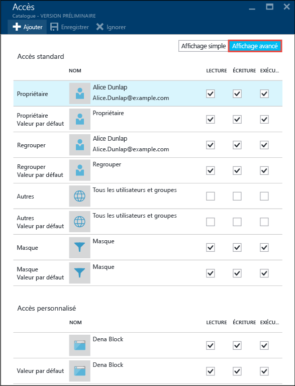

## Les super utilisateurs
Les super utilisateurs sont ceux qui ont le plus de droits parmi tous les utilisateurs de Data Lake Store. Un super utilisateur :

* dispose des autorisations RWX sur **tous** les fichiers et dossiers ;
* peut modifier les autorisations de n’importe quel fichier ou dossier ;
* peut modifier l’utilisateur propriétaire ou le groupe propriétaire d’un fichier ou d’un dossier.

Dans Azure, il existe plusieurs rôles Azure pour les comptes Data Lake Store :

* Propriétaires
* Contributeurs
* Lecteurs
* etc.

Toutes les personnes ayant le rôle **Propriétaire** pour un compte Data Lake Store sont automatiquement considérées comme des super utilisateurs pour ce compte. Pour en savoir plus sur le contrôle d’accès en fonction du rôle Azure (RBAC), consultez [Contrôle d’accès en fonction du rôle](../active-directory/role-based-access-control-configure.md).

## L’utilisateur propriétaire
L’utilisateur qui a créé l’élément est automatiquement l’utilisateur propriétaire de l’élément. Les utilisateurs propriétaires peuvent :

* modifier les autorisations des fichiers détenus ;
* modifier le groupe propriétaire d’un fichier détenu, tant que l’utilisateur propriétaire est également membre du groupe cible.

> [!NOTE]
> L’utilisateur propriétaire **ne peut pas** modifier l’utilisateur propriétaire d’un autre fichier lui appartenant. Seuls les super utilisateurs peuvent modifier l’utilisateur propriétaire d’un fichier ou d’un dossier.
> 
> 

## Le groupe propriétaire
Dans les ACL POSIX, chaque utilisateur est associé à un « groupe principal ». Par exemple, l’utilisateur « alice » peut appartenir au groupe « finance ». Alice peut appartenir à plusieurs groupes, mais un groupe est toujours désigné comme son groupe principal. Dans POSIX, lorsqu’Alice crée un fichier, son groupe principal est défini comme groupe propriétaire de ce fichier, dans le cas présent « finance ».

Lorsqu’un nouvel élément de système de fichiers est créé, Data Lake Store affecte une valeur au groupe propriétaire.

* **Cas 1** : le dossier racine « / ». Ce dossier est créé lors de la création d’un compte Data Lake Store. Dans ce cas, le groupe propriétaire est défini sur l’utilisateur qui a créé le compte.
* **Cas 2** (tous les autres cas) : lorsqu’un nouvel élément est créé, le groupe propriétaire est copié à partir du dossier parent.

Le groupe propriétaire peut être modifié par :

* les super utilisateurs ;
* l’utilisateur propriétaire, si l’utilisateur propriétaire est également membre du groupe cible.

## Algorithme de vérification des accès
L’illustration suivante représente l’algorithme de vérification des accès pour les comptes Data Lake Store.

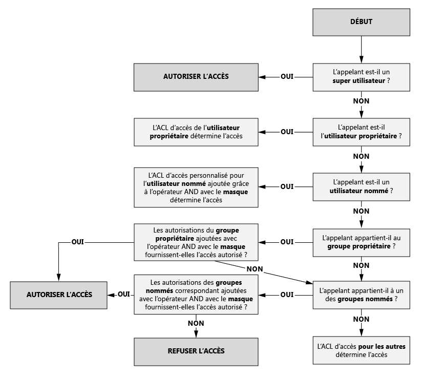

## Le masque et les « autorisations effectives »
Le **masque** est une valeur RWX utilisée pour limiter l’accès aux **utilisateurs nommés**, au **groupe propriétaire** et aux **groupes nommés** lors de l’exécution de l’algorithme de vérification des accès. Voici les concepts clés du masque.

* Le masque crée des « autorisations effectives », c’est-à-dire qu’il modifie les autorisations au moment de la vérification des accès.
* Le masque peut être modifié directement par le propriétaire du fichier et les super utilisateurs.
* Le masque a la possibilité de supprimer des autorisations pour créer l’autorisation effective. Le masque **ne peut pas** ajouter d’autorisations à l’autorisation effective.

Prenons quelques exemples. Ci-dessous, le masque est défini sur **RWX**, ce qui signifie qu’il ne supprime aucune autorisation. Notez que les autorisations effectives pour un utilisateur nommé, un groupe propriétaire et un groupe nommé ne sont pas modifiées lors de la vérification des accès.

Dans l’exemple ci-dessous, le masque est défini sur **R-X**. Par conséquent, il **désactive l’autorisation d’écriture** pour l’**utilisateur nommé**, le **groupe propriétaire** et le **groupe nommé** au moment de la vérification des accès.

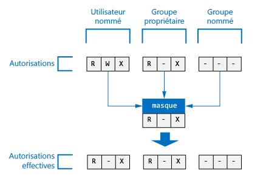

Pour référence, voici où apparaît le masque d’un fichier ou d’un dossier dans le portail Azure.

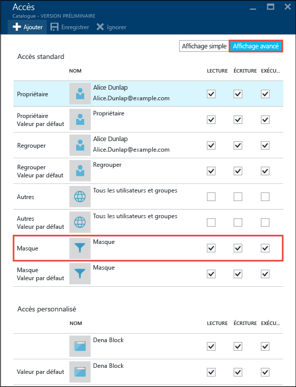

> [!NOTE]
> Pour un nouveau compte Data Lake Store, le masque de l’ACL d’accès et de l’ACL par défaut du dossier racine (« / ») est défini par défaut sur RWX.
> 
> 

## Autorisations sur les nouveaux fichiers et dossiers
Lorsqu’un nouveau fichier ou dossier est créé dans un dossier existant, l’ACL par défaut sur le dossier parent détermine :

* L’ACL par défaut et l’ACL d’accès pour un dossier enfant
* L’ACL d’accès pour un fichier enfant (ces fichiers n’ont pas d’ACL par défaut)

### L’ACL d’accès pour un fichier ou dossier enfant
Lorsqu’un fichier ou dossier enfant est créé, l’ACL par défaut du parent est copiée comme ACL d’accès du fichier ou du dossier enfant. En outre, si un **autre** utilisateur dispose des autorisations RWX dans l’ACL par défaut du parent, il est totalement supprimé de l’ACL d’accès de l’élément enfant.

Dans la plupart des cas, les informations ci-dessus constituent tout ce que vous devez savoir sur la manière dont l’ACL d’accès d’un élément enfant est définie. Toutefois, si vous connaissez les systèmes POSIX et que vous souhaitez comprendre dans le détail comment cette transformation est réalisée, consultez la section [Rôle de l’umask lors de la création de l’ACL d’accès pour les nouveaux fichiers et dossiers](#umasks-role-in-creating-the-access-acl-for-new-files-and-folders), plus loin dans cet article.

### ACL par défaut pour un dossier enfant
Lors de la création d’un dossier enfant sous un dossier parent, l’ACL par défaut du dossier parent est copiée, telle quelle, en tant qu’ACL par défaut du dossier enfant.

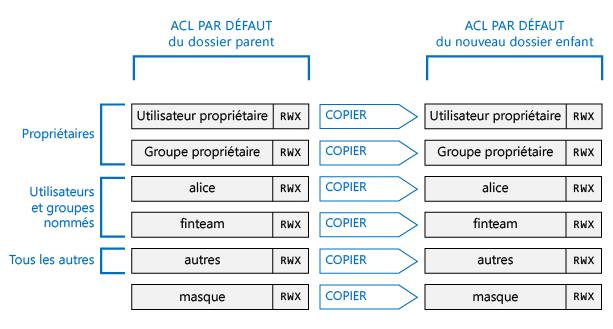

## Rubriques avancées permettant de comprendre les ACL dans Data Lake Store
Voici quelques rubriques avancées pour vous aider à comprendre comment les ACL sont déterminées pour les fichiers ou dossiers Date Lake Store.

### Rôle de l’umask lors de la création de l’ACL d’accès pour les nouveaux fichiers et dossiers
Dans un système compatible POSIX, le concept général est que l’umask est une valeur 9 bits sur le dossier parent permettant de transformer l’autorisation pour l’**utilisateur propriétaire**, le **groupe propriétaire** et les **autres** rôles sur l’ACL d’accès d’un nouveau fichier ou dossier enfant. Les bits d’un umask identifient les bits à désactiver dans l’ACL d’accès de l’élément enfant. Par conséquent, il est utilisé pour empêcher, de manière sélective, la propagation des autorisations pour l’utilisateur propriétaire, le groupe propriétaire et les autres rôles.

Dans un système HDFS, l’umask est généralement une option de configuration à l’échelle du site, contrôlée par les administrateurs. Data Lake Store utilise un **umask à l’échelle du compte** qui ne peut pas être modifié. La table suivante présente l’umask de Data Lake Store.

| Groupe d'utilisateurs | Paramètre | Effet sur l’ACL d’accès du nouvel élément enfant |
| --- | --- | --- |
| Utilisateur propriétaire |--- |Aucun effet |
| Groupe propriétaire |--- |Aucun effet |
| Autres |RWX |Supprimer Lecture + Écriture + Exécution |

L’illustration suivante représente ce umask en action. L’effet immédiat est la suppression des autorisations **Lecture + Écriture + Exécution** pour les **autres** utilisateurs. Dans la mesure où l’umask n’a pas spécifié de bits pour l’**utilisateur propriétaire** et le **groupe propriétaire**, ces autorisations ne sont pas modifiées.

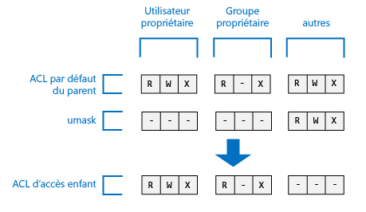

### Le sticky bit
Le sticky bit est une fonctionnalité avancée d’un système de fichiers POSIX. Dans le contexte de Data Lake Store, il est peu probable que le sticky bit soit nécessaire.

La table ci-dessous montre comment le sticky bit fonctionne dans Data Lake Store.

| Groupe d'utilisateurs | Fichier | Dossier |
| --- | --- | --- |
| Sticky bit **DÉSACTIVÉ** |Aucun effet |Aucun effet |
| Sticky bit **ACTIVÉ** |Aucun effet |Empêche une personne autre que les **super utilisateurs** et l’**utilisateur propriétaire** d’un élément enfant de supprimer ou de renommer cet élément enfant. |

Le sticky bit n’est pas affiché dans le portail Azure.

## Questions les plus fréquentes sur les ACL dans Data Lake Store
Voici quelques questions fréquentes concernant les ACL dans Data Lake Store.

### Dois-je activer la prise en charge des ACL ?
Non. Le contrôle d’accès via les ACL est toujours activé pour les comptes Data Lake Store.

### Quelles sont les autorisations nécessaires pour supprimer de manière récursive un dossier et son contenu ?
* L’utilisateur doit disposer des autorisations **Écriture + Exécution** sur le dossier parent.
* L’utilisateur doit disposer des autorisations **Lecture + Écriture + Exécution** sur le dossier à supprimer, et tous les dossiers qu’il contient.
  >[AZURE.NOTE] La suppression des fichiers dans des dossiers ne nécessite pas l’autorisation Écriture sur ces fichiers. En outre, le dossier racine « / » ne peut **jamais** être supprimé.

### Qui est défini comme propriétaire d’un fichier ou d’un dossier ?
Le créateur d’un fichier ou d’un dossier en devient le propriétaire.

### Qui est défini comme groupe propriétaire d’un fichier ou d’un dossier lors de sa création ?
Cette information est copiée à partir du groupe propriétaire du dossier parent sous lequel le nouveau fichier ou dossier est créé.

### Je suis l’utilisateur propriétaire d’un fichier, mais je n’ai pas les autorisations RWX dont j’ai besoin. Que faire ?
L’utilisateur propriétaire peut modifier les autorisations du fichier pour s’accorder les autorisations RWX dont il a besoin.

### Data Lake Store prend-il en charge l’héritage des ACL ?
Non.

### Quelle est la différence entre le masque et umask ?
| masque | umask |
| --- | --- |
| La propriété **mask** est disponible sur tous les fichiers et dossiers. |**umask** est une propriété du compte Data Lake Store. Ainsi, il existe un seul umask dans Data Lake Store. |
| La propriété mask sur un fichier ou dossier peut être modifiée par l’utilisateur propriétaire ou le groupe propriétaire d’un fichier, ou par un super utilisateur. |La propriété umask ne peut être modifiée par aucun utilisateur, même pas par un super utilisateur. Il s’agit d’une valeur constante non modifiable. |
| La propriété mask est utilisée lors de l’exécution de l’algorithme de vérification des accès pour déterminer si un utilisateur a le droit d’effectuer une opération sur un fichier ou dossier. Le rôle du masque est de créer des « autorisations effectives » au moment de la vérification des accès. |L’umask n’est pas utilisé lors de la vérification des accès. L’umask est utilisé pour déterminer l’ACL d’accès des nouveaux éléments enfants d’un dossier. |
| Le masque est une valeur RWX de 3 bits qui s’applique à l’utilisateur nommé, au groupe nommé et à l’utilisateur propriétaire au moment de la vérification des accès. |L’umask est une valeur de 9 bits qui s’applique à l’utilisateur propriétaire, au groupe propriétaire et aux autres rôles d’un nouvel enfant. |

### Comment en savoir plus sur le modèle de contrôle d’accès POSIX ?
* [http://www.vanemery.com/Linux/ACL/POSIX\_ACL\_on\_Linux.html](http://www.vanemery.com/Linux/ACL/POSIX_ACL_on_Linux.html)
* [Guide des autorisations HDFS](http://hadoop.apache.org/docs/current/hadoop-project-dist/hadoop-hdfs/HdfsPermissionsGuide.html)
* [Forum aux questions POSIX](http://www.opengroup.org/austin/papers/posix_faq.html)
* [POSIX 1003.1 2008](http://standards.ieee.org/findstds/standard/1003.1-2008.html)
* [POSIX 1003.1e 1997](http://users.suse.com/~agruen/acl/posix/Posix_1003.1e-990310.pdf)
* [ACL POSIX sous Linux](http://users.suse.com/~agruen/acl/linux-acls/online/)
* [ACL à l’aide des listes de contrôle d’accès sous Linux](http://bencane.com/2012/05/27/acl-using-access-control-lists-on-linux/)

## Voir aussi
* [Présentation d’Azure Data Lake Store](data-lake-store-overview.md)
* [Prise en main d'Azure Data Lake Analytics](../data-lake-analytics/data-lake-analytics-get-started-portal.md)

<!---HONumber=AcomDC_0914_2016-->
