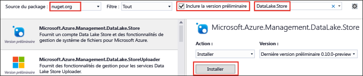
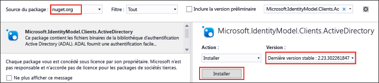

<properties
   pageTitle="Utiliser le Kit de développement logiciel (SDK) .NET Data Lake Store pour développer des applications | Azure"
   description="Utiliser le Kit de développement logiciel (SDK) .NET Azure Data Lake Store pour développer des applications"
   services="data-lake-store"
   documentationCenter=""
   authors="nitinme"
   manager="paulettm"
   editor="cgronlun"/>

<tags
   ms.service="data-lake-store"
   ms.devlang="na"
   ms.topic="hero-article"
   ms.tgt_pltfrm="na"
   ms.workload="big-data"
   ms.date="04/20/2016"
   ms.author="nitinme"/>

# Prise en main d’Azure Data Lake Store à l’aide du Kit de développement logiciel (SDK) .NET

> [AZURE.SELECTOR]
- [Portail](data-lake-store-get-started-portal.md)
- [PowerShell](data-lake-store-get-started-powershell.md)
- [Kit SDK .NET](data-lake-store-get-started-net-sdk.md)
- [Kit SDK Java](data-lake-store-get-started-java-sdk.md)
- [API REST](data-lake-store-get-started-rest-api.md)
- [Interface de ligne de commande Azure](data-lake-store-get-started-cli.md)
- [Node.JS](data-lake-store-manage-use-nodejs.md)

Apprenez à utiliser le Kit de développement logiciel (SDK) .NET Azure Data Lake Store pour créer un compte Azure Data Lake et effectuer des opérations de base comme créer des dossiers, télécharger des fichiers de données, supprimer votre compte, etc. Pour plus d’informations sur Data Lake, consultez [Azure Data Lake Store](data-lake-store-overview.md).

## Configuration requise

* Visual Studio 2013 ou 2015. Les instructions ci-dessous utilisent Visual Studio 2015.
* **Un abonnement Azure**. Consultez la page [Obtention d’un essai gratuit d’Azure](https://azure.microsoft.com/pricing/free-trial/).
* **Activez votre abonnement Azure** pour la version d'évaluation publique de Data Lake Store. Consultez les [instructions](data-lake-store-get-started-portal.md#signup).
* **Créez une application Azure Active Directory**. Consultez [Création de l’application Active Directory et du principal du service à l’aide du portail](../resource-group-create-service-principal-portal.md). Pour une application console .NET que vous créez dans cet article, vous devez créer une **Application cliente native** (et non une application web, comme illustré dans le lien). Une fois que vous avez créé l’application, récupérez les valeurs suivantes liées à l’application.
	- Obtenez l’**ID client** et l’**URI de redirection** associés à l’application.
	- Définir des autorisations déléguées

	Vous pouvez utiliser le lien ci-dessus pour obtenir des instructions sur la manière de récupérer ces valeurs et définir les autorisations.

## Créer une application .NET

1. Ouvrez Visual Studio et créez une application console.

2. Dans le menu **Fichier**, cliquez sur **Nouveau**, puis sur **Projet**.

3. Dans **Nouveau projet**, entrez ou sélectionnez les valeurs suivantes :

	| Propriété | Valeur |
	|----------|-----------------------------|
	| Catégorie | Modèles/Visual C#/Windows |
	| Modèle | Application console |
	| Nom | CreateADLApplication |

4. Cliquez sur **OK** pour créer le projet.

5. Ajoutez les packages Nuget à votre projet.

	1. Dans l’Explorateur de solutions, cliquez avec le bouton droit sur le nom du projet, puis cliquez sur **Gérer les packages NuGet**.
	2. Dans l’onglet **Gestionnaire de package Nuget**, assurez-vous que **Source du package** a la valeur **nuget.org** et que la case **Inclure la version préliminaire** est cochée.
	3. Recherchez et installez les packages Data Lake Store suivants :

		* `Microsoft.Azure.Management.DataLake.Store`
		* `Microsoft.Azure.Management.DataLake.StoreUploader`

		

	4. Installez également le package `Microsoft.IdentityModel.Clients.ActiveDirectory` pour l’authentification Azure Active Directory. Veillez à *décocher* la case **inclure la version préliminaire** afin de pouvoir installer une version stable de ce package.

		

	5. Fermez le **Gestionnaire de package NuGet**.

7. Ouvrez **Program.cs**, supprimez le code existant, puis intégrez les instructions suivantes pour ajouter des références aux espaces de noms.

		using System;
        using System.IO;
        using System.Security;
        using System.Text;
        using System.Collections.Generic;
        using System.Linq;

        using Microsoft.Azure.Management.DataLake.Store;
        using Microsoft.Azure.Management.DataLake.Store.Models;
        using Microsoft.Azure.Management.DataLake.StoreUploader;
        using Microsoft.IdentityModel.Clients.ActiveDirectory;
        using Microsoft.Rest;

8. Déclarez les variables comme indiqué ci-dessous et indiquez les valeurs pour le nom du Data Lake Store et le nom du groupe de ressources. Le nom Data Lake Store que vous fournissez est créé par l'application. Le groupe de ressources que vous fournissez ici doit déjà exister. En outre, assurez-vous que le chemin d'accès local et le nom de fichier que vous fournissez ici existent sur l'ordinateur. Ajoutez l'extrait de code suivant après les déclarations d'espace de noms.

		namespace SdkSample
        {
            class Program
            {
                private static DataLakeStoreAccountManagementClient _adlsClient;
                private static DataLakeStoreFileSystemManagementClient _adlsFileSystemClient;

                private static string _adlsAccountName;
                private static string _resourceGroupName;
                private static string _location;

                private static void Main(string[] args)
                {
                    _adlsAccountName = "<DATA-LAKE-STORE-NAME>"; // TODO: Replace this value with the name for a NEW Store account.
                    _resourceGroupName = "<RESOURCE-GROUP-NAME>"; // TODO: Replace this value. This resource group should already exist.
                    _location = "East US 2";

                    string localFolderPath = @"C:\local_path"; // TODO: Make sure this exists and can be overwritten.
                    string localFilePath = localFolderPath + "file.txt"; // TODO: Make sure this exists and can be overwritten.
                    string remoteFolderPath = "/data_lake_path/";
                    string remoteFilePath = remoteFolderPath + "file.txt";
				}
			}
		}

Dans les sections suivantes de cet article, vous découvrirez comment utiliser les méthodes .NET pour effectuer des opérations telles que l’authentification des utilisateurs, la création de comptes Data Lake Store, le téléchargement de fichiers, etc.. Si vous recherchez un exemple complet sur l'utilisation de Data Lake Store, consultez l’[Annexe](#appendix-sample-code) en bas de cet article.

## Authentification de l'utilisateur

Deux méthodes sont disponibles pour vous authentifier à l’aide d’Azure Active Directory :

* **Interactive**, pour laquelle un utilisateur s’inscrit avec de l’application. Cela est implémenté avec la méthode `AuthenticateUser` dans l’extrait de code ci-dessous.

* **Non interactive**, pour laquelle l’application fournit ses propres informations d’identification. Cela est implémenté avec la méthode `AuthenticateAppliaction` dans l’extrait de code ci-dessous.

### Authentification interactive

L'extrait de code suivant montre une méthode `AuthenticateUser` que vous pouvez utiliser pour une expérience de connexion interactive.

 	// Authenticate the user with AAD through an interactive popup.
    // You need to have an application registered with AAD in order to authenticate.
    //   For more information and instructions on how to register your application with AAD, see:
    //   https://azure.microsoft.com//documentation/articles/resource-group-create-service-principal-portal/
	public static TokenCredentials AuthenticateUser(string tenantId, string resource, string appClientId, Uri appRedirectUri, string userId = "")
	{
	    var authContext = new AuthenticationContext("https://login.microsoftonline.com/" + tenantId);
	
	    var tokenAuthResult = authContext.AcquireToken(resource, appClientId, appRedirectUri,
	        PromptBehavior.Auto, UserIdentifier.AnyUser);
	
	    return new TokenCredentials(tokenAuthResult.AccessToken);
	}

### Authentification non interactive

L'extrait de code suivant montre une méthode `AuthenticateApplication` que vous pouvez utiliser pour une expérience de connexion non interactive.

	// Authenticate the application with AAD through the application's secret key.
	// You need to have an application registered with AAD in order to authenticate.
	//   For more information and instructions on how to register your application with AAD, see:
	//   https://azure.microsoft.com//documentation/articles/resource-group-create-service-principal-portal/
	public static TokenCredentials AuthenticateApplication(string tenantId, string resource, string appClientId, Uri appRedirectUri, SecureString clientSecret)
	{
	    var authContext = new AuthenticationContext("https://login.microsoftonline.com/" + tenantId);
	    var credential = new ClientCredential(appClientId, clientSecret);
	
	    var tokenAuthResult = authContext.AcquireToken(resource, credential);
	
	    return new TokenCredentials(tokenAuthResult.AccessToken);
	}
	
## Créer un compte Data Lake Store

L'extrait de code suivant montre une méthode `CreateAccount` que vous pouvez utiliser pour créer un compte Data Lake Store.

	// Create Data Lake Store account
    public static void CreateAccount()
    {
        var adlsParameters = new DataLakeStoreAccount(location: _location);
        _adlsClient.Account.Create(_resourceGroupName, _adlsAccountName, adlsParameters);
    } 

## Répertorier tous les comptes Data Lake Store pour un abonnement

L'extrait de code suivant illustre la méthode `ListAdlStoreAccounts` qui vous permet de répertorier tous les comptes Data Lake Store pour un abonnement Azure donné.

	// List all ADLS accounts within the subscription
	public static List<DataLakeStoreAccount> ListAdlStoreAccounts()
	{
	    var response = _adlsClient.Account.List(_adlsAccountName);
	    var accounts = new List<DataLakeStoreAccount>(response);
	
	    while (response.NextPageLink != null)
	    {
	        response = _adlsClient.Account.ListNext(response.NextPageLink);
	        accounts.AddRange(response);
	    }
	
	    return accounts;
	}

## Créer un répertoire

L'extrait de code suivant montre une méthode `CreateDirectory` que vous pouvez utiliser pour créer un répertoire au sein d’un compte Data Lake Store.

	// Create a directory
    public static void CreateDirectory(string path)
    {
        _adlsFileSystemClient.FileSystem.Mkdirs(_adlsAccountName, path);
    }

## Télécharger un fichier sur Data Lake Store

L'extrait de code suivant montre une méthode `UploadFile` que vous pouvez utiliser pour télécharger des fichiers sur un compte Data Lake Store.

	// Upload a file
    public static void UploadFile(string srcFilePath, string destFilePath, bool force = true)
    {
        var parameters = new UploadParameters(srcFilePath, destFilePath, _adlsAccountName, isOverwrite: force);
        var frontend = new DataLakeStoreFrontEndAdapter(_adlsAccountName, _adlsFileSystemClient);
        var uploader = new DataLakeStoreUploader(parameters, frontend);
        uploader.Execute();
    }

## Obtenir des informations sur un fichier ou répertoire

L'extrait de code suivant montre une méthode `GetItemInfo` que vous pouvez utiliser pour récupérer des informations sur un fichier ou un répertoire disponible dans Data Lake Store.

	// Get file or directory info
    public static FileStatusProperties GetItemInfo(string path)
    {
        return _adlsFileSystemClient.FileSystem.GetFileStatus(_adlsAccountName, path).FileStatus;
    }

## Répertorier des fichiers ou répertoires

L'extrait de code suivant montre une méthode `ListItem` que vous pouvez utiliser pour répertorier tous les fichiers et répertoires au sein d’un compte Data Lake Store.
	
	// List files and directories
    public static List<FileStatusProperties> ListItems(string directoryPath)
    {
        return _adlsFileSystemClient.FileSystem.ListFileStatus(_adlsAccountName, directoryPath).FileStatuses.FileStatus.ToList();
    }

## Concaténation de fichiers

L'extrait de code suivant montre une méthode `ConcatenateFiles` qui vous permet de concaténer des fichiers.

	// Concatenate files
    public static void ConcatenateFiles(string[] srcFilePaths, string destFilePath)
    {
        _adlsFileSystemClient.FileSystem.Concat(_adlsAccountName, destFilePath, srcFilePaths);
    }

## Ajout à un fichier

L'extrait de code suivant montre une méthode `AppendToFile` qui permet d’ajouter des données à un fichier déjà stocké dans un compte Data Lake Store.

	// Append to file
    public static void AppendToFile(string path, string content)
    {
        var stream = new MemoryStream(Encoding.UTF8.GetBytes(content));

        _adlsFileSystemClient.FileSystem.Append(_adlsAccountName, path, stream);
    }

## Téléchargement d’un fichier

L'extrait de code suivant montre une méthode `DownloadFile` que vous pouvez utiliser pour télécharger un fichier depuis un compte Data Lake Store.

	// Download file
    public static void DownloadFile(string srcPath, string destPath)
    {
        var stream = _adlsFileSystemClient.FileSystem.Open(_adlsAccountName, srcPath);
        var fileStream = new FileStream(destPath, FileMode.Create);

        stream.CopyTo(fileStream);
        fileStream.Close();
        stream.Close();
    }

## Supprimer un compte Data Lake Store

L'extrait de code suivant montre une méthode `DeleteAccount` que vous pouvez utiliser pour supprimer un compte Data Lake Store.

	// Delete account
    public static void DeleteAccount()
    {
        _adlsClient.Account.Delete(_resourceGroupName, _adlsAccountName);
    }

## Annexe : exemple de code

L'extrait de code suivant est un exemple complet que vous pouvez copier et coller dans votre application pour voir une opération de bout en bout sur Data Lake Store. Avant d'exécuter l'extrait de code, vérifiez que vous fournissez les valeurs requises, notamment le nom du Data Lake Store, le nom du groupe de ressources, etc. Vous devez également fournir les valeurs requises pour l’authentification Azure Active Direcctory, notamment **<APPLICATION-CLIENT-ID>** , **<APPLICATION-REPLY-URI>**, et **<SUBSCRIPTION-ID>**.

Bien que l'extrait de code ci-dessous fournit des méthodes pour les deux approches, interactive et non interactive, le bloc de code non interactif est mis en commentaire. Pour la méthode interactive, vous devez fournir l’ID client de l’application AAD et l’URI de redirection. Le lien fournit dans les conditions préalables donne accès à des instructions sur la façon d’obtenir ces données.

>[AZURE.NOTE] Si vous souhaitez modifier l’extrait de code et utiliser la méthode non interactive (`AuthenticateApplication`), vous devez également fournir la clé d’authentification client, en plus de l’ID client et de l’URI de réponse client, en tant qu’entrées pour la méthode. L’article [Création de l’application Active Directory et du principal du service à l’aide du portail](../resource-group-create-service-principal-portal.md) fournit également des informations sur la génération et la récupération de la clé d’authentification client.
	
Enfin, assurez-vous que le chemin d'accès local et le nom de fichier que vous fournissez ici existent sur l'ordinateur. Si vous recherchez des exemples de données à charger, vous pouvez récupérer le dossier **Données Ambulance** dans le [Référentiel Git Azure Data Lake](https://github.com/MicrosoftBigData/usql/tree/master/Examples/Samples/Data/AmbulanceData).

    using System;
    using System.IO;
    using System.Security;
    using System.Text;
    using System.Collections.Generic;
    using System.Linq;

    using Microsoft.Azure.Management.DataLake.Store;
    using Microsoft.Azure.Management.DataLake.Store.Models;
    using Microsoft.Azure.Management.DataLake.StoreUploader;
    using Microsoft.IdentityModel.Clients.ActiveDirectory;
    using Microsoft.Rest;

    namespace SdkSample
    {
        class Program
        {
            private static DataLakeStoreAccountManagementClient _adlsClient;
            private static DataLakeStoreFileSystemManagementClient _adlsFileSystemClient;

            private static string _adlsAccountName;
            private static string _resourceGroupName;
            private static string _location;

            private static void Main(string[] args)
            {
                _adlsAccountName = "<DATA-LAKE-STORE-NAME>"; // TODO: Replace this value with the name for a NEW Store account.
                _resourceGroupName = "<RESOURCE-GROUP-NAME>"; // TODO: Replace this value. This resource group should already exist.
                _location = "East US 2";

                string localFolderPath = @"C:\local_path"; // TODO: Make sure this exists and can be overwritten.
                string localFilePath = localFolderPath + "file.txt"; // TODO: Make sure this exists and can be overwritten.
                string remoteFolderPath = "/data_lake_path/";
                string remoteFilePath = remoteFolderPath + "file.txt";

                // Authenticate the user
                var tokenCreds = AuthenticateUser("common", "https://management.core.windows.net/",
                    "<APPLICATION-CLIENT-ID>", new Uri("<APPLICATION-REPLY-URI>")); // TODO: Replace bracketed values.

                SetupClients(tokenCreds, "<SUBSCRIPTION-ID>"); // TODO: Replace bracketed value.

                // Run sample scenarios
                WaitForNewline("Authenticated.", "Creating NEW account.");
                CreateAccount();
                WaitForNewline("Account created.", "Creating a directory.");

                // Create a directory in the Data Lake Store
                CreateDirectory(remoteFolderPath);
                WaitForNewline("Directory created.", "Showing directory info.");

                // Get info about the directory in the Data Lake Store
                var itemInfo = GetItemInfo(remoteFolderPath);
                Console.WriteLine("Type: " + itemInfo.Type);
                Console.WriteLine("Last modified (UTC): " +
                                  new DateTime(1970, 1, 1, 0, 0, 0, 0, DateTimeKind.Utc).AddMilliseconds(
                                      itemInfo.ModificationTime.Value));
                WaitForNewline("Directory info shown.", "Uploading a file.");

                // Upload a file to the Data Lake Store
                UploadFile(localFilePath, remoteFilePath);
                WaitForNewline("File uploaded.", "Listing files and directories.");

                // List the files in the Data Lake Store
                var itemList = ListItems(remoteFolderPath);
                var fileMenuItems = itemList.Select(a => String.Format("{0,15} {1}", a.Type, a.PathSuffix));
                Console.WriteLine(String.Join("\r\n", fileMenuItems));
                WaitForNewline("Files and directories listed.", "Appending content to a file.");

                // Append to a file in the Data Lake Store
                AppendToFile(remoteFilePath, "123");
                WaitForNewline("Content appended.", "Downloading a file.");

                // Download a file from the Data Lake Store
                DownloadFile(remoteFilePath, localFilePath);
                WaitForNewline("File downloaded.", "Deleting account.");

                // Delete account
                DeleteAccount();
                WaitForNewline("Account deleted. You can now exit.");
            }

            // Helper function to show status and wait for user input
            public static void WaitForNewline(string reason, string nextAction = "")
            {
                if (!String.IsNullOrWhiteSpace(nextAction))
                {
                    Console.WriteLine(reason + "\r\nPress ENTER to continue...");
                    Console.ReadLine();
                    Console.WriteLine(nextAction);
                }
                else
                {
                    Console.WriteLine(reason + "\r\nPress ENTER to continue...");
                    Console.ReadLine();
                }
            }

            // Authenticate the user with AAD through an interactive popup.
            // You need to have an application registered with AAD in order to authenticate.
            //   For more information and instructions on how to register your application with AAD, see:
            //   https://azure.microsoft.com//documentation/articles/resource-group-create-service-principal-portal/
            public static TokenCredentials AuthenticateUser(string tenantId, string resource, string appClientId, Uri appRedirectUri, string userId = "")
            {
                var authContext = new AuthenticationContext("https://login.microsoftonline.com/" + tenantId);

                var tokenAuthResult = authContext.AcquireToken(resource, appClientId, appRedirectUri,
                    PromptBehavior.Auto, UserIdentifier.AnyUser);

                return new TokenCredentials(tokenAuthResult.AccessToken);
            }
			
			/*
            // Authenticate the application with AAD through the application's secret key.
            // You need to have an application registered with AAD in order to authenticate.
            //   For more information and instructions on how to register your application with AAD, see:
            //   https://azure.microsoft.com//documentation/articles/resource-group-create-service-principal-portal/
            public static TokenCredentials AuthenticateApplication(string tenantId, string resource, string appClientId, Uri appRedirectUri, SecureString clientSecret)
            {
                var authContext = new AuthenticationContext("https://login.microsoftonline.com/" + tenantId);
                var credential = new ClientCredential(appClientId, clientSecret);

                var tokenAuthResult = authContext.AcquireToken(resource, credential);

                return new TokenCredentials(tokenAuthResult.AccessToken);
            }
			*/

            //Set up clients
            public static void SetupClients(TokenCredentials tokenCreds, string subscriptionId)
            {
                _adlsClient = new DataLakeStoreAccountManagementClient(tokenCreds);
                _adlsClient.SubscriptionId = subscriptionId;

                _adlsFileSystemClient = new DataLakeStoreFileSystemManagementClient(tokenCreds);
            }

            // Create account
            public static void CreateAccount()
            {
                // Create ADLS account
                var adlsParameters = new DataLakeStoreAccount(location: _location);
                _adlsClient.Account.Create(_resourceGroupName, _adlsAccountName, adlsParameters);
            }

            // Delete account
            public static void DeleteAccount()
            {
                _adlsClient.Account.Delete(_resourceGroupName, _adlsAccountName);
            }

            // List all ADLS accounts within the subscription
            public static List<DataLakeStoreAccount> ListAdlStoreAccounts()
            {
                var response = _adlsClient.Account.List(_adlsAccountName);
                var accounts = new List<DataLakeStoreAccount>(response);

                while (response.NextPageLink != null)
                {
                    response = _adlsClient.Account.ListNext(response.NextPageLink);
                    accounts.AddRange(response);
                }

                return accounts;
            }

            // Upload a file
            public static void UploadFile(string srcFilePath, string destFilePath, bool force = true)
            {
                var parameters = new UploadParameters(srcFilePath, destFilePath, _adlsAccountName, isOverwrite: force);
                var frontend = new DataLakeStoreFrontEndAdapter(_adlsAccountName, _adlsFileSystemClient);
                var uploader = new DataLakeStoreUploader(parameters, frontend);
                uploader.Execute();
            }

            // Concatenate files
            public static void ConcatenateFiles(string[] srcFilePaths, string destFilePath)
            {
                _adlsFileSystemClient.FileSystem.Concat(_adlsAccountName, destFilePath, srcFilePaths);
            }

            // Get file or directory info
            public static FileStatusProperties GetItemInfo(string path)
            {
                return _adlsFileSystemClient.FileSystem.GetFileStatus(_adlsAccountName, path).FileStatus;
            }

            // List files and directories
            public static List<FileStatusProperties> ListItems(string directoryPath)
            {
                return _adlsFileSystemClient.FileSystem.ListFileStatus(_adlsAccountName, directoryPath).FileStatuses.FileStatus.ToList();
            }

            // Download file
            public static void DownloadFile(string srcPath, string destPath)
            {
                var stream = _adlsFileSystemClient.FileSystem.Open(_adlsAccountName, srcPath);
                var fileStream = new FileStream(destPath, FileMode.Create);

                stream.CopyTo(fileStream);
                fileStream.Close();
                stream.Close();
            }

            // Append to file
            public static void AppendToFile(string path, string content)
            {
                var stream = new MemoryStream(Encoding.UTF8.GetBytes(content));

                _adlsFileSystemClient.FileSystem.Append(_adlsAccountName, path, stream);
            }

            // Create a directory
            public static void CreateDirectory(string path)
            {
                _adlsFileSystemClient.FileSystem.Mkdirs(_adlsAccountName, path);
            }
        }
    }

## Étapes suivantes

- [Sécuriser les données dans Data Lake Store](data-lake-store-secure-data.md)
- [Utiliser Azure Data Lake Analytics avec Data Lake Store](../data-lake-analytics/data-lake-analytics-get-started-portal.md)
- [Utiliser Azure HDInsight avec Data Lake Store](data-lake-store-hdinsight-hadoop-use-portal.md)

<!---HONumber=AcomDC_0427_2016-->