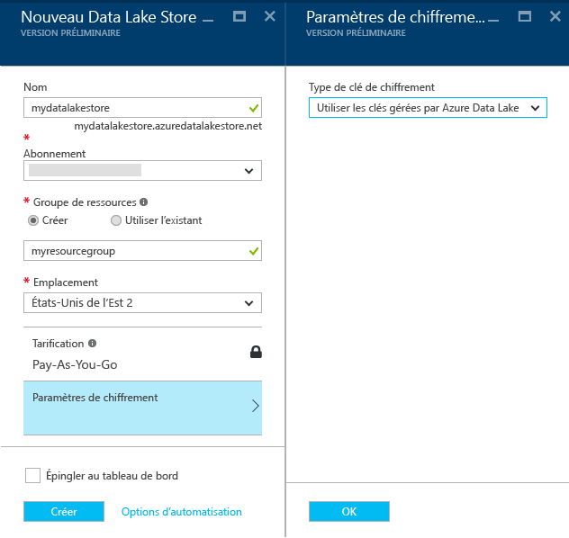
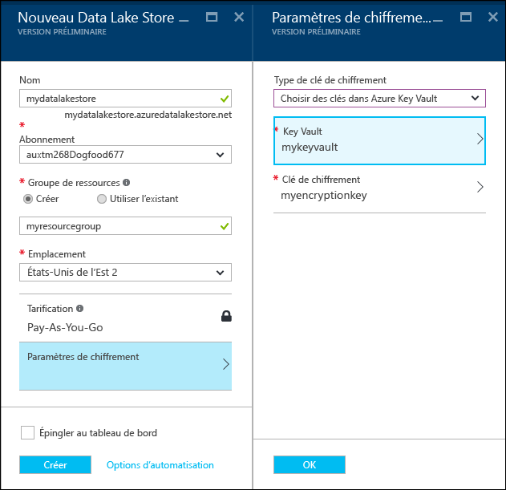
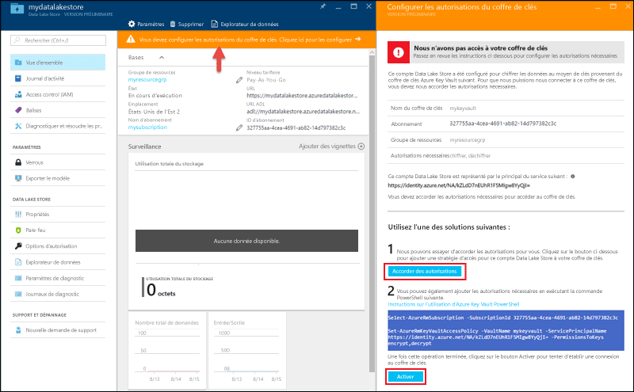

# Prise en main d'Azure Data Lake Store avec le portail Azure
> [!div class="op_single_selector"]
> * [Portail](data-lake-store-get-started-portal.md)
> * [PowerShell](data-lake-store-get-started-powershell.md)
> * [Kit SDK .NET](data-lake-store-get-started-net-sdk.md)
> * [Kit SDK Java](data-lake-store-get-started-java-sdk.md)
> * [API REST](data-lake-store-get-started-rest-api.md)
> * [Interface de ligne de commande Azure](data-lake-store-get-started-cli.md)
> * [Node.JS](data-lake-store-manage-use-nodejs.md)
> * [Python](data-lake-store-get-started-python.md)
>
> 

Apprenez à utiliser le portail Azure pour créer un compte Azure Data Lake Store et effectuer des opérations de base comme créer des dossiers, télécharger des fichiers de données, supprimer votre compte, etc. Pour plus d’informations sur Data Lake Store, consultez [Vue d’ensemble d’Azure Data Lake Store](data-lake-store-overview.md).

## Composants requis
Avant de commencer ce didacticiel, vous devez disposer des éléments suivants :

* **Un abonnement Azure**. Consultez la page [Obtention d’un essai gratuit d’Azure](https://azure.microsoft.com/pricing/free-trial/).

## Les vidéos vous permettent-elles d’apprendre plus rapidement ?
Regardez les vidéos suivantes pour vous familiariser avec Data Lake Store.

* [Créer un compte Data Lake Store](https://mix.office.com/watch/1k1cycy4l4gen)
* [Manage data in Data Lake Store using the Data Explorer (Gérer les données dans Data Lake Store à l’aide de l’Explorateur de données)](https://mix.office.com/watch/icletrxrh6pc)

## Créer un compte Azure Data Lake Store
1. Inscrivez-vous au nouveau [portail Azure](https://portal.azure.com).
2. Cliquez sur **NOUVEAU**, puis sur **Données + Stockage** et enfin sur **Azure Data Lake Store**. Lisez les informations contenues dans le panneau **Azure Data Lake Store**, puis cliquez sur **Créer** dans le coin inférieur gauche du panneau.
3. Dans le panneau **Nouveau Data Lake Store** , fournissez les valeurs comme l'indique la capture d'écran ci-dessous :
   
    
   
   * **Nom**. Entrez un nom unique pour le compte Data Lake Store.
   * **Abonnement**. Sélectionnez l’abonnement sous lequel vous souhaitez créer un nouveau compte Data Lake Store.
   * **Groupe de ressources**. Sélectionnez un groupe de ressources existant ou sélectionnez l’option **Créer** pour en créer un. Un groupe de ressources est un conteneur réunissant les ressources associées d’une application. Pour plus d’informations, consultez [Groupes de ressources dans Azure](../azure-resource-manager/resource-group-overview.md#resource-groups).
   * **Emplacement**: sélectionnez l'emplacement où vous souhaitez créer le compte Data Lake Store.
   * **Paramètres de chiffrement**. Vous pouvez choisir si vous souhaitez ou non chiffrer votre compte Data Lake Store. Si vous choisissez de le chiffrer, vous pouvez également spécifier comment gérer la clé de chiffrement principale que vous souhaitez utiliser pour chiffrer les données de votre compte.
     
     * (Facultatif) Sélectionnez **Ne pas activer le chiffrement** dans la liste déroulante pour désactiver le chiffrement.
     * (Par défaut) Sélectionnez **Utiliser les clés gérées par Azure Data Lake** si vous souhaitez qu’Azure Data Lake Store gère vos clés de chiffrement.
       
         
     * (Facultatif) Sélectionnez **Choisir les clés dans Azure Key Vault** si vous souhaitez utiliser vos propres clés présentes dans votre coffre Azure Key Vault. Avec cette option, vous pouvez également créer un compte et des clés Key Vault si ce n’est pas déjà fait.
       
         
       
       Cliquez sur **OK** dans le panneau **Paramètres de chiffrement**.
       
       > [!NOTE]
       > Si vous utilisez les clés d’un coffre Azure Key Vault pour configurer le chiffrement du compte Data Lake Store, vous devez affecter des autorisations permettant au compte Azure Data Lake Store d’accéder au coffre Azure Key Vault. Pour savoir comment procéder, consultez [Affecter des autorisations au coffre Azure Key Vault](#assign-permissions-to-the-azure-key-vault)
       > 
       > 
4. Cliquez sur **Create**. Si vous choisissez d’épingler le compte au tableau de bord, vous serez renvoyé au tableau de bord et vous pourrez voir la progression de l’approvisionnement de votre compte Data Lake Store. Une fois le compte Data Lake Store approvisionné, le panneau du compte s'affiche.

## Affecter des autorisations au coffre Azure Key Vault
Si vous avez utilisé des clés d’un coffre Azure Key Vault pour configurer le chiffrement sur le compte Data Lake Store, vous devez configurer l’accès entre le compte Data Lake Store et le compte Azure Key Vault. Pour ce faire, procédez comme suit.

1. Si vous avez utilisé des clés du coffre Azure Key Vault, un avertissement s’affiche en haut du panneau du compte Data Lake Store. Cliquez dessus pour ouvrir le panneau **Configurer les autorisations de Key Vault**.
   
    
2. Le panneau affiche deux options possibles pour configurer l’accès.
   
   * Dans la première option, cliquez sur **Accorder l’autorisation** pour configurer l’accès. La première option est activée uniquement lorsque l’utilisateur qui a créé le compte Data Lake Store est également administrateur du coffre Azure Key Vault.
   * L’autre option consiste à exécuter l’applet de commande PowerShell qui s’affiche dans le panneau. Vous devez être propriétaire de coffre Azure Key Vault ou avoir le droit d’accorder des autorisations sur le coffre Azure Key Vault. Après avoir exécuté l’applet de commande, revenez au panneau et cliquez sur **Activer** pour configurer l’accès.

## Créer des dossiers dans un compte Azure Data Lake Store
Vous pouvez créer des dossiers sous votre compte Data Lake Store pour gérer et stocker des données.

1. Ouvrez le compte Data Lake Store que vous venez de créer. Dans le volet gauche, cliquez sur **Parcourir**, puis sur **Data Lake Store**. Ensuite, dans le panneau Data Lake Store, cliquez sur le nom du compte sous lequel vous souhaitez créer des dossiers. Si vous avez épinglé le compte au tableau d'accueil, cliquez sur la vignette de ce compte.
2. Dans le panneau de votre compte Data Lake Store, cliquez sur **Explorateur de données**.
   
    
3. Dans le panneau de votre compte Data Lake Store, cliquez sur **Nouveau dossier**, entrez un nom pour le nouveau dossier, puis cliquez sur **OK**.
   
    
   
    Le nouveau dossier apparaît dans le panneau **Explorateur de données** . Vous pouvez créer des dossiers imbriqués jusqu'au niveau que vous souhaitez.
   
    

## Télécharger des données sur un compte Azure Data Lake Store
Vous pouvez télécharger vos données sur un compte Azure Data Lake Store directement à la racine ou dans un dossier que vous avez créé dans le compte. Suivez les étapes de la capture d'écran ci-dessous pour télécharger un fichier vers un sous-dossier du panneau **Explorateur de données** . Dans cette capture d'écran, le fichier est téléchargé vers un sous-dossier visible dans l'arborescence de navigation (encadré en rouge).

Si vous recherchez des exemples de données à charger, vous pouvez récupérer le dossier **Données Ambulance** dans le [Référentiel Git Azure Data Lake](https://github.com/MicrosoftBigData/usql/tree/master/Examples/Samples/Data/AmbulanceData).

## Propriétés et actions disponibles sur les données stockées
Cliquez sur le fichier nouvellement ajouté pour ouvrir le panneau **Propriétés** . Les propriétés associées au fichier et les actions que vous pouvez effectuer sur le fichier sont disponibles dans ce panneau. Vous pouvez également copier la totalité du chemin d'accès dans le fichier dans votre compte Azure Data Lake Store, encadré en rouge dans la capture d'écran ci-dessous.

* Cliquez sur **Aperçu** pour afficher un aperçu du fichier, directement à partir du navigateur. Vous pouvez également spécifier le format de l'aperçu. Cliquez sur **Aperçu**, puis sur **Format** dans le panneau **Aperçu du fichier**. Ensuite, dans le panneau **Format de l’aperçu du fichier**, spécifiez les options comme le nombre de lignes à afficher, l’encodage à utiliser, le séparateur à utiliser, etc.
  
  
* Cliquez sur **Télécharger** pour télécharger le fichier sur votre ordinateur.
* Cliquez sur **Renommer le fichier** pour renommer le fichier.
* Cliquez sur **Supprimer le fichier** pour supprimer le fichier.

## Sécurisez vos données
Vous pouvez sécuriser les données stockées dans votre compte Azure Data Lake Store à l'aide d'Azure Active Directory et Access Control (ACL). Pour savoir comment procéder, consultez [Sécurisation des données dans Azure Data Lake Store](data-lake-store-secure-data.md).

## Supprimer un compte Azure Data Lake Store
Pour supprimer un compte Azure Data Lake Store, cliquez sur **Supprimer**dans le panneau de votre Data Lake Store. Pour confirmer l'action, vous devrez entrer le nom du compte que vous souhaitez supprimer. Entrez le nom du compte, puis cliquez sur **Supprimer**.

## Étapes suivantes
* [Sécuriser les données dans Data Lake Store](data-lake-store-secure-data.md)
* [Utiliser Azure Data Lake Analytics avec Data Lake Store](../data-lake-analytics/data-lake-analytics-get-started-portal.md)
* [Utiliser Azure HDInsight avec Data Lake Store](data-lake-store-hdinsight-hadoop-use-portal.md)
* [Accéder aux journaux de diagnostic de Data Lake Store](data-lake-store-diagnostic-logs.md)

<!--HONumber=Nov16_HO4-->

