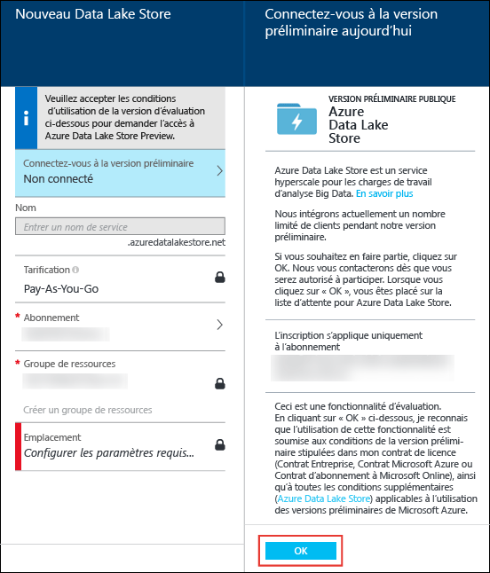
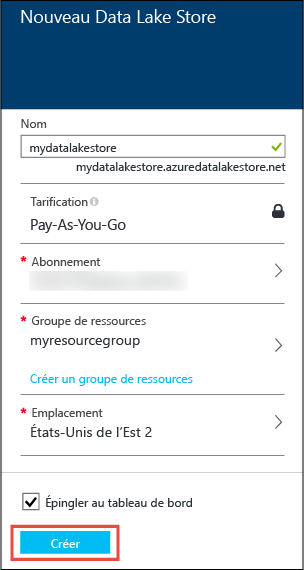
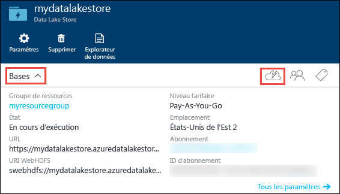
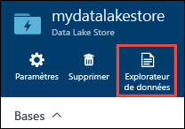
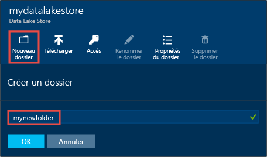
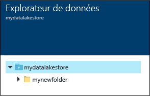
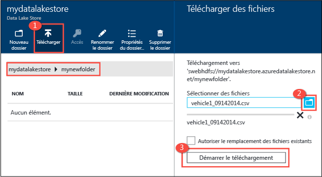
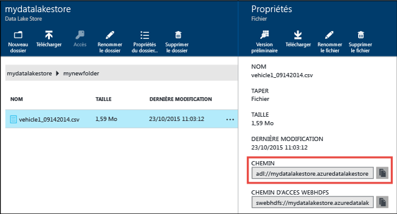
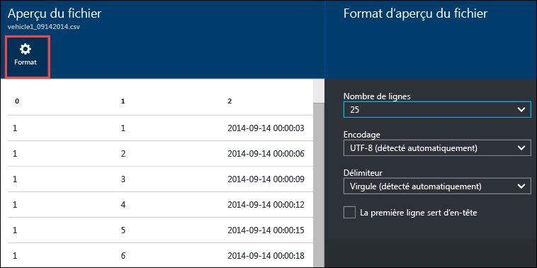
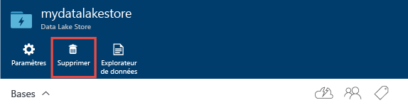

<properties 
   pageTitle="Prise en main de Data Lake Store | Azure" 
   description="Utiliser le portail pour créer un compte Data Lake Store et effectuer des opérations de base dans Data Lake Store" 
   services="data-lake-store" 
   documentationCenter="" 
   authors="nitinme" 
   manager="paulettm" 
   editor="cgronlun"/>
 
<tags
   ms.service="data-lake-store"
   ms.devlang="na"
   ms.topic="article"
   ms.tgt_pltfrm="na"
   ms.workload="big-data" 
   ms.date="11/13/2015"
   ms.author="nitinme"/>

# Prise en main d'Azure Data Lake Store avec le portail Azure en version préliminaire

> [AZURE.SELECTOR]
- [Using Portal](data-lake-store-get-started-portal.md)
- [Using PowerShell](data-lake-store-get-started-powershell.md)
- [Using .NET SDK](data-lake-store-get-started-net-sdk.md)
- [Using Azure CLI](data-lake-store-get-started-cli.md)

Apprenez à utiliser le portail Azure en version préliminaire pour créer un compte Azure Data Lake Store et effectuer des opérations de base comme créer des dossiers, télécharger des fichiers de données, supprimer votre compte, etc. Pour plus d'informations sur Data Lake Store, consultez [Vue d'ensemble d'Azure Data Lake Store](data-lake-store-overview.md).

## Configuration requise

Avant de commencer ce didacticiel, vous devez disposer des éléments suivants :

- **Un abonnement Azure**. Consultez la page [Obtention d’un essai gratuit d’Azure](https://azure.microsoft.com/fr-FR/pricing/free-trial/).

## Activer votre abonnement Azure pour la version d'évaluation publique de Data Lake Store

Vous devez tout d'abord demander l'activation de votre abonnement Azure pour la version d'évaluation publique de Data Lake Store. Pour ce faire, procédez comme suit.

1. Inscrivez-vous au nouveau [portail Azure en version préliminaire](https://portal.azure.com).
2. Cliquez sur **NOUVEAU**, puis sur **Données + Stockage** et enfin sur **Azure Data Lake Store**.
3. Dans le panneau **Nouveau Data Lake Store**, cliquez sur **S'inscrire à la version d'évaluation**. Lisez les informations, puis cliquez sur **OK**. Vous recevez un courrier électronique une fois votre abonnement activé pour la version d'évaluation publique.

	

## Créer un compte Azure Data Lake Store

1. Inscrivez-vous au nouveau [portail Azure en version préliminaire](https://portal.azure.com).

2. Cliquez sur **NOUVEAU**, puis sur **Données + Stockage** et enfin sur **Azure Data Lake Store**. Lisez les informations contenues dans le panneau **Azure Data Lake Store**, puis cliquez sur **Créer** dans le coin inférieur gauche du panneau.

3. Dans le panneau **Nouveau Data Lake Store**, fournissez les valeurs comme l'indique la capture d'écran ci-dessous :

	

	- **Abonnement**. Sélectionnez l'abonnement sous lequel vous souhaitez créer un nouveau compte Data Lake Store.
	- **Groupe de ressources**. Sélectionnez un groupe de ressources existant ou cliquez sur **Créer un groupe de ressources** pour en créer un. Un groupe de ressources est un conteneur réunissant les ressources associées d’une application. Pour plus d'informations, consultez [Groupes de ressources dans Azure](resource-group-overview.md#resource-groups).
	- **Emplacement** : sélectionnez l'emplacement où vous souhaitez créer le compte Data Lake Store.

4. Sélectionnez **Épingler au tableau d'accueil** si vous souhaitez que le compte Data Lake Store soit accessible à partir du tableau d'accueil.

5. Cliquez sur **Create**. Si vous choisissez d'épingler le compte au tableau d'accueil, vous serez renvoyé au tableau d'accueil et vous pourrez voir la progression de l'approvisionnement de votre compte Data Lake Store. Une fois le compte Data Lake Store approvisionné, le panneau du compte s'affiche.

6. Développez la liste déroulante **Essentials** pour afficher les informations relatives à votre compte Data Lake Store, comme le groupe de ressources auquel il appartient, l'emplacement, etc. Cliquez sur l'icône **Démarrage rapide** pour afficher des liens vers d'autres ressources liées au Data Lake Store.

	

## Créer des dossiers dans un compte Azure Data Lake Store

Vous pouvez créer des dossiers sous votre compte Data Lake Store pour gérer et stocker des données.

1. Ouvrez le compte Data Lake Store que vous venez de créer. Dans le volet gauche, cliquez sur **Parcourir**, puis sur **Data Lake Store**. Ensuite, dans le panneau Data Lake Store, cliquez sur le nom du compte sous lequel vous souhaitez créer des dossiers. Si vous avez épinglé le compte au tableau d'accueil, cliquez sur la vignette de ce compte.

2. Dans le panneau de votre compte Data Lake Store, cliquez sur **Explorateur de données**.

	

3. Dans le panneau de votre compte Data Lake Store, cliquez sur **Nouveau dossier**, entrez un nom pour le nouveau dossier, puis cliquez sur **OK**.
	
	
	
	Le nouveau dossier apparaît dans le panneau **Explorateur de données**. Vous pouvez créer des dossiers imbriqués jusqu'au niveau que vous souhaitez.

	

## Télécharger des données sur un compte Azure Data Lake Store

Vous pouvez télécharger vos données sur un compte Azure Data Lake Store directement à la racine ou dans un dossier que vous avez créé dans le compte. Suivez les étapes de la capture d'écran ci-dessous pour télécharger un fichier vers un sous-dossier du panneau **Explorateur de données**. Dans cette capture d'écran, le fichier est téléchargé vers un sous-dossier visible dans l'arborescence de navigation (encadré en rouge).

Si vous recherchez des exemples de données à charger, vous pouvez récupérer le dossier **Données Ambulance** dans le [Référentiel Git Azure Data Lake](https://github.com/MicrosoftBigData/AzureDataLake/tree/master/SQLIPSamples/SampleData/AmbulanceData).

## Propriétés et actions disponibles sur les données stockées

Cliquez sur le fichier nouvellement ajouté pour ouvrir le panneau **Propriétés**. Les propriétés associées au fichier et les actions que vous pouvez effectuer sur le fichier sont disponibles dans ce panneau. Vous pouvez également copier la totalité du chemin d'accès dans le fichier dans votre compte Azure Data Lake Store, encadré en rouge dans la capture d'écran ci-dessous.

* Cliquez sur **Aperçu** pour afficher un aperçu du fichier, directement à partir du navigateur. Vous pouvez également spécifier le format de l'aperçu. Cliquez sur **Aperçu**, puis sur **Format** dans le panneau **Aperçu du fichier**. Ensuite, dans le panneau **Format d'aperçu du fichier**, spécifiez les options comme le nombre de lignes à afficher, l'encodage à utiliser, le séparateur à utiliser, etc.

  

* Cliquez sur **Télécharger** pour télécharger le fichier sur votre ordinateur.

* Cliquez sur **Renommer le fichier** pour renommer le fichier.

* Cliquez sur **Supprimer le fichier** pour supprimer le fichier.

## Sécurisez vos données

Vous pouvez sécuriser les données stockées dans votre compte Azure Data Lake Store à l'aide d'Azure Active Directory et Access Control (ACL). Pour savoir comment procéder, consultez [Sécurisation des données dans Azure Data Lake Store](data-lake-store-secure-data.md).

## Supprimer un compte Azure Data Lake Store

Pour supprimer un compte Azure Data Lake Store, cliquez sur **Supprimer** dans le panneau de votre Data Lake Store. Pour confirmer l'action, vous devrez entrer le nom du compte que vous souhaitez supprimer. Entrez le nom du compte, puis cliquez sur **Supprimer**.

## Autres méthodes de création d'un compte Data Lake Store

- [Prise en main de Data Lake Store avec PowerShell](data-lake-store-get-started-powershell.md)
- [Prise en main de Data Lake Store avec le Kit de développement logiciel (SDK) .NET](data-lake-store-get-started-net-sdk.md)
- [Prise en main de Data Lake Store avec l’interface de ligne de commande Azure](data-lake-store-get-started-cli.md)

## Étapes suivantes

- [Sécuriser les données dans Data Lake Store](data-lake-store-secure-data.md)
- [Utiliser Azure Data Lake Analytics avec Data Lake Store](data-lake-analytics-get-started-portal.md)
- [Utiliser Azure HDInsight avec Data Lake Store](data-lake-store-hdinsight-hadoop-use-portal.md)

<!---HONumber=Nov15_HO4-->