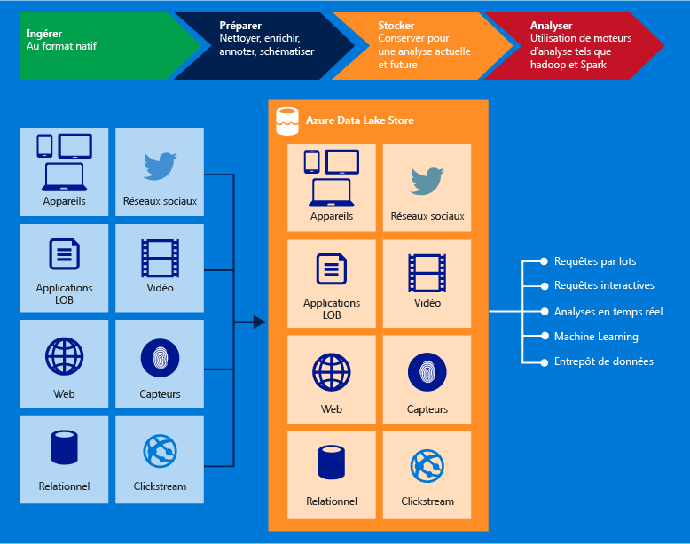

# Présentation d'Azure Data Lake Store
Azure Data Lake Store est un référentiel d'entreprise à très grande échelle pour les charges de travail d'analyse du Big Data. Azure Data Lake vous permet de capturer les données de toute taille, de tout type et à toute vitesse d'ingestion dans un emplacement unique en vue d'une analyse opérationnelle et exploratoire.

> [!TIP]
> Utilisez le [Parcours d’apprentissage Data Lake Store](https://azure.microsoft.com/documentation/learning-paths/data-lake-store-self-guided-training/) pour commencer à explorer le service Azure Data Lake Store.
> 
> 

Azure Data Lake Store est accessible à partir de Hadoop (disponible avec le cluster HDInsight) avec les API REST compatibles WebHDFS. Il est conçu spécifiquement pour permettre l'analyse des données stockées et met l'accent sur les performances des scénarios d'analyse des données. En standard, il inclut toutes les capacités de niveau entreprise (sécurité, facilité de gestion, évolutivité, fiabilité et disponibilité) essentielles pour les cas d'usage professionnels réels.

Voici quelques-unes des fonctionnalités clés d'Azure Data Lake.

### Conçu pour Hadoop
Azure Data Lake Store est un système de fichiers Apache Hadoop compatible avec HDFS (Hadoop Distributed File System) et fonctionnant avec l'écosystème Hadoop.  Vos applications ou services HDInsight existants, qui utilisent l'API WebHDFS, peuvent s'intégrer facilement à Data Lake Store. Data Lake Store offre également une interface REST compatible WebHDFS pour les applications

Les données stockées dans Data Lake Store peuvent être facilement analysées avec les infrastructures d'analyse Hadoop, comme MapReduce ou Hive. Les clusters Microsoft Azure HDInsight peuvent être approvisionnés et configurés pour accéder directement aux données stockées dans Data Lake Store.

### Stockage illimité, fichiers de l´'ordre du pétaoctet
Azure Data Lake Store offre un stockage illimité et est approprié pour le stockage d'une grande variété de données à des fins d'analyse. Il n'impose aucune limite de taille de compte, de taille de fichier ou de quantité de données stockées dans un lac de données. La taille des fichiers individuels peut varier de l'ordre du kilooctet à l'ordre du pétaoctet, ce qui en fait le choix idéal pour stocker tout type de données. Les données sont stockées durablement en créant des copies multiples. De plus, il n'existe aucune limite de durée de stockage des données dans le lac de données.

### Performances optimisées pour l'analyse du Big Data
Azure Data Lake Store est conçu pour faire fonctionner des systèmes d'analyse à grande échelle, nécessitant un débit élevé pour interroger et analyser de grands volumes de données. Le lac de données répartit les différentes parties des fichiers sur plusieurs serveurs de stockage distincts. Cela améliore le débit de lecture lors de la lecture du fichier en parallèle de l'analyse de données.

### Prêt à l'emploi : hautement disponible et sécurisé
Azure Data Lake Store offre une fiabilité et une disponibilité aux normes industrielles. Vos données sont stockées durablement en créant des copies redondantes pour vous prémunir contre toute défaillance imprévue. Les entreprises peuvent utiliser Azure Data Lake dans leurs solutions et l'intégrer à leur plateforme de données existante.

Data Lake Store fournit également une sécurité de niveau entreprise des données stockées. Pour plus d'informations, consultez [Sécurisation des données dans Azure Data Lake Store](#DataLakeStoreSecurity).

### Toutes les données
Azure Data Lake Store peut stocker des données dans leur format natif, en l'état, sans nécessiter de transformations préalables. Data Lake Store ne requiert pas la définition d'un schéma avant le chargement des données, laissant ainsi à l'infrastructure d'analyse individuelle le soin d'interpréter les données et de définir un schéma au moment de l'analyse. La possibilité de stocker les fichiers de formats et de tailles arbitraires rend possible la gestion par Data Lake Store de données structurées, semi-structurées et non structurées.

Les conteneurs Azure Data Lake Store pour données sont essentiellement des dossiers et des fichiers. Vous travaillez sur les données stockées à l'aide de kits de développement logiciel (SDK), du portail Azure et d’Azure Powershell. Tant que vous placez vos données dans le magasin en utilisant ces interfaces et les conteneurs appropriés, vous pouvez stocker n'importe quel type de données. Data Lake Store n'effectue aucune opération particulière sur les données en fonction du type de données qu’il contient.

## Sécurisation des données dans Azure Data Lake Store
Azure Data Lake Store utilise Azure Active Directory pour l'authentification et les listes de contrôle d'accès pour gérer l'accès à vos données.

| Fonctionnalité | Description |
| --- | --- |
| Authentification |Azure Data Lake Store s'intègre à Azure Active Directory (AAD) pour la gestion des identités et des accès de toutes les données stockées dans Azure Data Lake Store. Grâce à cette intégration, Azure Data Lake tire parti de toutes les fonctionnalités d'AAD, notamment l'authentification multifacteur, l'accès conditionnel, le contrôle d'accès en fonction du rôle, l'analyse d'utilisation des applications, la surveillance de la sécurité et les alertes, etc. Azure Data Lake Store prend en charge le protocole OAuth 2.0 pour l'authentification auprès de l'interface REST. |
| Contrôle d’accès |Azure Data Lake Store offre un contrôle d'accès grâce à la prise en charge des autorisations de type POSIX exposées par le protocole WebHDFS. Dans la version publique préliminaire de Data Lake Store (la version actuelle), les ACL peuvent être activées au niveau du dossier racine, des sous-dossiers et des fichiers individuels. Pour plus d’informations sur le fonctionnement des ACL dans le contexte de Data Lake Store, consultez [Contrôle d’accès dans Data Lake Store](data-lake-store-access-control.md). |
| Chiffrement |Data Lake Store fournit également le chiffrement des données stockées dans le compte. Vous spécifiez les paramètres de chiffrement lors de la création d’un compte Data Lake Store. Vous pouvez choisir de chiffrer vos données ou non. Pour savoir comment fournir une configuration avec chiffrement, consultez [Prise en main d’Azure Data Lake Store à l’aide du Portail Azure](data-lake-store-get-started-portal.md). |

Vous souhaitez en savoir plus sur la sécurisation des données dans Data Lake Store ? Suivez les liens ci-dessous.

* Pour savoir comment sécuriser les données dans Data Lake Store, consultez [Sécurisation des données dans Azure Data Lake Store](data-lake-store-secure-data.md).
* Vous préférez visualiser des vidéos ? [Regardez cette vidéo](https://mix.office.com/watch/1q2mgzh9nn5lx) sur la sécurisation des données stockées dans Data Lake Store.

## Applications compatibles avec Azure Data Lake Store
Azure Data Lake Store est compatible avec la plupart des composants open source de l’écosystème Hadoop. Par ailleurs, il s’intègre facilement avec d’autres services Azure. Cela fait du Data Lake Store la solution idéale pour vos besoins de stockage de données. Suivez les liens ci-dessous pour découvrir comment Data Lake Store peut être utilisé avec les composants open source ainsi que d’autres services Azure.

* Consultez [Applications et services compatibles avec Azure Data Lake](data-lake-store-compatible-oss-other-applications.md) pour obtenir une liste des applications open source interopérables avec Data Lake Store.
* Consultez [Intégration avec d'autres services Azure](data-lake-store-integrate-with-other-services.md) pour comprendre comment Data Lake Store peut être utilisé avec d'autres services Azure afin d'augmenter le nombre de scénarios.
* Consultez la page [Scénarios de données impliquant Azure Data Lake Store](data-lake-store-data-scenarios.md) pour découvrir comment utiliser Data Lake Store pour des scénarios tels que la réception, le traitement, le téléchargement et la visualisation de données.

## Présentation du système de fichiers Azure Data Lake Store (adl://)
Data Lake Store est accessible via le nouveau système de fichiers AzureDataLakeFilesystem (adl://) dans les environnements Hadoop (disponible avec le cluster HDInsight). Les applications et les services qui utilisent adl:// peuvent tirer parti d'autres optimisations des performances, qui ne sont actuellement pas disponibles dans WebHDFS. Par conséquent, Data Lake Store vous laisse la liberté, soit de bénéficier de performances optimales en utilisant adl:// (option recommandée), soit de maintenir le code existant en continuant d'utiliser l'API WebHDFS directement. Azure HDInsight tire pleinement parti du système de fichiers AzureDataLakeFilesystem pour optimiser les performances sur Data Lake Store.

Vous pouvez accéder à vos données dans Data Lake Store à l'aide de `adl://<data_lake_store_name>.azuredatalakestore.net`. Pour plus d'informations sur la façon d'accéder aux données de Data Lake Store, consultez [Afficher les propriétés des données stockées](data-lake-store-get-started-portal.md#properties)

## Comment commencer à utiliser Azure Data Lake Store ?
Consultez [Prise en main de Data Lake Store avec le portail Azure](data-lake-store-get-started-portal.md)pour savoir comment approvisionner un Data Lake Store avec le portail Azure. Une fois que vous avez approvisionné Azure Data Lake, vous pouvez apprendre à utiliser les offres de Big Data, comme Azure Data Lake Analytics ou Azure HDInsight avec Data Lake Store. Vous pouvez également créer une application .NET pour créer un compte Azure Data Lake Store et effectuer des opérations comme télécharger des données, etc.

* [Prise en main d'Azure Data Lake Analytics](../data-lake-analytics/data-lake-analytics-get-started-portal.md)
* [Utiliser Azure HDInsight avec Data Lake Store](data-lake-store-hdinsight-hadoop-use-portal.md)
* [Prise en main d'Azure Data Lake Store avec le Kit de développement logiciel (SDK) .NET](data-lake-store-get-started-net-sdk.md)

## Vidéos Data Lake Store
Si vous préférez apprendre en regardant des vidéos, Data Lake Store contient des vidéos portant sur un large éventail de fonctionnalités.

* [Create an Azure Data Lake Store Account (Créer un compte Azure Data Lake Store)](https://mix.office.com/watch/1k1cycy4l4gen)
* [Use the Data Explorer to Manage Data in Azure Data Lake Store (Gérer les données dans Data Lake Store à l’aide de l’Explorateur de données)](https://mix.office.com/watch/icletrxrh6pc)
* [Connect Azure Data Lake Analytics to Azure Data Lake Store (Connecter Azure Data Lake Analytics à Azure Data Lake Store)](https://mix.office.com/watch/qwji0dc9rx9k)
* [Access Azure Data Lake Store via Data Lake Analytics (Accéder à Azure Data Lake Store via Data Lake Analytics)](https://mix.office.com/watch/1n0s45up381a8)
* [Connect Azure HDInsight to Azure Data Lake Store (Connecter Azure HDInsight à Azure Data Lake Store)](https://mix.office.com/watch/l93xri2yhtp2)
* [Access Azure Data Lake Store via Hive and Pig (Accéder à Azure Data Lake Store via Hive et Pig)](https://mix.office.com/watch/1n9g5w0fiqv1q)
* [Use DistCp (Hadoop Distributed Copy) to copy data to and from Azure Data Lake Store (Utiliser DistCp (Hadoop Distributed Copy) pour copier des données vers et depuis Azure Data Lake Store)](https://mix.office.com/watch/1liuojvdx6sie)
* [Use Apache Sqoop to move data between relational sources and Azure Data Lake Store (Utiliser Apache Sqoop pour déplacer des données entre les sources relationnelles et Azure Data Lake Store)](https://mix.office.com/watch/1butcdjxmu114)
* [Data Orchestration using Azure Data Factory for Azure Data Lake Store (Orchestration de données pour Azure Data Lake Store à l’aide d’Azure Data Factory)](https://mix.office.com/watch/1oa7le7t2u4ka)
* [Securing Data in the Azure Data Lake Store (Sécurisation des données dans Azure Data Lake Store)](https://mix.office.com/watch/1q2mgzh9nn5lx)

