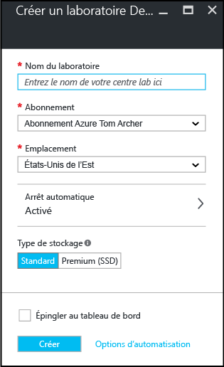

    <properties
	pageTitle="Create a DevTest Lab | Microsoft Azure"
	description="Create a new DevTest Lab lab for virtual machines"
	services="devtest-lab,virtual-machines"
	documentationCenter="na"
	authors="tomarcher"
	manager="douge"
	editor=""/>

<tags
	ms.service="devtest-lab"
	ms.workload="na"
	ms.tgt_pltfrm="na"
	ms.devlang="na"
	ms.topic="get-started-article"
	ms.date="11/01/2015"
	ms.author="tarcher"/>

# Créez un laboratoire de test et développement Azure DevTest Lab

## Conditions préalables

Pour créer un DevTest Lab, vous devez avoir :

- Un abonnement Azure. Pour en savoir plus sur les options d’achat d’Azure, consultez [Comment acheter Azure](https://azure.microsoft.com/pricing/purchase-options/) ou [Évaluation d’un mois gratuite](https://azure.microsoft.com/pricing/free-trial/). Vous devez être le propriétaire de l’abonnement pour créer le laboratoire.
- Groupe de ressources Azure pour le laboratoire. Consultez [Vue d’ensemble d’Azure Resource Manager](resource-group-overview.md) et [Contrôle d’accès en fonction du rôle Azure](../active-directory/role-based-access-control-configure.md).

## Création d’un laboratoire

1. Connectez-vous à la [version préliminaire du portail Azure](https://portal.azure.com).

1. Cliquez sur **Parcourir**.

1. Cliquez sur **Laboratoires de test et développement** dans la liste.

1. Dans le panneau **Laboratoires de test et développement**, cliquez sur **Ajouter**.

    

1. Dans le panneau **Créer un laboratoire de test et développement** :

    1. Entrez un **Nom de laboratoire** pour le nouveau laboratoire.
    1. Sélectionnez l’**Abonnement** à associer au laboratoire.
    1. Sélectionnez un **Emplacement** dans lequel stocker le laboratoire.
    1. Cliquez sur **créer**.

    

## Étapes suivantes

Une fois que vous avez créé votre laboratoire, voici quelques étapes à prendre en compte :

- [Sécuriser l’accès à un laboratoire de test et développement](devtest-lab-add-devtest-user.md).

- [Définir des stratégies de laboratoire](devtest-lab-set-lab-policy.md).

- [Créer un modèle de laboratoire](devtest-lab-create-template.md).

- [Créer des artefacts personnalisés pour vos machines virtuelles](devtest-lab-artifact-author.md).

- [Ajouter une machine virtuelle avec des artefacts à un laboratoire de test et développement Azure](devtest-lab-add-vm-with-artifacts.md).

<!---HONumber=AcomDC_0128_2016-->