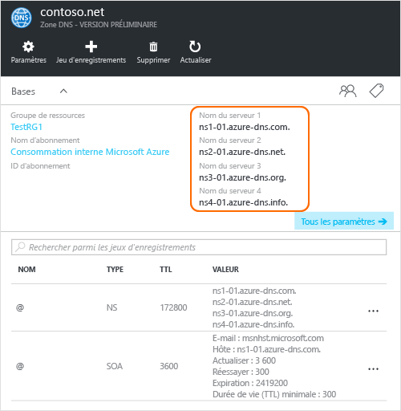

# <a name="delegate-a-domain-to-azure-dns"></a>Délégation de domaine à Azure DNS

Azure DNS vous permet d’héberger une zone DNS et de gérer les enregistrements DNS pour un domaine dans Azure. Pour que les requêtes DNS d’un domaine atteignent Azure DNS, le domaine doit être délégué à Azure DNS à partir du domaine parent. GardeN’oubliez pas qu’Azure DNS n’est pas le bureau d’enregistrement de domaines. Cet article explique comment déléguer votre domaine à Azure DNS

Pour les domaines achetés auprès d’un bureau d’enregistrement de domaines, ce dernier offre la possibilité de définir ces enregistrements NS. Pour créer une zone DNS avec un nom de domaine dans le DNS Azure, vous ne devez pas nécessairement être propriétaire de ce domaine. Toutefois, vous avez besoin de posséder le domaine pour configurer la délégation à Azure DNS dans le bureau d’enregistrement de domaines.

Par exemple, supposons que vous achetez le domaine « contoso.net » et que vous créez une zone avec le nom « contoso.net » dans Azure DNS. En tant que propriétaire du domaine, votre bureau d’enregistrement vous permet de configurer les adresses de serveur de noms (par exemple, les enregistrements NS) pour votre domaine. Le bureau d’enregistrement stocke ces enregistrements NS dans le domaine parent, dans ce cas « .net ». Les clients du monde entier peuvent ensuite être redirigés vers votre domaine dans la zone Azure DNS lors de la tentative de résolution des enregistrements DNS dans « contoso.net ».

## <a name="create-a-dns-zone"></a>Création d’une zone DNS

1. Connectez-vous au portail Azure.
1. Dans le menu Hub, cliquez sur **Nouveau > Mise en réseau >**, puis cliquez sur **Zone DNS** pour ouvrir le panneau Créer une zone DNS.

    

1. Dans le panneau **Créer une zone DNS**, entrez les valeurs suivantes, puis cliquez sur **Créer** :

   | **Paramètre** | **Valeur** | **Détails** |
   |---|---|---|
   |**Name**|contoso.net|Nom de la zone DNS|
   |**Abonnement**|[Votre abonnement]|Sélectionnez l’abonnement dans lequel créer la passerelle de l’application.|
   |**Groupe de ressources**|**Créer :** contosoRG|Créez un groupe de ressources. Le nom du groupe de ressources doit être unique au sein de l’abonnement sélectionné. Pour plus d’informations sur les groupes de ressources, consultez l’article [Présentation de Resource Manager](../azure-resource-manager/resource-group-overview.md?toc=%2fazure%2fdns%2ftoc.json#resource-groups).|
   |**Emplacement**|Ouest des États-Unis||

> [!NOTE]
> Le groupe de ressources fait référence à l’emplacement du groupe de ressources et n’a aucun impact sur la zone DNS. L’emplacement de la zone DNS est toujours « global » et n’est pas affiché.

## <a name="retrieve-name-servers"></a>Récupérer les serveurs de noms

Avant de pouvoir déléguer votre zone DNS à Azure DNS, vous devez d’abord connaître les noms de serveur de noms correspondant à votre zone. Azure DNS alloue des serveurs de noms à partir d’un pool chaque fois qu’une zone est créée.

1. Une fois la zone DNS créée, allez dans le panneau **Favoris** du portail Azure, puis cliquez sur **Toutes les ressources**. Cliquez sur la zone DNS **contoso.net** dans le panneau **Toutes les ressources**. Si l’abonnement que vous avez déjà sélectionné comporte plusieurs ressources, vous pouvez saisir **contoso.net** dans la case Filtrer par nom… pour accéder facilement à la passerelle d’application. 

1. Récupérez les serveurs de noms à partir du panneau de zone DNS. Dans cet exemple, la zone « contoso.net » a été attribuée aux serveurs de noms « ns1-01.azure-dns.com », « ns2-01.azure-dns.net », « ns3-01.azure-dns.org » et « ns4-01.azure-dns.info » :

 

Azure DNS crée automatiquement des enregistrements NS faisant autorité dans une zone qui contient les serveurs de noms attribués.  Pour afficher les noms de serveur de noms via Azure PowerShell ou l’interface de ligne de commande Azure, vous devez simplement récupérer ces enregistrements.

Les exemples suivants présentent également les étapes permettant de récupérer les serveurs de noms d’une zone Azure DNS avec PowerShell et Azure CLI.

### <a name="powershell"></a>PowerShell

```powershell
# The record name "@" is used to refer to records at the top of the zone.
$zone = Get-AzureRmDnsZone -Name contoso.net -ResourceGroupName contosoRG
Get-AzureRmDnsRecordSet -Name "@" -RecordType NS -Zone $zone
```

L’exemple suivant est la réponse.

```
Name              : @
ZoneName          : contoso.net
ResourceGroupName : contosorg
Ttl               : 172800
Etag              : 03bff8f1-9c60-4a9b-ad9d-ac97366ee4d5
RecordType        : NS
Records           : {ns1-07.azure-dns.com., ns2-07.azure-dns.net., ns3-07.azure-dns.org.,
                    ns4-07.azure-dns.info.}
Metadata          :
```

### <a name="azure-cli"></a>Interface de ligne de commande Azure

```azurecli
az network dns record-set show --resource-group contosoRG --zone-name contoso.net --type NS --name @
```

L’exemple suivant est la réponse.

```json
{
  "etag": "03bff8f1-9c60-4a9b-ad9d-ac97366ee4d5",
  "id": "/subscriptions/00000000-0000-0000-0000-000000000000/resourceGroups/contosoRG/providers/Microsoft.Network/dnszones/contoso.net/NS/@",
  "metadata": null,
  "name": "@",
  "nsRecords": [
    {
      "nsdname": "ns1-07.azure-dns.com."
    },
    {
      "nsdname": "ns2-07.azure-dns.net."
    },
    {
      "nsdname": "ns3-07.azure-dns.org."
    },
    {
      "nsdname": "ns4-07.azure-dns.info."
    }
  ],
  "resourceGroup": "contosoRG",
  "ttl": 172800,
  "type": "Microsoft.Network/dnszones/NS"
}
```

## <a name="delegate-the-domain"></a>Déléguer le domaine

Maintenant que la zone DNS est créée et que vous disposez des serveurs de noms, le domaine parent doit être mis à jour avec les serveurs de noms Azure DNS. Chaque bureau d’enregistrement a ses propres outils de gestion DNS pour modifier les enregistrements de serveur de noms pour un domaine. Dans la page de gestion du bureau d’enregistrement DNS, modifiez les enregistrements NS et remplacez-les par ceux créés par Azure DNS.

Lors de la délégation d’un domaine à Azure DNS, vous devez utiliser les noms de serveur de noms fournis par Azure DNS. Nous vous recommandons d’utiliser les quatre noms de serveur de noms, quel que soit le nom de votre domaine. La délégation de domaine ne requiert pas que le nom du serveur de noms utilise le même domaine de premier niveau que votre domaine.

Vous ne devez pas utiliser d’enregistrements de type glue pour pointer vers les adresses IP de serveur de noms Azure DNS, car ces adresses IP peuvent changer ultérieurement. Les délégations utilisant les noms de serveurs de noms dans votre propre zone (parfois appelés « serveurs de noms de redirection vers un microsite ») ne sont actuellement pas prises en charge dans Azure DNS.

## <a name="verify-name-resolution-is-working"></a>Vérifier le fonctionnement de la résolution de noms

Une fois la délégation effectuée, vous pouvez vérifier que la résolution de noms fonctionne à l’aide d’un outil tel que « nslookup » pour interroger l’enregistrement SOA de votre zone (qui est créé automatiquement en même temps que la zone).

Vous n’êtes pas obligé de spécifier les serveurs de noms Azure DNS ; si la délégation a été correctement configurée, le processus de résolution DNS normal trouve les serveurs de noms automatiquement.

```
nslookup -type=SOA contoso.com
```

Voici un exemple de réponse à partir de la commande précédente :

```
Server: ns1-04.azure-dns.com
Address: 208.76.47.4

contoso.com
primary name server = ns1-04.azure-dns.com
responsible mail addr = msnhst.microsoft.com
serial = 1
refresh = 900 (15 mins)
retry = 300 (5 mins)
expire = 604800 (7 days)
default TTL = 300 (5 mins)
```

## <a name="delegate-sub-domains-in-azure-dns"></a>Déléguer les sous-domaines dans Azure DNS

Si vous souhaitez configurer une zone enfant distincte, vous pouvez déléguer un sous-domaine dans Azure DNS. Par exemple, vous avez configuré et délégué « contoso.net » dans Azure DNS. Supposons que vous voulez configurer une zone enfant distincte, « partners.contoso.net ».

1. Créez la zone enfant « partners.contoso.net » dans Azure DNS.
2. Recherchez les enregistrements NS faisant autorité dans la zone enfant pour obtenir les serveurs de noms qui hébergent la zone enfant dans Azure DNS.
3. Déléguez la zone enfant en configurant les enregistrements NS de la zone parent pour qu'ils pointent vers la zone enfant.

### <a name="create-a-dns-zone"></a>Création d’une zone DNS

1. Connectez-vous au portail Azure.
1. Dans le menu Hub, cliquez sur **Nouveau > Mise en réseau >**, puis cliquez sur **Zone DNS** pour ouvrir le panneau Créer une zone DNS.

    

1. Dans le panneau **Créer une zone DNS**, entrez les valeurs suivantes, puis cliquez sur **Créer** :

   | **Paramètre** | **Valeur** | **Détails** |
   |---|---|---|
   |**Name**|partners.contoso.net|Nom de la zone DNS|
   |**Abonnement**|[Votre abonnement]|Sélectionnez l’abonnement dans lequel créer la passerelle de l’application.|
   |**Groupe de ressources**|**Use Existing :** (Utiliser existant) contosoRG|Créez un groupe de ressources. Le nom du groupe de ressources doit être unique au sein de l’abonnement sélectionné. Pour plus d’informations sur les groupes de ressources, consultez l’article [Présentation de Resource Manager](../azure-resource-manager/resource-group-overview.md?toc=%2fazure%2fdns%2ftoc.json#resource-groups).|
   |**Emplacement**|Ouest des États-Unis||

> [!NOTE]
> Le groupe de ressources fait référence à l’emplacement du groupe de ressources et n’a aucun impact sur la zone DNS. L’emplacement de la zone DNS est toujours « global » et n’est pas affiché.

### <a name="retrieve-name-servers"></a>Récupérer les serveurs de noms

1. Une fois la zone DNS créée, allez dans le panneau **Favoris** du portail Azure, puis cliquez sur **Toutes les ressources**. Cliquez sur la zone DNS **partners.contoso.net** dans le panneau **Toutes les ressources**. Si l’abonnement que vous avez déjà sélectionné comporte plusieurs ressources, vous pouvez saisir **partners.contoso.net** dans la case Filtrer par nom… pour accéder facilement à la zone DNS.

1. Récupérez les serveurs de noms à partir du panneau de zone DNS. Dans cet exemple, la zone « contoso.net » a été attribuée aux serveurs de noms « ns1-01.azure-dns.com », « ns2-01.azure-dns.net », « ns3-01.azure-dns.org » et « ns4-01.azure-dns.info » :

 

Azure DNS crée automatiquement des enregistrements NS faisant autorité dans une zone qui contient les serveurs de noms attribués.  Pour afficher les noms de serveur de noms via Azure PowerShell ou l’interface de ligne de commande Azure, vous devez simplement récupérer ces enregistrements.

### <a name="create-name-server-record-in-parent-zone"></a>Créer un enregistrement de serveur de noms dans la zone parente

1. Accédez à la zone DNS **contoso.net** dans le portail Azure.
1. Cliquez sur **+ Jeu d’enregistrements**.
1. Dans le panneau **Ajouter un jeu d’enregistrements**, entrez les valeurs suivantes, puis cliquez sur **OK** :

   | **Paramètre** | **Valeur** | **Détails** |
   |---|---|---|
   |**Name**|partenaires|Nom de la zone DNS enfant|
   |**Type**|NS|Utilisez NS pour les enregistrements de serveur de noms.|
   |**TTL**|1|Durée de vie.|
   |**Unité de durée de vie**|Heures|définit l’heure pour un affichage en direct (heures)|
   |**SERVEUR DE NOMS**|{serveurs de noms à partir de la zone partners.contoso.net}|Entrez les 4 serveurs de noms à partir de la zone de partners.contoso.net. |

   


### <a name="delegating-sub-domains-in-azure-dns-with-other-tools"></a>Déléguer des sous-domaines dans Azure DNS avec d’autres outils

Les exemples suivants présentent les étapes permettant de déléguer des sous-domaines dans Azure DNS avec PowerShell et CLI :

#### <a name="powershell"></a>PowerShell

L’exemple PowerShell suivant illustre cette procédure. Vous pouvez exécuter les mêmes étapes à l’aide du portail Azure ou de la version interplateforme d’Azure CLI.

```powershell
# Create the parent and child zones. These can be in same resource group or different resource groups as Azure DNS is a global service.
$parent = New-AzureRmDnsZone -Name contoso.net -ResourceGroupName contosoRG
$child = New-AzureRmDnsZone -Name partners.contoso.net -ResourceGroupName contosoRG

# Retrieve the authoritative NS records from the child zone as shown in the next example. This contains the name servers assigned to the child zone.
$child_ns_recordset = Get-AzureRmDnsRecordSet -Zone $child -Name "@" -RecordType NS

# Create the corresponding NS record set in the parent zone to complete the delegation. The record set name in the parent zone matches the child zone name, in this case "partners".
$parent_ns_recordset = New-AzureRmDnsRecordSet -Zone $parent -Name "partners" -RecordType NS -Ttl 3600
$parent_ns_recordset.Records = $child_ns_recordset.Records
Set-AzureRmDnsRecordSet -RecordSet $parent_ns_recordset
```

Utilisez `nslookup` pour vérifier que tout est correctement configuré en recherchant l’enregistrement SOA de la zone enfant.

```
nslookup -type=SOA partners.contoso.com
```

```
Server: ns1-08.azure-dns.com
Address: 208.76.47.8

partners.contoso.com
    primary name server = ns1-08.azure-dns.com
    responsible mail addr = msnhst.microsoft.com
    serial = 1
    refresh = 900 (15 mins)
    retry = 300 (5 mins)
    expire = 604800 (7 days)
    default TTL = 300 (5 mins)
```

#### <a name="azure-cli"></a>Interface de ligne de commande Azure

```azurecli
#!/bin/bash

# Create the parent and child zones. These can be in same resource group or different resource groups as Azure DNS is a global service.
az network dns zone create -g contosoRG -n contoso.net
az network dns zone create -g contosoRG -n partners.contoso.net
```

Récupérez les serveurs de noms de la zone `partners.contoso.net` à partir de la sortie.

```
{
  "etag": "00000003-0000-0000-418f-250de2b2d201",
  "id": "/subscriptions/00000000-0000-0000-0000-000000000000/resourceGroups/contosorg/providers/Microsoft.Network/dnszones/partners.contoso.net",
  "location": "global",
  "maxNumberOfRecordSets": 5000,
  "name": "partners.contoso.net",
  "nameServers": [
    "ns1-09.azure-dns.com.",
    "ns2-09.azure-dns.net.",
    "ns3-09.azure-dns.org.",
    "ns4-09.azure-dns.info."
  ],
  "numberOfRecordSets": 2,
  "resourceGroup": "contosorg",
  "tags": {},
  "type": "Microsoft.Network/dnszones"
}
```

Créez le jeu d’enregistrements et les enregistrements NS pour chaque serveur de noms.

```azurecli
#!/bin/bash

# Create the record set
az network dns record-set ns create --resource-group contosorg --zone-name contoso.net --name partners

# Create a ns record for each name server.
az network dns record-set ns add-record --resource-group contosorg --zone-name contoso.net --record-set-name partners --nsdname ns1-09.azure-dns.com.
az network dns record-set ns add-record --resource-group contosorg --zone-name contoso.net --record-set-name partners --nsdname ns2-09.azure-dns.net.
az network dns record-set ns add-record --resource-group contosorg --zone-name contoso.net --record-set-name partners --nsdname ns3-09.azure-dns.org.
az network dns record-set ns add-record --resource-group contosorg --zone-name contoso.net --record-set-name partners --nsdname ns4-09.azure-dns.info.
```

## <a name="delete-all-resources"></a>Supprimer toutes les ressources

Pour supprimer toutes les ressources créées dans cet article, procédez comme suit :

1. Allez dans le panneau **Favoris** du portail Azure, puis cliquez sur **Toutes les ressources**. Cliquez sur le groupe de ressources **contosorg** dans le panneau Toutes les ressources. Si l’abonnement que vous avez déjà sélectionné comporte plusieurs ressources, vous pouvez saisir **contosorg** dans la case **Filtrer par nom...** pour accéder facilement au groupe de ressources.
1. Dans le panneau **contosorg**, cliquez sur le bouton **Supprimer**.
1. Le portail nécessite que vous saisissiez le nom du groupe de ressources pour confirmer la suppression. Tapez *contosorg* comme nom du groupe de ressources, puis cliquez sur **Supprimer**. La suppression d’un groupe de ressources supprime toutes les ressources qu’il contient. Veuillez donc toujours vérifier le contenu d’un groupe de ressources avant de le supprimer. Le portail supprime toutes les ressources contenues dans le groupe de ressources, puis supprime le groupe de ressources lui-même. Cette opération prend plusieurs minutes.

## <a name="next-steps"></a>Étapes suivantes

[Gestion des zones DNS](dns-operations-dnszones.md)

[Gestion des enregistrements DNS](dns-operations-recordsets.md)
