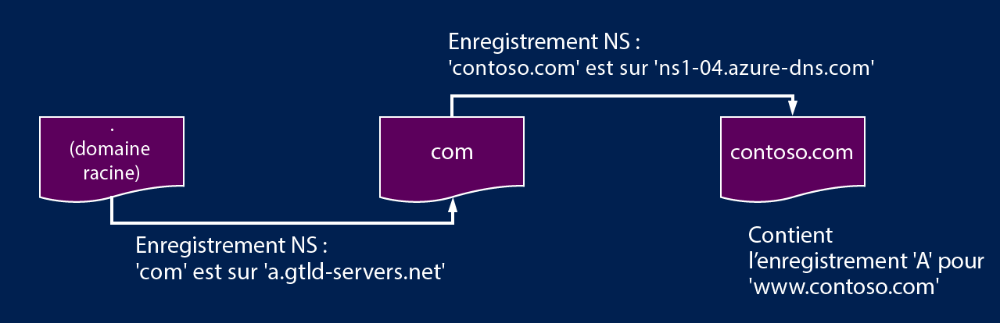

<properties
   pageTitle="Délégation de votre domaine à Azure DNS | Microsoft Azure"
   description="Découvrez comment modifier la délégation de domaine et les serveurs de noms Azure DNS pour fournir l’hébergement d’un domaine"
   services="dns"
   documentationCenter="na"
   authors="joaoma"
   manager="Adinah"
   editor=""/>

<tags
   ms.service="dns"
   ms.devlang="na"
   ms.topic="get-started-article"
   ms.tgt_pltfrm="na"
   ms.workload="infrastructure-services"
   ms.date="04/28/2015"
   ms.author="joaoma"/>

# Délégation de domaine à Azure DNS

Azure DNS est un service d’hébergement pour les domaines DNS. Pour que les requêtes DNS d’un domaine atteignent Azure DNS, le domaine doit être délégué à Azure DNS à partir du domaine parent. Cette page explique le fonctionnement de la délégation de domaine et indique comment déléguer des domaines à Azure DNS.

## Fonctionnement de la délégation DNS

### Zones et domaines

Un domaine est un nom unique dans le système DNS, par exemple, « contoso.com ». Un bureau d’enregistrement de domaines est une société qui peut fournir des noms de domaine Internet. Il vérifie si le domaine Internet que vous souhaitez utiliser est disponible et vous pouvez ensuite l’acheter. Une fois que le nom de domaine est enregistré, vous en êtes le propriétaire légal. Si vous disposez déjà d’un domaine Internet, vous allez utiliser le bureau d’enregistrement de domaines actuel pour la délégation à Azure DNS.

>[AZURE.NOTE]Pour plus d'informations sur le propriétaire d'un nom de domaine donné ou sur l'achat d'un domaine, consultez la page [Gestion des domaines Internet dans Azure AD](https://msdn.microsoft.com/library/azure/hh969248.aspx).

Une zone DNS permet d’héberger les enregistrements DNS d’un domaine particulier. Par exemple, le domaine « contoso.com » peut contenir un certain nombre d’enregistrements DNS, tels que « mail.contoso.com » (pour un serveur de messagerie) et « www.contoso.com » (pour un site web).

Azure DNS vous permet d’héberger une zone DNS et ainsi de gérer les enregistrements DNS pour un domaine dans Azure. N’oubliez pas qu’Azure DNS n’est pas un bureau d’enregistrement de domaines.

DNS est une hiérarchie de domaines. Celle-ci démarre à partir du domaine « racine », dont le nom est simplement « . ». Puis viennent les domaines de niveau supérieur, tels que « com », « net », « org », « uk » ou « jp ». Vous trouvez ensuite les domaines de second niveau, comme « org.uk » ou « co.jp ». Et ainsi de suite.

Les domaines de la hiérarchie DNS sont hébergés à l’aide de zones DNS distinctes. Ces zones sont globalement distribuées, et hébergées par des serveurs DNS dans le monde entier.

### Résolution et délégation

Deux types de serveur DNS sont disponibles :

- Un serveur DNS _faisant autorité_ héberge les zones DNS. Il répond aux requêtes DNS pour les enregistrements de ces zones uniquement.
- Un serveur DNS _récursif_ n’héberge pas de zones DNS. Il répond à toutes les requêtes DNS, en appelant des serveurs DNS faisant autorité pour rassembler les données dont il a besoin.

Les clients DNS des PC ou appareils mobiles appellent généralement un serveur DNS récursif pour effectuer les requêtes DNS dont les applications clientes ont besoin.

Lorsqu’un serveur DNS récursif reçoit une requête pour un enregistrement DNS tel que « www.contoso.com », il doit d’abord rechercher le serveur de noms qui héberge la zone pour le domaine « contoso.com ». Pour ce faire, il commence par les serveurs de noms racines, et à partir de là, il recherche les serveurs de noms hébergeant la zone « com ». Il interroge ensuite les serveurs de noms « com » pour trouver les serveurs de noms hébergeant la zone « contoso.com ». Enfin, il est en mesure de rechercher « www.contoso.com » parmi ces serveurs de noms.

On parle dans ce cas de résolution de noms DNS. La résolution DNS inclut toutefois des étapes supplémentaires, telles que le suivi des enregistrements CNAME, mais ce n’est pas important pour comprendre le fonctionnement de la délégation DNS.

Comment une zone parente « pointe-t-elle » vers les serveurs de noms d’une zone enfant ? Elle utilise pour cela un type spécial d’enregistrement DNS appelé enregistrement NS (pour « serveur de noms »). Par exemple, la zone racine contient les enregistrements NS pour « com », affichant les serveurs de noms pour la zone « com ». Et la zone « com » contient les enregistrements NS pour « contoso.com », affichant les serveurs de noms pour la zone « contoso.com ». La configuration d’enregistrements NS pour une zone enfant dans une zone parente est appelée « délégation de domaine ».

En voici une illustration :

Chaque délégation a en fait deux copies des enregistrements NS : une dans la zone parent qui pointe vers la zone enfant et l’autre dans la zone enfant elle-même. Par exemple, la zone « contoso.com » contient les enregistrements NS pour « contoso.com » (en plus des enregistrements NS dans « com »). Il s’agit d’enregistrements NS faisant autorité qui se trouvent au sommet de la zone enfant.

## Délégation d’un domaine à Azure DNS

Une fois que vous avez créé votre zone DNS dans Azure DNS, vous devez configurer les enregistrements NS de la zone parente pour qu’Azure DNS deviennent la source faisant autorité pour la résolution de noms pour votre zone. Pour les domaines achetés auprès d’un bureau d’enregistrement de domaines, ce dernier offre la possibilité de définir ces enregistrements NS.

>[AZURE.NOTE]Il est inutile de posséder un domaine pour créer une zone DNS avec ce domaine dans Azure DNS. Toutefois, vous avez besoin de posséder le domaine pour configurer la délégation à Azure DNS dans le bureau d’enregistrement de domaines.

Par exemple, supposons que vous achetez le domaine « contoso.com » et que vous créez une zone avec le nom « contoso.com » dans Azure DNS. En tant que propriétaire du domaine, votre bureau d’enregistrement vous permet de configurer les adresses de serveur de noms (par exemple, les enregistrements NS) pour votre domaine. Le bureau d’enregistrement stocke ces enregistrements NS dans le domaine parent, dans ce cas « .com ». Les clients du monde entier sont ensuite redirigés vers votre domaine dans la zone Azure DNS lors de la tentative de résolution des enregistrements DNS dans « contoso.com ».

Pour configurer la délégation, vous devez connaître les noms de serveur de noms de votre zone. Azure DNS alloue des serveurs de noms à partir d’un pool chaque fois qu’une zone est créée, puis stocke les enregistrements NS faisant autorité qui sont automatiquement créés dans votre zone. Par conséquent, pour afficher les noms de serveur de noms, vous devez simplement récupérer ces enregistrements.

À l’aide d’Azure PowerShell, les enregistrements NS faisant autorité peuvent être récupérés comme suit (le nom d’enregistrement « @ » fait référence à des enregistrements au sommet de la zone) :

	PS C:\> $zone = New-AzureDnsZone –Name contoso.com –ResourceGroupName MyAzureResourceGroup
	PS C:\> Get-AzureDnsRecordSet –Name “@” –RecordType NS –Zone $zone

	Name              : @
	ZoneName          : contoso.com
	ResourceGroupName : MyResourceGroup
	Ttl               : 3600
	Etag              : 5fe92e48-cc76-4912-a78c-7652d362ca18
	RecordType        : NS
	Records           : {ns1-04.azure-dns.com, ns2-04.azure-dns.net, ns3-04.azure-dns.org,
                     ns4-04.azure-dns.info}
	Tags              : {}

Dans cet exemple, la zone « contoso.com » a été attribuée aux serveurs de noms « ns1-04.azure-dns.com », « ns2-04.azure-dns .net », « ns3-04.azure-dns.org » et « ns4-04.azure-dns.info ».

Chaque bureau d’enregistrement a ses propres outils de gestion DNS pour modifier les enregistrements de serveur de noms pour un domaine. Dans la page de gestion du bureau d’enregistrement DNS, modifiez les enregistrements NS et remplacez-les par ceux créés par Azure DNS.

Une fois la délégation effectuée, vous pouvez vérifier que la résolution de noms fonctionne à l’aide d’un outil tel que « nslookup » pour interroger l’enregistrement SOA de votre zone (qui est créé automatiquement en même temps que la zone).

Notez que vous n’avez pas à spécifier les serveurs de noms Azure DNS, dans la mesure où le processus de résolution DNS normal trouve les serveurs de noms automatiquement si la délégation a été correctement configurée.

	PS C:\> nslookup –type=SOA contoso.com

	Server: ns1-04.azure-dns.com
	Address: 208.76.47.4

	contoso.com
	primary name server = ns1-04.azure-dns.com
	responsible mail addr = msnhst.microsoft.com
	serial = 1
	refresh = 900 (15 mins)
	retry = 300 (5 mins)
	expire = 604800 (7 days)
	default TTL = 300 (5 mins)

## Délégation de sous-domaines dans Azure DNS

Vous avez configuré et délégué « contoso.com » dans Azure DNS. Supposez que vous voulez configurer une zone enfant séparée, « partners.contoso.com ». Le processus est le même que pour une délégation normale :

1. Créez la zone enfant « partners.contoso.com » dans Azure DNS.
2. Recherchez les enregistrements NS faisant autorité dans la zone enfant pour obtenir les serveurs de noms qui hébergent la zone enfant dans Azure DNS.
3. Déléguez la zone enfant en configurant les enregistrements NS de la zone parent pour qu'ils pointent vers la zone enfant.

La seule différence est qu'à l'étape 3, les enregistrements NS doivent être créés dans la zone parente « contoso.com » dans Azure DNS, au lieu d'être configurés via un bureau d'enregistrement de domaines.

L'exemple PowerShell suivant illustre cette différence. Tout d'abord, nous créons les zones parent et enfant. Elles peuvent se trouver dans le même groupe de ressources ou des groupes de ressources différents :

	PS C:\> $parent = New-AzureDnsZone -Name contoso.com -ResourceGroupName RG1
	PS C:\> $child = New-AzureDnsZone -Name partners.contoso.com -ResourceGroupName RG1

Ensuite, nous récupérons les enregistrements NS faisant autorité dans la zone enfant :

	PS C:\> $child_ns_recordset = Get-AzureDnsRecordSet -Zone $child -Name "@" -RecordType NS

Enfin, nous créons le jeu d'enregistrements NS correspondant dans la zone parente pour effectuer la délégation (notez que le nom du jeu d'enregistrements dans la zone parente correspond au nom de la zone enfant, en l'occurrence « partners ») :

	PS C:\> $parent_ns_recordset = New-AzureDnsRecordSet -Zone $parent -Name "partners" -RecordType NS -Ttl 3600
	PS C:\> $parent_ns_recordset.Records = $child_ns_recordset.Records
	PS C:\> Set-AzureDnsRecordSet -RecordSet $parent_ns_recordset 

De la même façon que pour la délégation à l'aide d'un bureau d'enregistrement, nous pouvons vérifier que tout est correctement configuré en recherchant l'enregistrement SOA de la zone enfant :

	PS C:\> nslookup –type=SOA partners.contoso.com
	
	Server: ns1-08.azure-dns.com
	Address: 208.76.47.8
	
	partners.contoso.com
		primary name server = ns1-08.azure-dns.com
		responsible mail addr = msnhst.microsoft.com
		serial = 1
		refresh = 900 (15 mins)
		retry = 300 (5 mins)
		expire = 604800 (7 days)
		default TTL = 300 (5 mins)

## Étapes suivantes

[Gestion des zones DNS](../dns-operations-dnszones)

[Gestion des enregistrements DNS](../dns-operations-recordsets)

[Vue d’ensemble de Traffic Manager](../traffic-manager-overview)

[Automatisation des opérations Azure avec le Kit de développement (SDK) .NET](../dns-sdk)

[Référence de l’API REST d’Azure DNS](https://msdn.microsoft.com/library/azure/mt163862.aspx)
 

<!---HONumber=July15_HO4-->