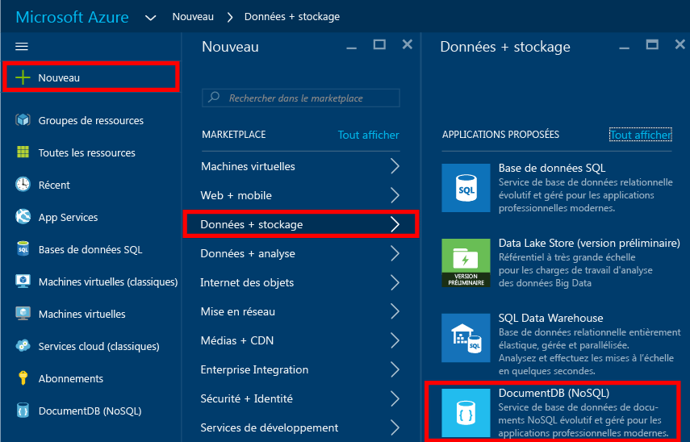
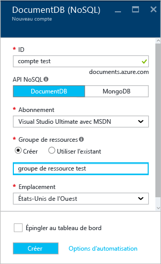
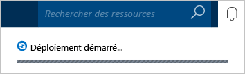
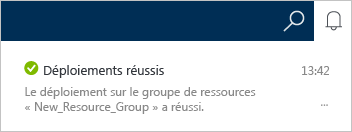
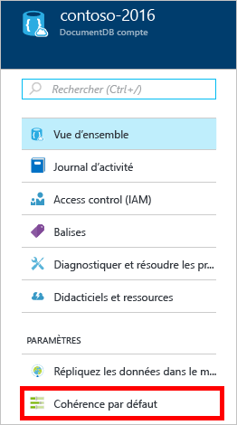
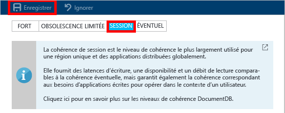

# Création d’un compte DocumentDB NoSQL à l’aide du Portail Azure
> [!div class="op_single_selector"]
> * [portail Azure](documentdb-create-account.md)
> * [Interface de ligne de commande Azure et Azure Resource Manager](documentdb-automation-resource-manager-cli.md)
> 
> 

Pour créer une base de données avec Microsoft Azure DocumentDB, vous devez :

* Avoir un compte Azure. Si vous n’en avez pas, vous pouvez obtenir un [compte Azure gratuit](https://azure.microsoft.com/free) . 
* Création d’un compte DocumentDB.  

Vous pouvez créer un compte DocumentDB avec le Portail Azure, à l’aide de modèles Azure Resource Manager ou de l’interface de ligne de commande Azure (CLI). Cet article décrit la procédure de création d’un compte DocumentDB à l’aide du Portail Azure. Pour créer un compte à l’aide d’Azure Resource Manager et de l’interface de ligne de commande Azure, consultez l’article [Automatisation de la création de compte de base de données DocumentDB](documentdb-automation-resource-manager-cli.md).

Vous débutez avec DocumentDB ? Regardez [cette](https://azure.microsoft.com/documentation/videos/create-documentdb-on-azure/) vidéo de quatre minutes réalisée par Scott Hanselman pour voir comment effectuer les tâches les plus courantes dans le portail en ligne.

1. Connectez-vous au [portail Azure](https://portal.azure.com/).
2. Dans la barre de lancement, cliquez sur **Nouveau**, **Bases de données**, puis sur **DocumentDB (NoSQL)**. 
   
     
3. Dans le panneau **Nouveau compte** , indiquez la configuration souhaitée pour le compte DocumentDB.
   
    
   
   * Dans la zone **ID**, entrez un nom pour identifier le compte DocumentDB.  Lorsque **l’ID** est validé, une coche verte s’affiche dans la case **ID**. La valeur de **ID** devient le nom d’hôte dans l’URI. Cet **ID** ne peut contenir que des minuscules, des chiffres, le caractère « - » et doit compter entre 3 et 50 caractères. Notez que *documents.azure.com* est ajouté au nom du point de terminaison de votre choix. Celui-ci devient le point de terminaison de votre compte DocumentDB.
   * Dans la zone **API NoSQL** , sélectionnez le modèle de programmation à utiliser :
     
     * **DocumentDB** : l’API DocumentDB est disponible via les [Kits de développement logiciel (SDK)](documentdb-sdk-dotnet.md) .NET, Java, Node.js, Python et JavaScript, ainsi que HTTP [REST](https://msdn.microsoft.com/library/azure/dn781481.aspx), et offre un accès par programme à toutes les fonctionnalités de DocumentDB. 
     * **MongoDB** : DocumentDB propose également la [prise en charge au niveau du protocole](documentdb-protocol-mongodb.md) pour les API **MongoDB**. Lorsque vous choisissez l’option de l’API MongoDB, vous pouvez utiliser les Kits de développement logiciel (SDK) MongoDB et les [outils](documentdb-mongodb-mongochef.md) existants pour communiquer avec DocumentDB. Vous pouvez [déplacer](documentdb-import-data.md) vos applications MongoDB existantes pour utiliser DocumentDB, [sans modification de code nécessaire](documentdb-connect-mongodb-account.md), et tirer parti d’une base de données entièrement gérée en tant que service, avec mise à l’échelle illimitée, réplication globale et autres fonctionnalités.
   * Dans **Abonnement**, sélectionnez l’abonnement Azure à utiliser avec le compte DocumentDB. Si votre compte ne comporte qu’un seul abonnement, ce compte sera sélectionné par défaut.
   * Dans **Groupe de ressources**, sélectionnez ou créez un groupe de ressources pour votre compte DocumentDB.  Par défaut, un nouveau groupe de ressources est créé. Pour plus d’informations, consultez [Utilisation du portail Azure pour gérer vos ressources Azure](../azure-portal/resource-group-portal.md).
   * Utilisez **Emplacement** pour indiquer l’emplacement géographique de l’hébergement de votre compte DocumentDB. 
4. Une fois les options du nouveau compte DocumentDB configurées, cliquez sur **Créer**. Pour vérifier l’état du déploiement, vérifiez le hub de notification.  
   
     
   
   
5. Une fois le compte DocumentDB créé, il est immédiatement utilisable avec les paramètres par défaut. La cohérence par défaut du compte DocumentDB est définie sur **Par session**.  Vous pouvez modifier la cohérence par défaut en cliquant sur **Cohérence par défaut** dans le menu de ressources. Pour en savoir plus sur les niveaux de cohérence proposés par DocumentDB, consultez [Niveaux de cohérence dans DocumentDB](documentdb-consistency-levels.md).
   
     
   
     

[Procédure : Création d’un compte DocumentDB]: #Howto
[Étapes suivantes]: #NextSteps
[documentdb-manage]:../articles/documentdb/documentdb-manage.md

## Étapes suivantes
Maintenant que vous disposez d’un compte DocumentDB, l’étape suivante consiste à créer une collection et une base de données DocumentDB. 

Pour créer une collection et une base de données, utilisez au choix :

* Le portail Azure, tel que décrit dans la rubrique [Création d’une collection DocumentDB avec le portail Azure](documentdb-create-collection.md).
* Les didacticiels complets, qui incluent des exemples de données : [.NET](documentdb-get-started.md), [.NET MVC](documentdb-dotnet-application.md), [Java](documentdb-java-application.md), [Node.js](documentdb-nodejs-application.md) ou [Python](documentdb-python-application.md).
* L’exemple de code [.NET](documentdb-dotnet-samples.md#database-examples), [Node.js](documentdb-nodejs-samples.md#database-examples) ou [Python](documentdb-python-samples.md#database-examples) disponible dans GitHub.
* Les Kits de développement logiciel (SDK) [.NET](documentdb-sdk-dotnet.md), [Node.js](documentdb-sdk-node.md), [Java](documentdb-sdk-java.md), [Python](documentdb-sdk-python.md) et [REST](https://msdn.microsoft.com/library/azure/mt489072.aspx).

Après avoir créé la base de données et la collection, vous devez [ajouter des documents](documentdb-view-json-document-explorer.md) aux collections.

Une fois que vous avez des documents dans une collection, vous pouvez utiliser [DocumentDB SQL](documentdb-sql-query.md) pour [exécuter des requêtes](documentdb-sql-query.md#executing-queries) sur vos documents. Vous pouvez exécuter des requêtes à l’aide de [l’Explorateur de requêtes](documentdb-query-collections-query-explorer.md) dans le portail, [l’API REST](https://msdn.microsoft.com/library/azure/dn781481.aspx) ou l’un des [Kits de développement logiciel (SDK)](documentdb-sdk-dotnet.md).

### En savoir plus
Pour en savoir plus sur DocumentDB, explorez les ressources suivantes :

* [Parcours d’apprentissage de DocumentDB](https://azure.microsoft.com/documentation/learning-paths/documentdb/)
* [Modèle de ressources hiérarchiques et concepts de DocumentDB](documentdb-resources.md)

<!--HONumber=Nov16_HO2-->

