# Didacticiel ASP.NET MVC : développement d’une application web avec DocumentDB.
> [!div class="op_single_selector"]
> * [.NET](documentdb-dotnet-application.md)
> * [.NET pour MongoDB](documentdb-mongodb-application.md)
> * [Node.JS](documentdb-nodejs-application.md)
> * [Java](documentdb-java-application.md)
> * [Python](documentdb-python-application.md)
> 
> 

Pour mettre en évidence la façon dont vous pouvez exploiter efficacement Azure DocumentDB pour stocker et interroger les documents JSON, cet article fournit une procédure de bout en bout vous montrant comment créer une application todo à l’aide d’Azure DocumentDB. Ces dernières sont stockées en tant que documents JSON dans Azure DocumentDB.

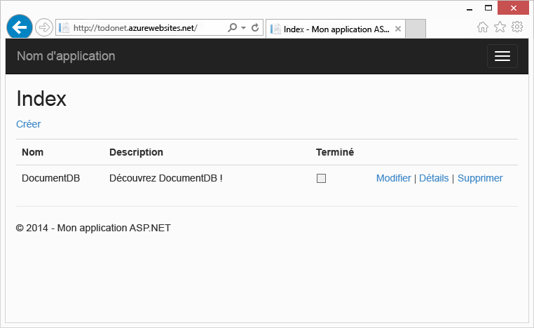

Cette procédure pas à pas montre comment utiliser le service DocumentDB fourni par Azure pour stocker des données et y accéder à partir d'une application web ASP.NET MVC hébergée sur Azure. Si vous recherchez un didacticiel portant uniquement sur DocumentDB et non sur les composants ASP.NET MVC, voir [Didacticiel NoSQL : générer une application de console C# DocumentDB](documentdb-get-started.md).

> [!TIP]
> Ce didacticiel suppose que vous disposez d'une expérience préalable de l'utilisation d'ASP.NET MVC et d'Azure Websites. Si vous débutez avec ASP.NET ou les [outils requis](#_Toc395637760), nous vous recommandons de télécharger le projet exemple complet à partir de [GitHub][GitHub] et de suivre les instructions fournies dans cet exemple. Une fois que vous l'avez créé, vous pouvez consulter cet article pour obtenir des informations sur le code dans le contexte du projet.
> 
> 

## Conditions préalables à l’exécution de ce didacticiel de base de données
Avant de suivre les instructions de cet article, vérifiez que les éléments suivants sont installés :

* Un compte Azure actif. Si vous ne possédez pas de compte, vous pouvez créer un compte d'évaluation gratuit en quelques minutes. Pour plus d’informations, consultez la rubrique [Version d’évaluation gratuite d’Azure](https://azure.microsoft.com/pricing/free-trial/). 

    OU

    Une installation locale de [l’émulateur Azure DocumentDB](documentdb-nosql-local-emulator.md).
* [Visual Studio 2015](http://www.visualstudio.com/) ou Visual Studio 2013 mise à jour 4 ou ultérieure. Si vous utilisez Visual Studio 2013, vous devrez installer le [package NuGet Microsoft.Net.Compilers](https://www.nuget.org/packages/Microsoft.Net.Compilers/) pour prendre en charge C# 6.0. 
* Kit de développement logiciel (SDK) Azure pour .NET 2.5.1 ou version ultérieure, disponible via [Microsoft Web Platform Installer][Microsoft Web Platform Installer].

Toutes les captures d'écran figurant dans cet article ont été prises avec Visual Studio 2013 Update 4 et le Kit de développement logiciel (SDK) Azure pour .NET 2.5.1. Si votre système est configuré avec différentes versions, il est probable que vos écrans et options ne correspondent pas totalement. Toutefois, si vous respectez la configuration requise citée plus haut, cette solution devrait fonctionner.

## Étape 1 : création d'un compte de base de données DocumentDB
Commençons par créer un compte DocumentDB. Si vous possédez déjà un compte ou si vous utilisez l’émulateur DocumentDB pour ce didacticiel, vous pouvez passer à l’étape [Création d’une application ASP.NET MVC](#_Toc395637762).

[!INCLUDE [documentdb-create-dbaccount](../../includes/documentdb-create-dbaccount.md)]

[!INCLUDE [documentdb-keys](../../includes/documentdb-keys.md)]

 
Voyons à présent comment créer une application ASP.NET MVC de A à Z. 

## Étape 2 : création d'une application ASP.NET MVC
Maintenant que vous avez un compte, nous allons créer notre nouveau projet ASP.NET.

1. Dans Visual Studio, dans le menu **Fichier**, pointez sur **Nouveau**, puis cliquez sur **Projet**.
   
       The **New Project** dialog box appears.
2. Dans le volet **Types de projets**, développez **Modèles**, **Visual C#**, **Web**, puis sélectionnez **Application web ASP.NET**.
   
      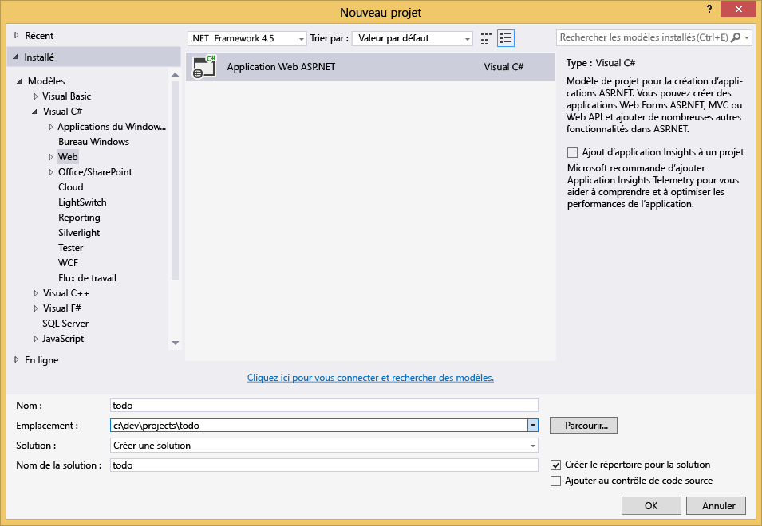
3. Dans la zone **Nom** , tapez le nom du projet. Ce didacticiel utilise le nom « todo ». Si vous choisissez d'utiliser un autre nom, chaque fois que ce didacticiel fera référence à l'espace de noms todo, veillez à corriger les exemples de code fournis de façon à utiliser le nom que vous avez attribué à votre application. 
4. Cliquez sur **Parcourir** pour accéder au dossier où vous souhaitez créer le projet, puis sur **OK**.
   
      La boîte de dialogue **Nouveau projet ASP.NET** s'affiche.
   
      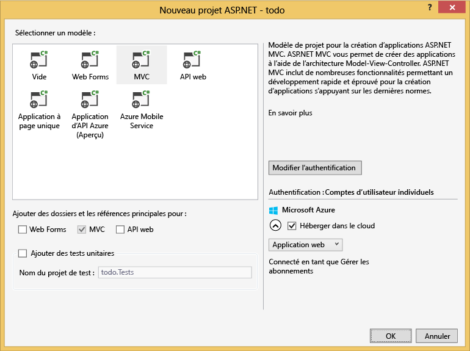
5. Dans le volet Modèles, sélectionnez **MVC**.
6. Si vous prévoyez d'héberger votre application dans Azure, sélectionnez **Héberger dans le cloud** dans le coin inférieur droit pour qu'Azure héberge l'application. Nous avons choisi un hébergement dans le cloud et d'exécuter l'application hébergée dans un site web Azure. Cette option préconfigure un site web Azure pour vous et facilite le déploiement de l'application opérationnelle finale. Si vous voulez utiliser un autre emplacement pour l'hébergement ou si vous ne voulez pas configurer Azure à l'avance, décochez la case **Héberger dans le cloud**.
7. Cliquez sur **OK** et laissez Visual Studio structurer le modèle ASP.NET MVC vide. 

    Si vous rencontrez l’erreur « Une erreur s’est produite lors du traitement de votre demande », consultez la section [Résolution des problèmes](#troubleshooting).

8. Si vous voulez procéder à l'hébergement dans le cloud, un ou plusieurs écrans supplémentaires apparaîtront pour vous demander de vous connecter à votre compte Azure et d'indiquer plusieurs valeurs pour votre nouveau site web. Fournissez toutes les valeurs supplémentaires et continuez. 
   
      Je n’ai pas choisi de « Serveur de base de données », car nous n’allons pas utiliser de serveur de base de données SQL Azure. Nous allons créer un compte Azure DocumentDB ultérieurement, dans le portail Azure.
   
    Pour plus d’informations sur le choix d’un **Plan App Service** et d’un **Groupe de ressources**, consultez la rubrique [Présentation détaillée des plans Azure App Service](../app-service/azure-web-sites-web-hosting-plans-in-depth-overview.md).
   
      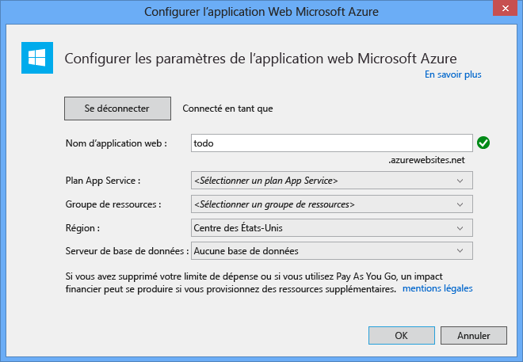
9. Une fois que Visual Studio a fini de créer l'application MVC réutilisable, vous disposez d'une application ASP.NET vide que vous pouvez exécuter localement.
   
    Nous allons sauter l'exécution du projet localement, car je suis sûr que nous avons tous vu l'application « Hello World » ASP.NET. Nous allons maintenant ajouter DocumentDB à ce projet et créer notre application.

## Étape 3 : Ajout de DocumentDB à votre projet d’application web MVC
Maintenant que nous avons la plupart des éléments ASP.NET MVC nécessaires à cette solution, passons au véritable objectif de ce didacticiel, à savoir, ajouter Azure DocumentDB à notre application web MVC.

1. Le Kit de développement logiciel (SDK) .NET DocumentDB est packagé et distribué en tant que package NuGet. Pour obtenir le package NuGet dans Visual Studio, utilisez le gestionnaire de package NuGet dans Visual Studio en cliquant avec le bouton droit sur le projet dans **l’Explorateur de solutions**, puis en cliquant sur **Gérer les packages NuGet**.
   
      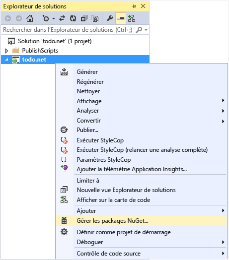
   
    La boîte de dialogue **Gérer les packages NuGet** apparaît.
2. Dans la zone NuGet **Parcourir**, tapez ***Azure DocumentDB***.
   
    À partir des résultats, installez le package **Bibliothèques clientes de Microsoft Azure DocumentDB** . Cela va vous permettre de télécharger et d'installer le package DocumentDB ainsi que toutes les dépendances (telles que Newtonsoft.Json). Cliquez sur **OK** dans la fenêtre **Aperçu**, puis sur **J’accepte** dans la fenêtre **Acceptation de la licence** pour terminer l’installation.
   
      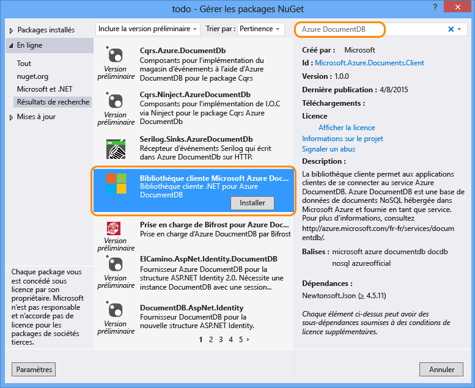
   
      Vous pouvez aussi utiliser la console du Gestionnaire de package pour installer le package. Pour cela, dans le menu **Outils**, cliquez sur **Gestionnaire de package NuGet**, puis cliquez sur **Console du Gestionnaire de package**. À l'invite de commandes, tapez ce qui suit.
   
        Install-Package Microsoft.Azure.DocumentDB
3. Une fois que le package est installé, votre solution Visual Studio doit ressembler à ce qui suit avec deux nouvelles références ajoutées, Microsoft.Azure.Documents.Client et Newtonsoft.Json.
   
      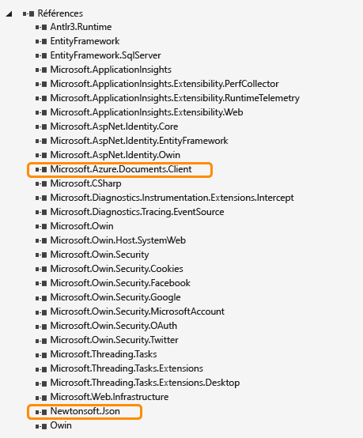

## Étape 4 : configuration de l'application ASP.NET MVC
Maintenant nous allons ajouter les modèles, les vues et les contrôleurs à cette application MVC :

* [Ajout d'un modèle](#_Toc395637764).
* [Ajout d'un contrôleur](#_Toc395637765).
* [Ajout de vues](#_Toc395637766).

### Ajout d’un modèle de données JSON
Commençons par créer le modèle (qui correspond au **M** dans MVC). 

1. Dans **l’Explorateur de solutions**, cliquez avec le bouton droit sur le dossier **Modèles**, cliquez sur **Ajouter**, puis sur **Classe**.
   
      La boîte de dialogue **Ajouter un nouvel élément** s'affiche.
2. Nommez votre nouvelle classe **Item.cs**, puis cliquez sur **Ajouter**. 
3. Dans ce nouveau fichier **Item.cs** , ajoutez ce qui suit après la dernière *instruction using*.
   
        using Newtonsoft.Json;
4. Remplacez maintenant ce code 
   
        public class Item
        {
        }
   
    par le code suivant :
   
        public class Item
        {
            [JsonProperty(PropertyName = "id")]
            public string Id { get; set; }
   
            [JsonProperty(PropertyName = "name")]
            public string Name { get; set; }
   
            [JsonProperty(PropertyName = "description")]
            public string Description { get; set; }
   
            [JsonProperty(PropertyName = "isComplete")]
            public bool Completed { get; set; }
        }
   
    Toutes les données de DocumentDB sont transmises puis stockées au format JSON. Pour contrôler la méthode JSON.NET de sérialisation/désérialisation de vos objets, vous pouvez utiliser l’attribut **JsonProperty**, comme indiqué dans la classe **Item** que nous venons de créer. Vous n'êtes **pas obligé** de procéder ainsi, mais cela permet de s'assurer que les propriétés respectent les conventions d'attribution de noms JSON camelCase. 
   
    En plus de contrôler le format du nom de propriété au moment d'être transmis à JSON, vous pouvez entièrement renommer vos propriétés .NET, comme ici avec la propriété **Description** . 

### Ajout d'un contrôleur
Maintenant que nous en avons terminé avec le **M** de MVC, intéressons-nous au **C**, qui correspond à la classe de contrôleur.

1. Dans **l’Explorateur de solutions**, cliquez avec le bouton droit sur le dossier **Contrôleurs**, cliquez sur **Ajouter**, puis sur **Contrôleur**.
   
    La boîte de dialogue **Ajouter une structure** s'affiche.
2. Sélectionnez **Classe de contrôleur MVC 5 - Vide** puis cliquez sur **Ajouter**.
   
    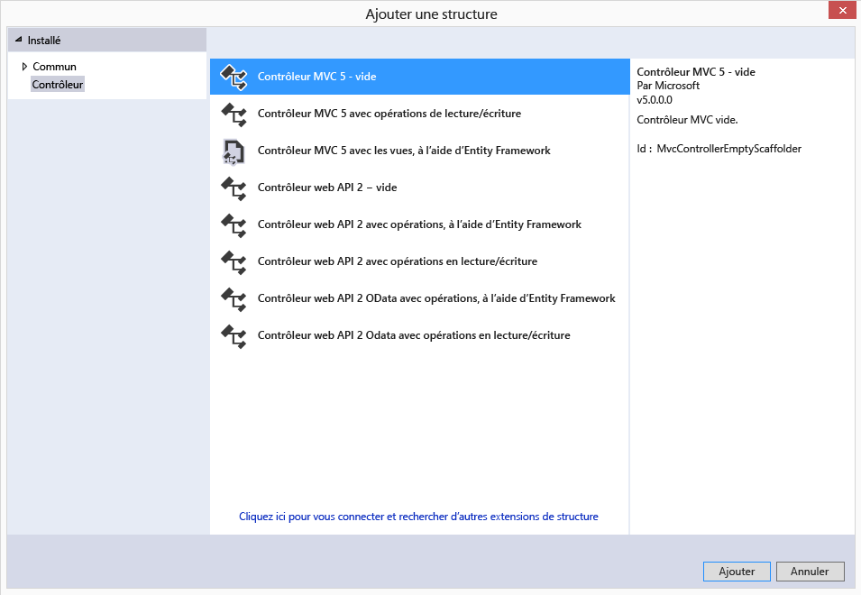
3. Nommez votre contrôleur **ItemController**
   
    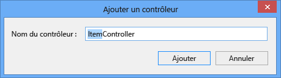
   
    Une fois le fichier créé, votre solution Visual Studio doit ressembler à ce qui suit avec le nouveau fichier ItemController.cs dans l' **Explorateur de solutions**. Le nouveau fichier Item.cs créé précédemment est aussi affiché.
   
    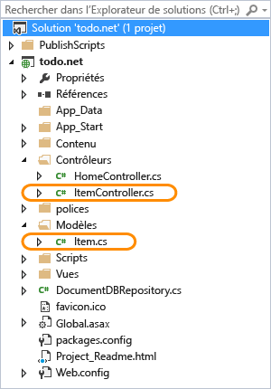
   
    Vous pouvez fermer ItemController.cs, nous y reviendrons par la suite. 

### Ajout de vues
À présent, créons le **V** de MVC, les vues :

* [Ajout d'une vue Index de l'élément](#AddItemIndexView).
* [Ajout d'une vue Nouvel élément](#AddNewIndexView).
* [Ajout d'une vue Modifier l'élément](#_Toc395888515).

#### Ajout d'une vue Index de l'élément
1. Dans **l’Explorateur de solutions**, développez le dossier **Vues**, cliquez avec le bouton droit sur le dossier vide **Élément** créé automatiquement par Visual Studio quand vous avez ajouté **ItemController** précédemment, cliquez sur **Ajouter**, puis sur **Affichage**.
   
    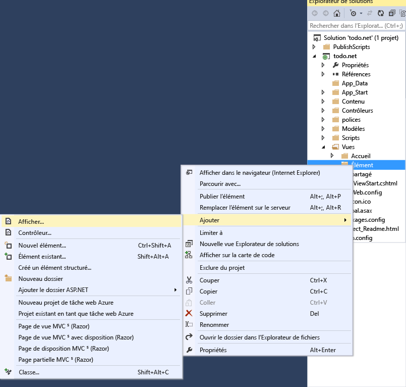
2. Dans la boîte de dialogue **Ajouter une vue** , procédez comme suit :
   
   * Dans la zone **Nom de la vue**, tapez ***Index***.
   * Dans la zone **Modèle**, sélectionnez ***Liste***.
   * Dans la zone **Classe de modèle**, sélectionnez ***Élément (todo.Models)***.
   * Laissez la zone **Classe du contexte de données** vide. 
   * Dans la zone de la page de disposition, tapez ***~/Views/Shared/_Layout.cshtml***.
     
     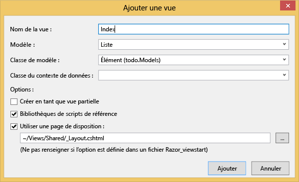
3. Une fois que vous avez défini toutes ces valeurs, cliquez sur **Ajouter** et laissez Visual Studio créer une vue de modèle. Le fichier .cshtml créé est ensuite ouvert. Nous pouvons fermer ce fichier dans Visual Studio. Nous y reviendrons ultérieurement.

#### Ajout d'une vue Nouvel élément
De la même façon que nous avons créé une vue **Index de l’élément**, nous allons maintenant créer une vue permettant de créer des **Éléments**.

1. Dans **l’Explorateur de solutions**, à nouveau, cliquez avec le bouton droit sur le dossier **Élément**, cliquez sur **Ajouter**, puis sur **Affichage**.
2. Dans la boîte de dialogue **Ajouter une vue** , procédez comme suit :
   
   * Dans la zone **Nom de la vue**, tapez ***Create***.
   * Dans la zone **Modèle**, sélectionnez ***Create***.
   * Dans la zone **Classe de modèle**, sélectionnez ***Élément (todo.Models)***.
   * Laissez la zone **Classe du contexte de données** vide.
   * Dans la zone de la page de disposition, tapez ***~/Views/Shared/_Layout.cshtml***.
   * Cliquez sur **Add**.

#### Ajout d'une vue Modifier l'élément
Pour terminer, ajoutons une dernière vue permettant de modifier un **Élément** en suivant la même procédure que précédemment.

1. Dans **l’Explorateur de solutions**, à nouveau, cliquez avec le bouton droit sur le dossier **Élément**, cliquez sur **Ajouter**, puis sur **Affichage**.
2. Dans la boîte de dialogue **Ajouter une vue** , procédez comme suit :
   
   * Dans la zone **Nom de la vue**, tapez ***Edit***.
   * Dans la zone **Modèle**, sélectionnez ***Edit***.
   * Dans la zone **Classe de modèle**, sélectionnez ***Élément (todo.Models)***.
   * Laissez la zone **Classe du contexte de données** vide. 
   * Dans la zone de la page de disposition, tapez ***~/Views/Shared/_Layout.cshtml***.
   * Cliquez sur **Add**.

Une fois cette opération effectuée, fermez tous les documents .cshtml dans Visual Studio. Nous reviendrons à ces vues un peu plus tard.

## Étape 5 : liaison de DocumentDB
Maintenant que nous nous sommes occupés des éléments de base de MVC, ajoutons le code pour DocumentDB. 

Dans cette section, nous allons ajouter du code pour gérer les éléments suivants :

* [Recensement des éléments non terminés.](#_Toc395637770)
* [Ajout d'éléments](#_Toc395637771).
* [Modification d'éléments](#_Toc395637772).

### Établissement de la liste des éléments incomplets dans votre application web MVC
La première chose à faire ici est d'ajouter une classe qui contient toute la logique permettant de se connecter à DocumentDB et de l'utiliser. Pour ce didacticiel, nous allons encapsuler toute cette logique dans une classe de référentiel appelée DocumentDBRepository. 

1. Dans **l’Explorateur de solutions**, cliquez avec le bouton droit sur le projet, cliquez sur **Ajouter**, puis sur **Classe**. Nommez la nouvelle classe **DocumentDBRepository**, puis cliquez sur **Ajouter**.
2. Dans la classe **DocumentDBRepository** nouvellement créée, ajoutez les *instructions using* suivantes au-dessus de la déclaration *namespace*
   
        using Microsoft.Azure.Documents; 
        using Microsoft.Azure.Documents.Client; 
        using Microsoft.Azure.Documents.Linq; 
        using System.Configuration;
        using System.Linq.Expressions;
        using System.Threading.Tasks;
   
    Remplacez maintenant ce code 
   
        public class DocumentDBRepository
        {
        }
   
    par le code suivant :
   
        public static class DocumentDBRepository<T> where T : class
        {
            private static readonly string DatabaseId = ConfigurationManager.AppSettings["database"];
            private static readonly string CollectionId = ConfigurationManager.AppSettings["collection"];
            private static DocumentClient client;
   
            public static void Initialize()
            {
                client = new DocumentClient(new Uri(ConfigurationManager.AppSettings["endpoint"]), ConfigurationManager.AppSettings["authKey"]);
                CreateDatabaseIfNotExistsAsync().Wait();
                CreateCollectionIfNotExistsAsync().Wait();
            }
   
            private static async Task CreateDatabaseIfNotExistsAsync()
            {
                try
                {
                    await client.ReadDatabaseAsync(UriFactory.CreateDatabaseUri(DatabaseId));
                }
                catch (DocumentClientException e)
                {
                    if (e.StatusCode == System.Net.HttpStatusCode.NotFound)
                    {
                        await client.CreateDatabaseAsync(new Database { Id = DatabaseId });
                    }
                    else
                    {
                        throw;
                    }
                }
            }
   
            private static async Task CreateCollectionIfNotExistsAsync()
            {
                try
                {
                    await client.ReadDocumentCollectionAsync(UriFactory.CreateDocumentCollectionUri(DatabaseId, CollectionId));
                }
                catch (DocumentClientException e)
                {
                    if (e.StatusCode == System.Net.HttpStatusCode.NotFound)
                    {
                        await client.CreateDocumentCollectionAsync(
                            UriFactory.CreateDatabaseUri(DatabaseId),
                            new DocumentCollection { Id = CollectionId },
                            new RequestOptions { OfferThroughput = 1000 });
                    }
                    else
                    {
                        throw;
                    }
                }
            }
        }
   
   > [!TIP]
   > Au moment de créer une collection DocumentCollection, vous pouvez fournir un paramètre RequestOptions facultatif pour OfferType, ce qui vous permet de spécifier le niveau de performance de la nouvelle collection. Si ce paramètre n'est pas transmis, le type d'offre par défaut est utilisé. Pour plus d'informations sur les types d'offre DocumentDB, consultez [Niveaux de performances dans DocumentDB](documentdb-performance-levels.md)
   > 
   > 
3. Nous allons lire certaines valeurs de la configuration. Pour cela, ouvrez le fichier **Web.config** de votre application et ajoutez les lignes suivantes sous la section `<AppSettings>`.
   
        <add key="endpoint" value="enter the URI from the Keys blade of the Azure Portal"/>
        <add key="authKey" value="enter the PRIMARY KEY, or the SECONDARY KEY, from the Keys blade of the Azure  Portal"/>
        <add key="database" value="ToDoList"/>
        <add key="collection" value="Items"/>
4. À présent, mettez à jour les valeurs de *endpoint* et *authKey* avec le panneau Clés du Portail Azure. Utilisez **l’URI** du panneau Clés comme valeur du paramètre endpoint et utilisez la valeur de **CLÉ PRIMAIRE** ou de **CLÉ SECONDAIRE** du panneau Clés comme valeur du paramètre authKey.

    Cette opération assure la connexion du référentiel DocumentDB. Ajoutons à présent notre logique d'application.

1. La première chose que nous souhaitons pouvoir faire avec une application de liste todo est d'afficher les éléments non terminés.  Copiez et collez l'extrait de code suivant n'importe où dans la classe **DocumentDBRepository** .
   
        public static async Task<IEnumerable<T>> GetItemsAsync(Expression<Func<T, bool>> predicate)
        {
            IDocumentQuery<T> query = client.CreateDocumentQuery<T>(
                UriFactory.CreateDocumentCollectionUri(DatabaseId, CollectionId))
                .Where(predicate)
                .AsDocumentQuery();
   
            List<T> results = new List<T>();
            while (query.HasMoreResults)
            {
                results.AddRange(await query.ExecuteNextAsync<T>());
            }
   
            return results;
        }
2. Ouvrez le **ItemController** que nous avons ajouté précédemment et ajoutez les *instructions using* suivantes au-dessus de la déclaration namespace.
   
        using System.Net;
        using System.Threading.Tasks;
        using todo.Models;
   
    Si votre projet n'est pas nommé « todo », vous devez mettre à jour « todo.Models; » en fonction du nom de votre projet.
   
    Remplacez maintenant ce code
   
        //GET: Item
        public ActionResult Index()
        {
            return View();
        }
   
    par le code suivant :
   
        [ActionName("Index")]
        public async Task<ActionResult> IndexAsync()
        {
            var items = await DocumentDBRepository<Item>.GetItemsAsync(d => !d.Completed);
            return View(items);
        }
3. Ouvrez **Global.asax.cs**, puis ajoutez la ligne suivante à la méthode **Application_Start**. 
   
        DocumentDBRepository<todo.Models.Item>.Initialize();

À ce stade, votre solution doit pouvoir être générée sans erreur.

Si vous exécutiez l’application maintenant, vous pourriez accéder au **HomeController** et à la vue **Index** de ce contrôleur. Bien qu'il s'agisse du comportement par défaut pour le projet de modèle MVC choisi au début, nous n'en voulons pas. Modifions le routage de cette application MVC pour changer ce comportement.

Ouvrez ***App\_Start\RouteConfig.cs***. Recherchez la ligne commençant par « defaults: », puis modifiez-la à l’image de celle qui suit.

        defaults: new { controller = "Item", action = "Index", id = UrlParameter.Optional }

Ce code indique maintenant à ASP.NET MVC que vous n’avez pas spécifié de valeur dans l’URL pour contrôler le comportement de routage qui, au lieu de **Home**, utilise **Item** comme contrôleur et **Index** comme vue.

Maintenant, si vous exécutez l’application, elle appellera votre **ItemController**, qui appellera la classe de référentiel et utilisera la méthode GetItems pour retourner tous les éléments non terminés à la vue **Views**\\**Item**\\**Index**. 

Si vous créez et exécutez ce projet maintenant, vous devriez voir ce qui suit :    

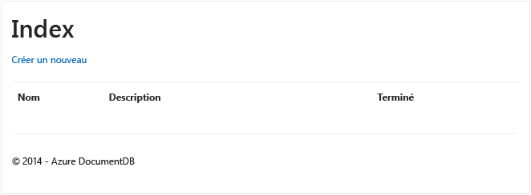

### Ajout d'éléments
Plaçons à présent quelques éléments dans notre base de données afin d'ajouter du contenu à la grille vide.

Ajoutons du code à DocumentDBRepository et ItemController pour rendre l’enregistrement persistant dans DocumentDB.

1. Ajoutez la méthode suivante à la classe **DocumentDBRepository** .
   
       public static async Task<Document> CreateItemAsync(T item)
       {
           return await client.CreateDocumentAsync(UriFactory.CreateDocumentCollectionUri(DatabaseId, CollectionId), item);
       }
   
   Cette méthode prend simplement un des objets qui lui est transmis et le rend persistant dans DocumentDB.
2. Ouvrez le fichier ItemController.cs et ajoutez l'extrait de code suivant dans la classe. C'est ce qui indique à ASP.NET MVC quelles opérations effectuer par rapport à l'action **Create** . Dans ce cas, restituez simplement la vue Create.cshtml associée créée précédemment.
   
        [ActionName("Create")]
        public async Task<ActionResult> CreateAsync()
        {
            return View();
        }
   
    Nous devons à présent ajouter du code à ce contrôleur qui acceptera la soumission à partir de la vue **Create** .
3. Ajoutez le bloc de code suivant à la classe ItemController.cs qui indique à ASP.NET MVC quoi faire d'une opération POST de formulaire pour ce contrôleur.
   
        [HttpPost]
        [ActionName("Create")]
        [ValidateAntiForgeryToken]
        public async Task<ActionResult> CreateAsync([Bind(Include = "Id,Name,Description,Completed")] Item item)
        {
            if (ModelState.IsValid)
            {
                await DocumentDBRepository<Item>.CreateItemAsync(item);
                return RedirectToAction("Index");
            }
   
            return View(item);
        }
   
    Ce code invoque le référentiel DocumentDB et utilise la méthode CreateItemAsync pour conserver la nouvelle tâche dans la base de données. 
   
    **Note de sécurité** : L’attribut **ValidateAntiForgeryToken** est utilisé ici pour protéger cette application contre les attaques de type falsification de requête intersites. En plus d'ajouter cet attribut, vous devez vérifier que vos vues fonctionnent avec ce jeton anti-falsification. Pour plus d’informations sur le sujet et pour obtenir des exemples illustrant une implémentation adéquate, consultez la rubrique [Prévention des falsifications de requête intersites][Preventing Cross-Site Request Forgery]. Le code source fourni sur [GitHub][GitHub] comporte l’implémentation complète.
   
    **Note de sécurité** : Nous utilisons également l’attribut **Bind** sur le paramètre de la méthode pour établir une protection contre les attaques par surcharge. Pour plus d’informations, consultez la rubrique [Opérations CRUD de base dans ASP.NET MVC][Basic CRUD Operations in ASP.NET MVC].

Le code qui permet d'ajouter de nouveaux éléments à la base de données est à présent complet.

### Modification d'éléments
La dernière chose à faire est d'ajouter la possibilité de modifier des **éléments** de la base de données et de les marquer comme terminés. La vue de modification ayant déjà été ajoutée au projet, il convient simplement d'ajouter à nouveau du code au contrôleur et à la classe **DocumentDBRepository** .

1. Ajoutez le code suivant à la classe **DocumentDBRepository** .
   
        public static async Task<Document> UpdateItemAsync(string id, T item)
        {
            return await client.ReplaceDocumentAsync(UriFactory.CreateDocumentUri(DatabaseId, CollectionId, id), item);
        }
   
        public static async Task<T> GetItemAsync(string id)
        {
            try
            {
                Document document = await client.ReadDocumentAsync(UriFactory.CreateDocumentUri(DatabaseId, CollectionId, id));
                return (T)(dynamic)document;
            }
            catch (DocumentClientException e)
            {
                if (e.StatusCode == HttpStatusCode.NotFound)
                {
                    return null;
                }
                else
                {
                    throw;
                }
            }
        }
   
    La première de ces méthodes, **GetItem**, récupère un élément auprès de DocumentDB et le transmet à nouveau à **ItemController**, puis à la vue **Edit**.
   
    La deuxième méthode que nous venons d’ajouter remplace le **document** dans DocumentDB par la version du **document** transmise par **ItemController**.
2. Ajoutez le code suivant à la classe **ItemController** .
   
        [HttpPost]
        [ActionName("Edit")]
        [ValidateAntiForgeryToken]
        public async Task<ActionResult> EditAsync([Bind(Include = "Id,Name,Description,Completed")] Item item)
        {
            if (ModelState.IsValid)
            {
                await DocumentDBRepository<Item>.UpdateItemAsync(item.Id, item);
                return RedirectToAction("Index");
            }
   
            return View(item);
        }
   
        [ActionName("Edit")]
        public async Task<ActionResult> EditAsync(string id)
        {
            if (id == null)
            {
                return new HttpStatusCodeResult(HttpStatusCode.BadRequest);
            }
   
            Item item = await DocumentDBRepository<Item>.GetItemAsync(id);
            if (item == null)
            {
                return HttpNotFound();
            }
   
            return View(item);
        }
   
    La première méthode traite l’opération HTTP GET qui se produit lorsque l’utilisateur clique sur le lien **Edit** de la vue **Index**. Elle extrait un [**Document**](http://msdn.microsoft.com/library/azure/microsoft.azure.documents.document.aspx) à partir de DocumentDB et le transmet à la vue **Edit**.
   
    La vue **Edit** renvoie ensuite une opération HTTP POST au **IndexController**. 
   
    La deuxième méthode que nous avons ajoutée gère en transmettant l'objet mis à jour à DocumentDB pour le rendre persistant dans la base de données.

Maintenant que nous avons répertorié les **éléments** non terminés, ajouté des **éléments**, puis modifié des **éléments**, nous sommes en mesure d’exécuter notre application.

## Étape 6 : exécution de l'application en local
Pour tester l'application sur votre machine locale, procédez comme suit :

1. Appuyez sur F5 dans Visual Studio pour générer l'application en mode débogage. Cette opération doit générer l'application et lancer un navigateur avec la page de grille vide que nous avons vue auparavant :
   
    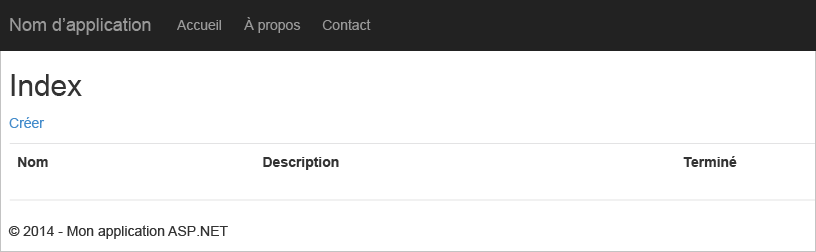
   
    Si vous utilisez Visual Studio 2013 et que vous recevez l’erreur « Cannot await in the body of a catch clause. », vous devez installer le [package NuGet Microsoft.Net.Compilers](https://www.nuget.org/packages/Microsoft.Net.Compilers/). Vous pouvez également comparer votre code avec l’exemple de projet sur [GitHub][GitHub]. 
2. Cliquez sur le lien **Créer nouveau** et ajoutez des valeurs aux champs **Nom** et **Description**. Ne cochez pas la case **Terminé**, sinon le nouvel **élément** serait ajouté avec l’état terminé et n’apparaîtrait pas dans la liste initiale.
   
    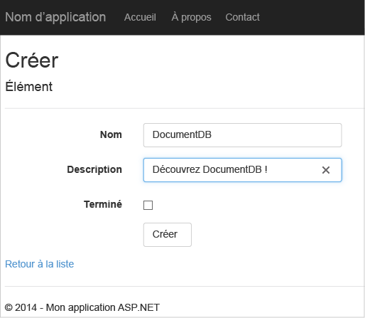
3. Cliquez sur **Créer**. Vous êtes alors redirigé vers la vue **Index** et votre **élément** apparaît dans la liste.
   
    
   
    Vous êtes libre d'ajouter quelques **éléments** supplémentaires à votre liste.
4. Cliquez sur **Modifier** en regard d’un **élément** de la liste. Vous êtes alors dirigé vers la vue **Edit** où vous pouvez mettre à jour les propriétés de votre objet, notamment l’indicateur **Completed**. Si vous marquez l’indicateur **Completed** et cliquez sur **Enregistrer**, **l’élément** est supprimé de la liste des tâches non terminées.
   
    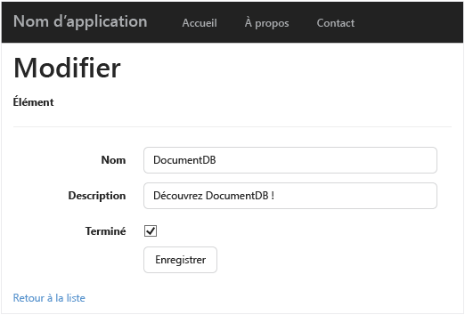
5. Une fois que vous avez testé l'application, appuyez sur Ctrl+F5 pour arrêter le débogage de l'application. Vous êtes prêt à déployer.

## Étape 7 : déploiement de l'application sur Azure Websites
Maintenant que l'application terminée fonctionne correctement avec DocumentDB, nous allons la déployer sur Azure Websites. Si vous avez sélectionné **Héberger dans le cloud** au moment de créer le projet ASP.NET MVC vide, Visual Studio vous facilite la tâche en faisant presque tout le travail à votre place. 

1. Pour publier cette application, il vous suffit de cliquer avec le bouton droit sur le projet dans **l’Explorateur de solutions**, puis de cliquer sur **Publier**.
   
    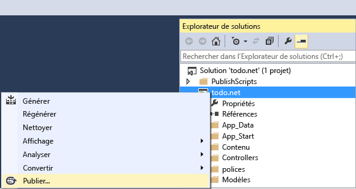
2. Tout doit être déjà configuré en fonction de vos informations d’identification. En fait, le site web ayant déjà été créé dans Azure à **l’URL de destination** indiquée, il ne vous reste plus qu’à cliquer sur **Publier**.
   
    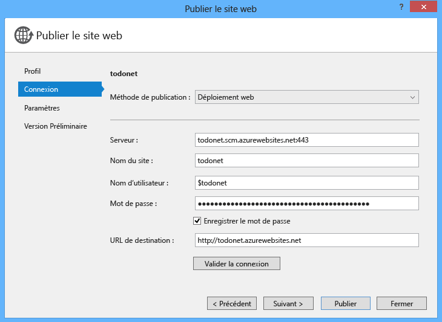

En quelques secondes, Visual Studio achève la publication de votre application web et lance un navigateur dans lequel vous pouvez voir votre réalisation exécutée dans Azure !

## Résolution des problèmes

Si vous rencontrez l’erreur « Une erreur s’est produite lors du traitement de votre demande » lors de la tentative de déploiement de l’application web, procédez comme suit : 

1. Annulez le message d’erreur, puis sélectionnez **Microsoft Azure Web Apps** à nouveau. 
2. Connectez-vous, puis sélectionnez **Nouveau** pour créer une nouvelle application web. 
3. Sur l’écran **Créer une application web sur Microsoft Azure**, effectuez les opérations suivantes : 
    
    - Nom de l’application web : « todo-net-app »
    - Plan App Service : créez un nouveau plan nommé « todo-net-app »
    - Groupe de ressources : créez un nouveau groupe nommé « todo-net-app »
    - Région : sélectionnez la région la plus proche des utilisateurs de votre application
    - Serveur de base de données : ne sélectionnez aucune base de données, puis cliquez sur **Créer**. 

4. Sur l’« écran todo-net-app * », cliquez sur **Valider la connexion**. Après avoir vérifié la connexion, cliquez sur **Publier**. 
    
    L’application s’affiche ensuite sur votre navigateur.

## Étapes suivantes
Félicitations ! Vous venez de créer votre première application web ASP.NET MVC à l’aide d’Azure DocumentDB et de la publier sur les sites web Azure. Le code source de l'application complète, y compris les fonctionnalités de détail et de suppression qui n'étaient pas incluses dans ce didacticiel, peuvent être téléchargés ou clonés à partir de [GitHub][GitHub]. Si vous êtes intéressé par l'ajout de ce code à votre application, copiez-le et ajoutez-le à cette dernière.

Pour ajouter des fonctionnalités supplémentaires à votre application, passez en revue les API disponibles dans la [bibliothèque DocumentDB .NET](https://msdn.microsoft.com/library/azure/dn948556.aspx) et n’hésitez pas à contribuer à la bibliothèque DocumentDB .NET sur [GitHub][GitHub]. 

[\*]: https://microsoft.sharepoint.com/teams/DocDB/Shared%20Documents/Documentation/Docs.LatestVersions/PicExportError
[Visual Studio Express]: http://www.visualstudio.com/products/visual-studio-express-vs.aspx
[Microsoft Web Platform Installer]: http://www.microsoft.com/web/downloads/platform.aspx
[Preventing Cross-Site Request Forgery]: http://go.microsoft.com/fwlink/?LinkID=517254
[Basic CRUD Operations in ASP.NET MVC]: http://go.microsoft.com/fwlink/?LinkId=317598
[GitHub]: https://github.com/Azure-Samples/documentdb-net-todo-app

