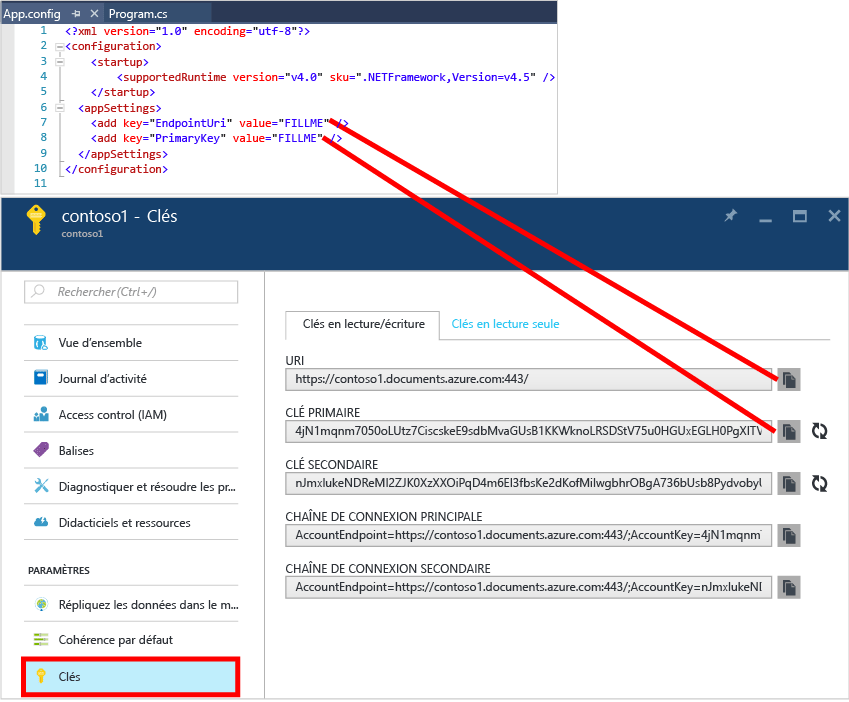

# Didacticiel NoSQL : générer une application de console C# DocumentDB
> [!div class="op_single_selector"]
> * [.NET](documentdb-get-started.md)
> * [Node.JS](documentdb-nodejs-get-started.md)
> 
> 

Bienvenue dans le didacticiel NoSQL pour le Kit de développement logiciel (SDK) .NET d’Azure DocumentDB ! Après avoir obtenu le projet Démarrage rapide ou à la fin de ce didacticiel, vous disposerez d’une application console qui crée et interroge des ressources DocumentDB.

* **[Démarrage rapide](#quickstart)**: téléchargez l’exemple de projet, ajoutez vos informations de connexion et rendez une application DocumentDB opérationnelle en moins de 10 minutes.
* **[Didacticiel](#tutorial)**: création intégrale d’une application de démarrage rapide en 30 minutes.

## Composants requis
* Un compte Azure actif. Si vous n’en avez pas, vous pouvez vous inscrire pour bénéficier d’un [compte gratuit](https://azure.microsoft.com/free/).
* [Visual Studio 2013 ou Visual Studio 2015](http://www.visualstudio.com/).
* .NET Framework 4.6

## Démarrage rapide
1. Téléchargez le fichier .zip de l’exemple de projet à partir de [GitHub](https://github.com/Azure-Samples/documentdb-dotnet-getting-started-quickstart/archive/master.zip) ou clonez le référentiel [documentdb-dotnet-getting-started-quickstart](https://github.com/Azure-Samples/documentdb-dotnet-getting-started-quickstart).
2. Utilisez le portail Azure pour [créer un compte DocumentDB](documentdb-create-account.md).
3. Dans le fichier App.config, remplacez les valeurs EndpointUri et PrimaryKey par celles récupérées du [Portail Azure](https://portal.azure.com/), en accédant au panneau **DocumentDB (NoSQL)**, en cliquant sur le **Nom du compte**, puis en cliquant sur **Clés** dans le menu de la ressource.
    
4. Créez le projet. La fenêtre de console affiche les ressources créées, interrogées puis nettoyées.
   
    

## Didacticiel
Ce didacticiel vous guide tout au long de la création d’une base de données DocumentDB, d’une collection DocumentDB et de documents JSON. Ensuite, vous allez interroger la collection, puis nettoyer et supprimer la base de données. Ce didacticiel crée un projet identique au projet de démarrage rapide, mais vous le créez de manière incrémentielle et vous recevez des explications sur le code que vous ajoutez au projet.

## Étape 1 : créer un compte DocumentDB
Créons un compte DocumentDB. Si vous avez déjà un compte que vous souhaitez utiliser, vous pouvez passer directement à l’étape [Configurer votre solution Visual Studio](#SetupVS).

[!INCLUDE [documentdb-create-dbaccount](../../includes/documentdb-create-dbaccount.md)]

## Étape 2 : configurer votre solution Visual Studio
1. Ouvrez **Visual Studio 2015** sur votre ordinateur.
2. Dans le menu **Fichier**, sélectionnez **Nouveau**, puis choisissez **Projet**.
3. Dans la boîte de dialogue **Nouveau projet**, sélectionnez **Modèles** / **Visual C#** / **Application console**, nommez votre projet, puis cliquez sur **OK**.
   
4. Dans **l’Explorateur de solutions**, cliquez avec le bouton droit sur votre nouvelle application console, qui se trouve sous votre solution Visual Studio.
5. Ensuite, sans quitter le menu, cliquez sur **Gérer les packages NuGet...**
   
6. Dans l’onglet **NuGet**, cliquez sur **Parcourir** et tapez **azure documentdb** dans la zone de recherche.
7. Dans les résultats, recherchez **Microsoft.Azure.DocumentDB** et cliquez sur **Installer**.
   L’ID de package de la bibliothèque cliente DocumentDB est [Microsoft.Azure.DocumentDB](https://www.nuget.org/packages/Microsoft.Azure.DocumentDB)
   

Parfait ! L’installation étant terminée, nous pouvons passer à l’écriture du code. Vous trouverez le projet de code complet de ce didacticiel dans [GitHub](https://github.com/Azure-Samples/documentdb-dotnet-getting-started/blob/master/src/Program.cs).

## Étape 3 : se connecter à un compte DocumentDB
Tout d’abord, ajoutez ces références au début de votre application C#, dans le fichier Program.cs :

    using System;
    using System.Linq;
    using System.Threading.Tasks;

    // ADD THIS PART TO YOUR CODE
    using System.Net;
    using Microsoft.Azure.Documents;
    using Microsoft.Azure.Documents.Client;
    using Newtonsoft.Json;

> [!IMPORTANT]
> Pour pouvoir exécuter ce didacticiel NoSQL, veillez à ajouter les dépendances ci-dessus.
> 
> 

Maintenant, ajoutez ces deux constantes et votre variable *client* dans votre classe publique *Program*.

    public class Program
    {
        // ADD THIS PART TO YOUR CODE
        private const string EndpointUri = "<your endpoint URI>";
        private const string PrimaryKey = "<your key>";
        private DocumentClient client;

Ensuite, accédez au [portail Azure](https://portal.azure.com) pour récupérer votre URI et votre clé primaire. L’URI et la clé primaire de DocumentDB sont nécessaires pour que votre application puisse se connecter et que DocumentDB approuve la connexion de votre application.

Dans le portail Azure, accédez à votre compte DocumentDB, puis cliquez sur **Clés**.

Copiez l’URI à partir du portail et collez-le dans `<your endpoint URI>` dans le fichier program.cs. Ensuite, copiez la clé primaire à partir du portail, puis collez-la dans `<your key>`.

![Capture d’écran du portail Azure utilisée par le didacticiel NoSQL pour créer une application de console C#. Présente un compte DocumentDB, avec le hub ACTIF et le bouton CLÉS mis en surbrillance dans le panneau du compte DocumentDB, et les valeurs d’URI, de CLÉ PRIMAIRE et de CLÉ SECONDAIRE mises en surbrillance dans le panneau Clés][keys]

Nous allons démarrer l’application de prise en main en créant une instance de **DocumentClient**.

Sous la méthode **Main**, ajoutez la nouvelle tâche asynchrone appelée **GetStartedDemo** qui va instancier notre nouveau **DocumentClient**.

    static void Main(string[] args)
    {
    }

    // ADD THIS PART TO YOUR CODE
    private async Task GetStartedDemo()
    {
        this.client = new DocumentClient(new Uri(EndpointUri), PrimaryKey);
    }

Ajoutez le code suivant pour exécuter votre tâche asynchrone à partir de la méthode **Main** . La méthode **Main** va intercepter les exceptions et les consigner dans la console.

    static void Main(string[] args)
    {
            // ADD THIS PART TO YOUR CODE
            try
            {
                    Program p = new Program();
                    p.GetStartedDemo().Wait();
            }
            catch (DocumentClientException de)
            {
                    Exception baseException = de.GetBaseException();
                    Console.WriteLine("{0} error occurred: {1}, Message: {2}", de.StatusCode, de.Message, baseException.Message);
            }
            catch (Exception e)
            {
                    Exception baseException = e.GetBaseException();
                    Console.WriteLine("Error: {0}, Message: {1}", e.Message, baseException.Message);
            }
            finally
            {
                    Console.WriteLine("End of demo, press any key to exit.");
                    Console.ReadKey();
            }

Appuyez sur **F5** pour exécuter votre application.

Félicitations ! Vous êtes connecté à un compte DocumentDB. Jetons maintenant un œil à l’utilisation de ressources DocumentDB.  

## Étape 4 : créer une base de données
Avant d'ajouter le code permettant de créer une base de données, ajoutez une méthode d'assistance pour l'écriture sur la console.

Copiez et collez la méthode **WriteToConsoleAndPromptToContinue** sous la méthode **GetStartedDemo**.

    // ADD THIS PART TO YOUR CODE
    private void WriteToConsoleAndPromptToContinue(string format, params object[] args)
    {
            Console.WriteLine(format, args);
            Console.WriteLine("Press any key to continue ...");
            Console.ReadKey();
    }

Votre [base de données](documentdb-resources.md#databases) DocumentDB peut être créée à l’aide de la méthode [CreateDatabaseAsync](https://msdn.microsoft.com/library/microsoft.azure.documents.client.documentclient.createdatabaseasync.aspx) de la classe **DocumentClient**. Une base de données est le conteneur logique de stockage de documents JSON partitionné entre les collections.

Copiez et collez la méthode **CreateDatabaseIfNotExists** sous la méthode **WriteToConsoleAndPromptToContinue**.

    // ADD THIS PART TO YOUR CODE
    private async Task CreateDatabaseIfNotExists(string databaseName)
    {
            // Check to verify a database with the id=FamilyDB does not exist
            try
            {
                    await this.client.ReadDatabaseAsync(UriFactory.CreateDatabaseUri(databaseName));
                    this.WriteToConsoleAndPromptToContinue("Found {0}", databaseName);
            }
            catch (DocumentClientException de)
            {
                    // If the database does not exist, create a new database
                    if (de.StatusCode == HttpStatusCode.NotFound)
                    {
                            await this.client.CreateDatabaseAsync(new Database { Id = databaseName });
                            this.WriteToConsoleAndPromptToContinue("Created {0}", databaseName);
                    }
                    else
                    {
                            throw;
                    }
            }
    }

Copiez et collez le code suivant dans votre méthode **GetStartedDemo** en dessous de la création du client. Ce faisant, vous créez la base de données *FamilyDB*.

    private async Task GetStartedDemo()
    {
        this.client = new DocumentClient(new Uri(EndpointUri), PrimaryKey);

        // ADD THIS PART TO YOUR CODE
        await this.CreateDatabaseIfNotExists("FamilyDB_va");

Appuyez sur **F5** pour exécuter votre application.

Félicitations ! Vous avez créé une base de données DocumentDB.  

## Étape 5 : créer une collection
> [!WARNING]
> **CreateDocumentCollectionAsync** crée une collection avec un débit réservé, ce qui a des conséquences sur la tarification. Pour plus d'informations, visitez notre [page de tarification](https://azure.microsoft.com/pricing/details/documentdb/).
> 
> 

Vous pouvez créer une [collection](documentdb-resources.md#collections) à l’aide de la méthode [CreateDocumentCollectionAsync](https://msdn.microsoft.com/library/microsoft.azure.documents.client.documentclient.createdocumentcollectionasync.aspx) de la classe **DocumentClient**. Une collection est un conteneur de documents JSON. Elle est associée à une logique d'application JavaScript.

Copiez et collez la méthode **CreateDocumentCollectionIfNotExists** sous votre méthode **CreateDatabaseIfNotExists**.

    // ADD THIS PART TO YOUR CODE
    private async Task CreateDocumentCollectionIfNotExists(string databaseName, string collectionName)
    {
        try
        {
            await this.client.ReadDocumentCollectionAsync(UriFactory.CreateDocumentCollectionUri(databaseName, collectionName));
            this.WriteToConsoleAndPromptToContinue("Found {0}", collectionName);
        }
        catch (DocumentClientException de)
        {
            // If the document collection does not exist, create a new collection
            if (de.StatusCode == HttpStatusCode.NotFound)
            {
                DocumentCollection collectionInfo = new DocumentCollection();
                collectionInfo.Id = collectionName;

                // Configure collections for maximum query flexibility including string range queries.
                collectionInfo.IndexingPolicy = new IndexingPolicy(new RangeIndex(DataType.String) { Precision = -1 });

                // Here we create a collection with 400 RU/s.
                await this.client.CreateDocumentCollectionAsync(
                    UriFactory.CreateDatabaseUri(databaseName),
                    collectionInfo,
                    new RequestOptions { OfferThroughput = 400 });

                this.WriteToConsoleAndPromptToContinue("Created {0}", collectionName);
            }
            else
            {
                throw;
            }
        }
    }

Copiez et collez le code suivant dans votre méthode **GetStartedDemo** en dessous de la création de la base de données. Ce faisant, vous créez la collection de documents *FamilyCollection_va*.

        this.client = new DocumentClient(new Uri(EndpointUri), PrimaryKey);

        await this.CreateDatabaseIfNotExists("FamilyDB_oa");

        // ADD THIS PART TO YOUR CODE
        await this.CreateDocumentCollectionIfNotExists("FamilyDB_va", "FamilyCollection_va");

Appuyez sur **F5** pour exécuter votre application.

Félicitations ! Vous avez créé une collection de documents DocumentDB.  

## Étape 6 : Création de documents JSON
Vous pouvez créer un [document](documentdb-resources.md#documents) à l’aide de la méthode [CreateDocumentAsync](https://msdn.microsoft.com/library/microsoft.azure.documents.client.documentclient.createdocumentasync.aspx) de la classe **DocumentClient**. Les documents correspondent à du contenu JSON (arbitraire) défini par l'utilisateur. Nous pouvons maintenant insérer un ou plusieurs documents. Si vous disposez déjà de données que vous souhaitez stocker dans votre base de données, vous pouvez utiliser de [l’outil de migration de données](documentdb-import-data.md)de DocumentDB.

Nous devons tout d’abord créer une classe **Family** représentant les objets stockés dans DocumentDB dans cet exemple. Nous allons également créer les sous-classes **Parent**, **Child**, **Pet** et **Address** qui seront utilisées dans **Family**. Notez que les documents doivent avoir une propriété **Id** sérialisée comme **id** dans JSON. Créez ces classes en ajoutant les sous-classes internes suivantes après la méthode **GetStartedDemo** .

Copiez et collez les classes **Family**, **Parent**, **Child**, **Pet** et **Address** sous la méthode **WriteToConsoleAndPromptToContinue**.

    private void WriteToConsoleAndPromptToContinue(string format, params object[] args)
    {
        Console.WriteLine(format, args);
        Console.WriteLine("Press any key to continue ...");
        Console.ReadKey();
    }

    // ADD THIS PART TO YOUR CODE
    public class Family
    {
        [JsonProperty(PropertyName = "id")]
        public string Id { get; set; }
        public string LastName { get; set; }
        public Parent[] Parents { get; set; }
        public Child[] Children { get; set; }
        public Address Address { get; set; }
        public bool IsRegistered { get; set; }
        public override string ToString()
        {
                return JsonConvert.SerializeObject(this);
        }
    }

    public class Parent
    {
        public string FamilyName { get; set; }
        public string FirstName { get; set; }
    }

    public class Child
    {
        public string FamilyName { get; set; }
        public string FirstName { get; set; }
        public string Gender { get; set; }
        public int Grade { get; set; }
        public Pet[] Pets { get; set; }
    }

    public class Pet
    {
        public string GivenName { get; set; }
    }

    public class Address
    {
        public string State { get; set; }
        public string County { get; set; }
        public string City { get; set; }
    }

Copiez et collez la méthode **CreateFamilyDocumentIfNotExists** sous votre méthode **CreateDocumentCollectionIfNotExists**.

    // ADD THIS PART TO YOUR CODE
    private async Task CreateFamilyDocumentIfNotExists(string databaseName, string collectionName, Family family)
    {
        try
        {
            await this.client.ReadDocumentAsync(UriFactory.CreateDocumentUri(databaseName, collectionName, family.Id));
            this.WriteToConsoleAndPromptToContinue("Found {0}", family.Id);
        }
        catch (DocumentClientException de)
        {
            if (de.StatusCode == HttpStatusCode.NotFound)
            {
                await this.client.CreateDocumentAsync(UriFactory.CreateDocumentCollectionUri(databaseName, collectionName), family);
                this.WriteToConsoleAndPromptToContinue("Created Family {0}", family.Id);
            }
            else
            {
                throw;
            }
        }
    }

Insérez ensuite deux documents, un pour la famille Andersen, l’autre pour la famille Wakefield.

Copiez et collez le code suivant dans votre méthode **GetStartedDemo** en dessous de la création de la collection de documents.

    await this.CreateDatabaseIfNotExists("FamilyDB_va");

    await this.CreateDocumentCollectionIfNotExists("FamilyDB_va", "FamilyCollection_va");

    // ADD THIS PART TO YOUR CODE
    Family andersenFamily = new Family
    {
            Id = "Andersen.1",
            LastName = "Andersen",
            Parents = new Parent[]
            {
                    new Parent { FirstName = "Thomas" },
                    new Parent { FirstName = "Mary Kay" }
            },
            Children = new Child[]
            {
                    new Child
                    {
                            FirstName = "Henriette Thaulow",
                            Gender = "female",
                            Grade = 5,
                            Pets = new Pet[]
                            {
                                    new Pet { GivenName = "Fluffy" }
                            }
                    }
            },
            Address = new Address { State = "WA", County = "King", City = "Seattle" },
            IsRegistered = true
    };

    await this.CreateFamilyDocumentIfNotExists("FamilyDB_va", "FamilyCollection_va", andersenFamily);

    Family wakefieldFamily = new Family
    {
            Id = "Wakefield.7",
            LastName = "Wakefield",
            Parents = new Parent[]
            {
                    new Parent { FamilyName = "Wakefield", FirstName = "Robin" },
                    new Parent { FamilyName = "Miller", FirstName = "Ben" }
            },
            Children = new Child[]
            {
                    new Child
                    {
                            FamilyName = "Merriam",
                            FirstName = "Jesse",
                            Gender = "female",
                            Grade = 8,
                            Pets = new Pet[]
                            {
                                    new Pet { GivenName = "Goofy" },
                                    new Pet { GivenName = "Shadow" }
                            }
                    },
                    new Child
                    {
                            FamilyName = "Miller",
                            FirstName = "Lisa",
                            Gender = "female",
                            Grade = 1
                    }
            },
            Address = new Address { State = "NY", County = "Manhattan", City = "NY" },
            IsRegistered = false
    };

    await this.CreateFamilyDocumentIfNotExists("FamilyDB_va", "FamilyCollection_va", wakefieldFamily);

Appuyez sur **F5** pour exécuter votre application.

Félicitations ! Vous avez créé deux collections de documents DocumentDB.  

## Étape 7 : interroger les ressources DocumentDB
DocumentDB prend en charge les [requêtes](documentdb-sql-query.md) enrichies sur les documents JSON stockés dans chaque collection.  L'exemple de code suivant affiche différentes requêtes (à l'aide de la syntaxe SQL de DocumentDB et de LINQ) que nous pouvons exécuter sur les documents insérés à l'étape précédente.

Copiez et collez la méthode **ExecuteSimpleQuery** sous votre méthode **CreateFamilyDocumentIfNotExists**.

    // ADD THIS PART TO YOUR CODE
    private void ExecuteSimpleQuery(string databaseName, string collectionName)
    {
        // Set some common query options
        FeedOptions queryOptions = new FeedOptions { MaxItemCount = -1 };

            // Here we find the Andersen family via its LastName
            IQueryable<Family> familyQuery = this.client.CreateDocumentQuery<Family>(
                    UriFactory.CreateDocumentCollectionUri(databaseName, collectionName), queryOptions)
                    .Where(f => f.LastName == "Andersen");

            // The query is executed synchronously here, but can also be executed asynchronously via the IDocumentQuery<T> interface
            Console.WriteLine("Running LINQ query...");
            foreach (Family family in familyQuery)
            {
                    Console.WriteLine("\tRead {0}", family);
            }

            // Now execute the same query via direct SQL
            IQueryable<Family> familyQueryInSql = this.client.CreateDocumentQuery<Family>(
                    UriFactory.CreateDocumentCollectionUri(databaseName, collectionName),
                    "SELECT * FROM Family WHERE Family.LastName = 'Andersen'",
                    queryOptions);

            Console.WriteLine("Running direct SQL query...");
            foreach (Family family in familyQueryInSql)
            {
                    Console.WriteLine("\tRead {0}", family);
            }

            Console.WriteLine("Press any key to continue ...");
            Console.ReadKey();
    }

Copiez et collez le code suivant dans votre méthode **GetStartedDemo** en dessous de la création du deuxième document.

    await this.CreateFamilyDocumentIfNotExists("FamilyDB_va", "FamilyCollection_va", wakefieldFamily);

    // ADD THIS PART TO YOUR CODE
    this.ExecuteSimpleQuery("FamilyDB_va", "FamilyCollection_va");

Appuyez sur **F5** pour exécuter votre application.

Félicitations ! Vous avez effectué une requête sur une collection DocumentDB.

Le diagramme suivant montre comment la syntaxe de requête SQL de DocumentDB est appelée sur la collection que vous avez créée. C'est par ailleurs cette même logique qui s'applique à la requête LINQ.

Le mot clé [FROM](documentdb-sql-query.md#from-clause) est facultatif dans la requête, car les requêtes DocumentDB sont déjà étendues à une collection unique. Par conséquent, « FROM Families f » peut être remplacé par «FROM root r » ou par tout autre nom de variable que vous choisissez. DocumentDB déduira que Families, root ou le nom de variable choisi fait par défaut référence à la collection actuelle.

## Étape 8 : remplacer le document JSON
DocumentDB prend en charge le remplacement des documents JSON.  

Copiez et collez la méthode **ReplaceFamilyDocument** sous votre méthode **ExecuteSimpleQuery**.

    // ADD THIS PART TO YOUR CODE
    private async Task ReplaceFamilyDocument(string databaseName, string collectionName, string familyName, Family updatedFamily)
    {
        try
        {
            await this.client.ReplaceDocumentAsync(UriFactory.CreateDocumentUri(databaseName, collectionName, familyName), updatedFamily);
            this.WriteToConsoleAndPromptToContinue("Replaced Family {0}", familyName);
        }
        catch (DocumentClientException de)
        {
            throw;
        }
    }

Copiez et collez le code suivant dans votre méthode **GetStartedDemo** en dessous de l’exécution de la requête. Après avoir remplacé le document, cela exécutera à nouveau la même requête pour afficher le document modifié.

    await this.CreateFamilyDocumentIfNotExists("FamilyDB_va", "FamilyCollection_va", wakefieldFamily);

    this.ExecuteSimpleQuery("FamilyDB_va", "FamilyCollection_va");

    // ADD THIS PART TO YOUR CODE
    // Update the Grade of the Andersen Family child
    andersenFamily.Children[0].Grade = 6;

    await this.ReplaceFamilyDocument("FamilyDB_va", "FamilyCollection_va", "Andersen.1", andersenFamily);

    this.ExecuteSimpleQuery("FamilyDB_va", "FamilyCollection_va");

Appuyez sur **F5** pour exécuter votre application.

Félicitations ! Vous avez remplacé un document DocumentDB.

## Étape 9 : supprimer le document JSON
DocumentDB prend en charge la suppression des documents JSON.  

Copiez et collez la méthode **DeleteFamilyDocument** sous votre méthode **ReplaceFamilyDocument**.

    // ADD THIS PART TO YOUR CODE
    private async Task DeleteFamilyDocument(string databaseName, string collectionName, string documentName)
    {
        try
        {
            await this.client.DeleteDocumentAsync(UriFactory.CreateDocumentUri(databaseName, collectionName, documentName));
            Console.WriteLine("Deleted Family {0}", documentName);
        }
        catch (DocumentClientException de)
        {
            throw;
        }
    }

Copiez et collez le code suivant dans votre méthode **GetStartedDemo** en dessous de l’exécution de la deuxième requête.

    await this.ReplaceFamilyDocument("FamilyDB_va", "FamilyCollection_va", "Andersen.1", andersenFamily);

    this.ExecuteSimpleQuery("FamilyDB_va", "FamilyCollection_va");

    // ADD THIS PART TO CODE
    await this.DeleteFamilyDocument("FamilyDB_va", "FamilyCollection_va", "Andersen.1");

Appuyez sur **F5** pour exécuter votre application.

Félicitations ! Vous avez supprimé un document DocumentDB.

## Étape 10 : supprimer la base de données
Supprimer la base de données créée revient à supprimer la base de données et toutes les ressources enfants (collections, documents, etc.).

Copiez et collez le code suivant dans votre méthode **GetStartedDemo** sous la suppression du document, pour supprimer la base de données et toutes ses ressources enfants.

    this.ExecuteSimpleQuery("FamilyDB_va", "FamilyCollection_va");

    await this.DeleteFamilyDocument("FamilyDB_va", "FamilyCollection_va", "Andersen.1");

    // ADD THIS PART TO CODE
    // Clean up/delete the database
    await this.client.DeleteDatabaseAsync(UriFactory.CreateDatabaseUri("FamilyDB_va"));

Appuyez sur **F5** pour exécuter votre application.

Félicitations ! Vous avez supprimé une base de données DocumentDB.

## Étape 11 : exécuter votre application de console C#
Appuyez sur F5 dans Visual Studio pour générer l'application en mode débogage.

La sortie de votre application de prise en main doit s’afficher. Celle-ci doit présenter les résultats des requêtes que nous avons ajoutées, qui doivent correspondre au texte d'exemple ci-dessous.

    Created FamilyDB_va
    Press any key to continue ...
    Created FamilyCollection_va
    Press any key to continue ...
    Created Family Andersen.1
    Press any key to continue ...
    Created Family Wakefield.7
    Press any key to continue ...
    Running LINQ query...
        Read {"id":"Andersen.1","LastName":"Andersen","District":"WA5","Parents":[{"FamilyName":null,"FirstName":"Thomas"},{"FamilyName":null,"FirstName":"Mary Kay"}],"Children":[{"FamilyName":null,"FirstName":"Henriette Thaulow","Gender":"female","Grade":5,"Pets":[{"GivenName":"Fluffy"}]}],"Address":{"State":"WA","County":"King","City":"Seattle"},"IsRegistered":true}
    Running direct SQL query...
        Read {"id":"Andersen.1","LastName":"Andersen","District":"WA5","Parents":[{"FamilyName":null,"FirstName":"Thomas"},{"FamilyName":null,"FirstName":"Mary Kay"}],"Children":[{"FamilyName":null,"FirstName":"Henriette Thaulow","Gender":"female","Grade":5,"Pets":[{"GivenName":"Fluffy"}]}],"Address":{"State":"WA","County":"King","City":"Seattle"},"IsRegistered":true}
    Replaced Family Andersen.1
    Press any key to continue ...
    Running LINQ query...
        Read {"id":"Andersen.1","LastName":"Andersen","District":"WA5","Parents":[{"FamilyName":null,"FirstName":"Thomas"},{"FamilyName":null,"FirstName":"Mary Kay"}],"Children":[{"FamilyName":null,"FirstName":"Henriette Thaulow","Gender":"female","Grade":6,"Pets":[{"GivenName":"Fluffy"}]}],"Address":{"State":"WA","County":"King","City":"Seattle"},"IsRegistered":true}
    Running direct SQL query...
        Read {"id":"Andersen.1","LastName":"Andersen","District":"WA5","Parents":[{"FamilyName":null,"FirstName":"Thomas"},{"FamilyName":null,"FirstName":"Mary Kay"}],"Children":[{"FamilyName":null,"FirstName":"Henriette Thaulow","Gender":"female","Grade":6,"Pets":[{"GivenName":"Fluffy"}]}],"Address":{"State":"WA","County":"King","City":"Seattle"},"IsRegistered":true}
    Deleted Family Andersen.1
    End of demo, press any key to exit.

Félicitations ! Vous avez terminé ce didacticiel NoSQL et que vous disposez d’une application de console C# qui fonctionne !

## Étapes suivantes
* Vous voulez un exemple de didacticiel NoSQL ASP.NET MVC plus complexe ? Consultez [Création d'une application web avec ASP.NET MVC et DocumentDB](documentdb-dotnet-application.md).
* Vous souhaitez effectuer un test des performances et de la mise à l’échelle avec DocumentDB ? Consultez la page [Test des performances et de la mise à l’échelle avec Azure DocumentDB](documentdb-performance-testing.md)
* Apprenez à [surveiller un compte DocumentDB](documentdb-monitor-accounts.md).
* Exécutez des requêtes sur notre exemple de dataset dans le [Query Playground](https://www.documentdb.com/sql/demo).
* Consultez la section Développer de la [page de documentation DocumentDB](https://azure.microsoft.com/documentation/services/documentdb/)pour découvrir plus en détail le modèle de programmation.

[documentdb-create-account]: documentdb-create-account.md
[keys]: media/documentdb-get-started-quickstart/nosql-tutorial-keys.png

<!--HONumber=Jan17_HO3-->

