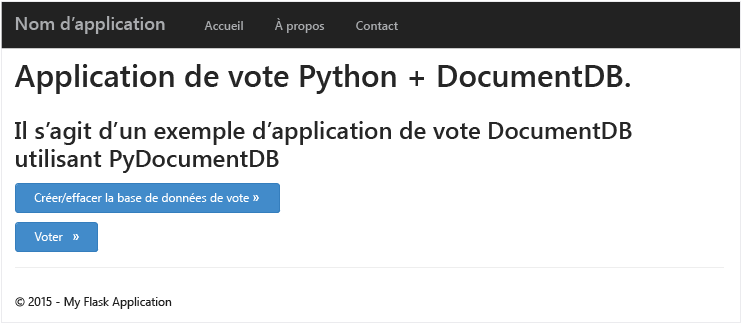
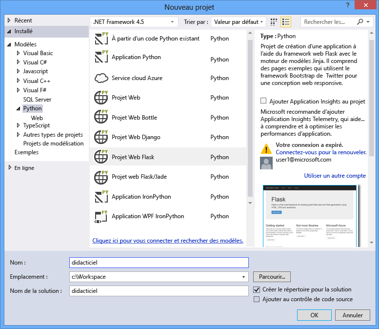
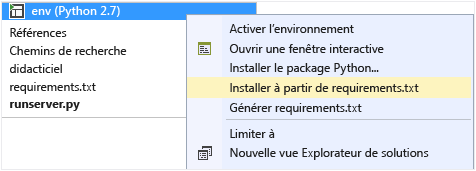
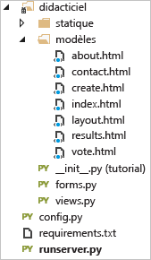
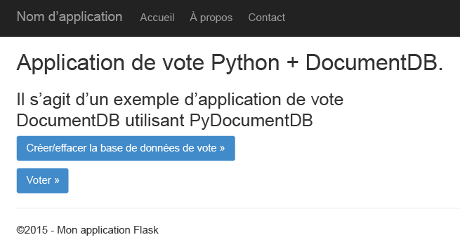
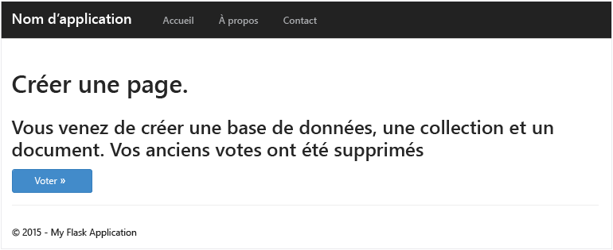
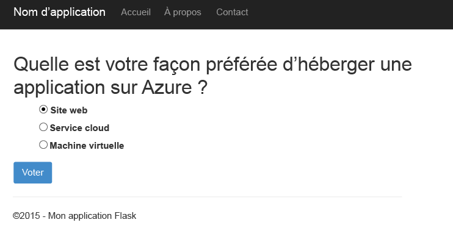
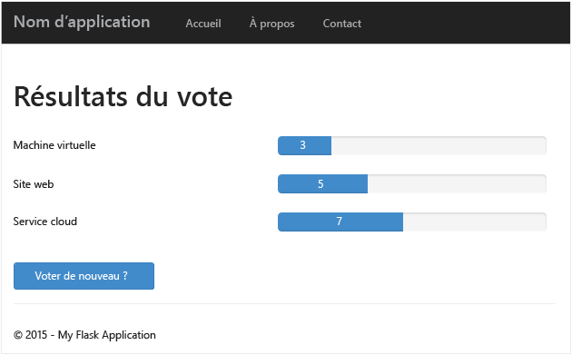
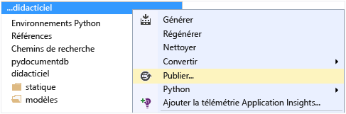
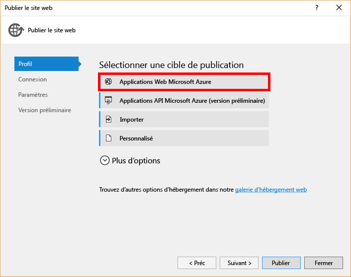

# <a name="python-flask-web-application-development-with-documentdb"></a>Développement d’une application Python Flask avec DocumentDB
> [!div class="op_single_selector"]
> * [.NET](documentdb-dotnet-application.md)
> * [Node.JS](documentdb-nodejs-application.md)
> * [Java](documentdb-java-application.md)
> * [Python](documentdb-python-application.md)
> 
> 

Ce didacticiel vous montre comment utiliser Azure DocumentDB pour stocker des données et y accéder à partir d’une application web Python hébergée sur Azure. Il suppose que vous avez déjà une expérience de l’utilisation de Python et des sites web Azure.

Ce didacticiel de base de données traite les points suivants :

1. Création et configuration d’un compte DocumentDB
2. Création d’une application Python MVC
3. Connexion à Azure DocumentDB pour une utilisation à partir de votre application web
4. Déploiement de l’application web sur Azure Websites

Dans ce didacticiel, vous allez créer une application de vote simple qui vous permettra de voter lors d’un sondage.



## <a name="database-tutorial-prerequisites"></a>Conditions préalables à l’exécution de ce didacticiel de base de données
Avant de suivre les instructions de cet article, vérifiez que les éléments suivants sont installés :

* Un compte Azure actif. Si vous ne possédez pas de compte, vous pouvez créer un compte d'évaluation gratuit en quelques minutes. Pour plus d'informations, consultez la page [Version d'évaluation gratuite d'Azure](https://azure.microsoft.com/pricing/free-trial/).
 
    OU 

    Une installation locale de [l’émulateur Azure DocumentDB](documentdb-nosql-local-emulator.md).
* [Visual Studio 2013](http://www.visualstudio.com/) ou une version ultérieure, ou [Visual Studio Express](), qui est la version gratuite. Les instructions de ce didacticiel sont écrites spécifiquement pour Visual Studio 2015. 
* Outils Python pour Visual Studio disponibles dans [GitHub](http://microsoft.github.io/PTVS/). Ce didacticiel utilise Python Tools for Visual Studio 2015. 
* Kit de développement logiciel (SDK) Azure Python pour Visual Studio 2.4 ou ultérieur, disponible sur [azure.com](https://azure.microsoft.com/downloads/). Nous avons utilisé le Kit de développement logiciel (SDK) Microsoft Azure pour Python 2.7.
* Python 2.7 disponible sur [python.org][2]. Nous avons utilisé Python 2.7.11. 

> [!IMPORTANT]
> Si vous installez Python 2.7 pour la première fois, sélectionnez **Ajouter python.exe au chemin d’accès**dans l’écran Personnaliser Python 2.7.11.
> 
> 
> 
> 

* Compilateur Microsoft Visual C++ pour Python 2.7 disponible auprès du [Centre de téléchargement Microsoft][3].

## <a name="step-1-create-a-documentdb-database-account"></a>Étape 1 : Création d’un compte de base de données DocumentDB
Commençons par créer un compte DocumentDB. Si vous possédez déjà un compte ou si vous utilisez l’émulateur DocumentDB pour ce didacticiel, vous pouvez passer à [l’Étape 2 : Création d’une application web Python Flask](#step-2:-create-a-new-python-flask-web-application).

[!INCLUDE [documentdb-create-dbaccount](../../includes/documentdb-create-dbaccount.md)]

<br/>
 Voyons à présent comment créer une application web Python Flask de A à Z.

## <a name="step-2-create-a-new-python-flask-web-application"></a>Étape 2 : Création d’une application web Python Flask
1. Dans Visual Studio, dans le menu **Fichier**, pointez sur **Nouveau**, puis cliquez sur **Projet**.
   
    La boîte de dialogue **Nouveau projet** apparaît.
2. Dans le volet gauche, développez **Modèles** puis **Python**, puis cliquez sur **Web**. 
3. Sélectionnez **Projet web Flask** dans le volet central puis, dans la zone **Nom**, tapez **tutorial**, puis cliquez sur **OK**. N’oubliez pas que les noms de package Python doivent être entièrement en minuscules, comme décrit dans le [Style Guide for Python Code](https://www.python.org/dev/peps/pep-0008/#package-and-module-names).
   
    Si vous ne connaissez pas bien Python Flask, sachez qu’il s’agit d’une infrastructure de développement d’applications web qui permet d’accélérer la création d’applications web dans Python.
   
    
4. Dans la fenêtre **Outils Python pour Visual Studio**, cliquez sur **Installer dans un environnement virtuel**. 
   
    
5. Dans la fenêtre **Ajouter un environnement virtuel**, vous pouvez accepter les valeurs par défaut et utiliser Python 2.7 comme environnement de base, car PyDocumentDB ne prend actuellement pas en charge Python 3.x, puis cliquez sur **Créer**. Cette opération configure l’environnement virtuel Python nécessaire à votre projet.
   
    
   
    La fenêtre de sortie affiche `Successfully installed Flask-0.10.1 Jinja2-2.8 MarkupSafe-0.23 Werkzeug-0.11.5 itsdangerous-0.24 'requirements.txt' was installed successfully.` quand l’environnement est correctement installé.

## <a name="step-3-modify-the-python-flask-web-application"></a>Étape 3 : Modification de l’application web Python Flask
### <a name="add-the-python-flask-packages-to-your-project"></a>Ajouter les packages Python Flask à votre projet
Une fois votre projet configuré, vous devez ajouter les packages Flask requis, dont pydocumentdb, le package Python pour DocumentDB.

1. Dans l’Explorateur de solutions, ouvrez le fichier nommé **requirements.txt** et remplacez son contenu par le code suivant :
   
        flask==0.9
        flask-mail==0.7.6
        sqlalchemy==0.7.9
        flask-sqlalchemy==0.16
        sqlalchemy-migrate==0.7.2
        flask-whooshalchemy==0.55a
        flask-wtf==0.8.4
        pytz==2013b
        flask-babel==0.8
        flup
        pydocumentdb>=1.0.0
2. Enregistrez le fichier **requirements.txt** . 
3. Dans l’Explorateur de solutions, cliquez avec le bouton droit sur **env**, puis cliquez sur **Install from requirements.txt** (Installer depuis requirements.txt).
   
    
   
    Après l’installation, la fenêtre de sortie affiche les informations suivantes :
   
        Successfully installed Babel-2.3.2 Tempita-0.5.2 WTForms-2.1 Whoosh-2.7.4 blinker-1.4 decorator-4.0.9 flask-0.9 flask-babel-0.8 flask-mail-0.7.6 flask-sqlalchemy-0.16 flask-whooshalchemy-0.55a0 flask-wtf-0.8.4 flup-1.0.2 pydocumentdb-1.6.1 pytz-2013b0 speaklater-1.3 sqlalchemy-0.7.9 sqlalchemy-migrate-0.7.2
   
   > [!NOTE]
   > Dans de rares cas, la fenêtre de résultat peut afficher une erreur. Si cela se produit, vérifiez si l’erreur n'est pas liée au nettoyage. Parfois, le nettoyage peut échouer, alors que l’installation sera réussie (faites défiler le contenu de la fenêtre de résultat pour le vérifier). Vous pouvez vérifier votre installation via la [vérification de l’environnement virtuel](#verify-the-virtual-environment). Si l’installation échoue mais que la vérification réussit, vous pouvez continuer.
   > 
   > 

### <a name="verify-the-virtual-environment"></a>Vérification de l'environnement virtuel
Vérifiez que l'installation est réussie.

1. Appuyez sur **Ctrl**+**Maj**+**B** pour générer la solution.
2. Une fois la génération terminée, démarrez le site Web en appuyant sur **F5**. Cette action démarre le serveur de développement Flask ainsi que votre navigateur web. La page suivante doit s'afficher.
   
    
3. Arrêtez le débogage du site web en appuyant sur **Maj**+**F5** dans Visual Studio.

### <a name="create-database-collection-and-document-definitions"></a>Création des définitions pour la base de données, la collection et le document
Nous allons maintenant créer votre application de vote en ajoutant de nouveaux fichiers et en mettant à jour d’autres fichiers.

1. Dans l’Explorateur de solutions, cliquez avec le bouton droit sur le projet **tutorial**, cliquez sur **Ajouter**, puis sur **Nouvel élément**. Sélectionnez **Fichier Python vide** et nommez le fichier **forms.py**.  
2. Ajoutez le code suivant au fichier forms.py, puis enregistrez le fichier.

```python
from flask.ext.wtf import Form
from wtforms import RadioField

class VoteForm(Form):
    deploy_preference  = RadioField('Deployment Preference', choices=[
        ('Web Site', 'Web Site'),
        ('Cloud Service', 'Cloud Service'),
        ('Virtual Machine', 'Virtual Machine')], default='Web Site')
```


### <a name="add-the-required-imports-to-viewspy"></a>Ajoutez les instructions import requises à views.py
1. Dans l’Explorateur de solutions, développez le dossier **tutorial** et ouvrez le fichier **views.py**. 
2. Ajoutez les instructions d’importation suivantes au début du fichier **views.py**, puis enregistrez le fichier. Elles importent les packages Flask et PythonSDK de DocumentDB.
   
    ```python
    from forms import VoteForm
    import config
    import pydocumentdb.document_client as document_client
    ```

### <a name="create-database-collection-and-document"></a>Création de base de données, de collection et de document
* Toujours dans **views.py**, ajoutez le code suivant à la fin du fichier. Cela permet de créer la base de données utilisée par le formulaire. Ne supprimez pas le code existant dans **views.py**. Il vous suffit d'ajouter le code à la fin.

```python
@app.route('/create')
def create():
    """Renders the contact page."""
    client = document_client.DocumentClient(config.DOCUMENTDB_HOST, {'masterKey': config.DOCUMENTDB_KEY})

    # Attempt to delete the database.  This allows this to be used to recreate as well as create
    try:
        db = next((data for data in client.ReadDatabases() if data['id'] == config.DOCUMENTDB_DATABASE))
        client.DeleteDatabase(db['_self'])
    except:
        pass

    # Create database
    db = client.CreateDatabase({ 'id': config.DOCUMENTDB_DATABASE })

    # Create collection
    collection = client.CreateCollection(db['_self'],{ 'id': config.DOCUMENTDB_COLLECTION })

    # Create document
    document = client.CreateDocument(collection['_self'],
        { 'id': config.DOCUMENTDB_DOCUMENT,
          'Web Site': 0,
          'Cloud Service': 0,
          'Virtual Machine': 0,
          'name': config.DOCUMENTDB_DOCUMENT 
        })

    return render_template(
       'create.html',
        title='Create Page',
        year=datetime.now().year,
        message='You just created a new database, collection, and document.  Your old votes have been deleted')
```

> [!TIP]
> La méthode **CreateCollection** prend un paramètre **RequestOptions** facultatif en tant que troisième paramètre. Il peut être utilisé pour spécifier le type d’offre de la collection. Si aucune valeur offerType n’est fournie, alors la collection est créée à l’aide du type d’offre par défaut. Pour plus d’informations sur les types d’offres DocumentDB, consultez [Niveaux de performances dans DocumentDB](documentdb-performance-levels.md).
> 
> 

### <a name="read-database-collection-document-and-submit-form"></a>Lecture de la base de données, de la collection et du document, et envoi du formulaire
* Toujours dans **views.py**, ajoutez le code suivant à la fin du fichier. Ce code configure le formulaire et lit la base de données, la collection et le document. Ne supprimez pas le code existant dans **views.py**. Il vous suffit d'ajouter le code à la fin.

```python
@app.route('/vote', methods=['GET', 'POST'])
def vote(): 
    form = VoteForm()
    replaced_document ={}
    if form.validate_on_submit(): # is user submitted vote  
        client = document_client.DocumentClient(config.DOCUMENTDB_HOST, {'masterKey': config.DOCUMENTDB_KEY})

        # Read databases and take first since id should not be duplicated.
        db = next((data for data in client.ReadDatabases() if data['id'] == config.DOCUMENTDB_DATABASE))

        # Read collections and take first since id should not be duplicated.
        coll = next((coll for coll in client.ReadCollections(db['_self']) if coll['id'] == config.DOCUMENTDB_COLLECTION))

        # Read documents and take first since id should not be duplicated.
        doc = next((doc for doc in client.ReadDocuments(coll['_self']) if doc['id'] == config.DOCUMENTDB_DOCUMENT))

        # Take the data from the deploy_preference and increment our database
        doc[form.deploy_preference.data] = doc[form.deploy_preference.data] + 1
        replaced_document = client.ReplaceDocument(doc['_self'], doc)

        # Create a model to pass to results.html
        class VoteObject:
            choices = dict()
            total_votes = 0

        vote_object = VoteObject()
        vote_object.choices = {
            "Web Site" : doc['Web Site'],
            "Cloud Service" : doc['Cloud Service'],
            "Virtual Machine" : doc['Virtual Machine']
        }
        vote_object.total_votes = sum(vote_object.choices.values())

        return render_template(
            'results.html', 
            year=datetime.now().year, 
            vote_object = vote_object)

    else :
        return render_template(
            'vote.html', 
            title = 'Vote',
            year=datetime.now().year,
            form = form)
```


### <a name="create-the-html-files"></a>Création des fichiers HTML
1. Dans l’Explorateur de solutions, dans le dossier **tutorial**, cliquez avec le bouton droit sur le dossier **templates**, cliquez sur **Ajouter**, puis sur **Nouvel élément**. 
2. Sélectionnez **Page HTML** puis, dans la zone Nom, tapez **create.html**. 
3. Répétez les étapes 1 et 2 pour créer deux autres fichiers HTML : results.html et vote.html.
4. Ajoutez le code suivant à **create.html** in the `<body>` . Il affiche un message indiquant la création d’une base de données, d’une collection et d’un document.
   
    ```html
    
    
    <h2>{{ title }}.</h2>
    <h3>{{ message }}</h3>
    <p><a href="{{ url_for('vote') }}" class="btn btn-primary btn-large">Vote &raquo;</a></p>
    
    ```
5. Ajoutez le code suivant à **results.html** dans l’élément `<body`. Il affiche les résultats du sondage.
   
    ```html
    
    
    <h2>Results of the vote</h2>
        <br />
   
    
    <div class="row">
        <div class="col-sm-5">{{choice}}</div>
            <div class="col-sm-5">
                <div class="progress">
                    <div class="progress-bar" role="progressbar" aria-valuenow="{{vote_object.choices[choice]}}" aria-valuemin="0" aria-valuemax="{{vote_object.total_votes}}" style="width: {{(vote_object.choices[choice]/vote_object.total_votes)*100}}%;">
                                {{vote_object.choices[choice]}}
                </div>
            </div>
            </div>
    </div>
    
   
    <br />
    <a class="btn btn-primary" href="{{ url_for('vote') }}">Vote again?</a>
    
    ```
6. Ajoutez le code suivant à **vote.html** dans l’élément `<body`. Il affiche le sondage et accepte les votes. Lors de l'enregistrement des votes, le contrôle est transmis à views.py où nous allons identifier le vote associé et ajouter le document correspondant.
   
    ```html
    
    
    <h2>What is your favorite way to host an application on Azure?</h2>
    <form action="" method="post" name="vote">
        {{form.hidden_tag()}}
            {{form.deploy_preference}}
            <button class="btn btn-primary" type="submit">Vote</button>
    </form>
    
    ```
7. Dans le dossier **templates**, remplacez le contenu **d’index.html** par le code suivant. Ce code définit une page d'accueil pour votre application
   
    ```html
    
    
    <h2>Python + DocumentDB Voting Application.</h2>
    <h3>This is a sample DocumentDB voting application using PyDocumentDB</h3>
    <p><a href="{{ url_for('create') }}" class="btn btn-primary btn-large">Create/Clear the Voting Database &raquo;</a></p>
    <p><a href="{{ url_for('vote') }}" class="btn btn-primary btn-large">Vote &raquo;</a></p>
    
    ```

### <a name="add-a-configuration-file-and-change-the-initpy"></a>Ajout d’un fichier de configuration et modification d’\_\_init\_\_.py
1. Dans l’Explorateur de solutions, cliquez sur le projet **tutorial**, cliquez sur **Ajouter**, cliquez sur **Nouvel élément**, sélectionnez **Fichier Python vide**, puis nommez le fichier **config.py**. Ce fichier de configuration est requis par les formulaires dans Flask. Vous pouvez l'utiliser pour fournir une clé secrète. Cette clé n'est cependant pas nécessaire dans le cadre de ce didacticiel.
2. Ajoutez le code suivant à config.py. Vous devrez modifier les valeurs de **DOCUMENTDB\_HOST** et de **DOCUMENTDB\_KEY** à l’étape suivante.
   
    ```python
    CSRF_ENABLED = True
    SECRET_KEY = 'you-will-never-guess'
   
    DOCUMENTDB_HOST = 'https://YOUR_DOCUMENTDB_NAME.documents.azure.com:443/'
    DOCUMENTDB_KEY = 'YOUR_SECRET_KEY_ENDING_IN_=='
   
    DOCUMENTDB_DATABASE = 'voting database'
    DOCUMENTDB_COLLECTION = 'voting collection'
    DOCUMENTDB_DOCUMENT = 'voting document'
    ```
3. Dans le [portail Azure](https://portal.azure.com/), accédez au panneau **Clés** en cliquant sur **Parcourir**, **Comptes DocumentDB**, double-cliquez sur le nom du compte à utiliser, puis cliquez sur le bouton **Clés** dans la zone **Éléments principaux**. Dans le panneau **Clés**, copiez la valeur de **l’URI** et collez-la dans le fichier **config.py** comme valeur de la propriété **DOCUMENTDB\_HOST**. 
4. De retour dans le portail Azure, dans le panneau **Clés**, copiez la valeur de la **Clé principale** ou de la **Clé secondaire**, et collez-la dans le fichier **config.py** comme valeur de la propriété **DOCUMENTDB\_KEY**.
5. Dans le fichier **\_\_init\_\_.py**, ajoutez la ligne suivante. 
   
        app.config.from_object('config')
   
    Le contenu du fichier doit donc être :
   
    ```python
    from flask import Flask
    app = Flask(__name__)
    app.config.from_object('config')
    import tutorial.views
    ```
6. Après avoir ajouté tous les fichiers, l’Explorateur de solutions doit ressembler à ceci :
   
    

## <a name="step-4-run-your-web-application-locally"></a>Étape 4 : Exécution locale de votre application web
1. Appuyez sur **Ctrl**+**Maj**+**B** pour générer la solution.
2. Une fois la génération terminée, démarrez le site Web en appuyant sur **F5**. Vous devez voir ceci sur votre écran.
   
    
3. Cliquez sur **Create/Clear the Voting Database** pour générer la base de données.
   
    
4. Cliquez ensuite sur **Vote** et sélectionnez votre option.
   
    
5. Chaque vote associé augmente le compteur adéquat.
   
    
6. Arrêtez le débogage du projet en appuyant sur Maj+F5.

## <a name="step-5-deploy-the-web-application-to-azure-websites"></a>Étape 5 : Déploiement de l’application web sur Azure Websites
Maintenant que l'application terminée fonctionne correctement avec DocumentDB, nous allons la déployer sur Azure Websites.

1. Cliquez avec le bouton droit sur le projet dans l’Explorateur de solutions (assurez-vous de ne pas encore l’exécuter localement), puis sélectionnez **Publier**.  
   
     
2. Dans la fenêtre **Publier le site Web**, sélectionnez **Microsoft Azure Web Apps**, puis cliquez sur **Suivant**.
   
    
3. Dans la fenêtre **Microsoft Azure Web Apps**, cliquez sur **Nouveau**.
   
    
4. Dans la fenêtre **Créer un site sur Microsoft Azure**, spécifiez le **nom de l'application Web**, le **plan App Service**, le **groupe de ressources** et la **région**, puis cliquez sur **Créer**.
   
    
5. Dans la fenêtre **Publier le site web**, cliquez sur **Publier**.
   
    
6. En quelques secondes, Visual Studio achève la publication de votre application web et lance un navigateur dans lequel vous pouvez voir votre réalisation exécutée dans Azure !

## <a name="troubleshooting"></a>Résolution de problèmes
S’il s’agit de la première application Python que vous avez exécutée sur votre ordinateur, assurez-vous que les dossiers suivants (ou les emplacements d’installation équivalents) sont inclus dans votre variable PATH :

    C:\Python27\site-packages;C:\Python27\;C:\Python27\Scripts;

Si vous recevez une erreur sur votre page de vote et que vous avez nommé votre projet autrement que **tutorial**, assurez-vous que **\_\_init\_\_.py** fait référence au nom de projet correct dans la ligne : `import tutorial.view`.

## <a name="next-steps"></a>Étapes suivantes
Félicitations ! Vous venez de créer votre première application web Python avec Azure DocumentDB et de la publier sur Azure Websites.

Nous mettons à jour et améliorons cette rubrique fréquemment en fonction de vos commentaires.  Une fois le didacticiel terminé, utilisez les boutons de vote en haut et en bas de cette page et veillez à indiquer vos commentaires sur les améliorations que nous pourrions apporter. Si vous souhaitez que nous vous contactions directement, n’hésitez pas à inclure votre adresse de messagerie dans vos commentaires.

Pour ajouter des fonctionnalités supplémentaires à votre application web, passez en revue les API disponibles dans le [Kit de développement logiciel (SDK) Python DocumentDB](documentdb-sdk-python.md).

Pour plus d’informations sur Azure, Visual Studio et Python, consultez le [Centre de développement Python](https://azure.microsoft.com/develop/python/). 

Pour d’autres didacticiels Python Flask, consultez [The Flask Mega-Tutorial, Part I: Hello, World!](http://blog.miguelgrinberg.com/post/the-flask-mega-tutorial-part-i-hello-world). 

[Visual Studio Express]: http://www.visualstudio.com/products/visual-studio-express-vs.aspx
[2]: https://www.python.org/downloads/windows/
[3]: https://www.microsoft.com/download/details.aspx?id=44266
[Microsoft Web Platform Installer]: http://www.microsoft.com/web/downloads/platform.aspx
[portail Azure]: http://portal.azure.com


<!--HONumber=Nov16_HO3-->


