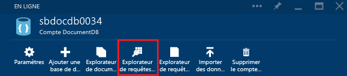
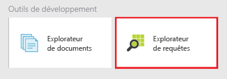
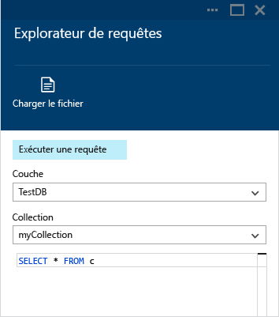
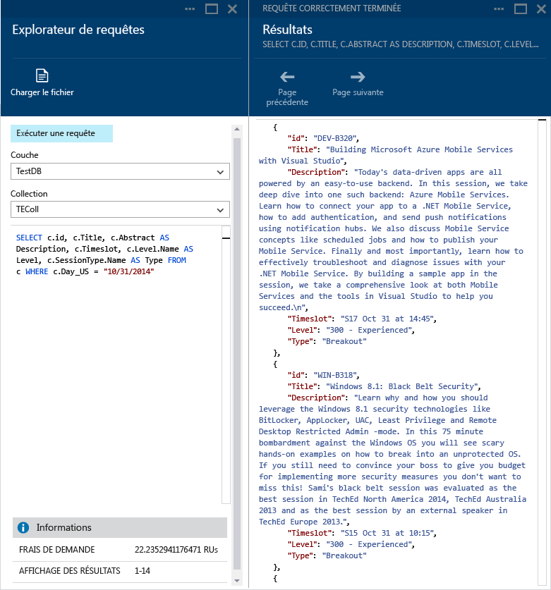
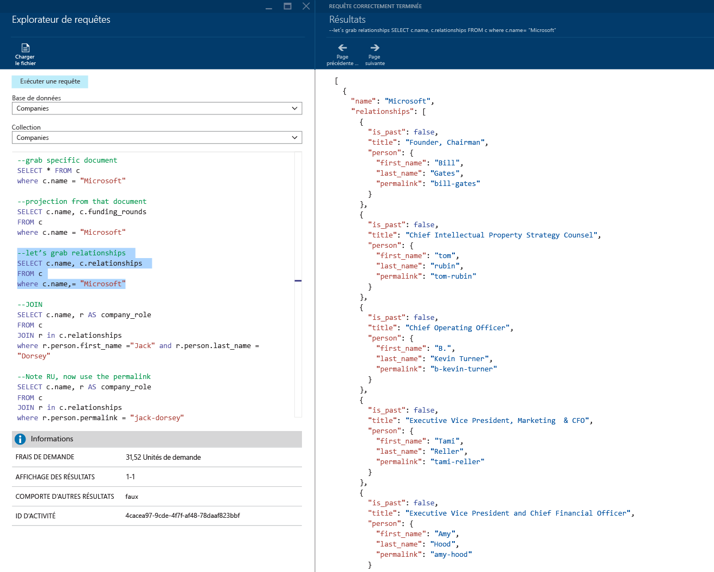
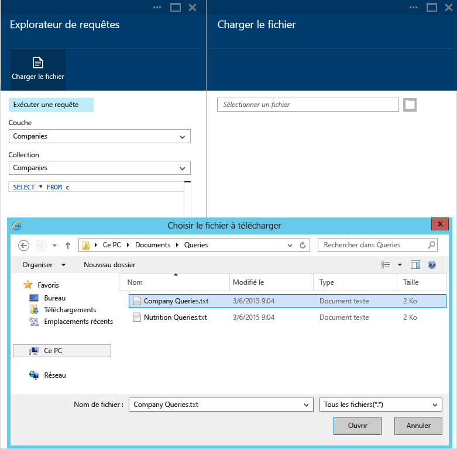
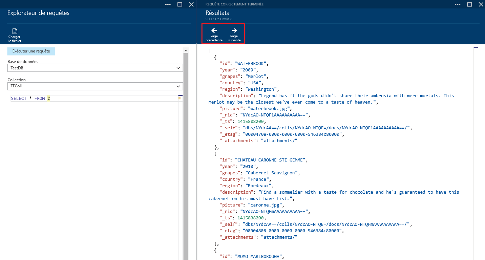
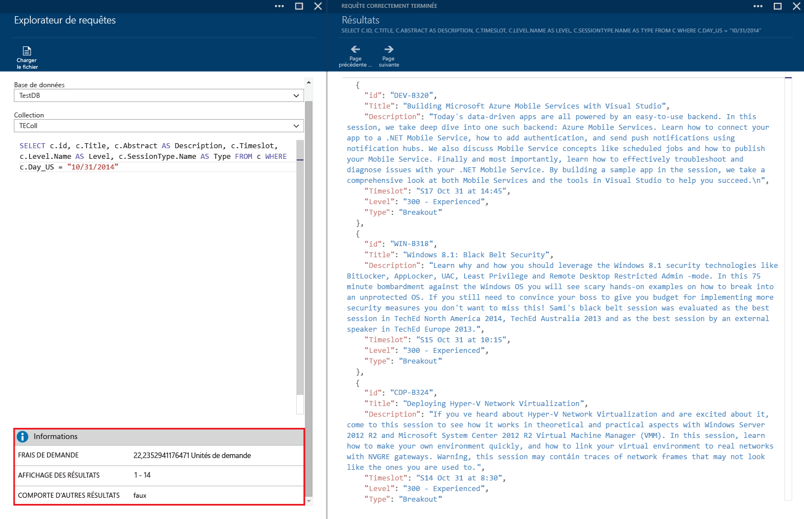
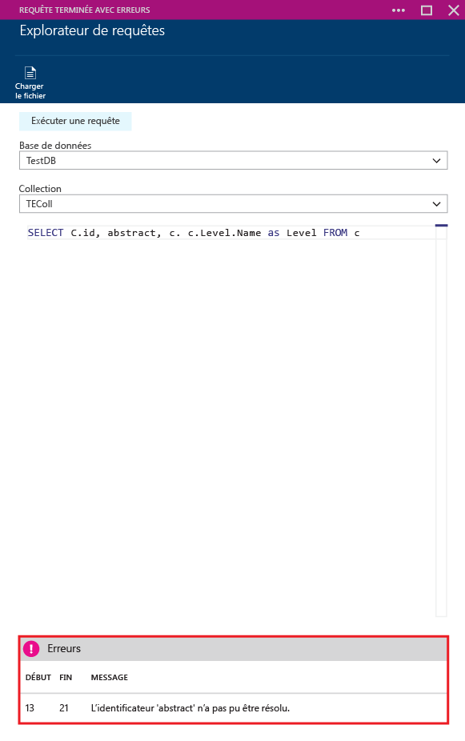

<properties 
	pageTitle="Création, modification et exécution de requêtes SQL dans le cadre d'une collection DocumentDB à l'aide de l'Explorateur de requête | Microsoft Azure" 
	description="Découvrez l'Explorateur de requête DocumentDB, un outil du portail en version préliminaire Azure qui permet de créer, de modifier et d'exécuter des requêtes SQL dans le cadre d'une collection DocumentDB." 
	services="documentdb" 
	authors="AndrewHoh" 
	manager="jhubbard" 
	editor="monicar" 
	documentationCenter=""/>

<tags 
	ms.service="documentdb" 
	ms.workload="data-services" 
	ms.tgt_pltfrm="na" 
	ms.devlang="na" 
	ms.topic="get-started-article"
	ms.date="09/08/2015" 
	ms.author="anhoh"/>

# Création, modification et exécution de requêtes SQL dans le cadre d'une collection DocumentDB à l'aide de l'Explorateur de requête. #

Cet article fournit une vue d’ensemble de l’Explorateur de requête [Microsoft Azure DocumentDB](http://azure.microsoft.com/services/documentdb/), un outil du portail Microsoft Azure en version préliminaire qui vous permet de créer, de modifier et d’exécuter des requêtes dans le cadre d’une collection DocumentDB.

Ce didacticiel vous permettra de pouvoir répondre aux questions suivantes :

-	Comment puis-je facilement créer, modifier et exécuter des requêtes dans le cadre d'une collection DocumentDB via un navigateur web ?
-	Comment puis-je facilement naviguer dans les pages de résultats de la requête DocumentDB via un navigateur web ?
-	Comment puis-je résoudre les erreurs de syntaxe de ma requête DocumentDB ? 

##Lancement et utilisation de l’Explorateur de requête##

L'Explorateur de requête peut être lancé à partir des panneaux de compte, de base de données et de collection DocumentDB.
  
1. En haut du panneau du compte ou de la base de données DocumentDB, cliquez simplement sur la commande **Explorateur de requête**.

	

2. Au bas de chaque panneau se trouve également un filtre **Outils de développement** avec la vignette **Explorateur de requête**.
	
	

2. Il vous suffit de cliquer sur la vignette pour lancer l'Explorateur de requête.

	Les zones de liste déroulante **Base de données** et **Collection** sont préremplies en fonction du contexte de lancement de l’Explorateur de requête. Par exemple, si vous le lancez à partir d'un panneau de base de données, la base de données active est préremplie. Si vous le lancez à partir d'un panneau de collection, la collection active est préremplie.

	

##Création, modification et exécution de requêtes avec l’Explorateur de requête##

L'Explorateur de requête vous permet de créer, de modifier et d'exécuter facilement des requêtes dans le cadre d'une collection DocumentDB et inclut la mise en surbrillance des valeurs et des mots clés de base pour améliorer la création de requêtes.

- Lors de l'ouverture initiale de l'Explorateur de requête, la requête par défaut « SELECT * FROM c » est proposée. Vous pouvez accepter la requête par défaut ou créer votre propre requête, puis cliquer sur le bouton **Exécuter la requête** pour afficher les résultats. L’Explorateur de requête prend en charge le langage de requête SQL DocumentDB comme indiqué dans l’article [Interrogation de DocumentDB](documentdb-sql-query.md).

	

- Vous pouvez également entrer plusieurs requêtes, mettre en surbrillance celle que vous voulez exécuter, puis cliquer sur le bouton **Exécuter la requête** pour afficher les résultats.

	

- Vous pouvez charger le contenu d’un fichier existant à l’aide de la commande **Charger le fichier**.

	

- L'Explorateur de requête renvoie par défaut les résultats par groupe de 100. Si la requête renvoie plus de 100 résultats, utilisez les commandes **Page suivante** et **Page précédente** pour naviguer dans les résultats.

	

- Les requêtes ayant réussi fournissent des informations telles que les frais de la requête, l’ensemble de résultats actuellement affiché et s’il existe d’autres résultats, qui sont accessibles via la commande **Page suivante**, comme indiqué précédemment.

	

- De même, si une requête se termine avec des erreurs, l'Explorateur de requête affiche une liste d'erreurs qui peut aider à la résolution des problèmes.

	

##Étapes suivantes

- Pour en savoir plus sur DocumentDB, cliquez [ici](http://azure.com/docdb).
- Pour en savoir plus sur la syntaxe du langage SQL DocumentDB prise en charge par l’Explorateur de requête, cliquez [ici](documentdb-sql-query.md).
 

<!---HONumber=Oct15_HO4-->