<properties
	pageTitle="Afficher, modifier, créer et télécharger des documents JSON à l'aide de l'Explorateur de documents DocumentDB | Microsoft Azure"
	description="Découvrez l’Explorateur de documents DocumentDB, un outil du portail Azure qui permet d’afficher, de modifier, de créer et de télécharger des documents JSON avec DocumentDB."
	services="documentdb"
	authors="AndrewHoh"
	manager="jhubbard"
	editor="monicar"
	documentationCenter=""/>

<tags
	ms.service="documentdb"
	ms.workload="data-services"
	ms.tgt_pltfrm="na"
	ms.devlang="na"
	ms.topic="get-started-article" 
	ms.date="01/28/2015"
	ms.author="anhoh"/>

# Afficher, modifier, créer et télécharger des documents JSON à l'aide de l'Explorateur de documents DocumentDB #

Cet article fournit une vue d’ensemble de l’Explorateur de documents [Microsoft Azure DocumentDB](https://azure.microsoft.com/services/documentdb/), un outil du portail Azure qui vous permet d’afficher, de modifier, de créer et de télécharger des documents JSON avec DocumentDB.

Ce didacticiel vous permettra de pouvoir répondre aux questions suivantes :

-	Comment faire pour créer, afficher, modifier et supprimer facilement des documents DocumentDB spécifiques via un navigateur web ?
-	Comment faire pour afficher facilement les propriétés système d'un document DocumentDB via un navigateur web ?
-	Comment faire pour effectuer facilement une ingestion en bloc de documents dans DocumentDB via un navigateur web ?

##Lancement de l'Explorateur de documents##

Vous pouvez lancer l'Explorateur de documents à partir de l'un des panneaux de compte DocumentDB, de base de données et de collection.

1. En haut du panneau de compte ou de base de données DocumentDB, cliquez simplement sur la commande **Explorateur de documents**.

	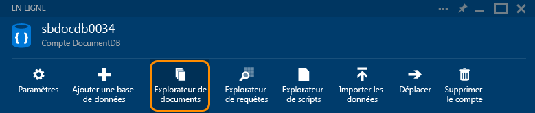
 
2. Ou, au bas de chaque panneau figure un filtre **Outils de développement** contenant le composant **Explorateur de documents**.

	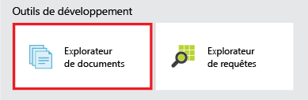

2. Cliquez simplement sur la vignette pour lancer l'Explorateur de documents.

	
Les zones de liste déroulante **Base de données** et **Collection** sont préremplies en fonction du contexte dans lequel vous lancez l’Explorateur de documents. Par exemple, si vous le lancez à partir d'un panneau de base de données, la base de données active est préremplie. Si vous le lancez à partir d'un panneau de collection, la collection active est préremplie.

	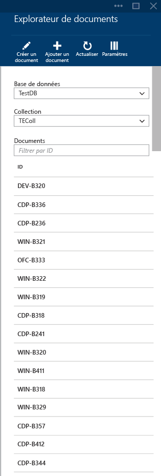

##Affichage, création et modification de documents avec l’Explorateur de documents##

L'Explorateur de documents vous permet de créer, modifier et supprimer facilement des documents.

- Pour créer un document, cliquez simplement sur la commande **Créer un document** et un extrait JSON minimal est fourni.

	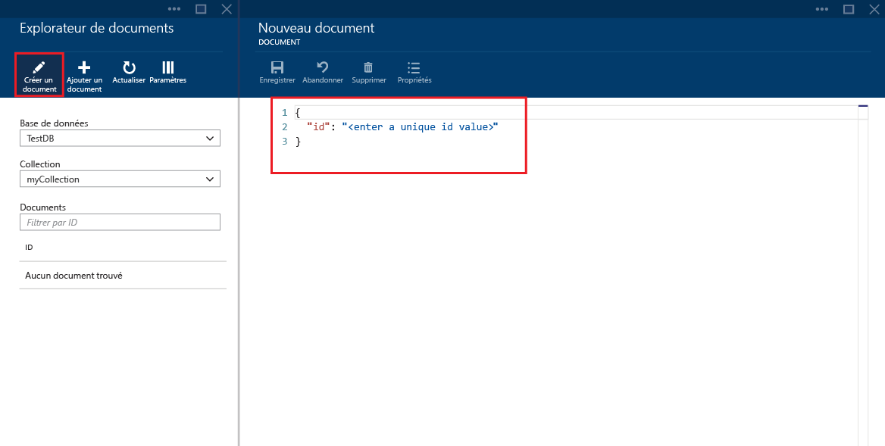

- Il vous suffit de taper ou de coller le contenu JSON du document que vous souhaitez créer et de cliquer sur la commande **Enregistrer** pour valider votre document.

	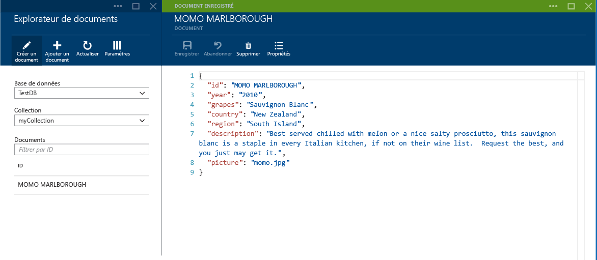

	> [AZURE.NOTE] Si vous ne fournissez pas de propriété « id », l'Explorateur de documents en ajoute automatiquement une et génère un GUID comme valeur d'ID.

- Si vous avez déjà des données issues de fichiers JSON, MongoDB, SQL Server, fichiers CSV, stockage Azure Table, Amazon DynamoDB, HBase ou autres collections DocumentDB, vous pouvez utiliser les [outils de migration de données](documentdb-import-data.md) DocumentDB pour importer rapidement vos données.

- Pour modifier un document existant, sélectionnez-le dans l’Explorateur de documents, modifiez-le comme vous le souhaitez, puis cliquez sur la commande **Enregistrer**.

	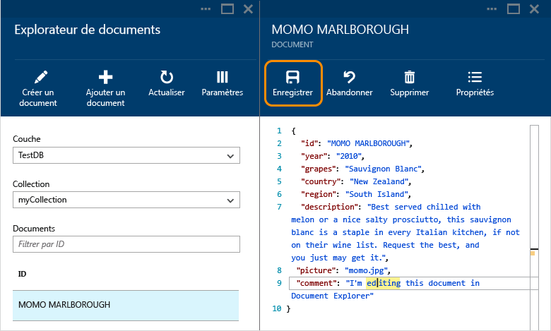

- Si vous modifiez un document et que vous décidez d'ignorer l'ensemble des modifications, cliquez sur la commande Ignorer, confirmez l'action de rejet et l'état précédent du document est rechargé.

	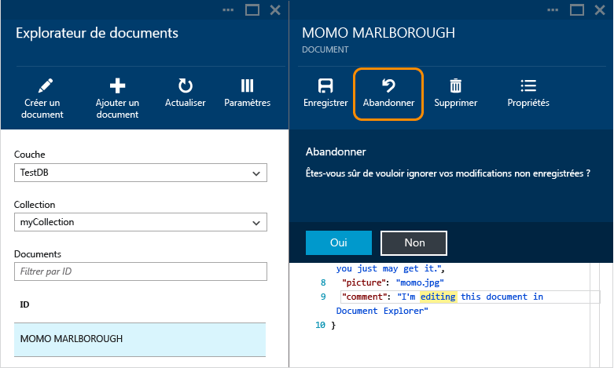

- Vous pouvez supprimer un document en le sélectionnant, en cliquant sur la commande **Supprimer**, puis en confirmant la suppression. Après la confirmation, le document est immédiatement supprimé de la liste de l'Explorateur de documents :

	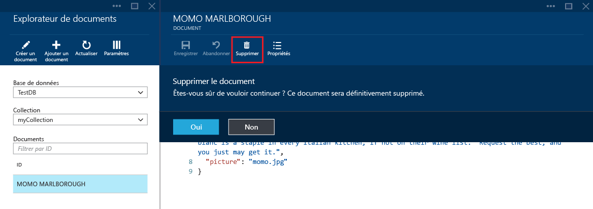

- Notez que l'Explorateur de documents vérifie que les documents nouveaux ou modifiés contiennent du code JSON valide. Vous pouvez même pointer sur la section incorrecte pour obtenir plus d'informations sur l'erreur de validation.

	

- En outre, l'Explorateur de documents vous empêche d'enregistrer un document avec un contenu JSON non valide.

	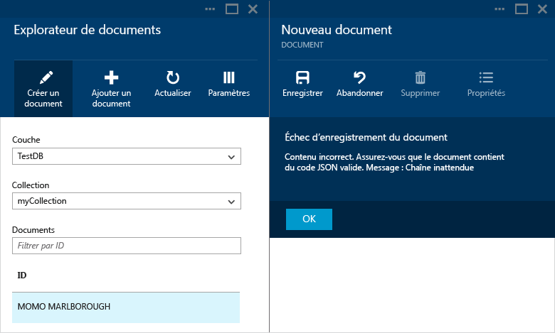

- Pour finir, vous pouvez facilement afficher les propriétés du document actuellement chargé en cliquant sur la commande **Propriétés**.

	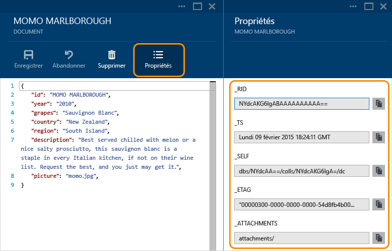

	> [AZURE.NOTE] La propriété timestamp (\_ts) est représentée en interne comme heure d'époque, mais l'Explorateur de documents affiche la valeur dans un format GMT lisible.

##Options de navigation et paramètres avancés de l’Explorateur de documents##

L’Explorateur de documents prend en charge un certain nombre d’options de navigation et de paramètres avancés.

1. Par défaut, l’Explorateur de documents charge les 100 premiers documents dans la collection sélectionnée, en fonction de leur date de création, de la plus ancienne à la plus récente. Vous pouvez charger des documents supplémentaires (par lots de 100) en sélectionnant l’option **Charger plus** en bas du panneau Explorateur de documents. Le comportement par défaut peut être modifié en cliquant sur la commande de paramètres en haut du panneau de l’Explorateur de documents.

	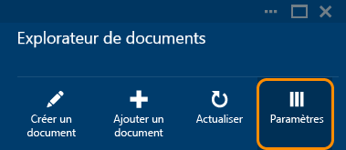

2. Dans le panneau des paramètres, vous pouvez ajuster le nombre d’éléments à afficher par page. Vous pouvez aussi indiquer une clause WHERE pour charger les documents correspondants dans la grille de l’Explorateur de documents. En savoir plus sur la grammaire SQL DocumentDB [ici](documentdb-sql-query.md).

	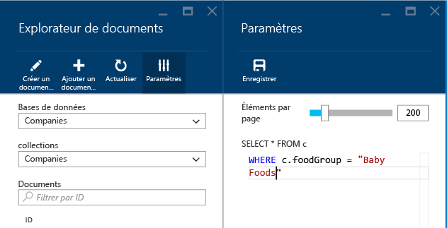

	> [AZURE.NOTE] Après avoir modifié les paramètres de l’Explorateur de documents, vous devez cliquer sur la commande **Actualiser** pour appliquer les nouveaux paramètres. Ces paramètres ne seront conservés que dans la session de navigateur actuelle.
	
3. Vous pouvez utiliser les zones de liste déroulante **Base de données** et **Collection** pour modifier facilement la collection à partir de laquelle les documents sont affichés actuellement sans avoir à fermer, puis à relancer l’Explorateur de documents.

4. L'Explorateur de documents prend également en charge le filtrage de l'ensemble de documents actuellement chargé par leur propriété ID. Il vous suffit de taper dans la zone de filtre.

	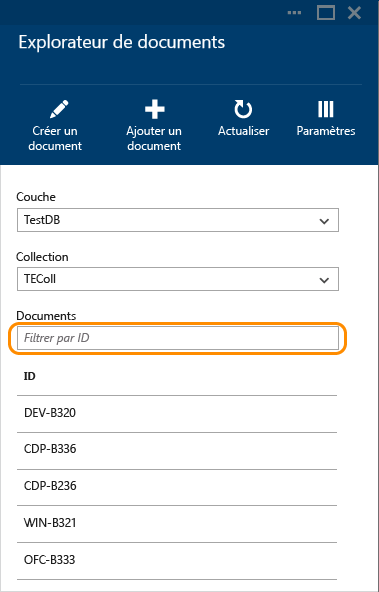

	Les résultats dans la liste de l'Explorateur de documents sont alors filtrés en fonction de vos critères.

	

	> [AZURE.IMPORTANT] La fonctionnalité de filtre de l’Explorateur de documents filtre uniquement l’ensemble de documents ***actuellement*** chargé et n’exécute pas de requête sur la collection actuellement sélectionnée.

5. Pour actualiser la liste des documents chargés par l’Explorateur de documents, cliquez simplement sur la commande **Actualiser** en haut du panneau.

	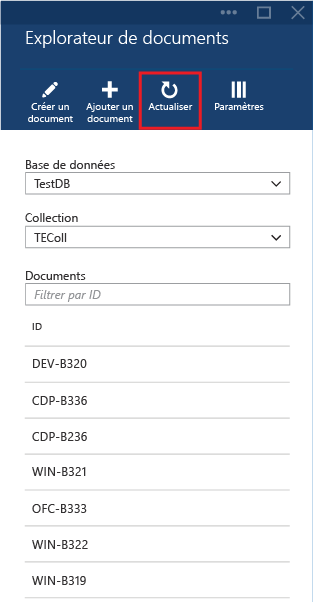

##Ajouter des documents en bloc à l’aide de l’Explorateur de documents##

L'Explorateur de documents prend en charge l'ingestion en bloc d'un ou plusieurs documents JSON existants.

1. Pour démarrer le processus de téléchargement, cliquez sur la commande **Ajouter un document**.

	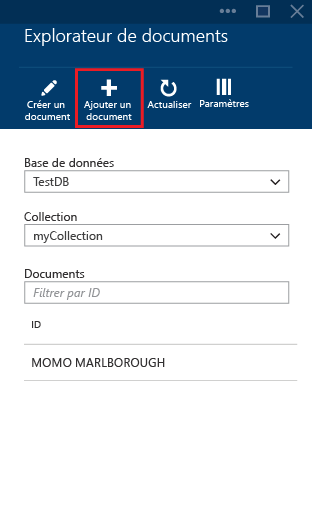

2. Un nouveau panneau s'ouvre. Cliquez sur le bouton Parcourir pour ouvrir une fenêtre d'Explorateur de fichiers, puis sélectionnez un ou plusieurs documents JSON à télécharger.

	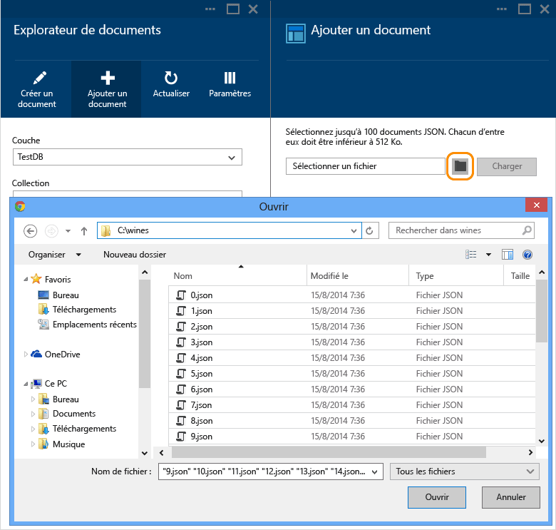

	> [AZURE.NOTE] L'Explorateur de documents prend actuellement en charge jusqu'à 100 documents JSON par opération de téléchargement.

3. Une fois que vous êtes satisfait de votre sélection, cliquez sur le bouton **Télécharger**. Les documents sont automatiquement ajoutés à la grille de l'Explorateur de documents et les résultats du téléchargement sont affichés à mesure que l'opération progresse. Les échecs d'importation sont signalés pour chaque fichier.

	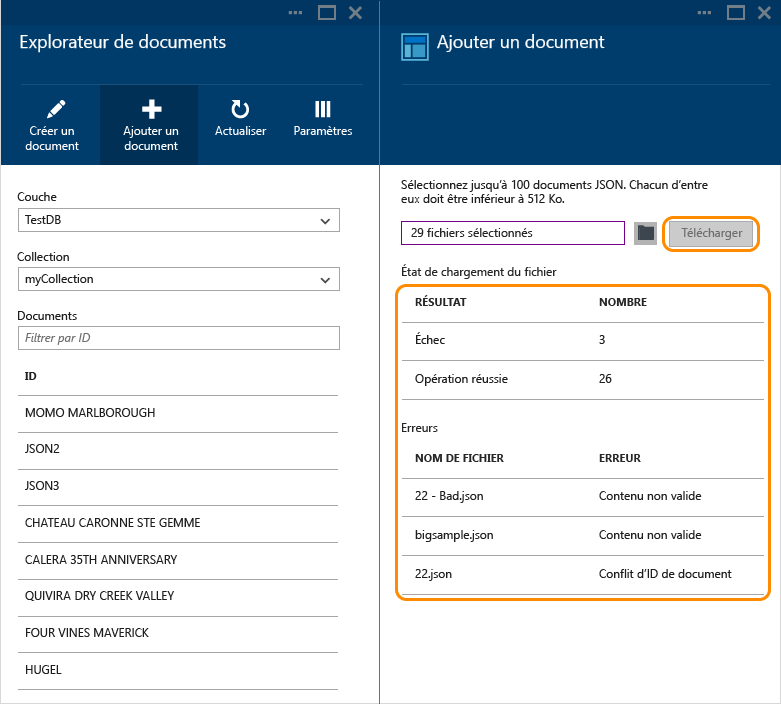

4. Une fois l'opération terminée, vous pouvez sélectionner jusqu'à 100 autres documents à télécharger.

##Étapes suivantes

- Pour en savoir plus sur DocumentDB, cliquez [ici](http://azure.com/docdb).
- Pour commencer à utiliser du code, cliquez [ici](documentdb-get-started.md).

 

<!---HONumber=AcomDC_0128_2016-->