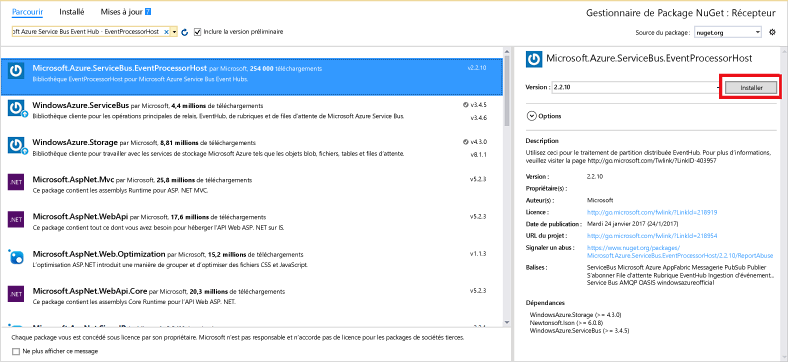

# <a name="receive-events-from-azure-event-hubs-using-the-net-framework"></a>Recevoir des événements provenant d’Azure Event Hubs avec .NET Framework

## <a name="introduction"></a>Introduction

Event Hubs constitue un service qui traite de grandes quantités de données d'événement (télémétrie) à partir de périphériques et d'applications connectés. Après avoir collecté des données dans les concentrateurs d’événements, vous pouvez les stocker à l’aide d’un cluster de stockage ou les transformer à l’aide d’un fournisseur d’analyses en temps réel. Cette fonctionnalité de collecte et de traitement d’événements à grande échelle représente un élément clé des architectures d’applications modernes, notamment l’Internet des objets (IoT).

Ce didacticiel explique comment écrire une application console .NET Framework qui reçoit des messages d’un concentrateur d’événements à l’aide de **[l’hôte du processeur d’événements][EventProcessorHost]**. Pour envoyer des événements avec .NET Framework, consultez l’article [Envoyer des événements vers les hubs d’événements Azure avec .NET Framework](event-hubs-dotnet-framework-getstarted-send.md) ou cliquez sur le langage d’envoi approprié dans le sommaire à gauche.

[L’hôte du processeur d’événements][EventProcessorHost] est une classe .NET qui simplifie la réception d’événements provenant de concentrateurs d’événements grâce à la gestion des points de contrôle permanents et des réceptions en parallèle de ces concentrateurs d’événements. [L’hôte du processeur d’événements][Event Processor Host] vous permet de répartir des événements sur plusieurs récepteurs, même lorsqu’ils sont hébergés dans des nœuds différents. Cet exemple illustre l’utilisation de [l’hôte du processeur d’événements][EventProcessorHost] pour un récepteur unique. L’exemple de [traitement d’événement mis à l’échelle][Scale out Event Processing with Event Hubs] illustre l’utilisation de [l’hôte du processeur d’événements][EventProcessorHost] pour plusieurs récepteurs.

## <a name="prerequisites"></a>Composants requis

Pour effectuer ce didacticiel, vous avez besoin de ce qui suit :

* [Microsoft Visual Studio 2015 ou une version ultérieure](http://visualstudio.com). Les captures d’écran de ce didacticiel utilisent Visual Studio 2017.
* Un compte Azure actif. Si vous n’en avez pas, vous pouvez créer un compte gratuit en quelques minutes. Pour plus d'informations, consultez la page [Version d'évaluation gratuite d'Azure](https://azure.microsoft.com/free/).

## <a name="create-an-event-hubs-namespace-and-an-event-hub"></a>Création d’un espace de noms Event Hubs et d’un concentrateur d’événements

La première étape consiste à utiliser le [portail Azure](https://portal.azure.com) pour créer un espace de noms de type Event Hubs et obtenir les informations de gestion nécessaires à votre application pour communiquer avec le concentrateur d’événements. Pour créer un espace de noms et un concentrateur d’événements, suivez la procédure décrite dans [cet article](event-hubs-create.md), puis passez aux étapes suivantes de ce didactiel.

## <a name="create-an-azure-storage-account"></a>Création d'un compte Azure Storage

Pour utiliser [l’hôte du processeur d’événements][EventProcessorHost], vous devez disposer d’un [compte de stockage Azure][Azure Storage account] :

1. Connectez-vous au [portail Azure][Azure portal], puis cliquez sur **Nouveau** en haut à gauche de l’écran.
2. Cliquez sur **Stockage**, puis sur **Compte de stockage**.
   
    
3. Dans le panneau **Créer un compte de stockage** , tapez un nom pour votre compte de stockage. Choisissez un abonnement Azure, un groupe de ressources et l’emplacement où créer la ressource. Cliquez ensuite sur **Créer**.
   
    
4. Dans la liste des comptes de stockage, cliquez sur le compte de stockage nouvellement créé.
5. Dans le panneau du compte de stockage, cliquez sur **Clés d’accès**. Copiez la valeur de **key1** pour pouvoir l’utiliser ultérieurement au cours de ce didacticiel.
   
    

## <a name="create-a-receiver-console-application"></a>Créer une application de console de destinataire

1. Dans Visual Studio, créez un projet d'application de bureau Visual C# à l'aide du modèle de projet **d’application de console** . Nommez le projet **Récepteur**.
   
    
2. Dans l’Explorateur de solutions, cliquez avec le bouton droit sur le projet **Récepteur**, puis cliquez sur **Gérer les packages NuGet pour la solution...**.
3. Cliquez sur l’onglet **Parcourir**, puis recherchez `Microsoft Azure Service Bus Event Hub - EventProcessorHost`. Cliquez sur **Installer**et acceptez les conditions d’utilisation.
   
    
   
    Visual Studio lance le téléchargement, l’installation et ajoute une référence au [Package NuGet Azure Service Bus Event Hub - EventProcessorHost](https://www.nuget.org/packages/Microsoft.Azure.ServiceBus.EventProcessorHost), avec toutes les dépendances associées.
4. Cliquez avec le bouton droit sur le projet **Récepteur**, cliquez sur **Ajouter**, puis cliquez sur **Classe**. Nommez la nouvelle classe **SimpleEventProcessor**, puis cliquez sur **Ajouter** pour créer la classe.
   
    
5. Ajoutez les instructions ci-après au début du fichier SimpleEventProcessor.cs :
    
  ```csharp
  using Microsoft.ServiceBus.Messaging;
  using System.Diagnostics;
  ```
    
  Insérez ensuite le code suivant dans le corps de la classe :
    
  ```csharp
  class SimpleEventProcessor : IEventProcessor
  {
    Stopwatch checkpointStopWatch;
    
    async Task IEventProcessor.CloseAsync(PartitionContext context, CloseReason reason)
    {
        Console.WriteLine("Processor Shutting Down. Partition '{0}', Reason: '{1}'.", context.Lease.PartitionId, reason);
        if (reason == CloseReason.Shutdown)
        {
            await context.CheckpointAsync();
        }
    }
    
    Task IEventProcessor.OpenAsync(PartitionContext context)
    {
        Console.WriteLine("SimpleEventProcessor initialized.  Partition: '{0}', Offset: '{1}'", context.Lease.PartitionId, context.Lease.Offset);
        this.checkpointStopWatch = new Stopwatch();
        this.checkpointStopWatch.Start();
        return Task.FromResult<object>(null);
    }
    
    async Task IEventProcessor.ProcessEventsAsync(PartitionContext context, IEnumerable<EventData> messages)
    {
        foreach (EventData eventData in messages)
        {
            string data = Encoding.UTF8.GetString(eventData.GetBytes());
    
            Console.WriteLine(string.Format("Message received.  Partition: '{0}', Data: '{1}'",
                context.Lease.PartitionId, data));
        }
    
        //Call checkpoint every 5 minutes, so that worker can resume processing from 5 minutes back if it restarts.
        if (this.checkpointStopWatch.Elapsed > TimeSpan.FromMinutes(5))
        {
            await context.CheckpointAsync();
            this.checkpointStopWatch.Restart();
        }
    }
  }
  ```
    
  Cette classe est appelée par **EventProcessorHost** pour traiter les événements envoyés par le concentrateur d’événements. La classe `SimpleEventProcessor` utilise un chronomètre pour appeler régulièrement la méthode de point de contrôle sur le contexte **EventProcessorHost** . Ce traitement garantit que, en cas de redémarrage du récepteur, la perte de traitement de travail ne soit pas supérieure à cinq minutes.
6. Dans la classe **Program**, ajoutez l’instruction `using` suivante en haut du fichier :
    
  ```csharp
  using Microsoft.ServiceBus.Messaging;
  ```
    
  Remplacez ensuite la méthode `Main` dans la classe `Program` par le code suivant, en remplaçant le nom de concentrateur d’événements et la chaîne de connexion au niveau de l’espace de noms, enregistrée précédemment, ainsi que la clé et le compte de stockage que vous avez copiés dans les sections précédentes. 
    
  ```csharp
  static void Main(string[] args)
  {
    string eventHubConnectionString = "{Event Hubs namespace connection string}";
    string eventHubName = "{Event Hub name}";
    string storageAccountName = "{storage account name}";
    string storageAccountKey = "{storage account key}";
    string storageConnectionString = string.Format("DefaultEndpointsProtocol=https;AccountName={0};AccountKey={1}", storageAccountName, storageAccountKey);
    
    string eventProcessorHostName = Guid.NewGuid().ToString();
    EventProcessorHost eventProcessorHost = new EventProcessorHost(eventProcessorHostName, eventHubName, EventHubConsumerGroup.DefaultGroupName, eventHubConnectionString, storageConnectionString);
    Console.WriteLine("Registering EventProcessor...");
    var options = new EventProcessorOptions();
    options.ExceptionReceived += (sender, e) => { Console.WriteLine(e.Exception); };
    eventProcessorHost.RegisterEventProcessorAsync<SimpleEventProcessor>(options).Wait();
    
    Console.WriteLine("Receiving. Press enter key to stop worker.");
    Console.ReadLine();
    eventProcessorHost.UnregisterEventProcessorAsync().Wait();
  }
  ```

7. Exécutez le programme et assurez-vous qu’il n’y a aucune erreur.
  
Félicitations ! Vous recevez maintenant les messages d’un concentrateur d’événements à l’aide de l’hôte du processeur d’événements.


> [!NOTE]
> Ce didacticiel utilise une seule instance de [EventProcessorHost][EventProcessorHost]. Pour augmenter le débit, il est recommandé d’exécuter plusieurs instances [EventProcessorHost][EventProcessorHost], comme illustré dans l’exemple de [traitement d'événement mis à l'échelle][traitement d'événement mis à l'échelle]. Dans ces cas, les différentes instances se coordonnent automatiquement entre elles afin d’équilibrer la charge des événements reçus. Si vous souhaitez que plusieurs récepteurs traitent *tous* les événements, vous devez utiliser le concept **ConsumerGroup** . Lors de la réception des événements à partir de différents ordinateurs, il peut être utile de spécifier des noms pour les instances de [EventProcessorHost][EventProcessorHost] basées sur les ordinateurs (ou rôles) dans lesquels ils sont déployés. Pour plus d’informations sur ces sujets, consultez les rubriques [Vue d’ensemble d’Event Hubs][Event Hubs overview] et [Guide de programmation Event Hubs][Event Hubs Programming Guide].
> 
> 

## <a name="next-steps"></a>Étapes suivantes

Vous avez conçu une application opérationnelle qui crée un concentrateur d’événements et envoie et reçoit des données. Pour en savoir plus, consultez les liens suivants :

* [Hôte du processeur d’événements][Event Processor Host]
* [Vue d’ensemble des hubs d’événements][Event Hubs overview]
* [FAQ sur les hubs d'événements](event-hubs-faq.md)

<!-- Images. -->
[19]: ./media/event-hubs-csharp-ephcs-getstarted/create-eh-proj1.png
[20]: ./media/event-hubs-csharp-ephcs-getstarted/create-eh-proj2.png
[21]: ./media/event-hubs-csharp-ephcs-getstarted/run-csharp-ephcs1.png
[22]: ./media/event-hubs-csharp-ephcs-getstarted/run-csharp-ephcs2.png

<!-- Links -->
[EventProcessorHost]: https://www.nuget.org/packages/Microsoft.Azure.ServiceBus.EventProcessorHost
[Event Hubs overview]: event-hubs-what-is-event-hubs.md
[Scale out Event Processing with Event Hubs]: https://code.msdn.microsoft.com/Service-Bus-Event-Hub-45f43fc3
[Event Hubs Programming Guide]: event-hubs-programming-guide.md
[Azure Storage account]: ../storage/storage-create-storage-account.md
[Event Processor Host]: /dotnet/api/microsoft.servicebus.messaging.eventprocessorhost
[Azure portal]: https://portal.azure.com

