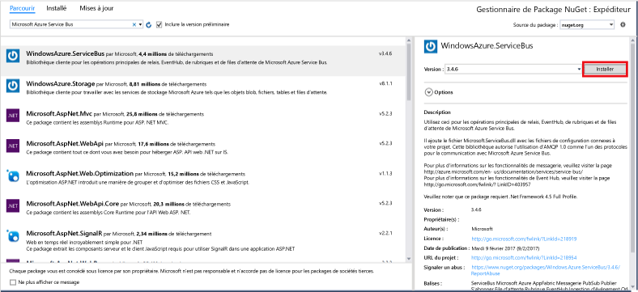

# <a name="send-events-to-azure-event-hubs-using-the-net-framework"></a>Envoyer des événements vers les hubs d’événements Azure avec .NET Framework

## <a name="introduction"></a>Introduction
Event Hubs constitue un service qui traite de grandes quantités de données d'événement (télémétrie) à partir de périphériques et d'applications connectés. Après avoir collecté des données dans les concentrateurs d’événements, vous pouvez les stocker à l’aide d’un cluster de stockage ou les transformer à l’aide d’un fournisseur d’analyses en temps réel. Cette fonctionnalité de collecte et de traitement d’événements à grande échelle représente un élément clé des architectures d’applications modernes, notamment l’Internet des objets (IoT).

Ce didacticiel montre comment utiliser le [portail Azure](https://portal.azure.com) pour créer un hub d’événements. Il montre également comment envoyer des événements vers un hub d’événements à l’aide d’une application de console écrite en C# avec .NET Framework. Pour recevoir des événements avec .NET Framework, consultez l’article [Recevoir des événements avec .NET Framework](event-hubs-dotnet-framework-getstarted-receive-eph.md) ou cliquez sur le langage de réception approprié dans le sommaire à gauche.

Pour réaliser ce didacticiel, vous aurez besoin des éléments suivants :

* [Microsoft Visual Studio](http://visualstudio.com)
* Un compte Azure actif. Si vous n’en avez pas, vous pouvez créer un compte gratuit en quelques minutes. Pour plus d'informations, consultez la page [Version d'évaluation gratuite d'Azure](https://azure.microsoft.com/free/).

## <a name="send-messages-to-event-hubs"></a>Envoi de messages vers Event Hubs
Dans cette section, vous allez écrire une application console Windows pour envoyer des événements à votre hub d'événements.

1. Dans Visual Studio, créez un projet d'application de bureau Visual C# à l'aide du modèle de projet **d’application de console** . Nommez le projet **Sender**.
   
    
2. Dans l’Explorateur de solutions, cliquez avec le bouton droit sur la solution, puis cliquez sur **Gérer les packages NuGet pour la solution**. 
3. Cliquez sur l’onglet **Parcourir**, puis recherchez `Microsoft Azure Service Bus`. Vérifiez que le nom du projet (**Expéditeur**) est spécifié dans la zone **Version(s)**. Cliquez sur **Installer**et acceptez les conditions d’utilisation. 
   
    
   
    Visual Studio lance le téléchargement, l’installation et ajoute une référence au [Package NuGet Azure Service Bus](https://www.nuget.org/packages/WindowsAzure.ServiceBus).
4. Ajoutez les instructions `using` suivantes en haut du fichier **Program.cs** :
   
    ```csharp
    using System.Threading;
    using Microsoft.ServiceBus.Messaging;
    ```
5. Ajoutez les champs suivants à la classe **Program** , en remplaçant les valeurs par le nom du Event Hub que vous avez créé dans la section précédente et par la chaîne de connexion au niveau de l’espace de noms, enregistrée précédemment.
   
    ```csharp
    static string eventHubName = "{Event Hub name}";
    static string connectionString = "{send connection string}";
    ```
6. Ajoutez la méthode suivante à la classe **Program** :
   
    ```csharp
    static void SendingRandomMessages()
    {
        var eventHubClient = EventHubClient.CreateFromConnectionString(connectionString, eventHubName);
        while (true)
        {
            try
            {
                var message = Guid.NewGuid().ToString();
                Console.WriteLine("{0} > Sending message: {1}", DateTime.Now, message);
                eventHubClient.Send(new EventData(Encoding.UTF8.GetBytes(message)));
            }
            catch (Exception exception)
            {
                Console.ForegroundColor = ConsoleColor.Red;
                Console.WriteLine("{0} > Exception: {1}", DateTime.Now, exception.Message);
                Console.ResetColor();
            }
   
            Thread.Sleep(200);
        }
    }
    ```
   
    Cette méthode envoie en continu les événements à votre hub d’événements avec un délai de 200 ms.
7. Enfin, ajoutez les lignes suivantes à la méthode **Main** :
   
    ```csharp
    Console.WriteLine("Press Ctrl-C to stop the sender process");
    Console.WriteLine("Press Enter to start now");
    Console.ReadLine();
    SendingRandomMessages();
    ```

## <a name="next-steps"></a>Étapes suivantes
Vous avez conçu une application opérationnelle qui crée un hub d’événements et envoie des données. Vous pouvez à présent passer aux scénarios suivants :

* [Recevoir des événements avec l’hôte du processeur d’événements](event-hubs-dotnet-framework-getstarted-receive-eph.md)
* [Informations de référence de l’hôte du processeur d’événements](/dotnet/api/microsoft.servicebus.messaging.eventprocessorhost)
* [Vue d’ensemble des hubs d’événements](event-hubs-what-is-event-hubs.md)

<!-- Images. -->
[19]: ./media/event-hubs-csharp-ephcs-getstarted/create-eh-proj1.png
[20]: ./media/event-hubs-csharp-ephcs-getstarted/create-eh-proj2.png
[21]: ./media/event-hubs-csharp-ephcs-getstarted/run-csharp-ephcs1.png
[22]: ./media/event-hubs-csharp-ephcs-getstarted/run-csharp-ephcs2.png

<!-- Links -->
[Event Processor Host]: https://www.nuget.org/packages/Microsoft.Azure.ServiceBus.EventProcessorHost
[Event Hubs overview]: event-hubs-overview.md


<!--HONumber=Feb17_HO1-->


