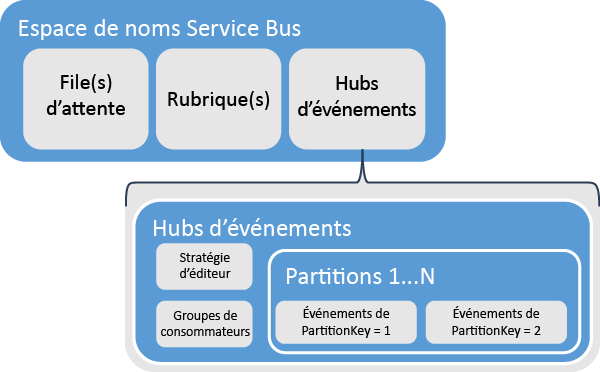
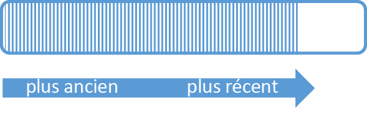
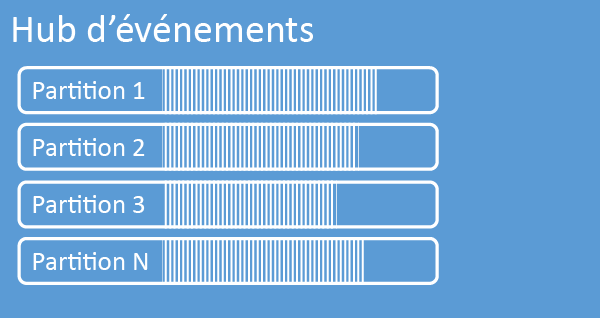
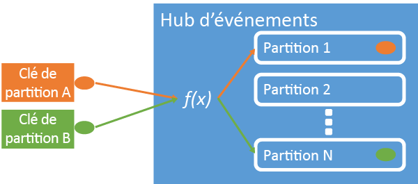
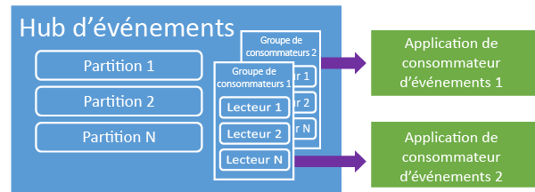
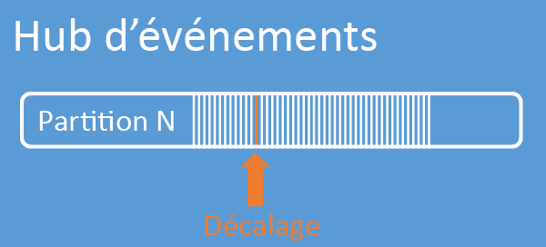
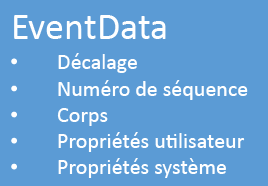

<properties 
    pageTitle="Vue d’ensemble d’Azure Event Hubs | Microsoft Azure"
    description="Introduction et présentation d’Azure Event Hubs."
    services="event-hubs"
    documentationCenter="na"
    authors="sethmanheim"
    manager="timlt"
    editor="" />
<tags 
    ms.service="event-hubs"
    ms.devlang="na"
    ms.topic="get-started-article"
    ms.tgt_pltfrm="na"
    ms.workload="na"
    ms.date="04/15/2016"
    ms.author="sethm" />

# Vue d'ensemble des hubs d'événements Azure

De nombreuses solutions modernes ont pour but de proposer des expériences client adaptatives ou d'améliorer les produits par le biais de commentaires en continu et de télémétrie automatisée. Ces solutions sont confrontées au défi consistant à traiter de façon fiable et sécurisée de très grandes quantités d'informations provenant de plusieurs éditeurs. Les hubs d'événements Microsoft Azure sont un service de plateforme gérée qui fournit une base pour l'admission de données à grande échelle dans un large éventail de scénarios. Le suivi de comportement dans les applications mobiles, les informations de trafic provenant de batteries de serveurs Web, la capture d'événements de jeu dans les jeux de console ou les données de télémétrie recueillies à partir de machines industrielles ou de véhicules connectés constituent des exemples de ces scénarios. Dans les architectures de solution, les hubs d'événements jouent souvent le rôle de « porte d'entrée » pour un pipeline d'événements, souvent appelé un service de *réception d'événements*. Un service de réception d'événements est un composant ou service qui se trouve entre les éditeurs d'événements et les consommateurs d'événements pour dissocier la production d'un flux d'événements de leur consommation.

Les hubs d'événements Azure constituent un service de traitement des événements. Celui-ci fournit des entrées d'événements et de télémétrie vers le cloud à grande échelle, avec une faible latence et une grande fiabilité. Ce service, utilisé avec d'autres services en aval, est particulièrement utile pour l'instrumentation de l'application, le traitement du workflow ou de l'expérience utilisateur, et les scénarios de l'Internet des Objets (IoT). Event Hubs fournit une fonctionnalité de gestion du flux de messages et, bien qu'un hub d'événements soit une entité similaire aux files d'attente et aux rubriques, il présente des caractéristiques très différentes de la messagerie d'entreprise traditionnelle. Les scénarios de messagerie d'entreprise nécessitent généralement plusieurs fonctionnalités sophistiquées, comme le séquençage, la lettre morte, la prise en charge des transactions, des garanties de livraison élevées, tandis que la préoccupation principale pour l'admission d'événements est un débit élevé et la flexibilité de traitement pour les flux d'événements. Par conséquent, les capacités des hubs d'événements diffèrent des rubriques Service Bus dans la mesure où elles sont fortement orientées vers le débit élevé et les scénarios de traitement des événements. Par conséquent, les hubs d'événements n'implémentent pas certaines des fonctionnalités de messagerie qui sont disponibles pour les rubriques. Si vous avez besoin de ces fonctionnalités, les rubriques constituent le meilleur choix.

Un hub d'événements est créé au niveau de l'espace de noms dans Service Bus, comme les files d'attente et les rubriques. Les hubs d'événements utilisent HTTP et AMQP comme interfaces API principales. Le diagramme suivant montre la relation entre les hubs d'événements et Service Bus.

## Vue d'ensemble conceptuelle

Les hubs d'événements fournissent la diffusion de messages via un modèle de consommateur partitionné. Les files d'attente et les rubriques utilisent un modèle [consommateur concurrent](https://msdn.microsoft.com/library/dn568101.aspx) dans lequel chaque consommateur tente de lire à partir de la même file d'attente ou ressource. Cette concurrence pour les ressources cause des limites en termes de complexité et de mise à l'échelle pour les applications de traitement de flux. Les hubs d'événements utilisent un modèle de consommateur partitionné dans lequel chaque consommateur lit uniquement un sous-ensemble spécifique, ou partition, du flux de messages. Ce modèle permet la mise à l'échelle horizontale pour le traitement des événements et fournit d'autres fonctionnalités axées sur le flux qui ne sont pas disponibles dans les rubriques et les files d'attente.

### Partitions

Une partition est une séquence ordonnée d'événements qui est conservée dans un hub d'événements. Les événements les plus récents sont ajoutés à la fin de cette séquence. Une partition peut être considérée comme un « journal de validation ».

Les partitions conservent les données pendant une durée de conservation configurée qui est définie au niveau du hub d'événements. Ce paramètre s'applique à toutes les partitions du hub d'événements. Les événements expirent selon une base temporelle. Vous ne pouvez pas les supprimer explicitement. Un hub d'événements contient plusieurs partitions. Chaque partition est indépendante et contient sa propre séquence de données. Par conséquent, les partitions évoluent souvent à des rythmes différents.

Le nombre de partitions est spécifié pendant la création du hub d’événements. Ce nombre doit être compris entre 2 et 32 (la valeur par défaut est 4). Les partitions constituent un mécanisme d'organisation des données. Elles sont davantage liées au degré de parallélisme en aval requis lors de la consommation des applications qu'au débit des hubs d'événements. Par conséquent, le choix du nombre de partitions dans un hub d'événements est directement lié au nombre de lecteurs simultanés que vous prévoyez d'avoir. Après la création du hub d'événements, le nombre de partitions n'est pas modifiable. Vous devez considérer ce nombre en termes d'échelle attendue à long terme. Vous pouvez augmenter la limite de 32 partitions en contactant l'équipe Service Bus.

Bien que les partitions soient identifiables et qu'il soit possible de leur envoyer du contenu directement, il est préférable d'éviter d'envoyer des données à des partitions spécifiques. Au lieu de cela, vous pouvez utiliser des constructions de niveau supérieur présentées dans les sections [Éditeur d'événements](#event-publisher) et [Stratégie de l'éditeur](#capacity-and-security).

Dans le contexte des hubs d'événements, les messages sont appelés *données d'événement*. Les données d'événement contiennent le corps de l'événement, un conteneur de propriétés défini par l'utilisateur et diverses métadonnées sur l'événement, comme son décalage dans la partition et son numéro dans la séquence de flux. Les partitions sont remplies d'une séquence de données d'événement.

## Éditeur d'événements

Toute entité qui envoie des événements ou des données à un hub d'événements est un *éditeur d'événements*. Les éditeurs d'événements peuvent publier des événements à l'aide de HTTPS ou AMQP 1.0. Les éditeurs d'événements utilisent un jeton SAS pour s'identifier auprès d'un hub d'événements. Ils peuvent avoir une identité unique ou utiliser un jeton SAS commun, en fonction des exigences du scénario.

Pour plus d'informations sur l'utilisation de SAS, consultez [Authentification par signature d'accès partagé avec Service Bus](../service-bus/service-bus-shared-access-signature-authentication.md).

### Tâches courantes de l'éditeur

Cette section décrit des tâches courantes des éditeurs d'événements.

#### Acquérir un jeton SAP

La signature d'accès partagé (SAS) est le mécanisme d'authentification pour les hubs d'événements. Service Bus fournit des stratégies SAS au niveau de l'espace de noms et du hub d'événements. Un jeton SAS est généré à partir d'une clé SAS. C'est un hachage SHA d'une URL, codé dans un format spécifique. À l'aide du nom de la clé (stratégie) et du jeton, Service Bus peut régénérer le hachage et ainsi, authentifier l'expéditeur. Normalement, les jetons SAS pour les éditeurs d'événements sont créés uniquement avec des privilèges d'**envoi** sur un hub d'événements spécifique. Le mécanisme URL de ce jeton SAS constitue la base de l'identification de l'éditeur introduite dans la stratégie de l'éditeur. Pour plus d'informations sur l'utilisation de SAS, consultez [Authentification par signature d'accès partagé avec Service Bus](../service-bus/service-bus-shared-access-signature-authentication.md).

#### Publication d'un événement

Vous pouvez publier un événement avec AMQP 1.0 ou HTTPS. Service Bus fournit une classe [EventHubClient](https://msdn.microsoft.com/library/microsoft.servicebus.messaging.eventhubclient.aspx) pour la publication d'événements sur un hub d'événements à partir de clients .NET. Pour les autres runtimes et plateformes, vous pouvez utiliser n'importe quel client AMQP 1.0, comme [Apache Qpid](http://qpid.apache.org/). Vous pouvez publier les événements individuellement ou par lots. Une publication unique (instance de données d'événement) a une limite de 256 Ko, qu'il s'agisse d'un événement unique ou d'un lot. La publication d'événements plus volumineux entraîne une erreur. Il est préférable pour les éditeurs de ne pas être au courant des partitions dans le hub d'événements et de spécifier uniquement une *clé de partition* (présentée dans la section suivante) ou leur identité par le biais de leur jeton SAS.

Le choix d'utiliser AMQP ou HTTPS est spécifique au scénario d'utilisation. AMQP requiert l'établissement d'un socket bidirectionnel persistant en plus de la sécurité au niveau du transport (TLS) ou SSL/TLS. Il peut s'agir d'une opération coûteuse en termes de trafic réseau, mais qui ne se produit qu'au début d'une session AMQP. HTTPS a une surcharge initiale inférieure, mais requiert une surcharge SSL supplémentaire pour chaque requête. Pour les éditeurs qui publient fréquemment des événements, AMQP permet des économies importantes en matière de performances, latence et débit.

### Clé de partition

Une clé de partition est une valeur qui est utilisée pour mapper des données d'événement entrant dans des partitions spécifiques dans le cadre de l'organisation des données. La clé de partition est une valeur fournie par l'expéditeur transmise dans un hub d'événements. Elle est traitée par le biais d'une fonction de hachage statique. Le résultat crée l'affectation de la partition. Si vous ne spécifiez pas de clé de partition lors de la publication d'un événement, une affectation de type tourniquet (round robin) est utilisée. Lorsque vous utilisez des clés de partition, l'éditeur d'événements n'est au courant que de sa clé de partition, et non de la partition sur laquelle les événements sont publiés. Cette dissociation de la clé et de la partition isole l'expéditeur du besoin d'en savoir trop sur le traitement en aval et le stockage des événements. Les clés de partition sont importantes pour organiser les données pour le traitement en aval, mais elles ne sont pas fondamentalement liées aux partitions elles-mêmes. Une identité par appareil ou unique à l'utilisateur constitue une bonne clé de partition, mais d'autres attributs tels que la géographie, peuvent également être utilisés pour regrouper des événements liés dans une seule partition. L'illustration suivante montre des expéditeurs d'événements utilisant des clés de partition à épingler sur les partitions.

Les hubs d'événements garantissent que tous les événements qui partagent la même valeur de clé de partition sont remis dans l'ordre et à la même partition. Qui plus est, si des clés de partition sont utilisées avec des stratégies d'éditeur, décrites dans la section suivante, alors l'identité de l'éditeur et la valeur de la clé de partition doivent correspondre. Sinon, une erreur se produit.

### Consommateur d'événements

Toute entité qui lit des données d'événement à partir d'un hub d'événements est un consommateur d'événements. Tous les consommateurs d'événements lisent le flux d'événements par le biais des partitions dans un groupe de consommateurs. Chaque partition ne doit avoir qu'un seul lecteur actif à la fois. Tous les consommateurs des hubs d'événements se connectent par le biais de la session AMQP 1.0, dans laquelle les événements sont remis dès qu'ils sont disponibles. Le client n'a pas besoin d'interroger la disponibilité des données.

#### Groupes de consommateurs

Le mécanisme publication/abonnement des hubs d'événements est activé à l'aide des groupes de consommateurs. Un groupe de consommateurs est une vue (état, position ou décalage) d'un hub d'événements dans sa totalité. Les groupes de consommateurs permettent à plusieurs applications consommatrices d'avoir chacune une vue distincte du flux d'événements et de lire le flux indépendamment à leur propre rythme et avec leurs propres décalages. Dans une architecture de traitement de flux, chaque application en aval équivaut à un groupe de consommateurs. Si vous souhaitez écrire des données d'événement dans le stockage à long terme, alors cette application d'enregistreur de stockage est un groupe de consommateurs. Le traitement des événements complexes est effectué par un autre groupe de consommateurs distinct. Vous ne pouvez accéder aux partitions que par le biais d'un groupe de consommateurs. Il existe toujours un groupe de consommateurs par défaut dans un hub d'événements. Vous pouvez créer jusqu'à 20 groupes de consommateurs pour un hub d'événements de niveau standard.

Voici quelques exemples de la convention URI de groupe consommateurs :

	//<my namespace>.servicebus.windows.net/<event hub name>/<Consumer Group #1>
	//<my namespace>.servicebus.windows.net/<event hub name>/<Consumer Group #2>

L'illustration suivante montre les consommateurs d'événements au sein des groupes de consommateurs.

#### Décalages du flux

Un décalage est la position d'un événement dans une partition. Vous pouvez considérer un décalage comme un curseur côté client. Le décalage est une numérotation en octets de l'événement. Ceci permet à un consommateur d'événements (lecteur) de spécifier un point dans le flux d'événements à partir duquel il veut commencer la lecture des événements. Vous pouvez spécifier le décalage comme un horodatage ou une valeur de décalage. Les consommateurs ont la responsabilité de stocker leurs propres valeurs de décalage en dehors du service des hubs d'événements.

Dans une partition, chaque événement inclut un décalage. Ce décalage est utilisé par les consommateurs pour indiquer l'emplacement dans la séquence d'événements pour une partition donnée. Les décalages peuvent être transmis au hub d'événements sous forme de valeur numérique ou d'horodatage lorsqu'un lecteur se connecte.

#### Points de contrôle

Les *points de contrôle* constituent un processus par lequel les lecteurs marquent ou valident leur position dans une séquence d'événements de partition. La réalisation des points de contrôle est la responsabilité du consommateur et se produit sur une base par partition dans un groupe de consommateurs. Cela signifie que pour chaque groupe de consommateurs, chaque lecteur de partition doit conserver une trace de sa position actuelle dans le flux d'événements. Il peut informer le service lorsqu'il considère que le flux de données est complet. Si un lecteur se déconnecte d'une partition, lorsqu'il se reconnecte il commence la lecture au point de contrôle qui a été précédemment soumis par le dernier lecteur de cette partition dans ce groupe de consommateurs. Lorsque le lecteur se connecte, il transmet ce décalage au hub d'événements pour spécifier l'emplacement où commencer la lecture. De cette façon, vous pouvez utiliser les points de contrôle pour marquer les événements comme « terminés » par les applications en aval et pour assurer la résilience en cas de basculement entre des lecteurs en cours d'exécution sur des ordinateurs différents. Étant donné que les données d'événement sont conservées pendant l'intervalle de conservation spécifié au moment de la création du hub d'événements, il est possible de revenir aux données plus anciennes en spécifiant un décalage inférieur à partir de ce processus de vérification. Grâce à ce mécanisme, les points de contrôle permettent la résilience au basculement et la relecture contrôlée du flux d'événements.

#### Tâches courantes du consommateur

Cette section décrit les tâches courantes pour les consommateurs ou les lecteurs d'événements de hubs d'événements. Tous les consommateurs de hubs d'événements se connectent à l'aide d'AMQP 1.0. AMQP 1.0 est un canal de communication bidirectionnelle prenant en charge l'état et la session. Chaque partition a une session de liaison AMQP 1.0 qui facilite le transport des événements séparés par partition.

##### Se connecter à une partition

Afin de consommer des événements à partir d'un hub d'événements, un consommateur doit se connecter à une partition. Comme mentionné précédemment, vous accédez toujours aux partitions par le biais d'un groupe de consommateurs. Dans le cadre du modèle de consommateur partitionné, un seul lecteur doit être actif sur une partition à la fois au sein d'un groupe de consommateurs. Lors de la connexion directe aux partitions, il est courant d'utiliser un mécanisme de bail afin de coordonner les connexions du lecteur aux partitions spécifiques. De cette façon, chaque partition dans un groupe de consommateurs peut n'avoir qu'un seul lecteur actif. La gestion de la position dans la séquence pour un lecteur est une tâche importante qui est effectuée grâce à des points de contrôle. Cette fonctionnalité est simplifiée grâce à l'utilisation de la classe [EventProcessorHost](https://msdn.microsoft.com/library/microsoft.servicebus.messaging.eventprocessorhost.aspx) pour les clients .NET. [EventProcessorHost](https://msdn.microsoft.com/library/microsoft.servicebus.messaging.eventprocessorhost.aspx) est un agent consommateur intelligent décrit dans la section suivante.

##### Lire les événements

Après l'ouverture d'une session AMQP 1.0 et d'une liaison pour une partition spécifique, les événements sont livrés par le service de hubs d'événements au client AMQP 1.0. Ce mécanisme de livraison permet un débit plus élevé et une latence plus faible par rapport aux mécanismes basés sur l'extraction, tels que HTTP GET. Alors que les événements sont envoyés au client, chaque instance de données d'événement contient des métadonnées importantes, comme le décalage et le numéro de séquence, qui sont utilisées pour faciliter les points de contrôle sur la séquence d'événements.

L'utilisateur a la responsabilité de gérer ce décalage de façon à permettre la progression de la gestion dans le traitement du flux.

## Capacité et sécurité

Event Hubs est une architecture parallèle hautement évolutive pour l'entrée de flux. Par conséquent, il existe plusieurs aspects essentiels à prendre en compte lorsque vous dimensionnez et mettez à l'échelle une solution basée sur les hubs d'événements. Les *unités de débit*, décrites dans la section suivante, constituent la première de ces vérifications de capacité.

### Unités de débit

La capacité de débit des hubs d'événements est contrôlée par les unités de débit. Les unités de débit sont des unités de capacité achetées préalablement. Une unité de débit unique inclut les éléments suivants :

- Entrée : jusqu'à 1 Mo par seconde ou 1 000 événements par seconde.

- Sortie : jusqu'à 2 Mo par seconde.

L'entrée est limitée à la quantité de capacité offerte par le nombre d'unités de débit achetées. L'envoi de données au-delà de cette quantité résulte en une exception de « quota dépassé ». Cette quantité est soit 1 Mo par seconde ou 1 000 événements par seconde, selon ce qui se produit en premier. La sortie ne produit pas d'exceptions de limitation, mais elle est limitée à la quantité de transfert de données prévu par les unités de débit achetées : 2 Mo par seconde par unité de débit. Si vous recevez des exceptions de vitesse de publication ou si vous attendez une sortie plus élevée, vérifiez le nombre d'unités de débit achetées pour l'espace de noms dans lequel le hub d'événements a été créé. Pour obtenir plus d’unités de débit, vous pouvez ajuster le paramètre dans la page **Espaces de noms** sous l’onglet **Mettre à l’échelle** du [portail Azure Classic][]. Vous pouvez également modifier ce paramètre à l'aide des API Azure.

Les partitions sont un concept d'organisation de données, alors que les unités de débit sont purement un concept de capacité. Les unités de débit sont facturées par heure et sont préalablement acquises. Une fois achetées, les unités de débit sont facturées au moins une heure. Il est possible d'acheter jusqu'à 20 unités de débit pour un espace de noms Service Bus. Un compte Azure est limité à 20 unités de débit. Ces unités de débit sont partagées par tous les hubs d'événements dans un espace de noms donné.

Les unités de débit sont allouées le plus tôt possible et elles peuvent ne pas être toujours disponibles pour un achat immédiat. Si vous avez besoin d'une capacité spécifique, nous vous recommandons d'acheter ces unités de débit à l'avance. Si vous avez besoin de plus de 20 unités de débit, vous pouvez contacter le support Service Bus pour acheter davantage d'unités de débit sur une base d'engagement dans des blocs de 20, jusqu'aux 100 premières unités de débit. Ensuite, vous pouvez également acheter des blocs de 100 unités de débit.

Nous vous recommandons d'équilibrer soigneusement les partitions et les unités de débit pour atteindre une échelle optimale avec les hubs d'événements. Une partition unique a une échelle maximale d'une unité de débit. Le nombre d'unités de débit doit être inférieur ou égal au nombre de partitions dans un hub d'événements.

Pour obtenir des informations de tarification détaillées, consultez [Tarification des hubs d'événements](https://azure.microsoft.com/pricing/details/event-hubs/).

### Stratégie d'éditeur

Event Hubs permet un contrôle granulaire sur les éditeurs d'événements par le biais des *stratégies d'éditeur*. Les stratégies d'éditeur sont un ensemble de fonctionnalités d'exécution conçu pour fournir de grands nombres d’éditeurs d'événements indépendants. Avec les stratégies d'éditeur, chaque éditeur utilise son propre identificateur unique lors de la publication d'événements sur un hub d'événements, à l'aide du mécanisme suivant :

	//<my namespace>.servicebus.windows.net/<event hub name>/publishers/<my publisher name>

Vous n'êtes pas obligé de créer des noms d'éditeurs à l'avance, mais ils doivent correspondre au jeton SAS utilisé lors de la publication d'un événement, afin de garantir les identités de l'éditeur indépendant. Pour plus d'informations sur la signature d'accès partagé (SAS), consultez [Authentification par signature d'accès partagé avec Service Bus](../service-bus/service-bus-shared-access-signature-authentication.md). Lors de l'utilisation de stratégies d'éditeur, la valeur **PartitionKey** est définie sur le nom de l'éditeur. Pour fonctionner correctement, ces valeurs doivent correspondre.

## Résumé

Les hubs d'événements Azure fournissent un service évolutif de traitement de télémétrie et d'événement qui peut être utilisé pour la surveillance courante d'application et du workflow utilisateur à toute échelle. Grâce à leur capacité à fournir des fonctionnalités publication-abonnement avec une faible latence et à grande échelle, les hubs d'événements constituent la « base » des données volumineuses (Big Data). Avec l'identité basée sur l'éditeur et les listes de révocation, ces fonctionnalités sont étendues à des scénarios Internet des objets (IoT) courants. Pour plus d'informations sur le développement d'applications de hubs d'événements, consultez le [Guide de programmation de hubs d'événements](event-hubs-programming-guide.md).

## Étapes suivantes

À présent que vous avez découvert les concepts Event Hubs, vous pouvez passer aux scénarios suivants :

- Prise en main avec un [didacticiel des hubs d'événements].
- Un [exemple d'application complet qui utilise des hubs d’événements].
- Une [solution de messages de file d'attente] utilisant les files d'attente Service Bus.

[portail Azure Classic]: http://manage.windowsazure.com
[didacticiel des hubs d'événements]: event-hubs-csharp-ephcs-getstarted.md
[exemple d'application complet qui utilise des hubs d’événements]: https://code.msdn.microsoft.com/windowsazure/Service-Bus-Event-Hub-286fd097
[solution de messages de file d'attente]: ../service-bus/service-bus-dotnet-multi-tier-app-using-service-bus-queues.md
 

<!---HONumber=AcomDC_0420_2016-->