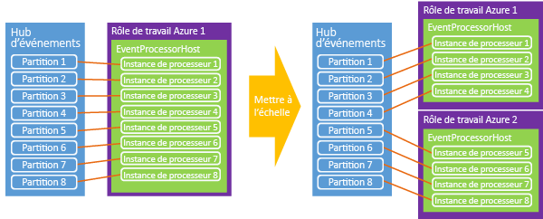

# <a name="event-hubs-programming-guide"></a>Guide de programmation de concentrateurs d’événements
Cette rubrique décrit la programmation avec Azure Event Hubs à l’aide du Kit de développement logiciel (SDK) Azure .NET. Il suppose une connaissance préalable des concentrateurs d’événements. Pour une vue d’ensemble conceptuelle des concentrateurs d’événements, consultez [Vue d'ensemble des concentrateurs d’événements](event-hubs-overview.md).

## <a name="event-publishers"></a>Éditeurs d'événements
L’envoi d'événements à un concentrateur d'événements s'effectue à l'aide d'HTTP POST ou via une connexion AMQP 1.0. Le choix entre les deux méthodes à utiliser à quel moment dépend du scénario spécifique qui est adressé. Les connexions AMQP 1.0 sont limitées en tant que connexions réparties dans Service Bus et sont plus appropriées dans les scénarios avec des volumes de messages plus importants fréquents et des conditions de latence plus faible, car elles fournissent un canal de messagerie permanent.

Les hubs d’événements sont créés et gérés à l’aide de la classe [NamespaceManager](https://msdn.microsoft.com/library/azure/microsoft.servicebus.namespacemanager.aspx) . L’utilisation des API gérées avec .NET, les constructions principales pour publier des données sur les concentrateurs d’événements sont les classes [EventHubClient](https://msdn.microsoft.com/library/azure/microsoft.servicebus.messaging.eventhubclient.aspx) et [EventData](https://msdn.microsoft.com/library/azure/microsoft.servicebus.messaging.eventdata.aspx). [EventHubClient](https://msdn.microsoft.com/library/azure/microsoft.servicebus.messaging.eventhubclient.aspx) fournit le canal de communication AMQP par le biais duquel les événements sont envoyés à Event Hub. La classe [EventData](https://msdn.microsoft.com/library/azure/microsoft.servicebus.messaging.eventdata.aspx) représente un événement et sert à publier des messages sur un hub d’événements. Cette classe inclut le corps, certaines métadonnées et les informations d'en-tête sur l'événement. D’autres propriétés sont ajoutées à l’objet [EventData](https://msdn.microsoft.com/library/azure/microsoft.servicebus.messaging.eventdata.aspx) lorsqu’il traverse un Event Hub.

## <a name="get-started"></a>Prise en main
Les classes .NET qui prennent en charge les concentrateurs d'événements font partie de l'assembly Microsoft.ServiceBus.dll. Le moyen le plus simple de référencer l'API Service Bus et de configurer votre application avec toutes les dépendances Service Bus est de télécharger le [package NuGet Service Bus](https://www.nuget.org/packages/WindowsAzure.ServiceBus). Vous pouvez également utiliser la [Console du gestionnaire de package](http://docs.nuget.org/docs/start-here/using-the-package-manager-console) dans Visual Studio. Pour cela, entrez la commande suivante dans la fenêtre de la [console du gestionnaire du package](http://docs.nuget.org/docs/start-here/using-the-package-manager-console) :

```
Install-Package WindowsAzure.ServiceBus
```

## <a name="create-an-event-hub"></a>Création d’un concentrateur d’événements
Vous pouvez utiliser la classe [NamespaceManager](https://msdn.microsoft.com/library/azure/microsoft.servicebus.namespacemanager.aspx) pour créer des concentrateurs d'événements. Par exemple :

```
var manager = new Microsoft.ServiceBus.NamespaceManager("mynamespace.servicebus.windows.net");
var description = manager.CreateEventHub("MyEventHub");
```

Dans la plupart des cas, il est recommandé d'utiliser les méthodes [CreateEventHubIfNotExists](https://msdn.microsoft.com/library/azure/microsoft.servicebus.namespacemanager.createeventhubifnotexists.aspx) pour éviter de générer des exceptions si le service redémarre. Par exemple :

```
var description = manager.CreateEventHubIfNotExists("MyEventHub");
```

Toutes les opérations de création de concentrateur d'événements, y compris [CreateEventHubIfNotExists](https://msdn.microsoft.com/library/azure/microsoft.servicebus.namespacemanager.createeventhubifnotexists.aspx), nécessitent des autorisations de **gestion** sur l'espace de noms en question. Si vous souhaitez limiter les autorisations de votre éditeur ou de vos applications clientes, vous pouvez éviter ces appels d'opération de création dans le code de production lorsque vous utilisez des informations d'identification avec des autorisations limitées.

La classe [EventHubDescription](https://msdn.microsoft.com/library/azure/microsoft.servicebus.messaging.eventhubdescription.aspx) contient des détails sur un concentrateur d'événements, notamment les règles d'autorisation, l'intervalle de rétention de message, les ID de partition, l’état et le chemin d'accès. Vous pouvez utiliser cette classe pour mettre à jour les métadonnées sur un concentrateur d'événements.

## <a name="create-an-event-hubs-client"></a>Création d’un client de concentrateurs d’événements
La classe principale d'interaction avec les concentrateurs d’événements est [Microsoft.ServiceBus.Messaging.EventHubClient](https://msdn.microsoft.com/library/azure/microsoft.servicebus.messaging.eventhubclient.aspx). Cette classe fournit les fonctionnalités de l'expéditeur et du récepteur. Vous pouvez instancier cette classe à l'aide de la méthode [Create](https://msdn.microsoft.com/library/azure/microsoft.servicebus.messaging.eventhubclient.create.aspx) , comme indiqué dans l'exemple suivant.

```
var client = EventHubClient.Create(description.Path);
```

Cette méthode utilise les informations de connexion de Service Bus dans le fichier App.config, dans la section `appSettings` . Pour obtenir un exemple du XML `appSettings` utilisé pour stocker les informations de connexion Service Bus, consultez la documentation pour la méthode [Microsoft.ServiceBus.Messaging.EventHubClient.Create(System.String)](https://msdn.microsoft.com/library/azure/microsoft.servicebus.messaging.eventhubclient.create.aspx) .

Vous pouvez également créer le client à partir d'une chaîne de connexion. Cette option fonctionne bien lorsque vous utilisez des rôles de travail Azure, car vous pouvez stocker la chaîne dans les propriétés de configuration du travail. Par exemple :

```
EventHubClient.CreateFromConnectionString("your_connection_string");
```

La chaîne de connexion sera au même format que celui dans lequel elle apparaît dans le fichier App.config pour les méthodes précédentes :

```
Endpoint=sb://[namespace].servicebus.windows.net/;SharedAccessKeyName=Manage;SharedAccessKey=[key]
```

Enfin, il est également possible de créer un objet [EventHubClient](https://msdn.microsoft.com/library/azure/microsoft.servicebus.messaging.eventhubclient.aspx) à partir d’une instance [MessagingFactory](https://msdn.microsoft.com/library/azure/microsoft.servicebus.messaging.messagingfactory.aspx), comme illustré dans l’exemple suivant.

```
var factory = MessagingFactory.CreateFromConnectionString("your_connection_string");
var client = factory.CreateEventHubClient("MyEventHub");
```

Il est important de noter que des objets [EventHubClient](https://msdn.microsoft.com/library/azure/microsoft.servicebus.messaging.eventhubclient.aspx) supplémentaires créés à partir d'une instance de fabrique de messagerie vont réutiliser la même connexion TCP sous-jacente. Par conséquent, ces objets ont une limite de débit côté client. La méthode [Create](https://msdn.microsoft.com/library/azure/microsoft.servicebus.messaging.eventhubclient.create.aspx) réutilise une fabrique de messagerie unique. Si vous avez besoin du débit très élevé d'un expéditeur unique, vous pouvez créer plusieurs fabriques de messages et un objet [EventHubClient](https://msdn.microsoft.com/library/azure/microsoft.servicebus.messaging.eventhubclient.aspx) à partir de chaque fabrique de messagerie.

## <a name="send-events-to-an-event-hub"></a>Envoyer des événements à un concentrateur d'événements
Vous pouvez envoyer des événements à un concentrateur d’événements en créant une instance [EventData](https://msdn.microsoft.com/library/azure/microsoft.servicebus.messaging.eventdata.aspx) et en l’envoyant via la méthode [Send](https://msdn.microsoft.com/library/azure/microsoft.servicebus.messaging.eventhubclient.send.aspx). Cette méthode prend un seul paramètre d’instance [EventData](https://msdn.microsoft.com/library/azure/microsoft.servicebus.messaging.eventdata.aspx) et l’envoie de façon synchrone à un concentrateur d'événements.

## <a name="event-serialization"></a>Sérialisation d'événement
La classe [EventData](https://msdn.microsoft.com/library/azure/microsoft.servicebus.messaging.eventdata.aspx) possède [quatre constructeurs surchargés](https://msdn.microsoft.com/library/azure/microsoft.servicebus.messaging.eventdata.eventdata.aspx) qui prennent un grand nombre de paramètres, comme un objet et un sérialiseur, un tableau d’octets ou un flux de données. Il est également possible d'instancier la classe [EventData](https://msdn.microsoft.com/library/azure/microsoft.servicebus.messaging.eventdata.aspx) et de définir le flux de données du corps par la suite. Lorsque vous utilisez JSON avec [EventData](https://msdn.microsoft.com/library/azure/microsoft.servicebus.messaging.eventdata.aspx), vous pouvez utiliser **Encoding.UTF8.GetBytes()** pour récupérer le tableau d'octets d'une chaîne encodée JSON.

## <a name="partition-key"></a>Clé de partition
La classe [EventData](https://msdn.microsoft.com/library/azure/microsoft.servicebus.messaging.eventdata.aspx) a une propriété [PartitionKey](https://msdn.microsoft.com/library/azure/microsoft.servicebus.messaging.eventdata.partitionkey.aspx) qui permet à l’expéditeur de spécifier une valeur qui est hachée pour produire une affectation de partition. L’utilisation d'une clé de partition garantit que tous les événements avec la même clé sont envoyés à la même partition dans le concentrateur d’événements. Les clés de partition courantes incluent des ID de session utilisateur et des ID d’expéditeur uniques. La propriété [PartitionKey](https://msdn.microsoft.com/library/azure/microsoft.servicebus.messaging.eventdata.partitionkey.aspx) est facultative et peut être fournie lorsque vous utilisez les méthodes [Microsoft.ServiceBus.Messaging.EventHubClient.Send(Microsoft.ServiceBus.Messaging.EventData)](https://msdn.microsoft.com/library/azure/microsoft.servicebus.messaging.eventdata.aspx) ou [Microsoft.ServiceBus.Messaging.EventHubClient.SendAsync(Microsoft.ServiceBus.Messaging.EventData)](https://msdn.microsoft.com/library/azure/microsoft.servicebus.messaging.eventdata.aspx). Si vous ne fournissez pas de valeur pour [PartitionKey](https://msdn.microsoft.com/library/azure/microsoft.servicebus.messaging.eventdata.partitionkey.aspx), des événements envoyés sont distribués aux partitions à l'aide d'un modèle de tourniquet (round-robin).

## <a name="batch-event-send-operations"></a>Opérations d'envoi d’événements par lot
L’envoi d'événements par lots peut augmenter considérablement le débit. L a méthode [SendBatch](https://msdn.microsoft.com/library/azure/microsoft.servicebus.messaging.eventhubclient.sendbatch.aspx)méthode prend un paramètre **IEnumerable** de type [EventData](https://msdn.microsoft.com/library/azure/microsoft.servicebus.messaging.eventdata.aspx) et envoie l’ensemble du lot comme une opération atomique au concentrateur d’événements.

```
public void SendBatch(IEnumerable<EventData> eventDataList);
```

Notez qu'un seul lot ne doit pas dépasser la limite de 256 Ko d'un événement. En outre, chaque message du lot utilise la même identité d’éditeur. Il incombe à l'expéditeur de s’assurer que le lot ne dépasse pas la taille d'événement maximale. Le cas échéant, une erreur **Send** cliente est générée.

## <a name="send-asynchronously-and-send-at-scale"></a>Envoi de manière asynchrone et envoi à l'échelle
Vous pouvez également envoyer de manière asynchrone des événements à un concentrateur d'événements. L’envoi de manière asynchrone peut augmenter la vitesse à laquelle un client peut envoyer des événements. Les deux méthodes [Send](https://msdn.microsoft.com/library/azure/microsoft.servicebus.messaging.eventhubclient.send.aspx) et [SendBatch](https://msdn.microsoft.com/library/azure/microsoft.servicebus.messaging.eventhubclient.sendbatch.aspx) sont disponibles dans les versions asynchrones qui retournent un objet [Task](https://msdn.microsoft.com/library/system.threading.tasks.task.aspx). Tandis que cette technique peut augmenter le débit, elle peut également entraîner le client à continuer à envoyer des événements même lorsqu’elle est limitée par le service des concentrateurs d’événements et peut entraîner des échecs du client ou la perte de messages si elle n'est pas implémentée correctement. En outre, vous pouvez utiliser la propriété [RetryPolicy](https://msdn.microsoft.com/library/azure/microsoft.servicebus.messaging.cliententity.retrypolicy.aspx) sur le client pour les options de nouvelle tentative du client.

## <a name="create-a-partition-sender"></a>Création d'un expéditeur de partition
Même s'il est plus courant d’envoyer des événements à un concentrateur d'événements avec une clé de partition, dans certains cas vous pouvez envoyer des événements directement à une partition donnée. Par exemple :

```
var partitionedSender = client.CreatePartitionedSender(description.PartitionIds[0]);
```

[CreatePartitionedSender](https://msdn.microsoft.com/library/azure/microsoft.servicebus.messaging.eventhubclient.createpartitionedsender.aspx) retourne un objet [EventHubSender](https://msdn.microsoft.com/library/azure/microsoft.servicebus.messaging.eventhubsender.aspx) que vous pouvez utiliser pour publier des événements dans une partition de concentrateur d’événements spécifique.

## <a name="event-consumers"></a>Consommateurs d'événements
Les concentrateurs d’événements ont deux modèles principaux pour la consommation d'événements : des récepteurs directs et des abstractions de niveau supérieur, comme [EventProcessorHost](https://msdn.microsoft.com/library/azure/microsoft.servicebus.messaging.eventprocessorhost.aspx)par exemple. Les récepteurs directs sont responsables de leur propre coordination de l'accès aux partitions dans un groupe de consommateurs.

### <a name="direct-consumer"></a>Consommateur direct
Le moyen le plus direct pour lire à partir d'une partition dans un groupe de consommateurs consiste à utiliser la classe [EventHubReceiver](https://msdn.microsoft.com/library/azure/microsoft.servicebus.messaging.eventhubreceiver.aspx) . Pour créer une instance de cette classe, vous devez utiliser une instance de la classe [EventHubConsumerGroup](https://msdn.microsoft.com/library/azure/microsoft.servicebus.messaging.eventhubconsumergroup.aspx) . Dans l'exemple suivant, l'ID de partition doit être spécifié lors de la création du récepteur pour le groupe de consommateurs.

```
EventHubConsumerGroup group = client.GetDefaultConsumerGroup();
var receiver = group.CreateReceiver(client.GetRuntimeInformation().PartitionIds[0]);
```

La méthode [CreateReceiver](https://msdn.microsoft.com/library/azure/microsoft.servicebus.messaging.eventhubconsumergroup.createreceiver.aspx) a plusieurs surcharges qui facilitent le contrôle sur le lecteur qui est créé. Ces méthodes incluent la spécification d'un décalage en tant que chaîne ou horodatage et la capacité à spécifier s'il faut inclure ce décalage spécifié dans le flux de données retourné, ou à le démarrer après. Une fois le récepteur créé, vous pouvez démarrer la réception d’événements sur l'objet retourné. La méthode [Receive](https://msdn.microsoft.com/library/azure/microsoft.servicebus.messaging.eventhubreceiver.receive.aspx) a quatre surcharges qui contrôlent les paramètres d'opération de réception, tels que la taille du lot et le temps d'attente. Vous pouvez utiliser les versions asynchrones de ces méthodes pour augmenter le débit d'un consommateur. Par exemple :

```
bool receive = true;
string myOffset;
while(receive)
{
    var message = receiver.Receive();
    myOffset = message.Offset;
    string body = Encoding.UTF8.GetString(message.GetBytes());
    Console.WriteLine(String.Format("Received message offset: {0} \nbody: {1}", myOffset, body));
}
```

Pour une partition spécifique, les messages sont reçus dans l'ordre dans lequel ils ont été envoyés au concentrateur d'événements. Le décalage est un jeton de chaîne utilisé pour identifier un message dans une partition.

Notez qu'une partition unique dans un groupe de consommateurs ne peut pas avoir plus de 5 lecteurs simultanés connectés à tout moment. Lorsque les lecteurs se connectent ou sont déconnectés, leurs sessions peuvent rester actives pendant plusieurs minutes avant que ce service ne reconnaisse qu'ils sont déconnectés. Pendant ce temps, la reconnexion à une partition peut échouer. Pour obtenir un exemple complet de l'écriture d'un récepteur direct pour les concentrateurs d’événements, consultez l’exemple [Récepteurs directs des concentrateurs d’événements de Service Bus](https://code.msdn.microsoft.com/Event-Hub-Direct-Receivers-13fa95c6) .

### <a name="event-processor-host"></a>Hôte du processeur d’événements
La classe [EventProcessorHost](https://msdn.microsoft.com/library/azure/microsoft.servicebus.messaging.eventprocessorhost.aspx) traite les données à partir des concentrateurs d’événements. Vous devez utiliser cette implémentation lors de la création de lecteurs d'événement sur la plateforme .NET. [EventProcessorHost](https://msdn.microsoft.com/library/azure/microsoft.servicebus.messaging.eventprocessorhost.aspx) fournit un environnement d'exécution sécurisé, multiprocessus, thread-safe pour des implémentations d’événements qui fournissent également une gestion de contrôle et de location de partition.

Pour utiliser la classe [EventProcessorHost](https://msdn.microsoft.com/library/azure/microsoft.servicebus.messaging.eventprocessorhost.aspx), vous pouvez implémenter [IEventProcessor](https://msdn.microsoft.com/library/azure/microsoft.servicebus.messaging.ieventprocessor.aspx). Cette interface contient trois méthodes :

* [OpenAsync](https://msdn.microsoft.com/library/azure/microsoft.servicebus.messaging.ieventprocessor.openasync.aspx)
* [CloseAsync](https://msdn.microsoft.com/library/azure/microsoft.servicebus.messaging.ieventprocessor.closeasync.aspx)
* [ProcessEventsAsync](https://msdn.microsoft.com/library/azure/microsoft.servicebus.messaging.ieventprocessor.processeventsasync.aspx)

Pour commencer le traitement des événements, vous devez instancier [EventProcessorHost](https://msdn.microsoft.com/library/azure/microsoft.servicebus.messaging.eventprocessorhost.aspx)en fournissant les paramètres appropriés pour votre concentrateur d'événements. Appelez ensuite [RegisterEventProcessorAsync](https://msdn.microsoft.com/library/azure/microsoft.servicebus.messaging.eventprocessorhost.registereventprocessorasync.aspx) pour enregistrer votre implémentation [IEventProcessor](https://msdn.microsoft.com/library/azure/microsoft.servicebus.messaging.ieventprocessor.aspx) avec le runtime. À ce stade, l'hôte tente d'acquérir un bail sur chaque partition dans le concentrateur d'événements à l'aide d'un algorithme « gourmand ». Ces baux sont valables pour une période donnée et doivent ensuite être renouvelés. Étant donné que de nouveaux nœuds (ici, des instances de rôle) sont en ligne, ils placent des réservations de bail et, en même temps, la charge est déplacée entre les nœuds tandis que chaque nœud tente d’acquérir plus de baux.



Au fil du temps, un équilibre est établi. Cette fonctionnalité dynamique permet d’appliquer aux consommateurs une mise à l'échelle basée sur le processeur pour une augmentation et une diminution d’échelle. Les concentrateurs d’événements n’ayant pas de concept direct du nombre de messages, l'utilisation moyenne du processeur est souvent la meilleure solution pour mesurer la mise à l’échelle du serveur principal ou du consommateur. Si les éditeurs commencent à publier plus d'événements que ce que les consommateurs peuvent traiter, l'augmentation du processeur sur les consommateurs peut être utilisée pour effectuer une mise à l’échelle automatique sur le nombre d’instances de travail.

La classe [EventProcessorHost](https://msdn.microsoft.com/library/azure/microsoft.servicebus.messaging.eventprocessorhost.aspx) implémente également un mécanisme de point de contrôle basé sur le stockage Azure. Ce mécanisme stocke le décalage sur une base par partition, afin que chaque consommateur puisse déterminer quel était le dernier point de contrôle du consommateur précédent. Étant donné que la transition des partitions entre les nœuds se fait via les baux, il s’agit d’un mécanisme de synchronisation qui facilité le déplacement de la charge.

## <a name="publisher-revocation"></a>Révocation de l’éditeur
Outre les fonctionnalités d’exécution avancées de [EventProcessorHost](https://msdn.microsoft.com/library/azure/microsoft.servicebus.messaging.eventprocessorhost.aspx), les hubs d’événements permettent la révocation de l’éditeur pour empêcher certains éditeurs d’envoyer des événements à un hub d’événements. Ces fonctionnalités sont particulièrement utiles si le jeton d'un éditeur a été compromis ou une mise à jour de logiciel les fait se comporter de façon inappropriée. Dans ces situations, l’identité de l'éditeur, qui fait partie de leur jeton SAP, peut être bloquée à partir d'événements de publication.

Pour plus d’informations sur la révocation de l’éditeur et l’envoi vers des concentrateurs d’événements en tant qu’éditeur, consultez l’exemple [Publication sécurisée à grande échelle des concentrateurs d’événements de Service Bus](https://code.msdn.microsoft.com/Service-Bus-Event-Hub-99ce67ab).

## <a name="next-steps"></a>Étapes suivantes
Pour en savoir plus sur les scénarios des concentrateurs d’événements, consultez ces liens :

* [Vue d’ensemble de l'API Event Hubs](event-hubs-api-overview.md)
* [Vue d’ensemble des concentrateurs d’événements](event-hubs-overview.md)
* [Exemples de code des concentrateurs d’événements](http://code.msdn.microsoft.com/site/search?query=event hub&f\[0\].Value=event hub&f\[0\].Type=SearchText&ac=5)
* [Informations de référence des API hôtes du processeur d’événements](https://msdn.microsoft.com/library/azure/microsoft.servicebus.messaging.eventprocessorhost.aspx)

<!--HONumber=Oct16_HO2-->


