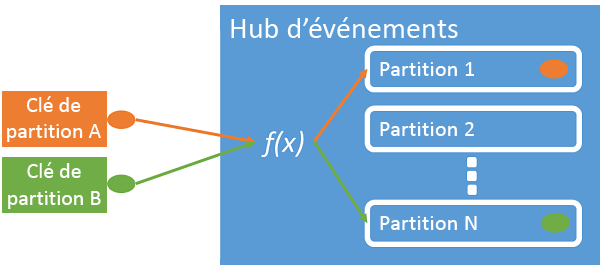
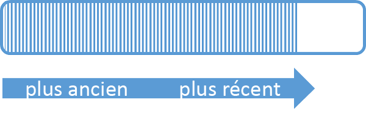
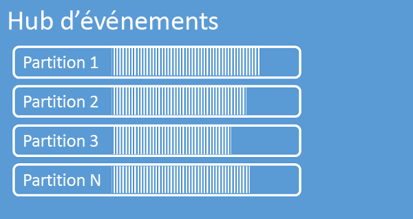
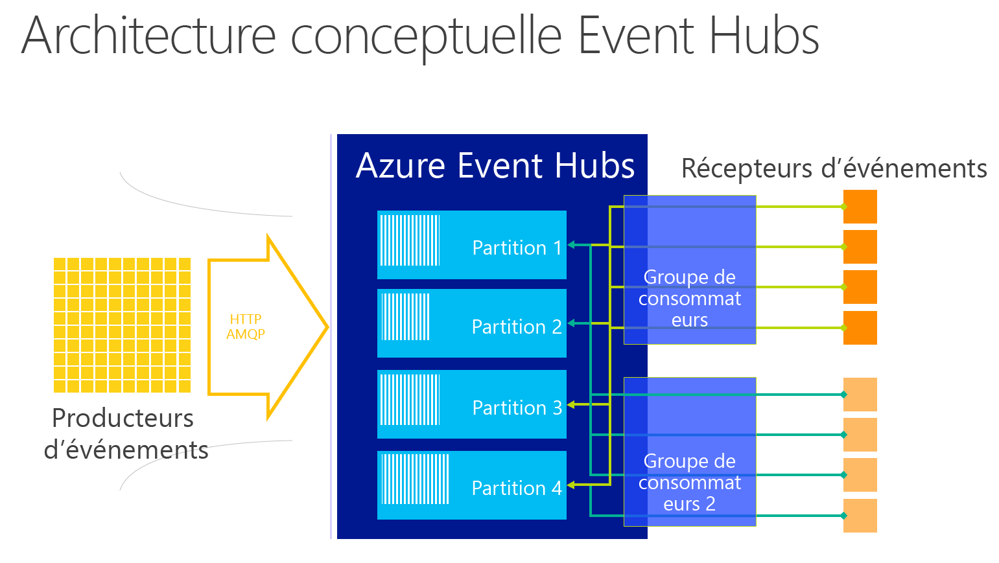
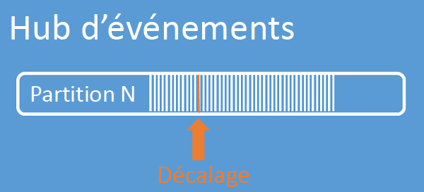

# <a name="what-is-azure-event-hubs"></a>Nouveautés des concentrateurs d'événements Azure ?
Il s’agit d’une plateforme de diffusion de données hautement évolutive, capable d’effectuer l’ingestion de plusieurs millions d’événements par seconde. Les données envoyées à un concentrateur d’événements peuvent être transformées et stockées à l’aide d’adaptateurs de traitement par lot/stockage ou d’un fournisseur d’analyse en temps réel. Grâce à leur capacité à fournir des fonctionnalités publication-abonnement avec une faible latence et à grande échelle, Event Hubs constitue la « base » des données volumineuses (Big Data).

## <a name="why-use-event-hubs"></a>Pourquoi utiliser Azure Event Hubs ?
Les fonctionnalités de traitement des événements et données de télémétrie de cette solution sont particulièrement adaptées pour les opérations suivantes :

* L’instrumentation de l'application
* L’expérience de l'utilisateur ou le traitement du flux de travail
* Des scénarios Internet des objets (IoT)

Azure Event Hubs inclut également une fonction de suivi du comportement dans les applications mobiles, des informations sur le trafic provenant de batteries de serveurs web, de capture d’événements de jeu dans les jeux de console ou des données de télémétrie recueillies sur des machines industrielles ou des véhicules connectés.

## <a name="azure-event-hubs-overview"></a>Vue d'ensemble des hubs d'événements Azure
Dans les architectures de solution, les concentrateurs d’événements jouent souvent le rôle de « porte d’entrée » pour un pipeline d’événements, parfois qualifié de service de *réception d’événements*. Un service de réception d'événements est un composant ou service qui se trouve entre les éditeurs d'événements et les consommateurs d'événements pour dissocier la production d'un flux d'événements de leur consommation.


Azure Event Hubs est un service de traitement d’événements qui gère l’ingestion de données de télémétrie et d’événements à l’échelle du cloud, en offrant une faible latence et une grande fiabilité. Cette solution fournit une fonctionnalité de gestion du flux de messages et présente des caractéristiques très différentes de la messagerie d’entreprise traditionnelle. Ses fonctionnalités reposent sur des scénarios de traitement des événements et un débit élevé. Par conséquent, Azure Event Hubs n’implémente pas certaines des fonctionnalités de messagerie qui sont disponibles pour les entités de messagerie, par exemple les rubriques.

Un concentrateur d’événements est créé au niveau de l’espace de noms et utilise les protocoles HTTP et AMQP en tant qu’interfaces API principales.

## <a name="event-publishers"></a>Éditeurs d'événements
Toute entité qui envoie des données à un concentrateur d’événements est un *éditeur d’événements*. Les éditeurs d’événements peuvent publier des événements à l’aide du protocole HTTPS ou AMQP 1.0. Ils utilisent un jeton SAS (Shared Access Signature) pour s’identifier auprès d’un concentrateur d’événements. Ils peuvent avoir une identité unique ou utiliser un jeton SAS commun.

### <a name="publishing-an-event"></a>Publication d'un événement
Vous pouvez publier un événement avec AMQP 1.0 ou HTTPS. Service Bus fournit une classe [EventHubClient](https://docs.microsoft.com/dotnet/api/microsoft.servicebus.messaging.eventhubclient) pour la publication d'événements sur un hub d'événements à partir de clients .NET. Pour les autres runtimes et plateformes, vous pouvez utiliser n'importe quel client AMQP 1.0, comme [Apache Qpid](http://qpid.apache.org/). Vous pouvez publier les événements individuellement ou par lots. Une publication unique (instance de données d’événement) a une limite de 256 Ko, qu’il s’agisse d’un événement unique ou d’un lot. La publication d'événements plus volumineux entraîne une erreur. Il est préférable pour les éditeurs de ne pas être au courant des partitions dans le hub d'événements et de spécifier uniquement une *clé de partition* (présentée dans la section suivante) ou leur identité par le biais de leur jeton SAS.

Le choix d'utiliser AMQP ou HTTPS est spécifique au scénario d'utilisation. AMQP requiert l'établissement d'un socket bidirectionnel persistant en plus de la sécurité au niveau du transport (TLS) ou SSL/TLS. Le protocole AMQP présente des coûts de gestion réseau plus élevés lors de l’initialisation de la session, mais le protocole HTTPS nécessite un temps de traitement SSL supplémentaire pour chaque demande. Par ailleurs, AMQP propose des performances plus élevées pour les éditeurs courants.



Azure Event Hubs garantit que tous les événements qui partagent la même valeur de clé de partition sont fournis dans l’ordre, et à la même partition. Si des clés de partition sont utilisées avec des stratégies d’éditeur, l’identité de l’éditeur et la valeur de la clé de partition doivent correspondre. Sinon, une erreur se produit.

### <a name="publisher-policy"></a>Stratégie de l'éditeur
Event Hubs permet un contrôle granulaire sur les éditeurs d'événements par le biais des *stratégies d'éditeur*. Les stratégies d’éditeur regroupent des fonctionnalités runtime conçues pour fournir un grand nombre d’éditeurs d’événements indépendants. Avec les stratégies d'éditeur, chaque éditeur utilise son propre identificateur unique lors de la publication d'événements sur un hub d'événements, à l'aide du mécanisme suivant :

```
//[my namespace].servicebus.windows.net/[event hub name]/publishers/[my publisher name]
```

Vous n'êtes pas obligé de créer des noms d'éditeurs à l'avance, mais ils doivent correspondre au jeton SAS utilisé lors de la publication d'un événement, afin de garantir les identités de l'éditeur indépendant. Lors de l'utilisation de stratégies d'éditeur, la valeur **PartitionKey** est définie sur le nom de l'éditeur. Pour fonctionner correctement, ces valeurs doivent correspondre.

## <a name="partitions"></a>Partitions
Azure Event Hubs diffuse des messages via un modèle de consommateur partitionné, dans lequel chaque consommateur lit uniquement un sous-ensemble spécifique, ou partition, du flux de messages. Ce modèle permet la mise à l’échelle horizontale pour le traitement des événements et fournit d’autres fonctionnalités de flux qui ne sont pas disponibles dans les rubriques et les files d’attente.

Une partition est une séquence ordonnée d'événements qui est conservée dans un hub d'événements. Les événements les plus récents sont ajoutés à la fin de cette séquence. Une partition peut être considérée comme un « journal de validation ».



Azure Event Hubs conserve les données pendant une durée de rétention configurée, qui s’applique à toutes les partitions du concentrateur d’événements. Les événements expirent selon une base temporelle. Vous ne pouvez pas les supprimer explicitement. Comme les partitions sont indépendantes et contiennent leur propre séquence de données, elles évoluent souvent à des vitesses différentes.



Le nombre de partitions est spécifié lors de la création du concentrateur d’événements. Il doit être compris entre 2 et 32. Le nombre de partitions n’est pas modifiable. Lorsque vous le définissez, tenez compte de la mise à l’échelle sur le long terme. Les partitions constituent un mécanisme d’organisation des données. Elles sont liées au degré de parallélisme en aval requis lors de la consommation des applications. Le choix du nombre de partitions dans un concentrateur d’événements est directement lié au nombre de lecteurs simultanés que vous prévoyez d’avoir. Si vous souhaitez augmenter le nombre de partitions au-delà de 32, contactez l’équipe Azure Event Hubs.

Les partitions sont identifiables et peuvent recevoir des données directement, mais cette pratique n’est pas recommandée. Au lieu de cela, vous pouvez utiliser des constructions de niveau supérieur présentées dans les sections [Éditeurs d’événements](#event-publishers) et [Capacité](#capacity).

Une séquence de données d’événement est incluse dans les partitions. Elle comprend le corps de chaque événement, un conteneur de propriétés défini par l’utilisateur et diverses métadonnées, telles que son décalage dans la partition et son numéro dans la séquence de flux.

### <a name="partition-key"></a>Clé de partition
Vous pouvez utiliser une clé de partition pour mapper des données d’événement entrant dans des partitions spécifiques dans le cadre de l’organisation des données. La clé de partition est une valeur fournie par l'expéditeur transmise dans un hub d'événements. Elle est traitée par le biais d’une fonction de hachage statique, qui crée l’affectation de la partition. Si vous ne spécifiez aucune clé de partition lors de la publication d’un événement, une affectation de type tourniquet (round robin) est utilisée.

L’éditeur d’événements est uniquement informé de sa clé de partition, et non de la partition sur laquelle les événements sont publiés. Grâce à cette dissociation de la clé et de la partition, l’expéditeur n’a pas besoin de connaître trop d’informations sur le traitement en aval. Une identité par appareil ou unique à l'utilisateur constitue une bonne clé de partition, mais d'autres attributs tels que la géographie, peuvent également être utilisés pour regrouper des événements liés dans une seule partition.

## <a name="sas-tokens"></a>Jetons SAS
Azure Event Hubs utilise des *signatures d’accès partagé* disponibles au niveau du concentrateur d’événements et de l’espace de noms. Un jeton SAS est généré à partir d'une clé SAS. C'est un hachage SHA d'une URL, codé dans un format spécifique. À l’aide du nom de la clé (stratégie) et du jeton, Azure Event Hubs peut régénérer le hachage et, ainsi, authentifier l’expéditeur. Normalement, les jetons SAS pour les éditeurs d’événements sont créés uniquement avec des privilèges d’**envoi** sur un hub d’événements spécifique. Le mécanisme URL de ce jeton SAS constitue la base de l'identification de l'éditeur introduite dans la stratégie de l'éditeur. Pour plus d’informations sur l’utilisation de SAS, consultez [Authentification par signature d’accès partagé avec Service Bus](../service-bus-messaging/service-bus-shared-access-signature-authentication.md).

## <a name="event-consumers"></a>Consommateurs d'événements
Toute entité qui lit des données d’événement à partir d’un concentrateur d’événements est un *consommateur d’événements*. Tous les consommateurs Azure Event Hubs se connectent par le biais de la session AMQP 1.0 ; les événements sont remis par le biais de cette session dès qu’ils sont disponibles. Le client n'a pas besoin d'interroger la disponibilité des données.

### <a name="consumer-groups"></a>Groupes de consommateurs
Le mécanisme de publication/d’abonnement des concentrateurs d’événements est activé à l’aide de *groupes de consommateurs*. Un groupe de consommateurs est une vue (état, position ou décalage) d'un hub d'événements dans sa totalité. Les groupes de consommateurs permettent à plusieurs applications consommatrices d'avoir chacune une vue distincte du flux d'événements et de lire le flux indépendamment à leur propre rythme et avec leurs propres décalages.

Dans une architecture de traitement de flux, chaque application en aval équivaut à un groupe de consommateurs. Si vous souhaitez écrire des données d'événement dans le stockage à long terme, alors cette application d'enregistreur de stockage est un groupe de consommateurs. Le traitement des événements complexes est ensuite effectué par un autre groupe de consommateurs distinct. Vous ne pouvez accéder aux partitions que par le biais d'un groupe de consommateurs. Sur une partition, un seul lecteur **d’un groupe de consommateurs donné** peut être actif au même moment. Il existe toujours un groupe de consommateurs par défaut dans un hub d'événements. Vous pouvez créer jusqu'à 20 groupes de consommateurs pour un hub d'événements de niveau standard.

Voici quelques exemples de la convention URI de groupe consommateurs :

```
//[my namespace].servicebus.windows.net/[event hub name]/[Consumer Group #1]
//[my namespace].servicebus.windows.net/[event hub name]/[Consumer Group #2]
```



### <a name="stream-offsets"></a>Décalages du flux
Un *décalage* correspond à la position d’un événement dans une partition. Vous pouvez considérer un décalage comme un curseur côté client. Le décalage est une numérotation en octets de l'événement. Ceci permet à un consommateur d'événements (lecteur) de spécifier un point dans le flux d'événements à partir duquel il veut commencer la lecture des événements. Vous pouvez spécifier le décalage comme un horodatage ou une valeur de décalage. Les consommateurs ont la responsabilité de stocker leurs propres valeurs de décalage en dehors du service des hubs d'événements. Dans une partition, chaque événement inclut un décalage.



### <a name="checkpointing"></a>Points de contrôle
Les *points de contrôle* constituent un processus par lequel les lecteurs marquent ou valident leur position dans une séquence d’événements de partition. La réalisation des points de contrôle est la responsabilité du consommateur et se produit sur une base par partition dans un groupe de consommateurs. Cela signifie que pour chaque groupe de consommateurs, chaque lecteur de partition doit conserver une trace de sa position actuelle dans le flux d'événements. Il peut informer le service lorsqu'il considère que le flux de données est complet.

Si un lecteur se déconnecte d'une partition, lorsqu'il se reconnecte il commence la lecture au point de contrôle qui a été précédemment soumis par le dernier lecteur de cette partition dans ce groupe de consommateurs. Lorsque le lecteur se connecte, il transmet ce décalage au hub d'événements pour spécifier l'emplacement où commencer la lecture. De cette façon, vous pouvez utiliser les points de contrôle pour marquer les événements comme « terminés » par les applications en aval et pour assurer la résilience en cas de basculement entre des lecteurs en cours d'exécution sur des ordinateurs différents. Il est possible de revenir à des données plus anciennes en spécifiant un décalage inférieur à partir de ce processus de vérification. Grâce à ce mécanisme, les points de contrôle permettent une résilience au basculement renforcée, mais également la relecture du flux d’événements.

### <a name="common-consumer-tasks"></a>Tâches courantes du consommateur
Tous les consommateurs Azure Event Hubs se connectent via un canal de communication bidirectionnelle prenant en charge l’état et la session AMQP 1.0. Chaque partition inclut une session AMQP 1.0, qui facilite le transport des événements séparés par partition.

#### <a name="connect-to-a-partition"></a>Se connecter à une partition
Lors de la connexion aux partitions, il est courant d’utiliser un mécanisme de bail afin de coordonner les connexions du lecteur à des partitions spécifiques. De cette façon, chaque partition dans un groupe de consommateurs peut n'avoir qu'un seul lecteur actif. La gestion des points de contrôle, de la location et des lecteurs a été simplifiée grâce à l’utilisation de la classe [EventProcessorHost](https://docs.microsoft.com/dotnet/api/microsoft.servicebus.messaging.eventprocessorhost) pour les clients .NET. [EventProcessorHost](https://docs.microsoft.com/dotnet/api/microsoft.servicebus.messaging.eventprocessorhost) est un agent consommateur intelligent.

#### <a name="read-events"></a>Lire les événements
Après l'ouverture d'une session AMQP 1.0 et d'une liaison pour une partition spécifique, les événements sont livrés par le service de hubs d'événements au client AMQP 1.0. Ce mécanisme de livraison permet un débit plus élevé et une latence plus faible par rapport aux mécanismes basés sur l'extraction, tels que HTTP GET. Alors que les événements sont envoyés au client, chaque instance de données d'événement contient des métadonnées importantes, comme le décalage et le numéro de séquence, qui sont utilisées pour faciliter les points de contrôle sur la séquence d'événements.

Données d’événement :
* Offset
* Numéro de séquence
* Corps
* Propriétés de l’utilisateur
* Propriétés système

Il vous incombe de gérer le décalage.

## <a name="capacity"></a>Capacité
Azure Event Hubs possède une architecture parallèle hautement évolutive. Vous devez tenir compte de plusieurs facteurs importants lors du dimensionnement et de la mise à l’échelle de votre infrastructure.

### <a name="throughput-units"></a>Unités de débit
La capacité de débit des concentrateurs d’événements est contrôlée par les *unités de débit*. Les unités de débit sont des unités de capacité achetées préalablement. Une unité de débit unique inclut les éléments suivants :

* Entrée : jusqu’à 1 Mo par seconde ou 1 000 événements par seconde, selon ce qui se produit en premier.
* Sortie : jusqu’à 2 Mo par seconde.

En cas de dépassement de la capacité des unités de débit achetées, l’entrée est limitée et une exception [ServerBusyException](https://docs.microsoft.com/dotnet/api/microsoft.azure.eventhubs.serverbusyexception) est renvoyée. La sortie ne produit aucune exception de limitation, mais reste limitée à la capacité des unités de débit achetées. Si vous recevez des exceptions de vitesse de publication ou si vous attendez une sortie plus élevée, vérifiez le nombre d’unités de débit achetées pour l’espace de noms. Vous pouvez gérer des unités de débit sur le panneau **Mettre à l’échelle** des espaces de noms, dans le [portail Azure][Azure portal]. Vous pouvez également effectuer cette opération par programme, à l’aide des API Azure.

Les unités de débit sont facturées par heure et sont préalablement acquises. Une fois achetées, les unités de débit sont facturées au moins une heure. Vous pouvez acheter jusqu’à 20 unités de débit pour un espace de noms Azure Event Hubs. Ces unités sont partagées entre tous les concentrateurs d’événements de l’espace de noms en question.

Il est possible d’acheter des unités de débit supplémentaires, par lots de 20 (pour un maximum de 100). Pour cela, contacter le support Azure. Ensuite, vous pouvez également acheter des blocs de 100 unités de débit.

Nous vous recommandons d’équilibrer soigneusement les partitions et les unités de débit pour obtenir un dimensionnement optimal. Une partition unique a une échelle maximale d'une unité de débit. Le nombre d'unités de débit doit être inférieur ou égal au nombre de partitions dans un hub d'événements.

Pour obtenir des informations de tarification détaillées, consultez [Tarification des hubs d'événements](https://azure.microsoft.com/pricing/details/event-hubs/).

## <a name="next-steps"></a>Étapes suivantes

* Prise en main avec un [didacticiel des hubs d'événements][Event Hubs tutorial]
* Un [exemple d’application complet qui utilise Event Hubs]
* [Guide de programmation de concentrateurs d’événements](event-hubs-programming-guide.md)
* [FAQ sur les hubs d'événements](event-hubs-faq.md)

[Event Hubs tutorial]: event-hubs-csharp-ephcs-getstarted.md
[exemple d’application complet qui utilise Event Hubs]: https://code.msdn.microsoft.com/Service-Bus-Event-Hub-286fd097
[Azure portal]: https://portal.azure.com


<!--HONumber=Feb17_HO1-->


