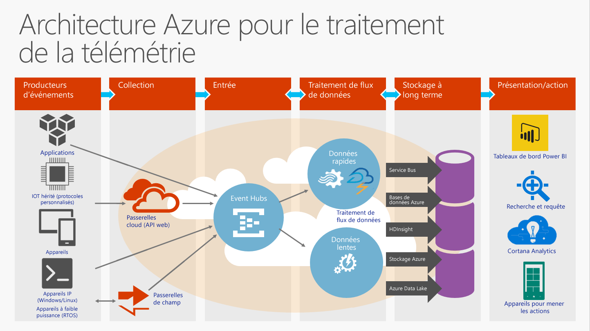

# Qu’est-ce qu’Event Hubs ?

Azure Event Hubs est une plateforme de diffusion de données hautement évolutive et de service d’ingestion d’événement capable de recevoir et de traiter des millions d’événements par seconde. Les concentrateurs d’événements peuvent traiter et stocker des événements, des données ou la télémétrie produits par des logiciels et appareils distribués. Les données envoyées à un concentrateur d’événements peuvent être transformées et stockées à l’aide d’adaptateurs de traitement par lot/stockage ou d’un fournisseur d’analyse en temps réel. Grâce à leur capacité à fournir des [fonctionnalités publication-abonnement](https://msdn.microsoft.com/library/aa560414.aspx) avec une faible latence et à grande échelle, les concentrateurs d’événements constitue la « base » des données volumineuses (Big Data).

## Pourquoi utiliser Azure Event Hubs ?

Les fonctionnalités de traitement des événements et données de télémétrie de cette solution sont particulièrement adaptées pour les opérations suivantes :

* L’instrumentation de l'application
* L’expérience de l'utilisateur ou le traitement du flux de travail
* Des scénarios Internet des objets (IoT)

Par exemple, les concentrateurs d’événements inclut une fonction de suivi du comportement dans les applications mobiles, des informations sur le trafic provenant de batteries de serveurs web, de capture d’événements de jeu dans les jeux de console ou des données de télémétrie collectées sur des machines industrielles, des véhicules connectés ou d’autres appareils.

## Vue d'ensemble des hubs d'événements Azure

Dans les architectures de solution, les concentrateurs d’événements jouent souvent le rôle de « porte d’entrée » pour un pipeline d’événements, parfois qualifié de service de *réception d’événements*. Un service de réception d'événements est un composant ou service qui se trouve entre les éditeurs d'événements et les consommateurs d'événements pour dissocier la production d'un flux d'événements de leur consommation. La figure suivante illustre cette architecture :

Cette solution fournit une fonctionnalité de gestion du flux de messages mais présente des caractéristiques différentes de la messagerie d’entreprise traditionnelle. Ses fonctionnalités reposent sur des scénarios de traitement des événements et un débit élevé. Par conséquent, les concentrateurs d’événements sont différents de la messagerie [Azure Service Bus](https://azure.microsoft.com/services/service-bus/) et n’implémentent pas certaines des fonctionnalités qui sont disponibles pour les entités de [messagerie Service Bus](/azure/service-bus-messaging/), par exemple les rubriques.

## Fonctionnalités des concentrateurs d’événements

Les concentrateurs d’événements incluent les éléments clés suivants :

- [**Producteurs/éditeurs d’événements**](event-hubs-features.md#event-publishers) : entité qui envoie des données à un concentrateur d’événements. Un événement est publié via AMQP 1.0 ou HTTPS.
- [**Capture**](event-hubs-features.md#capture) : vous permet de capturer les données de streaming Event Hubs et de le stocker dans un compte de stockage Blob Azure.
- [**Partitions**](event-hubs-features.md#partitions) : permet à chaque consommateur de lire un sous-ensemble, ou une partition, spécifique uniquement du flux d’événements.
- [**Jetons SAS**](event-hubs-features.md#sas-tokens) : jetons utilisés pour identifier et authentifier l’éditeur d’événements.
- [**Consommateurs d’événements**](event-hubs-features.md#event-consumers) : entité qui lit des données d’événement à partir d’un concentrateur d’événements. Les consommateurs d’événements se connectent via AMQP 1.0. 
- [**Groupes de consommateurs**](event-hubs-features.md#consumer-groups) : fournit à chaque plusieurs applications consommatrices une vue distincte du flux d’événements, permettant aux consommateurs d’agir de façon indépendante.
- [**Unités de débit**](event-hubs-features.md#capacity) : unités de capacité achetées préalablement. Une partition unique a une échelle maximale d’1 unité de débit.

Pour obtenir des détails techniques sur ces fonctionnalités et d’autres fonctionnalités encore des concentrateurs d’événements, consultez la [Vue d’ensemble des fonctionnalités des concentrateurs d’événements](event-hubs-features.md). 

## Étapes suivantes

Pour obtenir des informations de tarification détaillées des concentrateurs d’événements, consultez [Tarification des concentrateurs d’événements](https://azure.microsoft.com/pricing/details/event-hubs/).

Pour plus d’informations sur les concentrateurs d’événements, accédez aux liens suivants :

* Prise en main avec un [didacticiel des concentrateurs d’événements](event-hubs-dotnet-standard-getstarted-send.md)
* [FAQ sur les hubs d'événements](event-hubs-faq.md)
* [Exemples d’applications qui utilisent des Event Hubs](https://github.com/Azure/azure-event-hubs/tree/master/samples)
 
 

