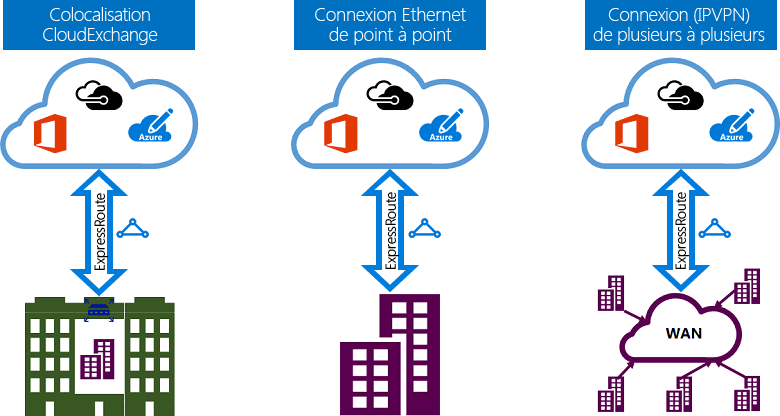

# Modèles de connectivité ExpressRoute
Vous pouvez créer une connexion entre votre réseau local et le cloud Microsoft de trois façons différentes : à l’aide d’une [colocalisation avec échange de cloud](#CloudExchange), d’une [connexion Ethernet point à point](#Ethernet)ou d’une [connexion universelle (IPVPN)](#IPVPN). Les fournisseurs de connectivité peuvent offrir un ou plusieurs modèles de connectivité. Vous pouvez contacter votre fournisseur de connectivité pour choisir le modèle qui vous convient le mieux.
  

## Colocalisation avec un échange de cloud
Si vous êtes colocalisé avec une installation dans le cadre d’un échange de cloud, vous pouvez commander des interconnexions virtuelles vers le cloud de Microsoft via l’échange Ethernet du fournisseur de colocalisation. Les fournisseurs de colocalisation peuvent offrir des interconnexions de couche 2 ou des interconnexions de couche 3 gérées entre votre infrastructure dans l’installation de colocalisation et le cloud de Microsoft.

## Connexions Ethernet point à point
Vous pouvez connecter vos centres de données/bureaux locaux au cloud de Microsoft via des liaisons Ethernet point à point. Les fournisseurs Ethernet point à point peuvent offrir des connexions de couche 2 ou des connexions de couche 3 gérées entre votre site et le cloud de Microsoft.

## Réseaux universels (IPVPN)
Vous pouvez intégrer votre réseau étendu au cloud de Microsoft. Les fournisseurs IPVPN (généralement des VPN MPLS) offrent une connectivité universelle entre vos succursales et vos centres de données. Le cloud de Microsoft peut être interconnecté à votre réseau étendu afin qu’il apparaisse comme n’importe quelle autre succursale. Les fournisseurs de réseaux étendus offrent généralement une connectivité de couche 3 gérée. Les capacités et fonctionnalités ExpressRoute sont identiques pour tous les modèles de connectivité ci-dessus. 

## Étapes suivantes
* Découvrez en détail les connexions ExpressRoute et les domaines de routage. Consultez la page [Circuits ExpressRoute et domaines de routage](expressroute-circuit-peerings.md).
* Découvrez en détail les fonctionnalités ExpressRoute. Consultez la [présentation technique d’ExpressRoute](expressroute-introduction.md).
* Recherchez un fournisseur de services. Consultez la page [Partenaires ExpressRoute et emplacements d’homologation](expressroute-locations.md).
* Vérifiez que toutes les conditions préalables sont remplies. Consultez la page [Configuration requise pour ExpressRoute](expressroute-prerequisites.md).
* Reportez-vous aux conditions requises pour le [routage](expressroute-routing.md), la [traduction d’adresses réseau](expressroute-nat.md) et la [qualité de service](expressroute-qos.md).
* Configurez votre connexion ExpressRoute.
  * [Création d’un circuit ExpressRoute](expressroute-howto-circuit-portal-resource-manager.md)
  * [Configuration du routage](expressroute-howto-routing-portal-resource-manager.md)
  * [Liaison d’un réseau virtuel à un circuit ExpressRoute](expressroute-howto-linkvnet-portal-resource-manager.md)

<!--HONumber=Feb17_HO2-->

