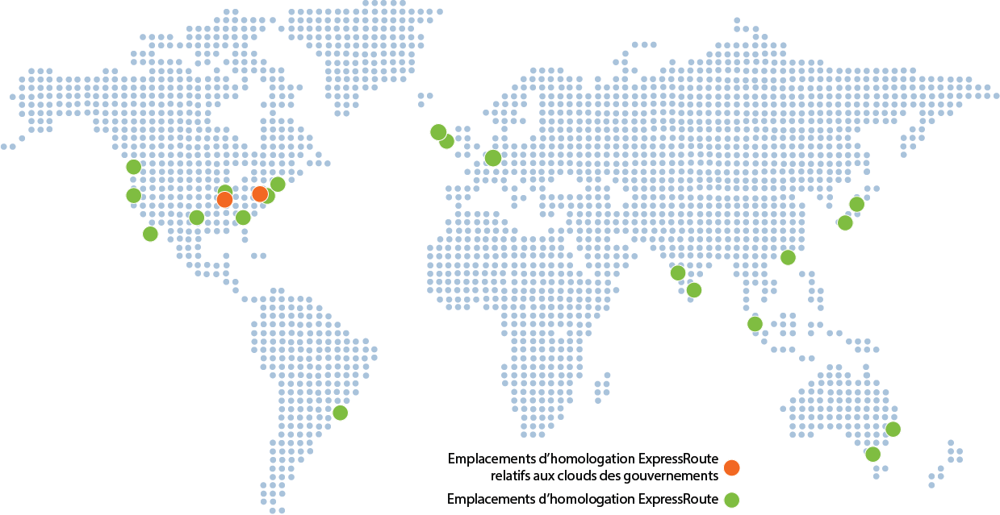

<properties
   pageTitle="Emplacements ExpressRoute | Microsoft Azure"
   description="Cet article fournit une vue d’ensemble détaillée des emplacements où les services sont proposés et de la façon de se connecter à des régions Azure."
   services="expressroute"
   documentationCenter="na"
   authors="cherylmc"
   manager="carmonm"
   editor="" />
<tags
   ms.service="expressroute"
   ms.devlang="na"
   ms.topic="get-started-article"
   ms.tgt_pltfrm="na"
   ms.workload="infrastructure-services"
   ms.date="04/19/2016"
   ms.author="cherylmc" />

# Partenaires ExpressRoute et emplacements d’homologation

Les tables de cet article offrent des informations sur les fournisseurs de connectivité ExpressRoute, la couverture géographique ExpressRoute, les services cloud Microsoft pris en charge via ExpressRoute et les intégrateurs système ExpressRoute.

## Fournisseurs de connectivité ExpressRoute

ExpressRoute est pris en charge dans tous les emplacements et régions Azure. La carte ci-dessous fournit une liste des régions Azure et des emplacements ExpressRoute. Les emplacements ExpressRoute se réfèrent à ceux où Microsoft s’associe à plusieurs fournisseurs de services.

Vous aurez accès aux services Azure dans toutes les régions au sein d’une une région géopolitique si vous êtes connecté à au moins un emplacement ExpressRoute dans la région géopolitique. Le tableau ci-dessous fournit une carte des régions Azure vers des emplacements ExpressRoute au sein d’une région géopolitique.

|**Région géopolitique**|**Régions Azure**|**Emplacements ExpressRoute**|
|---|---|---|
|**Amérique du Nord**|Est des États-Unis, Ouest des États-Unis, Est des États-Unis 2, Centre des États-Unis, Centre-Sud des États-Unis, Centre-Nord des États-Unis, Centre du Canada, Est du Canada|Atlanta, Chicago, Dallas, Las Vegas+, Los Angeles, New York, Seattle, Silicon Valley, Washington DC, Montréal+, Toronto|
|**Amérique du Sud**|Sud du Brésil|São Paulo|
|**Europe**|Europe du Nord, Europe de l’Ouest|Amsterdam, Dublin, Londres|
|**Asie**|Asie orientale, Asie du Sud-Est|Hong Kong, Singapour|
|**Japon**|Ouest du Japon, Est du Japon|Osaka, Tokyo|
|**Australie**|Sud-est de l’Australie |Est de l’Australie|Melbourne, Sydney|
|**Inde**|Inde-Ouest, Inde-Centre, Inde-Sud|Chennai, Mumbai|

Le tableau ci-dessous fournit des informations sur les régions et les limites géopolitiques et des clouds nationaux.

|**Région géopolitique**|**Régions Azure**|**Emplacements ExpressRoute**|
|---|---|---|---|
|**Cloud du gouvernement des États-Unis**|Gouvernement américain - Iowa, Gouvernement américain - Virginie|Chicago, New York+, Washington DC|
|**Chine**|Chine du Nord, Chine orientale|Pékin, Shanghai +|
|**Allemagne**|Allemagne centrale, Allemagne de l’est|Berlin+, Francfort|

La connectivité entre les régions géopolitiques n’est pas prise en charge dans la référence ExpressRoute Standard. Vous devez activer le module complémentaire ExpressRoute Premium pour prendre en charge la connectivité globale. La connectivité à des environnements de cloud nationaux n’est pas prise en charge. En cas de besoin, vous pouvez collaborer avec votre fournisseur de connectivité.

## Emplacements de fournisseur de connectivité

### Production Azure

| **Fournisseur de services** |**Microsoft Azure** | **Office 365 et CRM Online** | **Emplacements** |
|-----------------------|--------------------|----------------|---------------|
| **[Réseaux Aryaka](http://www.aryaka.com/)** | Pris en charge | Pris en charge | Amsterdam, Silicon Valley, Singapour, Tokyo, Washington DC |
| **[AT&T NetBond](https://www.synaptic.att.com/clouduser/html/productdetail/ATT_NetBond.htm)** | Pris en charge | Pris en charge | Amsterdam, Chicago, Dallas, Londres, Silicon Valley, Singapour, Sydney, Washington DC |
| **[British Telecom](http://www.globalservices.bt.com/uk/en/news/bt_to_provide_connectivity_to_microsoft_azure)** | Pris en charge | Pris en charge | Amsterdam, Hong Kong, Londres, Silicon Valley, Singapour, Tokyo, Washington DC |
|**CenturyLink** | Bientôt disponible | Bientôt disponible| Silicon Valley |
|**China Telecom Global** | Pris en charge | Non pris en charge | Hong Kong |
|**Cologix** | Pris en charge | Bientôt disponible | Montréal+, Toronto |
| **[Colt](http://www.colt.net/uk/en/news/colt-announces-dedicated-cloud-access-for-microsoft-azure-services-en.htm)** | Pris en charge | Pris en charge | Amsterdam, Dublin, Londres |
| **Comcast** | Pris en charge | Non pris en charge | Silicon Valley, Washington DC |
| **[CoreSite](http://www.coresite.com/solutions/cloud-services/public-cloud-providers/microsoft-azure-expressroute)** | Pris en charge | Pris en charge | Los Angeles | 
| **[Equinix](http://www.equinix.com/partners/microsoft-azure/)** | Pris en charge | Pris en charge | Amsterdam, Atlanta, Chicago, Dallas, Hong Kong, Londres, Los Angeles, Melbourne, New York, Osaka, Sao Paulo, Seattle, Silicon Valley, Singapour, Sydney, Tokyo, Toronto, Washington DC |
| **euNetworks** | Pris en charge | Pris en charge | Amsterdam |
| **[Internet Initiative Japan Inc. - IIJ](http://www.iij.ad.jp/en/news/pressrelease/2015/1216-2.html)** | Pris en charge | Pris en charge | Osaka, Tokyo |
| **[InterCloud](https://www.intercloud.com/)** | Pris en charge | Pris en charge | Amsterdam, Londres, Singapour, Washington DC |
| **Internet Solutions - Cloud Connect** | Pris en charge | Pris en charge | Amsterdam, Londres |
| **Interxion** | Pris en charge | Pris en charge | Amsterdam, Londres |
| **[Level 3 Communications](http://your.level3.com/LP=882?WT.tsrc=02192014LP882AzureVanityAzureText)** | Pris en charge | Pris en charge | Amsterdam, Chicago, Dallas, Las Vegas+, Londres, Seattle, Silicon Valley, Washington DC |
| **Megaport** | Pris en charge | Pris en charge | Dallas, Las Vegas+, Los Angeles, Melbourne, New York, Seattle, Singapour, Sydney, Washington DC |
| **MTN** | Pris en charge | Pris en charge | Londres |
| **NEXTDC** | Pris en charge | Pris en charge | Melbourne, Sydney |
| **NTT Communications** | Pris en charge | Pris en charge | Londres, Osaka, Tokyo |
| **[Orange](http://www.orange-business.com/)** | Pris en charge | Pris en charge | Amsterdam, Hong Kong, Londres, Silicon Valley, Singapour, Washington DC |
| **PCCW Global Limited** | Pris en charge | Pris en charge | Hong Kong |
| **[SingTel](http://info.singtel.com/about-us/news-releases/singtel-provide-secure-private-access-microsoft-azure-public-cloud)** | Pris en charge | Non pris en charge | Singapour |
| **Softbank** | Pris en charge | Pris en charge | Osaka, Tokyo | 
| **[Tata Communications](http://www.tatacommunications.com/lp/izo/azure/azure_index.html)** | Pris en charge | Pris en charge | Amsterdam, Chennai, Hong Kong, Londres, Mumbai, Silicon Valley, Singapour, Washington DC |
| **[TeleCity Group](http://www.telecitygroup.com/investor-centre/news_details.htm?locid=03100500400b00d&xml)** | Pris en charge | Pris en charge | Amsterdam, Londres |
| **Telenor** | Pris en charge | Pris en charge | Amsterdam, Londres |
| **[Telstra Corporation](http://www.telstra.com.au/business-enterprise/network-services/networks/cloud-direct-connect/)** | Pris en charge | Non pris en charge | Melbourne, Sydney |
| **[Verizon](http://www.verizonenterprise.com/products/networking/secure-cloud-interconnect/)** | Pris en charge | Pris en charge | Amsterdam, Hong Kong, Londres, Silicon Valley, Singapour, Sydney, Tokyo, Washington DC |
| **Vodafone** | Pris en charge | Non pris en charge | Londres | 
| **[Zayo Group](http://www.zayo.com/solutions/industries/connect-to-cloud-data-centers/cloud-connectivity/microsoft-expressroute/)** | Pris en charge | Pris en charge | Chicago, Los Angeles, New York, Silicon Valley, Toronto, Washington DC |

 **+** = bientôt disponible

### Environnements de cloud national

#### Cloud du gouvernement des États-Unis

| **Fournisseur de services** |**Microsoft Azure** | **Office 365** | **Emplacements** |
|-----------------------|--------------------|----------------|---------------|
| **[AT&T NetBond](https://www.synaptic.att.com/clouduser/html/productdetail/ATT_NetBond.htm)** | Pris en charge | Pris en charge | Chicago, Washington DC |
| **[Equinix](http://www.equinix.com/partners/microsoft-azure/)** | Pris en charge | Pris en charge | Chicago, New York+, Washington DC |
| **[Level 3 Communications - IPVPN](http://your.level3.com/LP=882?WT.tsrc=02192014LP882AzureVanityAzureText)** | Pris en charge | Bientôt disponible | Chicago, New York+, Washington DC |
| **[Verizon](http://news.verizonenterprise.com/2014/04/secure-cloud-interconnect-solutions-enterprise/)** | Pris en charge | Pris en charge | Chicago, New York+, Washington DC |

#### Chine

| **Fournisseur de services** |**Microsoft Azure** | **Office 365** | **Emplacements** |
|-----------------------|--------------------|----------------|---------------|
| **China Telecom** | Pris en charge | Non pris en charge | Pékin, Shanghai +|
Pour plus d’informations, consultez [ExpressRoute en Chine](http://www.windowsazure.cn/home/features/expressroute/).

#### Allemagne

| **Fournisseur de services** |**Microsoft Azure** | **Office 365** | **Emplacements** |
|-----------------------|--------------------|----------------|---------------|
| **[Colt](http://www.colt.net/uk/en/news/colt-announces-dedicated-cloud-access-for-microsoft-azure-services-en.htm)** | Bientôt disponible | Non pris en charge | Berlin+, Francfort+|
| **[Equinix](http://www.equinix.com/partners/microsoft-azure/)** | Bientôt disponible | Non pris en charge | Francfort+|
| **e-shelter** | Bientôt disponible | Non pris en charge | Berlin+|
| **Interxion** | Pris en charge | Non pris en charge | Francfort|

## Connectivité via des fournisseurs de services non répertoriés

Si votre fournisseur de connectivité ne se trouve pas dans la liste des sections précédentes, vous pouvez quand même créer une connexion.

- Vérifiez auprès de votre fournisseur de connectivité s’il est connecté à l’un des échanges dans le tableau ci-dessous. Vous pouvez consulter les liens ci-dessous pour recueillir des informations supplémentaires sur les services proposés par les fournisseurs d’échange. Plusieurs fournisseurs de connectivité sont déjà connectés à des échanges Ethernet.

	- [Equinix Cloud Exchange](http://www.equinix.com/services/interconnection-connectivity/cloud-exchange/)
	- [TeleCity CloudIX](http://www.telecitygroup.com/colocation-services/cloud-ix.htm)
	- [InterXion](http://www.interxion.com/)
	- [NextDC](http://www.nextdc.com/)
	- [CoreSite](http://www.coresite.com/)
- Demandez à votre fournisseur de connectivité d’étendre votre réseau à l’emplacement d’homologation de votre choix.
	- Vérifiez que votre fournisseur de connectivité étend votre connectivité avec une haute disponibilité pour éviter tout point de défaillance unique.
- Commandez un circuit ExpressRoute avec échange en tant que fournisseur de connectivité pour se connecter à Microsoft.
	- Pour définir la connectivité, procédez de la manière décrite dans [Création d’un circuit ExpressRoute](expressroute-howto-circuit-classic.md).

|**Fournisseur de connectivité**|**Microsoft Exchange**|**Emplacements d’homologation**|
|---|---|---|
|**Alaska Communications**|Equinix|Seattle|
|**[XO Communications](http://www.xo.com/)**|Equinix|Silicon Valley|

## Intégrateurs système ExpressRoute

L’activation de la connectivité privée pour l’adapter à vos besoins peut s’avérer difficile selon l’échelle de votre réseau. Vous pouvez faire appel à l’un des intégrateurs système figurant dans le tableau ci-dessous pour vous aider à intégrer ExpressRoute.

|**Intégrateur système**|**Continent**|
|---|---|
|**[Avanade Inc.](http://www.avanade.com/)**| Asie, Europe, États-Unis |
|**[Dotnet Solutions](http://www.dotnetsolutions.co.uk/)**| Europe |
|**[Nimbo](http://www.nimbo.com/)**|FR||
|**[OneAs1a](http://www.oneas1a.com/express-connect-any-cloud-ecac)** | Asie |
|**[Perficient](http://www.perficient.com/Partners/Microsoft/Cloud/Azure-ExpressRoute)** | FR |
|**[Project Leadership](http://www.projectleadership.net/azure)** | FR |

## Étapes suivantes

- Pour plus d'informations sur ExpressRoute, consultez le [FAQ sur ExpressRoute](expressroute-faqs.md).
- Assurez-vous que toutes les conditions préalables sont remplies. Consultez la page [Configuration requise pour ExpressRoute](expressroute-prerequisites.md).

<!---HONumber=AcomDC_0427_2016-->