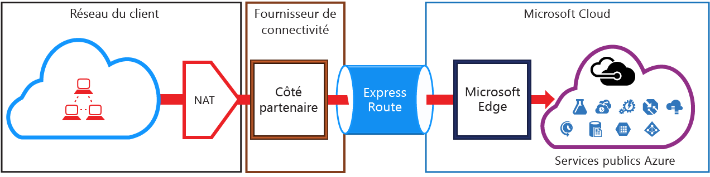
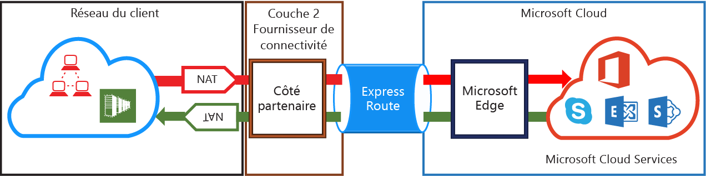

<properties
   pageTitle="Configuration NAT requise pour les circuits ExpressRoute | Microsoft Azure"
   description="Cette page détaille les conditions nécessaires à la configuration et à la gestion des NAT pour les circuits ExpressRoute."
   documentationCenter="na"
   services="expressroute"
   authors="cherylmc"
   manager="carolz"
   editor=""/>
<tags
   ms.service="expressroute"
   ms.devlang="na"
   ms.topic="get-started-article"
   ms.tgt_pltfrm="na"
   ms.workload="infrastructure-services"
   ms.date="01/16/2016"
   ms.author="cherylmc"/>

# Configuration NAT requise pour ExpressRoute

Pour vous connecter aux services de cloud Microsoft à l'aide d'ExpressRoute, vous devez configurer et gérer les NAT. Certains fournisseurs de connectivité proposent la configuration et la gestion NAT comme un service géré. Vérifiez auprès de votre fournisseur de connectivité s’il offre un tel service. Si ce n'est pas le cas, vous devez respecter les conditions décrites ci-dessous.

Examinez la page [Circuits ExpressRoute et domaines de routage](expressroute-circuit-peerings.md) pour obtenir une vue d'ensemble des différents domaines de routage. Pour répondre aux exigences en matière d'adresses IP publiques pour les homologations publiques Azure et Microsoft, nous vous recommandons de configurer un NAT entre votre réseau et Microsoft. Cette section fournit une description détaillée de l'infrastructure NAT que vous devez configurer.

## Configuration NAT requise pour l'homologation publique Azure

Le chemin d'homologation publique Azure vous permet de vous connecter à tous les services hébergés dans Azure en utilisant leurs adresses IP publiques. Cela inclut tous les services répertoriés dans le [FAQ sur ExpressRoute](expressroute-faqs.md) et tous les services hébergés par les éditeurs de logiciels sur Microsoft Azure. La connectivité aux services Microsoft Azure sur l'homologation publique est toujours lancée de votre réseau vers le réseau Microsoft. Le trafic destiné à Microsoft Azure sur l'homologation publique doit être configuré en SNAT avec des adresses IPv4 publiques valides avant leur entrée sur le réseau Microsoft. L'illustration suivante indique de façon sommaire comment configurer un NAT pour répondre à cette exigence.

### Pool d’adresses IP NAT et publications de routage

Vous devez vous assurer que le trafic qui entre via le chemin d'accès d’homologation publique Azure utilise une adresse IPv4 publique valide. Microsoft doit être en mesure de valider la propriété du pool d'adresses NAT IPv4 par rapport à un Registre Internet de routage régional (RIR) ou un Registre de routage Internet (IRR). Une vérification sera effectuée en fonction du numéro AS en cours d’homologation et des adresses IP utilisées pour le NAT. Reportez-vous à la page [Configuration requise pour le routage ExpressRoute](expressroute-routing.md) pour plus d'informations sur les registres de routage.
 
Il n'existe aucune restriction concernant la longueur du préfixe IP NAT publié via cette homologation. Vous devez surveiller le pool NAT et vous assurer que vous n’êtes pas à court de sessions NAT.

>[AZURE.IMPORTANT]Le pool IP NAT proposé à Microsoft ne doit pas être publié sur Internet. Cela interromprait la connectivité avec d'autres services Microsoft.

## Configuration NAT requise pour l'homologation Microsoft

Le chemin d’homologation Microsoft vous permet de vous connecter aux services de cloud Microsoft non pris en charge via le chemin d'homologation publique Azure. La liste des services inclut les services Office 365, notamment Exchange Online, SharePoint Online, Skype Entreprise et CRM Online. Microsoft prévoit la prise en charge de la connectivité bidirectionnelle sur l'homologation Microsoft. Le trafic destiné aux services de cloud Microsoft doit être configuré en SNAT avec des adresses IPv4 publiques valides avant leur entrée sur le réseau Microsoft. Avant d’arriver sur votre réseau, le trafic provenant des services de cloud Microsoft doit être configuré en SNAT. L'illustration suivante indique de façon sommaire comment configurer un NAT pour l’homologation Microsoft.
 

#### Trafic en provenance de votre réseau et destiné à Microsoft

- Vous devez vous assurer que le trafic qui entre via le chemin d'accès d’homologation Microsoft utilise une adresse IPv4 publique valide. Microsoft doit être en mesure de valider le propriétaire du pool d'adresses NAT IPv4 par rapport au Registre Internet de routage régional (RIR) ou à un Registre de routage Internet (IRR). Une vérification sera effectuée en fonction du numéro AS en cours d’homologation et des adresses IP utilisées pour le NAT. Reportez-vous à la page [Configuration requise pour le routage ExpressRoute](expressroute-routing.md) pour plus d'informations sur les registres de routage.

- Les adresses IP utilisées pour la configuration de l'homologation publique Azure et d’autres circuits ExpressRoute ne doivent pas être proposées à Microsoft via la session BGP. Il n'existe aucune restriction concernant la longueur du préfixe IP NAT publié via cette homologation.

	>[AZURE.IMPORTANT]Le pool IP NAT proposé à Microsoft ne doit pas être publié sur Internet. Cela interromprait la connectivité avec d'autres services Microsoft.

#### Trafic en provenance de Microsoft et destiné à votre réseau

- Certains scénarios exigent que Microsoft initie la connectivité aux points de terminaison de service hébergés au sein de votre réseau. Un exemple typique de ce scénario est la connectivité avec des serveurs ADFS hébergés sur votre réseau à partir d'Office 365. Dans ce cas, vous devez transférer les préfixes appropriés de votre réseau vers l'homologation Microsoft. 

- Vous devez configurer en SNAT le trafic destiné aux adresses IP au sein de votre réseau à partir de Microsoft.

## Étapes suivantes

- Reportez-vous aux conditions requises pour le [routage](expressroute-routing.md) et la [qualité de service](expressroute-qos.md).
- Pour plus d’informations sur les workflows, consultez [Workflows d’approvisionnement du circuit ExpressRoute et états du circuit](expressroute-workflows.md).
- Configurez votre connexion ExpressRoute.

	- [Création d’un circuit ExpressRoute](expressroute-howto-circuit-classic.md)
	- [Configuration du routage](expressroute-howto-routing-classic.md)
	- [Liaison d’un réseau virtuel à un circuit ExpressRoute](expressroute-howto-linkvnet-classic.md)

<!---HONumber=AcomDC_0121_2016-->