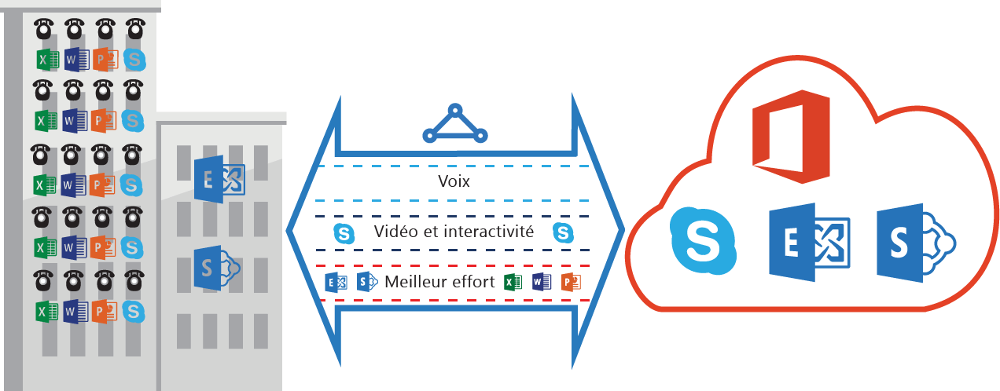

<properties
   pageTitle="Configuration requise de QoS pour ExpressRoute | Microsoft Azure"
   description="Cette page fournit des informations détaillées sur la configuration et la gestion de QoS pour des circuits ExpressRoute."
   documentationCenter="na"
   services="expressroute"
   authors="cherylmc"
   manager="carmonm"
   editor=""/>
<tags
   ms.service="expressroute"
   ms.devlang="na"
   ms.topic="get-started-article"
   ms.tgt_pltfrm="na"
   ms.workload="infrastructure-services"
   ms.date="04/18/2016"
   ms.author="cherylmc"/>

# Configuration requise pour ExpressRoute QoS

Skype Entreprise a différentes charges de travail nécessitant un traitement QoS différencié. Si vous envisagez d’utiliser des services vocaux via ExpressRoute, vous devez respecter les conditions requises décrites ci-dessous.

>[AZURE.NOTE] La configuration requise pour QoS ne s’applique qu’à l’homologation Microsoft.

Le tableau suivant fournit la liste des marquages DSCP utilisés par Skype Entreprise. Pour plus d’informations, voir [Gestion de QoS pour Skype Entreprise](https://technet.microsoft.com/library/gg405409.aspx).

| **Classe de trafic** | **Traitement (marquage DSCP)** | **Skype for Business Workloads** |
|---|---|---|
| **Voice** | EF (46) | Skype / Lync voice |
| **Interactive** | AF41 (34) | Vidéo |
| | AF21 (18) | Partage d’application | 
| | CS3 (24) | Signalisation SIP |
| **Par défaut** | AF11 (10) | Transfert de fichiers|
| | CS0 (0) | Tout autre élément| 

- Vous devez classer les charges de travail et marquer les valeurs DSCP appropriées. Suivez les instructions fournies [ici](https://technet.microsoft.com/library/gg405409.aspx) sur la définition des marquages DSCP dans votre réseau.

- Vous devez configurer et prendre en charge plusieurs files d’attente QoS au sein de votre réseau. La voix doit être une classe autonome et recevoir le traitement Entity Framework spécifié dans la norme RFC 3246.

- Vous pouvez choisir le mécanisme de mise en file d’attente, la stratégie de détection de congestion et l’allocation de bande passante par classe de trafic. Toutefois, le marquage DSCP pour Skype For Business Workloads doit être conservé. Si vous utilisez des marquages DSCP non répertoriés ci-dessus, par exemple AF31 (26), vous devez réécrire cette valeur DSCP 0 avant d’envoyer le paquet à Microsoft. Microsoft envoie uniquement les paquets marqués avec la valeur DSCP indiquée dans le tableau ci-dessus.

## Étapes suivantes

- Voir la configuration requise pour [Routage](expressroute-routing.md) et [NAT](expressroute-nat.md).
- Consultez les liens suivants pour configurer votre connexion ExpressRoute.

	- [Création d’un circuit ExpressRoute](expressroute-howto-circuit-classic.md)
	- [Configuration du routage](expressroute-howto-routing-classic.md)
	- [Liaison d’un réseau virtuel à un circuit ExpressRoute](expressroute-howto-linkvnet-classic.md)

<!---HONumber=AcomDC_0427_2016-->