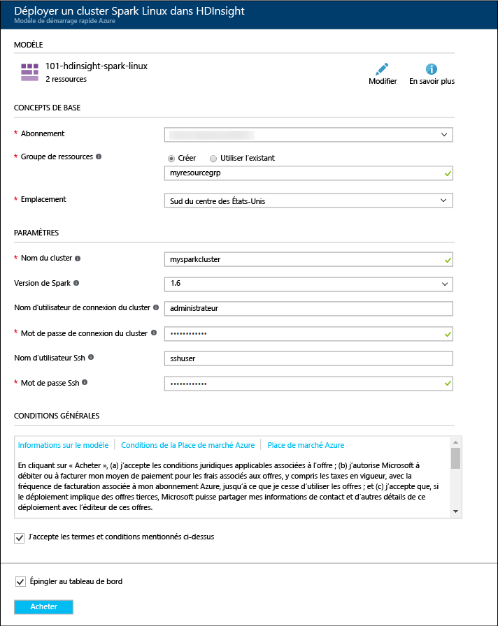
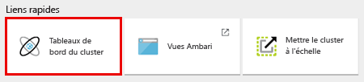

# Prise en main : Créer le cluster Apache Spark sur Azure HDInsight et exécuter des requêtes interactives à l’aide de Spark SQL

Découvrez comment créer un cluster [Apache Spark](hdinsight-apache-spark-overview.md) dans HDInsight, puis comment utiliser le bloc-notes [Jupyter](https://jupyter.org) pour exécuter des requêtes interactives Spark SQL sur le cluster Spark.

   

## Composants requis
* **Un abonnement Azure**. Avant de commencer ce didacticiel, vous devez disposer d’un abonnement Azure. Voir [Créez votre compte Azure gratuit](https://azure.microsoft.com/free).

## Créer un cluster Spark
Dans cette section, vous créez un cluster Spark dans HDInsight à l’aide d’un [modèle Azure Resource Manager](https://azure.microsoft.com/resources/templates/101-hdinsight-spark-linux/). Pour obtenir d’autres méthodes de création de cluster, consultez [Création de clusters HDInsight](hdinsight-hadoop-provision-linux-clusters.md).

1. Cliquez sur l’image suivante pour ouvrir le modèle dans le portail Azure.         

    

2. Saisissez les valeurs suivantes :

    

    * **Abonnement** : sélectionnez votre abonnement Azure pour ce cluster.
    * **Groupe de ressources** : créez un groupe de ressources ou sélectionnez un groupe existant. Le groupe de ressources est utilisé pour gérer des ressources Azure pour vos projets.
    * **Emplacement** : sélectionnez un emplacement pour le groupe de ressources.  Cet emplacement est également utilisé pour le stockage de cluster par défaut et le cluster HDInsight.
    * **ClusterName** : entrez un nom pour le cluster Hadoop que vous créez.
    * **Version de Spark** : sélectionnez la version de Spark que vous souhaitez installer sur le cluster.
    * **Nom d’utilisateur et mot de passe de cluster**: le nom de connexion par défaut est admin.
    * **Nom d’utilisateur et mot de passe SSH**.

   Notez ces valeurs.  Vous en aurez besoin plus loin dans le didacticiel.

3. Sélectionnez **J’accepte les termes et conditions mentionnés ci-dessus** et **Épingler au tableau de bord**, puis cliquez sur **Acheter**. Vous pouvez voir une nouvelle vignette intitulée Envoi du déploiement pour Déploiement de modèle. La création du cluster prend environ 20 minutes.

> [!NOTE]
> Cet article crée un cluster Spark qui utilise des [objets Blob Azure Storage en tant que cluster de stockage](hdinsight-hadoop-use-blob-storage.md). Vous pouvez également créer un cluster Spark qui utilise [Azure Data Lake Store](../data-lake-store/data-lake-store-overview.md) comme stockage supplémentaire, en plus des objets Blob Azure Storage utilisés en tant que stockage par défaut. Pour plus d’informations, voir [Créer un cluster HDInsight avec Data Lake Store](../data-lake-store/data-lake-store-hdinsight-hadoop-use-portal.md).
>
>

## Exécuter une requête Spark SQL

Dans cette section, vous allez utiliser un bloc-notes Jupyter pour exécuter des requêtes Spark SQL sur le cluster Spark. Les clusters HDInsight Spark fournissent trois noyaux que vous pouvez utiliser avec le bloc-notes Jupyter. Ces composants sont les suivants :

* **PySpark** (pour les applications écrites en Python)
* **PySpark3** (pour les applications écrites en Python3)
* **Spark** (pour les applications écrites en Scala)

Dans cet article, vous allez utiliser le noyau **PySpark**. Pour plus d’informations sur les noyaux, consultez [Noyaux de blocs-notes Jupyter avec les clusters Apache Spark dans HDInsight](hdinsight-apache-spark-jupyter-notebook-kernels.md). Les principaux avantages de l’utilisation du noyau PySpark sont les suivants :

* Les contextes pour Spark et Hive sont définis automatiquement.
* Utilisez des cell magics, notamment `%%sql`, pour exécuter directement les requêtes SQL ou Hive, sans aucun extrait de code précédent.
* Le résultat des requêtes SQL ou Hive est automatiquement affiché.

### Création d’un bloc-notes Jupyter avec un noyau PySpark

1. Ouvrez le [portail Azure](https://portal.azure.com/).

2. Si vous avez choisi d’épingler le cluster au tableau de bord, cliquez sur la mosaïque du cluster dans le tableau de bord pour lancer le panneau du cluster.

    Si vous n’avez pas épinglé le cluster au tableau de bord, dans le volet gauche, cliquez sur **Clusters HDInsight**, puis cliquez sur le cluster que vous avez créé.

3. À partir de **Liens rapides**, cliquez sur **Tableaux de bord de Cluster**, puis sur **Bloc-notes Jupyter**. Si vous y êtes invité, entrez les informations d’identification d’administrateur pour le cluster.

   

   > [!NOTE]
   > Vous pouvez également atteindre le bloc-notes Jupyter pour votre cluster en ouvrant l'URL suivante dans votre navigateur. Remplacez **CLUSTERNAME** par le nom de votre cluster.
   >
   > `https://CLUSTERNAME.azurehdinsight.net/jupyter`
   >
   >
3. Créez un bloc-notes. Cliquez sur **Nouveau**, puis sur **PySpark**.

   

   Un nouveau bloc-notes est créé et ouvert sous le nom Untitled(Untitled.pynb).

4. Cliquez sur le nom du bloc-notes en haut, puis entrez un nom convivial si vous le souhaitez.

    

5. Collez l’exemple de code suivant dans une cellule vide, puis appuyez sur **MAJ + ENTRÉE** pour exécuter le code. Le code importe les types requis pour ce scénario :

        from pyspark.sql.types import *

    Comme vous avez créé un bloc-notes à l’aide du noyau PySpark, il est inutile de créer des contextes explicitement. Les contextes Spark et Hive sont automatiquement créés pour vous lorsque vous exécutez la première cellule de code.

    

    À chaque exécution d’une tâche dans Jupyter, le titre de la fenêtre du navigateur web affiche l’état **(Occupé)** ainsi que le titre du bloc-notes. Un cercle plein s’affiche également en regard du texte **PySpark** dans le coin supérieur droit. Une fois le travail terminé, ce cercle est remplacé par un cercle vide.

6. Exécutez le code suivant pour inscrire un exemple de jeu de données comme table temporaire (**hvac**).

        # Load the data
        hvacText = sc.textFile("wasbs:///HdiSamples/HdiSamples/SensorSampleData/hvac/HVAC.csv")

        # Create the schema
        hvacSchema = StructType([StructField("date", StringType(), False),StructField("time", StringType(), False),StructField("targettemp", IntegerType(), False),StructField("actualtemp", IntegerType(), False),StructField("buildingID", StringType(), False)])

        # Parse the data in hvacText
        hvac = hvacText.map(lambda s: s.split(",")).filter(lambda s: s[0] != "Date").map(lambda s:(str(s[0]), str(s[1]), int(s[2]), int(s[3]), str(s[6]) ))

        # Create a data frame
        hvacdf = sqlContext.createDataFrame(hvac,hvacSchema)

        # Register the data frame as a table to run queries against
        hvacdf.registerTempTable("hvac")

    Les clusters Spark dans HDInsight sont fournis avec un exemple de fichier de données, **hvac.csv**, sous **\HdiSamples\HdiSamples\SensorSampleData\hvac**.

7. Exécutez le code suivant pour interroger les données.

        %%sql
        SELECT buildingID, (targettemp - actualtemp) AS temp_diff, date FROM hvac WHERE date = \"6/1/13\"

   Étant donné que vous utilisez un noyau PySpark, vous pouvez maintenant exécuter directement une requête SQL sur la table temporaire **hvac** que vous avez créée à l’aide de la méthode magique `%%sql`. Pour plus d’informations sur la méthode magique `%%sql` et d’autres méthodes magiques disponibles avec le noyau PySpark, consultez [Noyaux disponibles sur les blocs-notes Jupyter avec clusters Spark HDInsight](hdinsight-apache-spark-jupyter-notebook-kernels.md#parameters-supported-with-the-sql-magic).

   La sortie sous forme de tableau suivante s’affiche par défaut.

     

    Vous pouvez également voir les résultats dans d’autres visualisations. Par exemple, un graphique en aires pour le même résultat se présenterait comme suit.

    

9. Arrêtez le bloc-notes pour libérer les ressources du cluster une fois l’exécution de l’application terminée. Pour ce faire, dans le menu **Fichier** du bloc-notes, cliquez sur **Fermer et arrêter**.

## Résolution des problèmes

Voici quelques problèmes courants que vous pouvez rencontrer lorsque vous utilisez les clusters HDInsight.

### Exigences de contrôle d’accès
Si vous rencontrez un problème lors de la création de clusters HDInsight, reportez-vous aux [exigences de contrôle d’accès](hdinsight-administer-use-portal-linux.md#create-clusters).

## Suppression du cluster
[!INCLUDE [delete-cluster-warning](../../includes/hdinsight-delete-cluster-warning.md)]

## Voir aussi
* [Vue d’ensemble : Apache Spark sur Azure HDInsight](hdinsight-apache-spark-overview.md)

### Scénarios
* [Spark avec BI : effectuez une analyse interactive des données à l’aide de Spark dans HDInsight avec des outils BI](hdinsight-apache-spark-use-bi-tools.md)
* [Spark avec Machine Learning : Utiliser Spark dans HDInsight pour l’analyse de la température de bâtiments à l’aide de données HVAC](hdinsight-apache-spark-ipython-notebook-machine-learning.md)
* [Spark avec Machine Learning : Utiliser Spark dans HDInsight pour prédire les résultats de l’inspection des aliments](hdinsight-apache-spark-machine-learning-mllib-ipython.md)
* [Streaming Spark : Utiliser Spark dans HDInsight pour créer des applications de diffusion en continu en temps réel](hdinsight-apache-spark-eventhub-streaming.md)
* [Analyse des journaux de site web à l’aide de Spark dans HDInsight](hdinsight-apache-spark-custom-library-website-log-analysis.md)
* [Application Insight telemetry data analysis using Spark in HDInsight (Analyse des données de télémétrie Application Insight à l’aide de Spark dans HDInsight)](hdinsight-spark-analyze-application-insight-logs.md)

### Créer et exécuter des applications
* [Créer une application autonome avec Scala](hdinsight-apache-spark-create-standalone-application.md)
* [Exécuter des tâches à distance avec Livy sur un cluster Spark](hdinsight-apache-spark-livy-rest-interface.md)

### Outils et extensions
* [Utilisation du plugin d’outils HDInsight pour IntelliJ IDEA pour créer et soumettre des applications Spark Scala](hdinsight-apache-spark-intellij-tool-plugin.md)
* [Use HDInsight Tools Plugin for IntelliJ IDEA to debug Spark applications remotely) (Utiliser le plug-in Outils HDInsight pour IntelliJ IDEA pour déboguer des applications Spark à distance)](hdinsight-apache-spark-intellij-tool-plugin-debug-jobs-remotely.md)
* [Utiliser des bloc-notes Zeppelin avec un cluster Spark sur HDInsight](hdinsight-apache-spark-use-zeppelin-notebook.md)
* [Noyaux disponibles pour le bloc-notes Jupyter dans un cluster Spark pour HDInsight](hdinsight-apache-spark-jupyter-notebook-kernels.md)
* [Utiliser des packages externes avec les blocs-notes Jupyter](hdinsight-apache-spark-jupyter-notebook-use-external-packages.md)
* [Install Jupyter on your computer and connect to an HDInsight Spark cluster (Installer Jupyter sur un ordinateur et se connecter au cluster Spark sur HDInsight)](hdinsight-apache-spark-jupyter-notebook-install-locally.md)

### Gestion des ressources
* [Gérer les ressources du cluster Apache Spark dans Azure HDInsight](hdinsight-apache-spark-resource-manager.md)
* [Track and debug jobs running on an Apache Spark cluster in HDInsight (Suivi et débogage des tâches en cours d’exécution sur un cluster Apache Spark dans HDInsight)](hdinsight-apache-spark-job-debugging.md)

[hdinsight-versions]: hdinsight-component-versioning.md
[hdinsight-upload-data]: hdinsight-upload-data.md
[hdinsight-storage]: hdinsight-hadoop-use-blob-storage.md

[azure-purchase-options]: http://azure.microsoft.com/pricing/purchase-options/
[azure-member-offers]: http://azure.microsoft.com/pricing/member-offers/
[azure-free-trial]: http://azure.microsoft.com/pricing/free-trial/
[azure-management-portal]: https://manage.windowsazure.com/
[azure-create-storageaccount]: storage-create-storage-account.md

