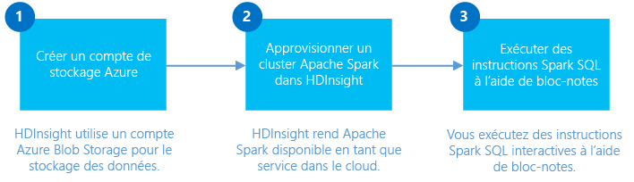

# Prise en main : créer un cluster Apache Spark sur Azure HDInsight Linux et exécuter des requêtes interactives à l’aide de Spark SQL
Découvrez comment créer un cluster Apache Spark dans HDInsight, puis comment utiliser le bloc-notes [Jupyter](https://jupyter.org) pour exécuter des requêtes interactives Spark SQL sur le cluster Spark.

   

[!INCLUDE [delete-cluster-warning](../../includes/hdinsight-delete-cluster-warning.md)]

## Configuration requise
* **Un abonnement Azure**. Avant de commencer ce didacticiel, vous devez disposer d’un abonnement Azure. Consultez la page [Obtention d’un essai gratuit d’Azure](https://azure.microsoft.com/documentation/videos/get-azure-free-trial-for-testing-hadoop-in-hdinsight/).
* **Un client SSH (Secure Shell)** : les systèmes Linux, Unix et OS X fournissent un client SSH par le biais de la commande `ssh`. Pour les systèmes Windows, nous vous recommandons [PuTTY](http://www.chiark.greenend.org.uk/~sgtatham/putty/download.html).
* **Clés SSH (Secure Shell) (facultatif)** : vous pouvez sécuriser le compte SSH utilisé pour la connexion au cluster à l’aide d’un mot de passe ou d’une clé publique. Avec un mot de passe, vous êtes rapidement opérationnel. Utilisez cette option pour pouvoir rapidement créer un cluster et exécuter certaines tâches de test. L’utilisation d’une clé est une méthode plus sécurisée, mais qui demande une installation supplémentaire. Elle convient dans le cadre de la création d’un cluster de production. Dans cet article, nous utilisons la méthode du mot de passe. Pour savoir comment créer et utiliser des clés SSH avec HDInsight, consultez les articles suivants :
  
  * Depuis un ordinateur Linux : [Utilisation de HDInsight Linux (Hadoop) depuis Linux, Unix ou OS X](hdinsight-hadoop-linux-use-ssh-unix.md)
  * Depuis un ordinateur Windows : [Utilisation de SSH avec HDInsight Linux (Hadoop) depuis Windows](hdinsight-hadoop-linux-use-ssh-windows.md)

> [!NOTE]
> Cet article utilise un modèle Azure Resource Manager pour créer un cluster Spark qui utilise le [Stockage Blob Azure en tant que cluster de stockage](hdinsight-hadoop-use-blob-storage.md). Vous pouvez également créer un cluster Spark qui utilise [Azure Data Lake Store](../data-lake-store/data-lake-store-overview.md) comme stockage supplémentaire, en plus des objets Blob Azure Storage utilisés en tant que stockage par défaut. Pour plus d’informations, voir [Créer un cluster HDInsight avec Data Lake Store](../data-lake-store/data-lake-store-hdinsight-hadoop-use-portal.md).
> 
> 

### Exigences de contrôle d’accès
[!INCLUDE [access-control](../../includes/hdinsight-access-control-requirements.md)]

## Création d’un cluster Spark
Dans cette section, vous allez créer un cluster HDInsight version 3.4 (Spark version 1.6.1) à l’aide d’un modèle Azure Resource Manager. Pour en savoir plus sur les différentes versions de HDInsight et leurs contrats SLA, consultez la page [Contrôle de version des composants HDInsight](hdinsight-component-versioning.md). Pour obtenir d’autres méthodes de création de cluster, consultez [Création de clusters HDInsight](hdinsight-hadoop-provision-linux-clusters.md).

1. Cliquez sur l’image suivante pour ouvrir le modèle dans le portail Azure.         
   
    
   
    Le modèle se trouve dans un conteneur d’objets blob public, disponible à l’adresse *https://hditutorialdata.blob.core.windows.net/armtemplates/create-linux-based-spark-cluster-in-hdinsight.json*. 
2. À partir du panneau Paramètres, saisissez les informations suivantes :
   
   * **ClusterName**: entrez un nom pour le cluster Hadoop que vous allez créer.
   * **Nom d’utilisateur et mot de passe de cluster**: le nom de connexion par défaut est admin.
   * **Nom d’utilisateur et mot de passe SSH**.
     
     Veuillez noter ces valeurs.  Vous en aurez besoin plus loin dans le didacticiel.
     
     > [!NOTE]
     > SSH permet d’accéder à distance au cluster HDInsight à l’aide d’une ligne de commande. Le nom d’utilisateur et le mot de passe que vous employez ici sont utilisés pour la connexion au cluster via SSH. Par ailleurs, le nom d’utilisateur SSH doit être unique, car il crée un compte d’utilisateur sur tous les nœuds du cluster HDInsight. Voici quelques-uns des noms de compte dont l’usage est réservé aux services sur le cluster et qui ne peuvent pas être utilisés en tant que nom d’utilisateur SSH :
     > 
     > root, hdiuser, storm, hbase, ubuntu, zookeeper, hdfs, yarn, mapred, hbase, hive, oozie, falcon, sqoop, admin, tez, hcat, hdinsight-zookeeper.
     > 
     > Pour plus d'informations sur l'utilisation de SSH avec HDInsight, consultez l'un des articles suivants :
     > 
     > * [Utilisation de SSH avec Hadoop Linux sur HDInsight à partir de Linux, Unix ou OS X](hdinsight-hadoop-linux-use-ssh-unix.md)
     > * [Utilisation de SSH avec Hadoop Linux sur HDInsight à partir de Windows](hdinsight-hadoop-linux-use-ssh-windows.md)
     > 
     > 

3.Cliquez sur **OK** pour enregistrer les paramètres.

4.Dans le panneau **Déploiement personnalisé**, cliquez sur la zone de liste déroulante **Groupe de ressources**, puis cliquez sur **Nouveau** pour créer un nouveau groupe de ressources. Le groupe de ressources est un conteneur qui regroupe le cluster, le compte de stockage dépendant et une autre ressource liée.

5.Cliquez sur **Conditions juridiques**, puis cliquez sur **Créer**.

6.Cliquez sur **Créer**. Vous verrez une nouvelle vignette intitulée Envoi du déploiement pour Déploiement de modèle. La création du cluster et de la base de données SQL prend environ 20 minutes.

## Exécuter des requêtes Spark SQL à l’aide d’un bloc-notes Jupyter
Dans cette section, vous allez utiliser un bloc-notes Jupyter pour exécuter des requêtes Spark SQL sur le cluster Spark. Les clusters HDInsight Spark fournissent deux noyaux que vous pouvez utiliser avec le bloc-notes Jupyter. Ces étapes sont les suivantes :

* **PySpark** (pour les applications écrites en Python)
* **Spark** (pour les applications écrites en Scala)

Dans cet article, vous allez utiliser le noyau PySpark. L’article [Noyaux disponibles sur les ordinateurs portables Jupyter avec clusters Spark HDInsight](hdinsight-apache-spark-jupyter-notebook-kernels.md#why-should-i-use-the-new-kernels) présente en détail les avantages de l’utilisation du noyau PySpark. Cependant, voici deux principaux avantages de l’utilisation du noyau PySpark :

* Il est inutile de définir les contextes pour Spark et Hive. Ils sont automatiquement définis pour vous.
* Vous pouvez utiliser des cell magics, notamment `%%sql`, pour exécuter directement vos requêtes SQL ou Hive, sans aucun extrait de code précédent.
* Le résultat des requêtes SQL ou Hive est automatiquement affiché.

### Création d’un bloc-notes Jupyter avec un noyau PySpark
1. Dans le tableau d’accueil du [portail Azure](https://portal.azure.com/), cliquez sur la vignette de votre cluster Spark (si vous l’avez épinglé au tableau d’accueil). Vous pouvez également accéder à votre cluster sous **Parcourir tout** > **Clusters HDInsight**.   
2. Dans le panneau du cluster Spark, cliquez sur **Tableau de bord du cluster**, puis sur **Bloc-notes Jupyter**. Si vous y êtes invité, entrez les informations d’identification d’administrateur pour le cluster.
   
   > [!NOTE]
   > Vous pouvez également atteindre le bloc-notes Jupyter pour votre cluster en ouvrant l'URL suivante dans votre navigateur. Remplacez **CLUSTERNAME** par le nom de votre cluster :
   > 
   > `https://CLUSTERNAME.azurehdinsight.net/jupyter`
   > 
   > 
3. Créer un nouveau bloc-notes. Cliquez sur **Nouveau**, puis sur **PySpark**.
   
    
4. Un nouveau bloc-notes est créé et ouvert sous le nom Untitled.pynb. Cliquez sur le nom du bloc-notes en haut, puis entrez un nom convivial.
   
    
5. Comme vous avez créé un bloc-notes à l’aide du noyau PySpark, il est inutile de créer des contextes explicitement. Les contextes Spark et Hive sont automatiquement créés pour vous lorsque vous exécutez la première cellule de code. Vous pouvez commencer par importer les types requis pour ce scénario. Pour cela, collez l’extrait de code suivant dans une cellule vide, puis appuyez sur **MAJ + ENTRÉE**.
   
        from pyspark.sql.types import *
   
    À chaque exécution d’une tâche dans Jupyter, le titre de la fenêtre du navigateur web affiche l’état **(Occupé)** ainsi que le titre du bloc-notes. Un cercle plein s’affiche également en regard du texte **PySpark** dans le coin supérieur droit. Une fois le travail terminé, ce cercle est remplacé par un cercle vide.
   
     
6. Chargez un exemple de données dans une table temporaire. Lorsque vous créez un cluster Spark dans HDInsight, l’exemple de fichier de données **hvac.csv** est copié vers le compte de stockage associé dans **\HdiSamples\HdiSamples\SensorSampleData\hvac**.
   
    Dans une cellule vide, collez l’exemple de code suivant puis appuyez sur **MAJ + ENTRÉE**. Cet exemple de code enregistre les données dans une table temporaire appelée **hvac**.
   
        # Load the data
        hvacText = sc.textFile("wasbs:///HdiSamples/HdiSamples/SensorSampleData/hvac/HVAC.csv")
   
        # Create the schema
        hvacSchema = StructType([StructField("date", StringType(), False),StructField("time", StringType(), False),StructField("targettemp", IntegerType(), False),StructField("actualtemp", IntegerType(), False),StructField("buildingID", StringType(), False)])
   
        # Parse the data in hvacText
        hvac = hvacText.map(lambda s: s.split(",")).filter(lambda s: s[0] != "Date").map(lambda s:(str(s[0]), str(s[1]), int(s[2]), int(s[3]), str(s[6]) ))
   
        # Create a data frame
        hvacdf = sqlContext.createDataFrame(hvac,hvacSchema)
   
        # Register the data fram as a table to run queries against
        hvacdf.registerTempTable("hvac")
7. Étant donné que vous utilisez un noyau PySpark, vous pouvez maintenant exécuter directement une requête SQL sur la table temporaire **hvac** que vous venez de créer à l’aide de la méthode magique `%%sql`. Pour plus d’informations sur la méthode magique `%%sql` , ainsi que les autres méthodes magiques disponibles avec le noyau PySpark, consultez [Noyaux disponibles sur les blocs-notes Jupyter avec clusters Spark HDInsight](hdinsight-apache-spark-jupyter-notebook-kernels.md#why-should-i-use-the-new-kernels).
   
        %%sql
        SELECT buildingID, (targettemp - actualtemp) AS temp_diff, date FROM hvac WHERE date = \"6/1/13\"
8. Une fois le travail terminé, le résultat tabulaire suivant s’affiche par défaut.
   
     
   
    Vous pouvez également voir les résultats dans d’autres visualisations. Par exemple, un graphique en aires pour le même résultat se présenterait comme suit.
   
    
9. Une fois l’exécution de l’application terminée, arrêtez le bloc-notes pour libérer les ressources. Pour ce faire, dans le menu **Fichier** du bloc-notes, cliquez sur **Fermer et arrêter**. Cette opération permet d’arrêter et de fermer le bloc-notes.

## Suppression du cluster
[!INCLUDE [delete-cluster-warning](../../includes/hdinsight-delete-cluster-warning.md)]

## Voir aussi
* [Vue d’ensemble : Apache Spark sur Azure HDInsight](hdinsight-apache-spark-overview.md)

### Scénarios
* [Spark avec BI : effectuez une analyse interactive des données à l’aide de Spark dans HDInsight avec des outils BI](hdinsight-apache-spark-use-bi-tools.md)
* [Spark avec Machine Learning : Utiliser Spark dans HDInsight pour l’analyse de la température de bâtiments à l’aide de données HVAC](hdinsight-apache-spark-ipython-notebook-machine-learning.md)
* [Spark avec Machine Learning : Utiliser Spark dans HDInsight pour prédire les résultats de l’inspection des aliments](hdinsight-apache-spark-machine-learning-mllib-ipython.md)
* [Streaming Spark : Utiliser Spark dans HDInsight pour créer des applications de diffusion en continu en temps réel](hdinsight-apache-spark-eventhub-streaming.md)
* [Analyse des journaux de site web à l’aide de Spark dans HDInsight](hdinsight-apache-spark-custom-library-website-log-analysis.md)
* [Application Insight telemetry data analysis using Spark in HDInsight (Analyse des données de télémétrie Application Insight à l’aide de Spark dans HDInsight)](hdinsight-spark-analyze-application-insight-logs.md)

### Créer et exécuter des applications
* [Créer une application autonome avec Scala](hdinsight-apache-spark-create-standalone-application.md)
* [Exécuter des tâches à distance avec Livy sur un cluster Spark](hdinsight-apache-spark-livy-rest-interface.md)

### Outils et extensions
* [Utilisez le plugin d’outils HDInsight pour IntelliJ IDEA pour créer et soumettre des applications Spark Scala](hdinsight-apache-spark-intellij-tool-plugin.md)
* [Use HDInsight Tools Plugin for IntelliJ IDEA to debug Spark applications remotely) (Utiliser le plug-in Outils HDInsight pour IntelliJ IDEA pour déboguer des applications Spark à distance)](hdinsight-apache-spark-intellij-tool-plugin-debug-jobs-remotely.md)
* [Utiliser des bloc-notes Zeppelin avec un cluster Spark sur HDInsight](hdinsight-apache-spark-use-zeppelin-notebook.md)
* [Noyaux disponibles pour le bloc-notes Jupyter dans un cluster Spark pour HDInsight](hdinsight-apache-spark-jupyter-notebook-kernels.md)
* [Utiliser des packages externes avec les blocs-notes Jupyter](hdinsight-apache-spark-jupyter-notebook-use-external-packages.md)
* [Install Jupyter on your computer and connect to an HDInsight Spark cluster (Installer Jupyter sur un ordinateur et se connecter au cluster Spark sur HDInsight)](hdinsight-apache-spark-jupyter-notebook-install-locally.md)

### Gestion des ressources
* [Gérer les ressources du cluster Apache Spark dans Azure HDInsight](hdinsight-apache-spark-resource-manager.md)
* [Track and debug jobs running on an Apache Spark cluster in HDInsight (Suivi et débogage des tâches en cours d’exécution sur un cluster Apache Spark dans HDInsight)](hdinsight-apache-spark-job-debugging.md)

[hdinsight-versions]: hdinsight-component-versioning.md
[hdinsight-upload-data]: hdinsight-upload-data.md
[hdinsight-storage]: hdinsight-hadoop-use-blob-storage.md

[azure-purchase-options]: http://azure.microsoft.com/pricing/purchase-options/
[azure-member-offers]: http://azure.microsoft.com/pricing/member-offers/
[azure-free-trial]: http://azure.microsoft.com/pricing/free-trial/
[azure-management-portal]: https://manage.windowsazure.com/
[azure-create-storageaccount]: storage-create-storage-account.md

<!--HONumber=Nov16_HO2-->

