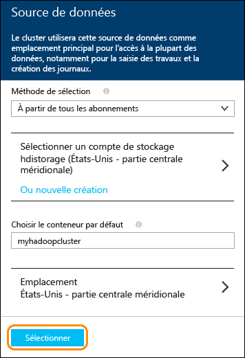

<properties 
	pageTitle="Approvisionner un cluster Spark sur HDInsight et utiliser Spark SQL à partir de Zeppelin et Jupyter pour effectuer une analyse interactive | Microsoft Azure"
	description="Des instructions pas à pas expliquent comment approvisionner rapidement un cluster Apache Spark dans HDInsight, puis comment utiliser Spark SQL à partir des blocs-notes Zeppelin et Jupyter pour exécuter des requêtes interactives."
	services="hdinsight"
	documentationCenter=""
	authors="nitinme"
	manager="paulettm"
	editor="cgronlun"
	tags="azure-portal"/>

<tags 
	ms.service="hdinsight"
	ms.workload="big-data"
	ms.tgt_pltfrm="na"
	ms.devlang="na"
	ms.topic="article"
	ms.date="08/07/2015"
	ms.author="nitinme"/>

# Démarrage rapide : Approvisionner Apache Spark sur HDInsight et exécuter des requêtes interactives à l’aide de Spark SQL

[AZURE.INCLUDE [version-préliminaire-portail-hdinsight-azure](../../includes/hdinsight-azure-preview-portal.md)]

* [Configuration d'Apache Spark sur HDInsight et exécution de requêtes interactives à l'aide de Spark SQL](hdinsight-apache-spark-zeppelin-notebook-jupyter-spark-sql-v1.md)

Découvrez comment approvisionner un cluster Apache Spark dans HDInsight à l'aide de l'option Création rapide, puis comment utiliser les blocs-notes [Zeppelin](https://zeppelin.incubator.apache.org) et [Jupyter](https://jupyter.org) basés sur le web pour exécuter des requêtes interactives Spark SQL sur le cluster Spark.

   

**Configuration requise :**

Avant de commencer ce didacticiel, vous devez disposer d’un abonnement Azure. Consultez [Obtenir une version d'évaluation gratuite d'Azure](http://azure.microsoft.com/documentation/videos/get-azure-free-trial-for-testing-hadoop-in-hdinsight/).

##Approvisionner un cluster HDInsight Spark

Dans cette section, vous allez approvisionner un cluster HDInsight version 3.2, qui est basé sur la version 1.3.1 de Spark. Pour en savoir plus sur les différentes versions de HDInsight et leurs contrats SLA, consultez la page [Contrôle de version des composants HDInsight](hdinsight-component-versioning.md).

>[AZURE.NOTE]Les étapes décrites dans cet article permettent de créer un cluster Apache Spark dans HDInsight à l’aide des paramètres de configuration de base. Pour plus d'informations sur les autres paramètres de configuration de cluster (comme l'utilisation d'un espace de stockage supplémentaire, d'un réseau virtuel Azure ou d'un metastore pour Hive), consultez [Approvisionner des clusters HDInsight à l'aide d'options personnalisées](hdinsight-apache-spark-provision-clusters.md).

**Pour approvisionner un cluster Spark**

1. Connectez-vous à la [version préliminaire du portail Azure](https://ms.portal.azure.com/). 

2. Cliquez sur **NOUVEAU**, sur **Analyse de données**, puis sur **HDInsight**.

    

3. Saisissez un **Nom de cluster**, sélectionnez **Hadoop** comme **Type de cluster**, et à partir du menu déroulant **Système d'exploitation du cluster**, sélectionnez **Windows Server 2012 R2 Datacenter**. Une coche verte apparaît en regard du nom de cluster s'il est disponible.

	

4. Si vous avez plusieurs abonnements, cliquez sur l'entrée **Abonnement** pour sélectionner l'abonnement Azure qui sera utilisé pour le cluster.

5. Cliquez sur **Groupe de ressources** pour afficher une liste des groupes de ressources existants, puis sélectionnez celui dans lequel créer le cluster. Vous pouvez également cliquer sur **Créer un nouveau**, puis saisir le nom du nouveau groupe de ressources. Une coche verte s'affiche pour indiquer si le nouveau nom de groupe est disponible.

	> [AZURE.NOTE]Cette entrée ira par défaut dans l'un des groupes de ressources existants, si l'un d'eux est disponible.

6. Cliquez sur **Informations d'identification**, puis saisissez un **nom de connexion de cluster** et un **mot de passe de connexion au cluster**. Si vous souhaitez activer le Bureau à distance sur le nœud de cluster, cliquez sur l‘option **Oui** pour **Activer le Bureau à distance**, puis spécifiez les valeurs requises. Le présent didacticiel ne nécessite pas de bureau à distance, et vous pouvez donc ignorer cette étape. Cliquez sur **Sélectionner** au bas de l'écran pour enregistrer la configuration des informations d'identification.

	

7. Cliquez sur **Source de données** pour choisir une source de données existante pour le cluster ou en créer une. Lors de l'approvisionnement d'un cluster Hadoop dans HDInsight, vous spécifiez un compte Azure Storage. Un conteneur de stockage d'objets blob spécifique de ce compte est désigné en tant que système de fichiers par défaut, comme dans un système de fichiers distribués Hadoop (HDFS). Par défaut, le cluster HDInsight est approvisionné dans le même centre de données que le compte de stockage que vous spécifiez. Pour plus d'informations, consultez [Utilisation du stockage d'objets blob Azure avec HDInsight][hdinsight-storage].

	

	Actuellement, vous pouvez sélectionner un compte de stockage Azure comme source de données pour un cluster HDInsight. Lisez ce qui suit pour comprendre les entrées du panneau **Source de données**.

	- **Méthode de sélection** : définissez cette propriété sur la valeur **De tous les abonnements** pour permettre l'exploration des comptes de stockage de tous vos abonnements. Affectez-lui la valeur **Clé d'accès** si vous souhaitez saisir le **nom de stockage** et la **clé d'accès** d'un compte de stockage existant.

	- **Sélectionner le compte de stockage/Créer un compte** : cliquez sur **Sélectionner le compte de stockage** pour parcourir et sélectionner un compte de stockage existant à associer au cluster. Vous pouvez également cliquer sur **Créer** pour créer un nouveau compte de stockage. Utilisez le champ qui s'affiche pour saisir le nom du compte de stockage. Une coche verte s'affiche si le nom est disponible.

	- **Choisir le conteneur par défaut** : utilisez cette option pour saisir le nom du conteneur par défaut à utiliser pour le cluster. Vous pouvez saisir ensuite n'importe quel nom, mais nous vous conseillons d'utiliser le même nom que celui du cluster pour que vous puissiez facilement reconnaître le conteneur utilisé pour ce cluster spécifique.

	- **Emplacement** : zone géographique dans laquelle le compte de stockage se trouve ou dans laquelle il sera créé.

		> [AZURE.IMPORTANT]La sélection de l'emplacement de la source de données par défaut définit également l'emplacement du cluster HDInsight. Le cluster et la source de données par défaut doivent se trouver dans la même région.
	
	Cliquez sur **Sélectionner** pour enregistrer la configuration de la source de données.

8. Cliquez sur **Niveaux de tarification du nœud** pour afficher des informations sur les nœuds qui seront créés pour ce cluster. Définissez le nombre de nœuds Worker dont vous avez besoin pour le cluster. Le coût estimé du cluster s'affiche dans le panneau.

	

	Cliquez sur **Sélectionner** pour enregistrer la configuration de tarification du nœud.

9. Dans le panneau **Nouveau cluster HDInsight**, assurez-vous que l'option **Épingler au tableau d'accueil** est sélectionnée, puis cliquez sur **Créer**. Le cluster est créé et la vignette correspondante ajoutée au tableau d'accueil de votre portail Azure. L'icône indique que le cluster est en cours de configuration et sera modifiée pour représenter l'icône HDInsight une fois la configuration terminée.

	| Pendant l’approvisionnement | Approvisionnement terminé |
	| ------------------ | --------------------- |
	|  |  |

	> [AZURE.NOTE]La création du cluster prend un certain temps (en règle générale, environ 15 minutes). Utilisez la vignette du tableau d'accueil, ou l'entrée **Notifications** à gauche de la page pour vérifier le processus de d'approvisionnement.

10. Une fois l'approvisionnement terminé, cliquez sur la vignette du cluster Spark dans le tableau d'accueil pour lancer le panneau du cluster.

##Exécuter des requêtes Spark SQL interactives à l'aide d'un bloc-notes Zeppelin

Après avoir approvisionné un cluster, vous pouvez utiliser un bloc-notes Zeppelin basé sur le web pour exécuter des requêtes Spark SQL interactives sur le cluster HDInsight Spark. Dans cette section, nous allons utiliser un fichier exemple de données (hvac.csv), qui est disponible par défaut sur le cluster pour exécuter des requêtes Spark SQL interactives.

>[AZURE.NOTE]Le bloc-notes que vous créez en suivant les instructions ci-dessous est également disponible par défaut sur le cluster. Une fois Zeppelin lancé, vous trouverez le bloc-notes en lançant une recherche sur le nom **Zeppelin HVAC tutorial**.

1. Lancez le bloc-notes Zeppelin. Dans le panneau du cluster Spark, cliquez sur **Liens rapides**, puis dans le panneau **Tableau de bord du cluster**, cliquez sur **Bloc-notes Zeppelin**. Lorsque vous y êtes invité, entrez les informations d’identification d’administrateur pour le cluster. Pour lancer le bloc-notes, suivez les instructions indiquées dans la page qui s’ouvre.

2. Créez un bloc-notes. Dans le volet d'en-tête, cliquez sur **Bloc-notes**, puis sur **Créer une note**.

	

	Dans la même page, sous le titre **Bloc-notes**, un nouveau bloc-notes dont le nom commence par **Note XXXXXXXXX** doit s'afficher. Cliquez sur le nouveau bloc-notes.

3. Sur la page web du nouveau bloc-notes, cliquez sur l'en-tête et modifiez le nom du bloc-notes si vous le souhaitez. Appuyez sur ENTRÉE pour enregistrer la modification de nom. Vérifiez également que l'en-tête du bloc-notes indique l'état **Connected** dans le coin supérieur droit.

	

4. Chargez un exemple de données dans une table temporaire. Lorsque vous approvisionnez un cluster Spark dans HDInsight, le fichier exemple de données, **hvac.csv**, est copié vers le compte de stockage associé dans **\\HdiSamples\\SensorSampleData\\hvac**.

	Collez l’extrait suivant dans le paragraphe vide créé par défaut dans le nouveau bloc-notes.

		// Create an RDD using the default Spark context, sc
		val hvacText = sc.textFile("wasb:///HdiSamples/SensorSampleData/hvac/HVAC.csv")
		
		// Define a schema
		case class Hvac(date: String, time: String, targettemp: Integer, actualtemp: Integer, buildingID: String)
		
		// Map the values in the .csv file to the schema
		val hvac = hvacText.map(s => s.split(",")).filter(s => s(0) != "Date").map(
    		s => Hvac(s(0), 
            		s(1),
            		s(2).toInt,
            		s(3).toInt,
            		s(6)
        	)
		).toDF()
		
		// Register as a temporary table called "hvac"
		hvac.registerTempTable("hvac")
		
	Appuyez sur **MAJ + ENTRÉE** ou cliquez sur le bouton **Play** pour que le paragraphe exécute l'extrait. L’état indiqué dans le coin supérieur droit du paragraphe doit progresser de READY, PENDING, RUNNING à FINISHED. Le résultat s’affiche au bas du même paragraphe. La capture d’écran ressemble à ceci :

	

	Vous pouvez également indiquer un titre pour chaque paragraphe. Dans le coin droit, cliquez sur l'icône **Settings**, puis sur **Show title**.

5. Vous pouvez maintenant exécuter des instructions Spark SQL dans la table **hvac**. Collez la requête suivante dans un nouveau paragraphe. La requête récupère l’ID de bâtiment et la différence entre les températures cibles et réelles pour chaque bâtiment à une date donnée. Appuyez sur **MAJ + ENTRÉE**.

		%sql
		select buildingID, (targettemp - actualtemp) as temp_diff, date 
		from hvac
		where date = "6/1/13" 

	L'instruction **%sql** du début indique au bloc-notes d'utiliser l'interpréteur Spark SQL. Vous pouvez consulter les interpréteurs définis dans l'onglet **Interpreter** dans l'en-tête du bloc-notes.

	La capture d’écran qui suit présente le résultat.

	

	 Cliquez sur les options d’affichage (mis en exergue dans un rectangle) pour basculer entre les différentes représentations du même résultat. Cliquez sur **Settings** pour choisir ce qui constitue la clé et les valeurs dans le résultat. La capture d'écran ci-dessus utilise la clé **buildingID** et la moyenne **temp\_diff** comme valeur.

	
6. Vous pouvez également exécuter des instructions Spark SQL à l’aide de variables dans la requête. L'extrait suivant montre comment définir la variable **Temp** dans la requête avec les valeurs possibles d'interrogation. Lors de la première exécution de la requête, une liste déroulante est automatiquement renseignée avec les valeurs que vous avez spécifiées pour la variable.

		%sql
		select buildingID, date, targettemp, (targettemp - actualtemp) as temp_diff
		from hvac
		where targettemp > "${Temp = 65,65|75|85}" 

	Collez cet extrait dans un nouveau paragraphe, puis appuyez sur **MAJ + ENTRÉE**. La capture d’écran qui suit présente le résultat.

	

	Pour les requêtes suivantes, vous pouvez sélectionner une nouvelle valeur dans la liste déroulante et réexécuter la requête. Cliquez sur **Settings** pour choisir ce qui constitue la clé et les valeurs dans le résultat. La capture d'écran ci-dessus utilise la clé **buildingID**, la moyenne **temp\_diff** comme valeur, et le groupe **targettemp**.

7. Redémarrez l’interpréteur Spark SQL pour quitter l’application. Cliquez sur l'onglet **Interpreter** en haut de l'écran et, pour l'interpréteur Spark, cliquez sur **Restart**.

	

##Exécuter des requêtes Spark SQL à l'aide d'un bloc-notes Jupyter

Dans cette section, vous allez utiliser un bloc-notes Jupyter pour exécuter des requêtes Spark SQL sur un cluster Spark.

>[AZURE.NOTE]Le bloc-notes que vous créez en suivant les instructions ci-dessous est également disponible par défaut sur le cluster. Une fois Jupyter lancé, vous trouverez le bloc-notes en lançant une recherche sur **HVACTutorial.ipynb**.

1. Lancez le bloc-notes Jupyter. Dans le panneau du cluster Spark, cliquez sur **Liens rapides**, puis dans le panneau **Tableau de bord du cluster**, cliquez sur **Bloc-notes Jupyter**. Lorsque vous y êtes invité, entrez les informations d’identification d’administrateur pour le cluster Spark.

2. Créez un bloc-notes. Cliquez sur **Nouveau**, puis sur **Python 2**.

	

3. Un nouveau bloc-notes est créé et ouvert sous le nom Untitled.pynb. Cliquez sur le nom du bloc-notes en haut, puis entrez un nom convivial.

	

4. Importez les modules requis et créez les contextes Spark et SQL. Collez l'extrait suivant dans une cellule vide, puis appuyez sur **MAJ + ENTRÉE**.

		from pyspark import SparkContext
		from pyspark.sql import SQLContext
		from pyspark.sql.types import *

		# Create Spark and SQL contexts
		sc = SparkContext('spark://headnodehost:7077', 'pyspark')
		sqlContext = SQLContext(sc)

	À chaque exécution d'un travail dans Jupyter, le titre de la fenêtre du navigateur web affiche l'état **(Busy)** ainsi que le titre du bloc-notes. Un cercle plein s'affiche également en regard du texte **Python 2** dans le coin supérieur droit. Une fois le travail terminé, ce cercle est remplacé par un cercle vide.

	 

4. Chargez un exemple de données dans une table temporaire. Lorsque vous approvisionnez un cluster Spark dans HDInsight, le fichier exemple de données, **hvac.csv**, est copié vers le compte de stockage associé dans **\\HdiSamples\\SensorSampleData\\hvac**.

	Dans une cellule vide, collez l'extrait suivant, puis appuyez sur **MAJ + ENTRÉE**. Cet extrait enregistre les données dans une table temporaire appelée **hvac**.

		# Load the data
		hvacText = sc.textFile("wasb:///HdiSamples/SensorSampleData/hvac/HVAC.csv")
		
		# Create the schema
		hvacSchema = StructType([StructField("date", StringType(), False),StructField("time", StringType(), False),StructField("targettemp", IntegerType(), False),StructField("actualtemp", IntegerType(), False),StructField("buildingID", StringType(), False)])
		
		# Parse the data in hvacText
		hvac = hvacText.map(lambda s: s.split(",")).filter(lambda s: s[0] != "Date").map(lambda s:(str(s[0]), str(s[1]), int(s[2]), int(s[3]), str(s[6]) ))
		
		# Create a data frame
		hvacdf = sqlContext.createDataFrame(hvac,hvacSchema)
		
		# Register the data fram as a table to run queries against
		hvacdf.registerAsTable("hvac")
		
		# Run queries against the table and display the data
		data = sqlContext.sql("select buildingID, (targettemp - actualtemp) as temp_diff, date from hvac where date = "6/1/13"")
		data.show()

5. Une fois le travail terminé, le résultat suivant s’affiche.

		buildingID temp_diff date  
		4          8         6/1/13
		3          2         6/1/13
		7          -10       6/1/13
		12         3         6/1/13
		7          9         6/1/13
		7          5         6/1/13
		3          11        6/1/13
		8          -7        6/1/13
		17         14        6/1/13
		16         -3        6/1/13
		8          -8        6/1/13
		1          -1        6/1/13
		12         11        6/1/13
		3          14        6/1/13
		6          -4        6/1/13
		1          4         6/1/13
		19         4         6/1/13
		19         12        6/1/13
		9          -9        6/1/13
		15         -10       6/1/13

6. Redémarrez le noyau pour quitter l’application. Dans la barre de menus supérieure, cliquez successivement sur **Kernel**, **Restart** et **Restart** à nouveau lorsque vous y êtes invité.

	

##Voir aussi

* [Vue d’ensemble : Apache Spark sur Azure HDInsight](hdinsight-apache-spark-overview.md)
* [Approvisionner un cluster Spark sur HDInsight](hdinsight-apache-spark-provision-clusters.md)
* [Effectuer une analyse interactive des données à l’aide de Spark sur HDInsight avec des outils décisionnels](hdinsight-apache-spark-use-bi-tools.md)
* [Utiliser Spark sur HDInsight pour créer des applications d’apprentissage automatique](hdinsight-apache-spark-ipython-notebook-machine-learning.md)
* [Utiliser Spark sur HDInsight pour créer des applications de diffusion en continu en temps réel](hdinsight-apache-spark-csharp-apache-zeppelin-eventhub-streaming.md)
* [Gérer les ressources du cluster Apache Spark dans Azure HDInsight](hdinsight-apache-spark-resource-manager.md)

[hdinsight-versions]: ../hdinsight-component-versioning/
[hdinsight-upload-data]: ../hdinsight-upload-data/
[hdinsight-storage]: ../hdinsight-use-blob-storage/

[azure-purchase-options]: http://azure.microsoft.com/pricing/purchase-options/
[azure-member-offers]: http://azure.microsoft.com/pricing/member-offers/
[azure-free-trial]: http://azure.microsoft.com/pricing/free-trial/
[azure-management-portal]: https://manage.windowsazure.com/
[azure-create-storageaccount]: ../storage-create-storage-account/

<!---HONumber=August15_HO8-->