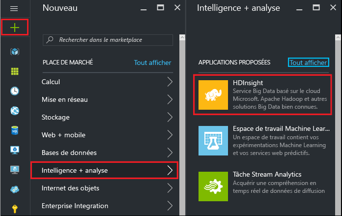
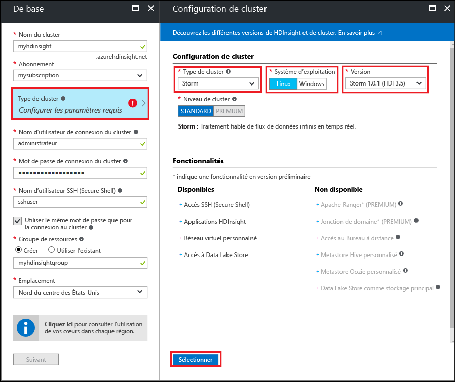

#Bien démarrer avec des exemples Storm Starter pour l’analyse de données volumineuses (« Big Data ») sur HDInsight basé sur Linux

Apache Storm est un système de calcul en temps réel, évolutif, distribué, à tolérance de panne, qui permet de traiter des flux de données. Avec Storm sur Azure HDInsight, vous pouvez créer un cluster Storm basé sur le cloud qui effectue l’analyse de données volumineuses en temps réel.

> [!IMPORTANT]
> Linux est le seul système d’exploitation utilisé sur HDInsight version 3.4 ou supérieure. Pour en savoir plus, consultez le paragraphe [Obsolescence de HDInsight sous Windows](hdinsight-component-versioning.md#hdi-version-33-nearing-deprecation-date).

## Composants requis

[!INCLUDE [delete-cluster-warning](../../includes/hdinsight-delete-cluster-warning.md)]

* **Un abonnement Azure**. Consultez la rubrique [Obtenir une version d'évaluation gratuite d'Azure](https://azure.microsoft.com/documentation/videos/get-azure-free-trial-for-testing-hadoop-in-hdinsight/).

* **Des connaissances en SSH et SCP**. Pour en savoir plus, voir [Utilisation de SSH avec HDInsight (Hadoop) depuis Bash (l’interpréteur de commande) sur Windows 10, Linux, Unix ou OS X](hdinsight-hadoop-linux-use-ssh-unix.md).

## Créer un cluster Storm

Utilisez les étapes suivantes pour créer un Storm sur un cluster HDInsight :

1. À partir du [portail Azure](https://portal.azure.com), sélectionnez **+ et Nouveau**, **Intelligence et analyse**, puis **HDInsight**.

    

2. Dans le panneau **De base**, entrez les informations suivantes :

    * **Nom du cluster** : nom du cluster HDInsight.
    * **Abonnement** : sélectionnez l'abonnement souhaité.
    * **Nom d’utilisateur de connexion du cluster** et **Mot de passe de connexion du cluster** : les informations de connexion lors de l’accès au cluster sur HTTPS. Vous utilisez ces informations d’identification pour accéder aux services tels que l’interface utilisateur Ambari Web ou l’API REST.
    * **Nom d’utilisateur Secure Shell (SSH)** : information de connexion utilisée lors de l’accès au cluster sur SSH. Par défaut, le mot de passe est le même que le mot de passe de connexion de cluster.
    * **Groupe de ressources** : groupe de ressources dans lequel créer le cluster.
    * **Emplacement** : la région Azure dans laquelle créer le cluster.

    

3. Sélectionnez le **Type de cluster**, puis définissez les valeurs suivantes sur le panneau **Configuration du cluster** :

    * **Type de cluster** : Storm

    * **Système d’exploitation** : Linux

    * **Version** : Storm 1.0.1 (HDI 3.5)

    * **Niveau cluster** : standard

    Enfin, utilisez le bouton **Sélectionner** pour enregistrer les paramètres.

    

4. Après avoir sélectionné le type de cluster, utilisez le bouton __Sélectionner__ pour définir le type de cluster. Ensuite, utilisez le bouton __Suivant__ bouton pour terminer la configuration de base.

5. À partir du panneau **Stockage**, sélectionnez ou créer un compte de stockage. Pour les étapes de ce document, laissez les autres champs de ce panneau sur leurs valeurs par défaut. Utilisez le bouton __Suivant__ pour enregistrer la configuration de stockage.

    

6. Dans le panneau **Résumé**, passez en revue la configuration du cluster. Utilisez les liens __Modifier__ pour modifier les éventuels paramètres incorrects. Pour finir, cliquez sur le bouton __Créer__ pour créer le cluster.

    

    > [!NOTE]
    > La création du cluster peut prendre jusqu’à 20 minutes.

## Exécution d’un exemple Starter Storm sur HDInsight

1. Connectez-vous au cluster HDInsight à l’aide de SSH :

        ssh USERNAME@CLUSTERNAME-ssh.azurehdinsight.net

    Si vous utilisez un mot de passe pour sécuriser votre compte utilisateur SSH, vous serez invité à le saisir. Si vous utilisez une clé publique, vous devrez peut-être utiliser le paramètre `-i` pour spécifier la clé privée correspondante. Par exemple, `ssh -i ~/.ssh/id_rsa USERNAME@CLUSTERNAME-ssh.azurehdinsight.net`.

    Pour en savoir plus, voir [Utilisation de SSH avec HDInsight (Hadoop) depuis Bash (l’interpréteur de commande) sur Windows 10, Linux, Unix ou OS X](hdinsight-hadoop-linux-use-ssh-unix.md).

2. Utilisez la commande suivante pour démarrer un exemple de topologie :

        storm jar /usr/hdp/current/storm-client/contrib/storm-starter/storm-starter-topologies-*.jar org.apache.storm.starter.WordCountTopology wordcount

    > [!NOTE]
    > Sur les versions antérieures de HDInsight, le nom de classe de la topologie est `storm.starter.WordCountTopology` au lieu de `org.apache.storm.starter.WordCountTopology`.

    Cette commande démarre l’exemple de topologie WordCount sur le cluster, avec le nom convivial « wordcount ». Elle génère des phrases de manière aléatoire et compte les occurrences de chaque mot dans ces phrases.

    > [!NOTE]
    > Pendant l’envoi de vos propres topologies au cluster, vous devez d’abord copier le fichier jar contenant le cluster avant d’utiliser la commande `storm`. Utilisez la commande `scp` pour copier le fichier. Par exemple, `scp FILENAME.jar USERNAME@CLUSTERNAME-ssh.azurehdinsight.net:FILENAME.jar`
    >
    > L’exemple WordCount et d’autres exemples de Storm Starter sont déjà inclus dans votre cluster sous `/usr/hdp/current/storm-client/contrib/storm-starter/`.

Si vous êtes intéressé par la source des exemples Storm Starter, vous trouverez le code à l’adresse [https://github.com/apache/storm/tree/1.0.x-branch/examples/storm-starter](https://github.com/apache/storm/tree/1.0.x-branch/examples/storm-starter). Ce lien concerne Storm 1.0.x, qui est fourni avec HDInsight 3.5. Pour les autres versions de Storm, utilisez le bouton __Branche__ situé en haut de la page pour sélectionner une autre version de Storm.

## Analyse de la topologie

L’interface utilisateur Storm fournit une interface web incluse dans votre cluster HDInsight pour utiliser les topologies en cours d’exécution.

Suivez la procédure ci-après pour surveiller la topologie à l’aide de l’interface utilisateur de Storm.

1. Pour afficher l’interface utilisateur Storm, ouvrez un navigateur web et accédez à l’adresse https://CLUSTERNAME.azurehdinsight.net/stormui. Remplacez **CLUSTERNAME** par le nom de votre cluster.

    > [!NOTE]
    > Si vous êtes invité à fournir un nom d’utilisateur et un mot de passe, entrez l’administrateur de cluster (admin) et le mot de passe que vous avez utilisé pour la création du cluster.

2. Sous **Résumé de la topologie**, sélectionnez l’entrée **Statistiques** située dans la colonne **Nom**. Vous obtenez plus d’informations sur la topologie.

    

    Cette page fournit les informations suivantes :

    * **Statistiques de topologie** : informations de base sur les performances de la topologie, organisées dans des fenêtres de temps.

        > [!NOTE]
        > La sélection d’une fenêtre de temps spécifique modifie la fenêtre de temps pour les informations affichées dans d’autres sections de la page.

    * **Spouts** : informations de base sur les spouts, y compris la dernière erreur retournée par chaque spout.

    * **Bolts** : informations de base sur les bolts.

    * **Configuration de la topologie** : informations détaillées sur la configuration de la topologie.

    Cette page présente également les actions qui peuvent être effectuées sur la topologie :

    * **Activer** : reprend le traitement d’une topologie désactivée.

    * **Désactiver** : suspend une topologie en cours d’exécution.

    * **Rééquilibrer** : ajuste le parallélisme de la topologie. Il convient de rééquilibrer les topologies en cours d’exécution après avoir modifié le nombre de nœuds dans le cluster. Le rééquilibrage ajuste le parallélisme pour compenser l’augmentation/la réduction du nombre de nœuds du cluster. Pour plus d’informations, consultez la rubrique [Présentation du parallélisme d’une topologie Storm](http://storm.apache.org/documentation/Understanding-the-parallelism-of-a-Storm-topology.html).

    * **Supprimer** : met fin à une topologie Storm après expiration du délai spécifié.

3. À partir de cette page, sélectionnez une entrée dans la section **Spouts** ou **Bolts**. Vous obtenez des informations relatives au composant sélectionné.

    

    Cette page affiche les informations suivantes :

    * **Statistiques du spout/bolt** : informations de base sur les performances de la topologie, organisées dans des fenêtres de temps.

        > [!NOTE]
        > La sélection d’une fenêtre de temps spécifique modifie la fenêtre de temps pour les informations affichées dans d’autres sections de la page.

    * **Statistiques d’entrée** (bolt uniquement) : informations sur les composants qui produisent des données consommées par le bolt.

    * **Statistiques de sortie** : informations sur les données émises par ce bolt.

    * **Exécuteurs** : informations sur les instances de ce composant.

    * **Erreurs** : erreurs générées par ce composant.

4. Lorsque vous affichez les détails d’un spout ou d’un bolt, sélectionnez une entrée depuis la colonne **Port** située dans la section **Exécuteurs** pour afficher les détails d’une instance spécifique du composant.

        2015-01-27 14:18:02 b.s.d.task [INFO] Emitting: split default ["with"]
        2015-01-27 14:18:02 b.s.d.task [INFO] Emitting: split default ["nature"]
        2015-01-27 14:18:02 b.s.d.executor [INFO] Processing received message source: split:21, stream: default, id: {}, [snow]
        2015-01-27 14:18:02 b.s.d.task [INFO] Emitting: count default [snow, 747293]
        2015-01-27 14:18:02 b.s.d.executor [INFO] Processing received message source: split:21, stream: default, id: {}, [white]
        2015-01-27 14:18:02 b.s.d.task [INFO] Emitting: count default [white, 747293]
        2015-01-27 14:18:02 b.s.d.executor [INFO] Processing received message source: split:21, stream: default, id: {}, [seven]
        2015-01-27 14:18:02 b.s.d.task [INFO] Emitting: count default [seven, 1493957]

    Dans cet exemple, le mot **sept** compte 1 493 957 occurrences. C’est le nombre de fois où le mot a été détecté depuis le démarrage de cette topologie.

## Arrêt de la topologie

Retournez à la page **Résumé de la topologie**, puis sélectionnez le bouton **Supprimer** de la section **Actions de topologie**. Lorsque vous êtes invité à entrer le nombre de secondes à attendre avant l’arrêt de la topologie, entrez le nombre 10. Après le délai d’expiration, la topologie n’apparaît plus quand vous vous rendez dans la section **Interface utilisateur Storm** du tableau de bord.

## Suppression du cluster

[!INCLUDE [delete-cluster-warning](../../includes/hdinsight-delete-cluster-warning.md)]

Si vous rencontrez un problème lors de la création de clusters HDInsight, reportez-vous aux [exigences de contrôle d’accès](hdinsight-administer-use-portal-linux.md#create-clusters).

## Étapes suivantes

Dans ce didacticiel Apache Storm, vous avez découvert les principes de base de l’utilisation de Storm sur HDInsight. À présent, découvrez comment [développer des topologies basées sur Java à l’aide de Maven](hdinsight-storm-develop-java-topology.md).

Si vous êtes déjà familiarisé avec le développement de topologies basées sur Java et que vous souhaitez déployer une topologie existante dans HDInsight, consultez la page [Déploiement et gestion des topologies Apache Storm sur HDInsight](hdinsight-storm-deploy-monitor-topology-linux.md).

Si vous êtes un développeur .NET, vous pouvez créer des topologies C# ou C#/Java hybrides à l’aide de Visual Studio. Pour plus d’informations, consultez la rubrique [Développer des topologies C# pour Apache Storm sur HDInsight en utilisant les outils Hadoop pour Visual Studio](hdinsight-storm-develop-csharp-visual-studio-topology.md).

Consultez les exemples suivants de topologies qui peuvent être utilisées avec Storm sur HDInsight :

* [Exemples de topologies pour Storm dans HDInsight](hdinsight-storm-example-topology.md)

[apachestorm]: https://storm.incubator.apache.org
[stormdocs]: http://storm.incubator.apache.org/documentation/Documentation.html
[stormstarter]: https://github.com/apache/storm/tree/master/examples/storm-starter
[stormjavadocs]: https://storm.incubator.apache.org/apidocs/
[azureportal]: https://manage.windowsazure.com/
[hdinsight-provision]: hdinsight-hadoop-provision-linux-clusters.md
[preview-portal]: https://portal.azure.com/

