<properties
	pageTitle="Didacticiel Apache Storm : prise en main de Storm | Microsoft Azure"
	description="Prise en main de l'analyse des big data avec Apache Storm et les exemples Starter Storm sur HDInsight. Découvrez comment utiliser Storm pour traiter les données en temps réel."
	keywords="apache storm,didacticiel apache storm,analyses big data,prise en main storm"
	services="hdinsight"
	documentationCenter=""
	authors="Blackmist"
	manager="jhubbard"
	editor="cgronlun"
	tags="azure-portal"/>

<tags
   ms.service="hdinsight"
   ms.devlang="java"
   ms.topic="article"
   ms.tgt_pltfrm="na"
   ms.workload="big-data"
   ms.date="09/07/2016"
   ms.author="larryfr"/>

# Didacticiel Apache Storm : prise en main d'exemples Storm Starter pour l'analyse de données volumineuses (« Big Data ») sur HDInsight

Apache Storm est un système de calcul en temps réel, évolutif, distribué, à tolérance de panne, qui permet de traiter des flux de données. Avec Storm sur Microsoft Azure HDInsight, vous pouvez créer un cluster Storm basé sur le cloud qui effectue l’analyse de Big Data en temps réel.

> [AZURE.NOTE] Les étapes décrites dans cet article créent un cluster HDInsight Windows. Pour savoir comment créer un cluster Storm sur HDInsight sous Linux, consultez le [Didacticiel Apache Storm : prise en main de l’exemple Storm Starter à l’aide de l’analyse de données sur HDInsight](hdinsight-apache-storm-tutorial-get-started-linux.md)

## Avant de commencer

[AZURE.INCLUDE [delete-cluster-warning](../../includes/hdinsight-delete-cluster-warning.md)]

Vous devez disposer de ce qui suit pour suivre jusqu’au bout ce didacticiel Storm Apache :

- **Un abonnement Azure**. Consultez la page [Obtention d’un essai gratuit d’Azure](https://azure.microsoft.com/documentation/videos/get-azure-free-trial-for-testing-hadoop-in-hdinsight/).

## Créer un cluster Storm

Storm sur HDInsight utilise un stockage d’objet blob Azure pour stocker les fichiers journaux et les topologies envoyés au cluster. Utilisez les étapes suivantes pour créer un compte de stockage Azure à utiliser avec votre cluster :

1. Connectez-vous au [portail Azure][preview-portal].

2. Sélectionnez **NOUVEAU**, __Analyse des données__, puis __HDInsight__.

	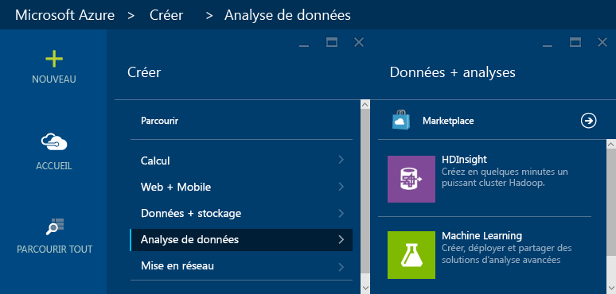

3. Entrez un __nom de cluster__. Une coche verte s’affiche en regard du __Nom de cluster__ s’il est disponible.

4. Si vous avez plusieurs abonnements,sélectionnez l’entrée __Abonnement__ pour sélectionner l’abonnement Azure qui sera utilisé pour le cluster.

5.  Utilisez __Sélectionner un type de cluster__ pour choisir un cluster __Storm__. Pour le __Système d’exploitation__, sélectionnez Windows. Pour __Niveau de cluster__, sélectionnez STANDARD. Enfin, utilisez le bouton Sélectionner pour enregistrer ces paramètres

	

5. Pour __Groupe de ressources__, vous pouvez utiliser la liste déroulante pour afficher la liste des groupes de ressources existants, puis sélectionner celui dans lequel créer le cluster. Vous pouvez également sélectionner __Nouveau__, puis saisir le nom du nouveau groupe de ressources. Une coche verte s’affiche pour indiquer si le nouveau nom de groupe est disponible.

6. Sélectionnez __Informations d’identification__, puis entrez une valeur dans les champs __Nom de connexion au cluster__ et __Mot de passe de connexion au cluster__. Enfin, utilisez __Sélectionner__ pour définir les informations d’identification. Le Bureau à distance ne sera pas utilisé dans ce document, vous pouvez donc laisser cette option désactivée.

	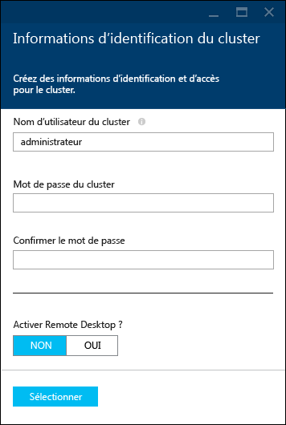

6. Pour __Source de données__, vous pouvez choisir une source de données existante ou en créer une.

	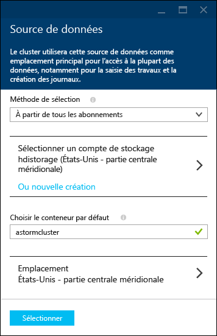

	Actuellement, vous pouvez sélectionner un compte de stockage Azure comme source de données pour un cluster HDInsight. Lisez ce qui suit pour comprendre à quoi correspondent les entrées du panneau __Source de données__.

	- __Méthode de sélection__ : définissez cette propriété sur la valeur __De tous les abonnements__ pour permettre l’exploration des comptes de stockage de tous vos abonnements. Affectez-lui la valeur __Clé d’accès__ si vous souhaitez saisir le __nom de stockage__ et la __clé d’accès__ d’un compte de stockage existant.

	- __Créer un nouveau__ : utilisez cette option pour créer un autre compte de stockage. Utilisez le champ qui s’affiche pour saisir le nom du compte de stockage. Une coche verte s’affiche si le nom est disponible.

	- __Choisir le conteneur par défaut__ : utilisez cette option pour saisir le nom du conteneur par défaut à utiliser pour le cluster. Vous pouvez saisir n’importe quel nom, mais nous vous conseillons d’utiliser le même nom que le cluster pour pouvoir facilement reconnaître le conteneur utilisé pour ce cluster spécifique.

	- __Emplacement__ : zone géographique dans laquelle le compte de stockage se trouve ou dans laquelle il sera créé.

		> [AZURE.IMPORTANT] La sélection de l’emplacement de la source de données par défaut définit également l’emplacement du cluster HDInsight. Le cluster et la source de données par défaut doivent se trouver dans la même zone géographique.

	- __Sélectionner__ : utilisez cette option pour enregistrer la configuration de la source de données.

7. Sélectionnez __Niveaux de tarification du nœud__ pour afficher des informations sur les nœuds qui seront créés pour ce cluster. Par défaut, le nombre de nœuds de travail est fixé à __4__. Affectez-lui la valeur __1__. Cela suffit pour ce didacticiel et réduit le coût du cluster. Le coût estimé du cluster s’affiche au bas de ce panneau.

	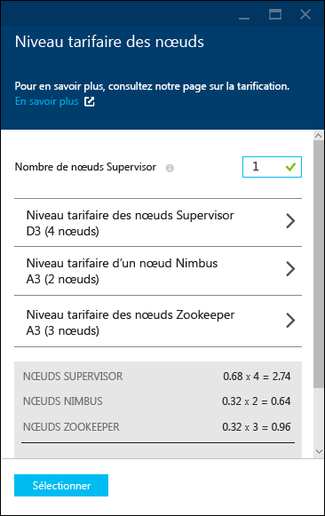

	Utilisez __Sélectionner__ pour enregistrer les informations de __Niveaux de tarification de nœud__.

8. Sélectionnez __Configuration facultative__. Ce panneau vous permet de sélectionner la version de cluster et de configurer d’autres paramètres facultatifs (par exemple, rejoindre un __Réseau virtuel__).

	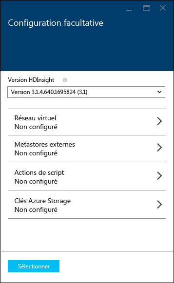

9. Vérifiez que l’option __Épingler au tableau d’accueil__ est sélectionnée, puis sélectionnez __Créer__. Le cluster est créé et la vignette correspondante ajoutée au Tableau d’accueil de votre portail Azure. L’icône indique que le cluster est en cours d’approvisionnement et sera modifiée pour représenter l’icône HDInsight une fois l’approvisionnement terminé.

	| Pendant l’approvisionnement | Approvisionnement terminé |
	| ------------------ | --------------------- |
	|  | 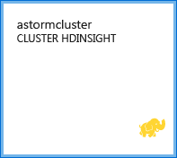 |

	> [AZURE.NOTE] La création du cluster prend un certain temps (en règle générale, environ 15 minutes). Utilisez la vignette du Tableau d’accueil, ou l’entrée __Notifications__ à gauche de la page pour vérifier le processus d’approvisionnement.

## Exécution d’un exemple Starter Storm sur HDInsight

Avec ce didacticiel Apache Storm vous apprendrez à analyser des big data à l’aide d’exemples Starter Storm sur GitHub.

Chaque cluster Storm sur HDInsight est doté d’un tableau de bord Storm, qui peut être utilisé pour télécharger et exécuter les topologies Storm sur le cluster. Chaque cluster est également fourni avec des exemples de topologies pouvant être exécutés directement depuis le tableau de bord Storm.

### Connexion au tableau de bord

Le tableau de bord se trouve dans **https://&lt;clustername>.azurehdinsight.net//**, où **clustername** est le nom du cluster. Vous trouverez également un lien vers le tableau de bord en sélectionnant le cluster dans le tableau d’accueil, puis en sélectionnant le lien __Tableau de bord__ en haut du panneau.

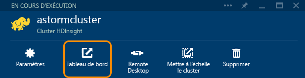

> [AZURE.NOTE] Quand vous vous connectez au tableau de bord, vous devez entrer un nom d’utilisateur et un mot de passe. Il s’agit du nom de l’administrateur (**admin**) et du mot de passe utilisé lors de la création du cluster.

Une fois le tableau de bord Storm chargé, le formulaire **Envoi de la topologie** s’affichera.

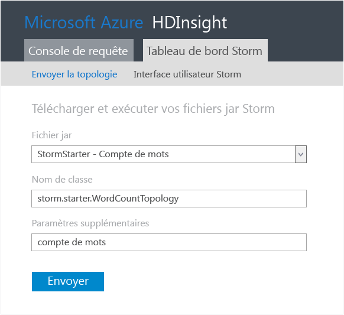

Le formulaire **Envoi de la topologie** peut servir à télécharger et exécuter des fichiers .jar qui contiennent des topologies Storm. Il inclut également plusieurs exemples de base fournis avec le cluster.

### Exécution de l’exemple de statistiques du projet de départ Storm dans GitHub

Les exemples fournis avec le cluster incluent plusieurs variantes d’une topologie de statistique. Ces exemples incluent un **spout** qui émet des phrases aléatoirement, et des **bolts** qui fragmentent chaque phrase en mots, puis comptent le nombre d’occurrences de chaque mot. Ces exemples sont tirés des [exemples Storm Starter](https://github.com/apache/storm/tree/master/examples/storm-starter), qui font partie d’Apache Storm.

Procédez comme suit pour exécuter un exemple Storm Starter :

1. Sélectionnez **StormStarter - WordCount** dans la liste déroulante du **fichier Jar**. Cette opération remplit les champs **Nom de la classe** et **Paramètres supplémentaires** avec les paramètres de cet exemple.

	

	* **Nom de la classe** : classe dans le fichier .jar qui envoie la topologie.
	* **Paramètres supplémentaires** : tous les paramètres requis par la topologie. Dans cet exemple, le champ sert à fournir un nom convivial pour la topologie envoyée.

2. Cliquez sur **Envoyer**. Après quelques instants, le champ **Résultat** affiche la commande utilisée pour envoyer la tâche, ainsi que les résultats de la commande. Le champ **Erreur** affiche toutes les erreurs qui se produisent au cours de l’envoi de la topologie.

	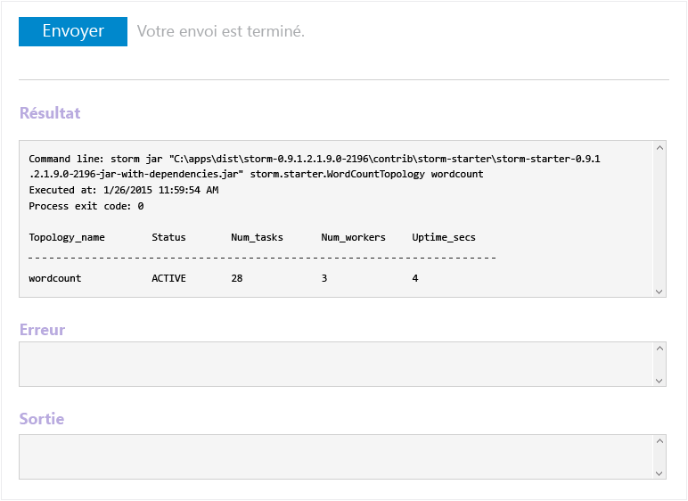

	> [AZURE.NOTE] Les résultats n’indiquent pas que la topologie est terminée : **une topologie Storm, une fois démarrée, s’exécute jusqu’à ce que vous l’arrêtiez.** La topologie de statistiques génère des phrases aléatoires tout en conservant le décompte du nombre de fois qu’elle rencontre chaque mot, jusqu’à ce que vous l’arrêtiez.

### Analyse de la topologie

L’interface utilisateur Storm peut servir à analyser la topologie.

1. Dans la partie supérieure du tableau de bord Storm, sélectionnez **Interface utilisateur Storm**. Un résumé des informations sur le cluster et les topologies en cours d’exécution s’affiche.

	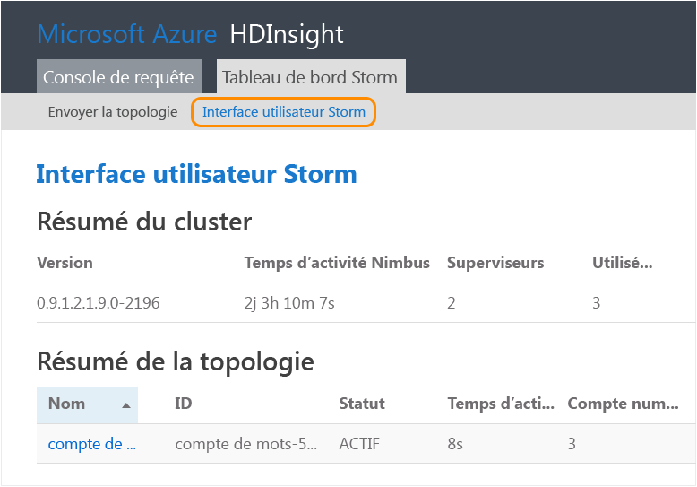

	Dans la page ci-dessus, vous pouvez voir la durée pendant laquelle la topologie a été active, ainsi que le nombre de processus de travail, d’exécuteurs et de tâches actuellement utilisés.

	> [AZURE.NOTE] La colonne **Nom** contient le nom convivial fourni précédemment via le champ**Paramètres supplémentaires**.

4. Sous **Résumé de la topologie**, sélectionnez l’entrée **Statistiques** située dans la colonne **Nom**. Vous obtenez plus d’informations sur la topologie.

	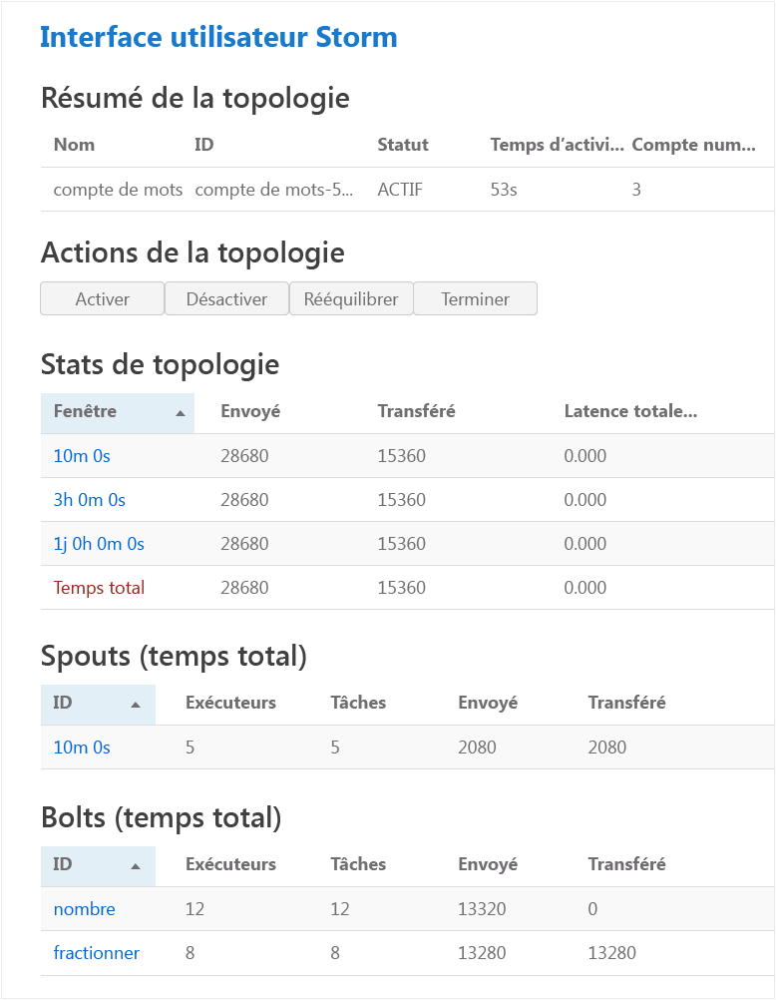

	Cette page fournit les informations suivantes :

	* **Statistiques de topologie** : informations de base sur les performances de la topologie, organisées dans des fenêtres de temps.

		> [AZURE.NOTE] La sélection d’une fenêtre de temps spécifique modifie la fenêtre de temps pour les informations affichées dans d’autres sections de la page.

	* **Spouts** : informations de base sur les spouts, y compris la dernière erreur retournée par chaque spout.

	* **Bolts** : informations de base sur les bolts.

	* **Configuration de la topologie** : informations détaillées sur la configuration de la topologie.

	Cette page présente également les actions qui peuvent être effectuées sur la topologie :

	* **Activer** : reprend le traitement d’une topologie désactivée.

	* **Désactiver** : suspend une topologie en cours d’exécution.

	* **Rééquilibrer** : ajuste le parallélisme de la topologie. Il convient de rééquilibrer les topologies en cours d’exécution après avoir modifié le nombre de nœuds dans le cluster. Cela permet à la topologie d’ajuster le parallélisme pour compenser l’augmentation/la réduction du nombre de nœuds du cluster. Pour plus d’informations, consultez la rubrique [Présentation du parallélisme d’une topologie Storm](http://storm.apache.org/documentation/Understanding-the-parallelism-of-a-Storm-topology.html).

	* **Supprimer** : met fin à une topologie Storm après expiration du délai spécifié.

5. À partir de cette page, sélectionnez une entrée dans la section **Spouts** ou **Bolts**. Vous obtenez des informations relatives au composant sélectionné.

	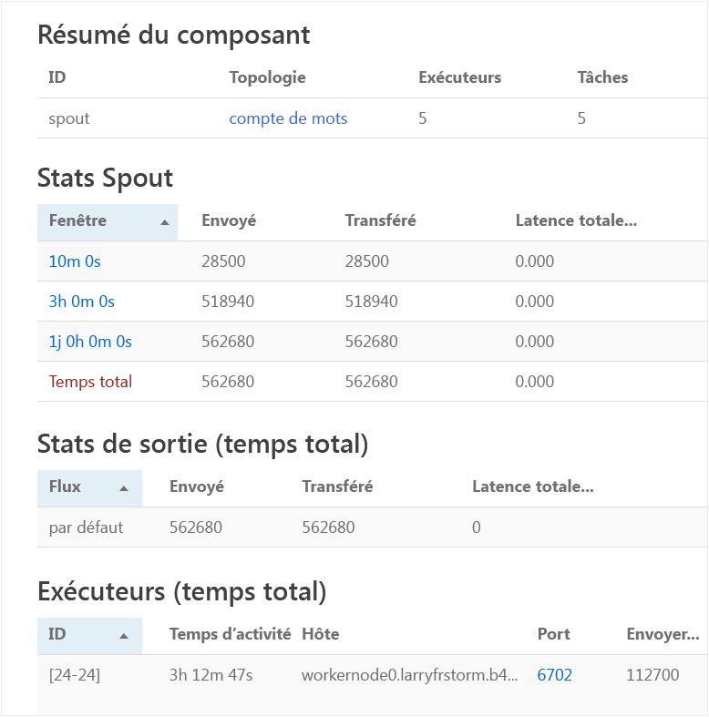

	Cette page affiche les informations suivantes :

	* **Statistiques du spout/bolt** : informations de base sur les performances de la topologie, organisées dans des fenêtres de temps.

		> [AZURE.NOTE] La sélection d’une fenêtre de temps spécifique modifie la fenêtre de temps pour les informations affichées dans d’autres sections de la page.

	* **Statistiques d’entrée** (bolt uniquement) : informations sur les composants qui produisent des données consommées par le bolt.

	* **Statistiques de sortie** : informations sur les données émises par ce bolt.

	* **Exécuteurs** : informations sur les instances de ce composant.

	* **Erreurs** : erreurs générées par ce composant.

5. Lorsque vous affichez les détails d’un spout ou d’un bolt, sélectionnez une entrée depuis la colonne **Port** située dans la section **Exécuteurs** pour afficher les détails d’une instance spécifique du composant.

		2015-01-27 14:18:02 b.s.d.task [INFO] Emitting: split default ["with"]
		2015-01-27 14:18:02 b.s.d.task [INFO] Emitting: split default ["nature"]
		2015-01-27 14:18:02 b.s.d.executor [INFO] Processing received message source: split:21, stream: default, id: {}, [snow]
		2015-01-27 14:18:02 b.s.d.task [INFO] Emitting: count default [snow, 747293]
		2015-01-27 14:18:02 b.s.d.executor [INFO] Processing received message source: split:21, stream: default, id: {}, [white]
		2015-01-27 14:18:02 b.s.d.task [INFO] Emitting: count default [white, 747293]
		2015-01-27 14:18:02 b.s.d.executor [INFO] Processing received message source: split:21, stream: default, id: {}, [seven]
		2015-01-27 14:18:02 b.s.d.task [INFO] Emitting: count default [seven, 1493957]

	À partir de ces données, vous pouvez voir qu’il y a 1,493,957 occurrences du mot **seven**. C’est le nombre de fois où il a été détecté depuis le démarrage de cette topologie.

### Arrêt de la topologie

Retournez à la page **Résumé de la topologie**, puis sélectionnez **Supprimer** dans la section**Actions de topologie**. Lorsque vous êtes invité à entrer le nombre de secondes à attendre avant l’arrêt de la topologie, entrez le nombre 10. Après le délai d’expiration, la topologie n’apparaît plus quand vous vous rendez dans la section **Interface utilisateur Storm** du tableau de bord.

##Suppression du cluster

[AZURE.INCLUDE [delete-cluster-warning](../../includes/hdinsight-delete-cluster-warning.md)]

## Résumé

Dans ce didacticiel sur Storm Apache, vous avez appris à créer un cluster Storm sur HDInsight à l’aide de Storm Starter et à déployer, surveiller et gérer des topologies Storm à l’aide du tableau de bord Storm.

## Étapes suivantes

* **HDInsight Tools pour Visual Studio** : HDInsight Tools vous permet d’utiliser Visual Studio pour envoyer, surveiller et gérer des topologies Storm semblables à celles du tableau de bord Storm mentionnées plus haut. HDInsight Tools offre la possibilité de créer des topologies Storm C# et inclut des exemples de topologies que vous pouvez déployer et exécuter sur votre cluster.

	Pour plus d’informations, consultez la rubrique [Prise en main des outils HDInsight pour Visual Studio](hdinsight-hadoop-visual-studio-tools-get-started.md).

* **Exemples de fichiers** : le cluster Storm HDInsight contient plusieurs exemples dans le répertoire **%STORM\_HOME%\\contrib**. Chaque exemple doit contenir les éléments suivants :

	* Le code source : par exemple, storm-starter-0.9.1.2.1.5.0-2057-sources.jar

	* Les documents Java : par exemple, storm-starter-0.9.1.2.1.5.0-2057-javadoc.jar

	* L'exemple : par exemple, storm-starter-0.9.1.2.1.5.0-2057-jar-with-dependencies.jar

	Utilisez la commande « jar » pour extraire le code source ou les documents Java. Par exemple, « jar -xvf storm-starter-0.9.1.2.1.5.0.2057-javadoc.jar ».

	> [AZURE.NOTE] Les documents Java sont composés de pages Web. Lorsque vous les avez extraits, utilisez un navigateur pour afficher le fichier **index.html**.

	Pour accéder à ces exemples, vous devez activer le bureau à distance pour le cluster Storm sur HDInsight, puis copier les fichiers à partir de **%STORM\_HOME%\\contrib**.

* Le document suivant contient une liste d’autres exemples pouvant être utilisés avec Storm sur HDInsight :

	* [Exemples de topologies pour Storm dans HDInsight](hdinsight-storm-example-topology.md)

[apachestorm]: https://storm.incubator.apache.org
[stormdocs]: http://storm.incubator.apache.org/documentation/Documentation.html
[stormstarter]: https://github.com/apache/storm/tree/master/examples/storm-starter
[stormjavadocs]: https://storm.incubator.apache.org/apidocs/
[azureportal]: https://manage.windowsazure.com/
[hdinsight-provision]: hdinsight-provision-clusters.md
[preview-portal]: https://portal.azure.com/

<!---HONumber=AcomDC_0914_2016-->