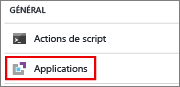
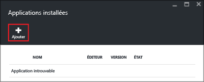
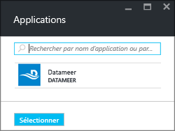
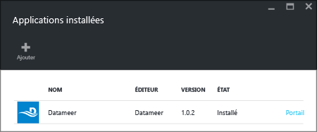

# Installer des applications HDInsight
Une application HDInsight est une application que les utilisateurs peuvent installer sur un cluster HDInsight sous Linux. Ces applications peuvent être développées par Microsoft, par des éditeurs de logiciels indépendants (ISV) ou par vous-même. Dans cet article, vous allez apprendre à installer une application publiée. Pour installer votre propre application, consultez la page [Installer des applications HDInsight personnalisées](hdinsight-apps-install-custom-applications.md). 

Actuellement, il existe trois applications publiées :

* **Datameer**: [Datameer](http://www.datameer.com/documentation/display/DAS50/Home?ls=Partners&lsd=Microsoft&c=Partners&cd=Microsoft) offre aux analystes une manière interactive de détecter, analyser et visualiser les résultats sur Big Data. Extrayez facilement des sources de données supplémentaires pour découvrir de nouvelles relations et obtenir les réponses dont vous avez besoin rapidement.
* **Streamsets Data Collector for HDnsight** fournit un environnement de développement intégré complet qui prend en charge la conception, le test, le déploiement et la gestion des pipelines d’ingestion universels qui maillent les flux et groupent les données, tout en incluant diverses transformations intégrées au flux, sans aucune écriture de code personnalisé. 
* **Cask CDAP 3.5 for HDInsight** fournit la première plateforme intégrée d’intégration dédiée au Big Data, qui réduit de 80 % le délai de production des applications et des lacs de données. Cette application prend uniquement en charge les clusters Standard HBase 3.4.

Les instructions fournies dans cet article utilisent le portail Azure. Vous pouvez également exporter le modèle Azure Resource Manager à partir du portail ou obtenir une copie de ce modèle auprès des fournisseurs et utiliser Azure PowerShell et l’interface de ligne de commande Azure pour déployer le modèle.  Consultez [Création de clusters Hadoop basés sur Linux dans HDInsight à l’aide de modèles Resource Manager | Microsoft Azure](hdinsight-hadoop-create-linux-clusters-arm-templates.md).

## Composants requis
Pour installer des applications HDInsight sur un cluster HDInsight existant, vous devez disposer d’un cluster HDInsight. Pour en créer un, consultez [Créer des clusters](hdinsight-hadoop-linux-tutorial-get-started.md#create-cluster). Vous pouvez également installer des applications HDInsight lorsque vous créez un cluster HDInsight.

## Installer des applications dans des clusters existants
La procédure suivante montre comment installer des applications HDInsight dans un cluster HDInsight existant.

**Pour installer une application HDInsight**

1. Connectez-vous au [portail Azure](https://portal.azure.com).
2. Cliquez sur **Clusters HDInsight** dans le menu de gauche.  Si vous ne le voyez pas, cliquez sur **Parcourir**, puis sur **Clusters HDInsight**.
3. Cliquez sur un cluster HDInsight.  Si vous ne disposez pas d’un tel cluster, vous devez d’abord en créer un.  Consultez la page [Créer des clusters](hdinsight-hadoop-linux-tutorial-get-started.md#create-cluster).
4. Cliquez sur **Applications**, sous la catégorie **Configurations**. S’il en existe, vous pouvez consulter une liste des applications installées.
   
    
5. Cliquez sur **Ajouter** dans le menu du panneau. 
   
    
   
    Une liste des applications HDInsight existantes s’affiche.
   
    
6. Cliquez sur une des applications, acceptez les conditions juridiques, puis cliquez sur **Sélectionner**.

Vous pouvez vérifier l’état de l’installation de l’application dans les notifications du portail (cliquez sur l’icône en forme de cloche en haut du portail). Une fois l’application installée, celle-ci s’affiche dans le panneau Applications installées.

## Installer des applications lors de la création du cluster
Vous pouvez également installer des applications HDInsight lorsque vous créez un cluster. Au cours du processus, les applications HDInsight sont installées une fois le cluster créé et en cours d’exécution. La procédure suivante montre comment installer des applications HDInsight lors de la création d’un cluster.

**Pour installer une application HDInsight**

1. Connexion au [portail Azure](https://portal.azure.com).
2. Cliquez sur **NOUVEAU**, sur **Données + analyse**, puis sur **HDInsight**.
3. Entrez le **nom du cluster**: ce nom doit être globalement unique.
4. Cliquez sur **Abonnement** pour sélectionner l’abonnement Azure qui sera utilisé pour le cluster.
5. Cliquez sur **Sélectionner un type de cluster**, puis choisissez :
   
   * **Type de cluster** : si vous ne savez pas lequel choisir, sélectionnez **Hadoop**. Il s’agit du type de cluster le plus répandu.
   * **Système d’exploitation** : sélectionnez **Linux**.
   * **Version**: utilisez la version par défaut si vous ne savez pas laquelle choisir. Pour plus d’informations, consultez [Versions de clusters HDInsight](hdinsight-component-versioning.md).
   * **Niveau de cluster**: Azure HDInsight propose deux catégories d’offres de cloud Big Data : Niveau Standard et Niveau Premium. Pour plus d’informations, consultez [Niveaux de cluster](hdinsight-hadoop-provision-linux-clusters.md#cluster-tiers).
6. Cliquez sur **Applications**, sur l’une des applications publiées, puis sur **Sélectionner**.
7. Cliquez sur **Informations d’identification** , puis entrez un mot de passe pour l’utilisateur admin. Vous devez également entrer un **Nom d’utilisateur SSH** et un **MOT DE PASSE** ou une **CLÉ PUBLIQUE**, qui seront utilisés pour authentifier l’utilisateur SSH. L'utilisation d'une clé publique est l'approche recommandée. Cliquez sur **Sélectionner** en bas de l’écran pour enregistrer la configuration des informations d’identification.
8. Cliquez sur **Source de données**, sélectionnez un des comptes existants ou créez un nouveau compte existant à utiliser comme compte de stockage par défaut pour le cluster.
9. Cliquez sur **Groupe de ressources** pour sélectionner un groupe de ressources existant, ou sur **Nouveau** pour créer un nouveau groupe de ressources.
10. Dans le panneau **Nouveau cluster HDInsight**, assurez-vous que l’option **Épingler au tableau d’accueil** est sélectionnée, puis cliquez sur **Créer**. 

## Répertorier les applications HDInsight installées et les propriétés
Le portail affiche une liste des applications HDInsight installées pour un cluster et les propriétés de chaque application installée.

**Pour répertorier une application HDInsight et afficher des propriétés**

1. Connectez-vous au [portail Azure](https://portal.azure.com).
2. Cliquez sur **Clusters HDInsight** dans le menu de gauche.  Si vous ne le voyez pas, cliquez sur **Parcourir**, puis sur **Clusters HDInsight**.
3. Cliquez sur un cluster HDInsight.
4. Dans le panneau **Paramètres**, cliquez sur **Applications** sous la catégorie **Général**. Le panneau Applications installées répertorie toutes les applications installées. 
   
    
5. Cliquez sur une des applications installées pour en afficher la propriété. Le panneau des propriétés répertorie les éléments suivants :
   
   * Nom de l’application : nom de l’application.
   * État : état de l’application. 
   * Page web : l’URL de l’application web que vous avez déployée sur le nœud de périmètre s’il existe. Les informations d’identification sont les mêmes que celles de l’utilisateur HTTP configurées pour le cluster.
   * Point de terminaison HTTP : les informations d’identification sont les mêmes que celles de l’utilisateur HTTP configuré pour le cluster. 
   * Point de terminaison SSH : vous pouvez utiliser [SSH](hdinsight-hadoop-linux-use-ssh-unix.md) pour la connexion au nœud de périmètre. Les informations d’identification sont les mêmes que celles de l’utilisateur SSH configurées pour le cluster.
6. Pour supprimer une application, cliquez avec le bouton droit sur l’application, puis sur **Supprimer** dans le menu contextuel.

## Connexion au nœud de périmètre
Vous pouvez vous connecter au nœud de périmètre à l’aide de HTTP et SSH. Vous trouverez les informations de point de terminaison sur le [portail](#list-installed-hdinsight-apps-and-properties). Pour plus d’informations sur l’utilisation de SSH avec HDInsight, consultez la rubrique [Utilisation de SSH avec Hadoop dans HDInsight sur Linux à partir de Linux, Unix ou OS X](hdinsight-hadoop-linux-use-ssh-unix.md). 

Les informations d’identification du point de terminaison HTTP sont les informations d’identification de l’utilisateur HTTP configurées pour le cluster HDInsight ; les informations d’identification du point de terminaison SSH sont les informations d’identification SSH configurées pour le cluster HDInsight.

## Résolution des problèmes
Consultez [Dépanner l’installation](hdinsight-apps-install-custom-applications.md#troubleshoot-the-installation).

## Étapes suivantes
* [Installer des applications HDInsight personnalisées](hdinsight-apps-install-custom-applications.md): découvrez comment déployer des applications HDInsight inédites vers HDInsight.
* [Publish HDInsight applications](hdinsight-apps-publish-applications.md)(Publier des applications HDInsight) : découvrez comment publier vos applications HDInsight personnalisées sur Azure Marketplace.
* [MSDN: Install an HDInsight application](https://msdn.microsoft.com/library/mt706515.aspx)(MSDN : installer une application HDInsight) : découvrez comment définir des applications HDInsight.
* [Personnalisation de clusters HDInsight basés sur Linux à l’aide d’une action de script](hdinsight-hadoop-customize-cluster-linux.md): apprenez à utiliser l’action de script pour installer des applications supplémentaires.
* [Créer des clusters Hadoop sous Linux dans HDInsight à l’aide de modèles Resource Manager](hdinsight-hadoop-create-linux-clusters-arm-templates.md): apprenez à appeler des modèles Resource Manager pour la création de clusters HDInsight.
* [Utiliser des nœuds de périmètre vides dans HDInsight](hdinsight-apps-use-edge-node.md): apprenez à utiliser un nœud de périmètre vide pour accéder au cluster HDInsight, tester des applications HDInsight et héberger des applications HDInsight.

<!--HONumber=Nov16_HO4-->

