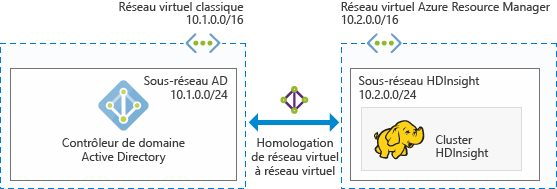
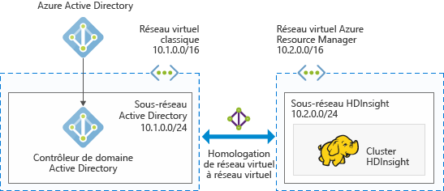
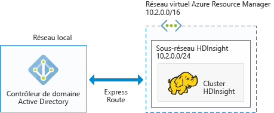

# Planifier des clusters Hadoop Azure joints à un domaine dans HDInsight

Le cluster Hadoop traditionnel est un cluster à un seul utilisateur. Il convient à la plupart des entreprises qui font appel à des équipes d’application plus petites pour créer leurs charges de travail Big Data. À mesure qu’Hadoop gagne en popularité, la plupart des entreprises font la transition vers un modèle dans lequel les clusters sont gérés par les équipes informatiques et plusieurs équipes d’application partagent des clusters. Par conséquent, les clusters multi-utilisateurs sont parmi les fonctionnalités les plus demandées dans HDInsight.

Au lieu de créer sa propre authentification et sa propre autorisation multi-utilisateur, HDInsight utilise le fournisseur d’identité le plus courant : Active Directory (AD). Dans Active Directory, la fonctionnalité puissante de groupes de sécurité permet de gérer l’autorisation multi-utilisateur dans HDInsight. En intégrant HDInsight avec Active Directory, les utilisateurs d’Active Directory peuvent communiquer avec les clusters à l’aide de leurs informations d’identification Active Directory. HDInsight mappe l’utilisateur Active Directory sur un utilisateur Hadoop local, de sorte que tous les services exécutés sur HDInsight (Ambari, Hive Server, Ranger, Spark Thrift Server, etc.) fonctionnent de manière transparente pour l’utilisateur authentifié.

## Intégrer HDInsight avec Active Directory

En intégrant HDInsight avec Active Directory, les nœuds du cluster HDInsight sont joints au domaine Active Directory. HDInsight crée des principaux de service pour les services Hadoop s’exécutant sur le cluster et les place dans une unité d’organisation spécifiée dans Active Directory. HDInsight crée également des mappages DNS inverses dans le domaine Active Directory pour les adresses IP des nœuds qui sont joints au domaine.

Pour appliquer cette configuration, vous pouvez adopter plusieurs architectures. Vous devez choisir celle qui vous convient le mieux.

**1. HDInsight intégré avec AD exécuté sur Azure IAAS**

Il s’agit de l’architecture la plus simple pour intégrer HDInsight avec Active Directory. Le contrôleur de domaine Active Directory s’exécute sur une (ou plusieurs) machines virtuelles (VM) dans Azure. Normalement, ces machines virtuelles se trouvent sur un réseau virtuel. Vous configurez un autre réseau virtuel pour le cluster HDInsight. Pour que HDInsight puisse voir Active Directory, vous devez mettre en lien ces réseaux virtuels à l’aide de [l’homologation des réseaux virtuels](../virtual-network/virtual-networks-create-vnetpeering-arm-portal.md).

> [!NOTE]
> Dans cette architecture, vous ne pouvez pas utiliser Azure Data Lake Store avec le cluster HDInsight.
 

Configuration requise pour Active Directory :

* Vous devez créer [l’unité organisationnelle](../active-directory-domain-services/active-directory-ds-admin-guide-create-ou.md) dans laquelle vous souhaitez placer les machines virtuelles du cluster HDInsight et les principaux du service utilisés par le cluster.
* [LDAPS](../active-directory-domain-services/active-directory-ds-admin-guide-configure-secure-ldap.md) doit être configuré de manière à communiquer avec Active Directory. Le certificat utilisé pour installer LDAPS doit être un certificat réel (et non un certificat auto-signé).
* Les zones DNS inverses doivent être créées sur le domaine de la plage d’adresses IP du sous-réseau HDInsight (par exemple 10.2.0.0/24 dans l’image précédente).
* Un compte de service ou un compte d’utilisateur est nécessaire. Il est utilisé pour créer le cluster HDInsight. Ce compte doit disposer des autorisations suivantes :

    - Autorisations de création des objets de principal de service et des objets ordinateur dans l’unité organisationnelle.
    - Autorisations de création de règles de proxy DNS inverses
    - Autorisations pour joindre des ordinateurs au domaine Active Directory.

**2. HDInsight intégré avec un annuaire Azure AD dans le cloud uniquement**

Pour un annuaire Azure Active Directory (Azure AD) dans le cloud uniquement, vous devez configurer un contrôleur de domaine afin de pouvoir intégrer HDInsight avec Azure Active Directory. Pour cela, vous devez utiliser [Azure Active Directory Domain Services](../active-directory-domain-services/active-directory-ds-overview.md) (Azure AD DS). Azure AD DS crée des machines contrôleurs de domaine sur le cloud et vous fournit leurs adresses IP. Il crée deux contrôleurs de domaine pour la haute disponibilité.

Actuellement, Azure AD DS existe seulement dans les réseaux virtuels classiques. Il est uniquement accessible à l’aide du portail Azure classique. Le réseau virtuel HDInsight existe dans le portail Azure, qui doit être mis en lien avec le réseau virtuel classique à l’aide de l’homologation des réseaux virtuels.

> [!NOTE]
> L’homologation entre un réseau virtuel classique et un réseau virtuel Azure Resource Manager exige que les deux réseaux virtuels soient dans la même région, et que les deux réseaux virtuels se trouvent sous le même abonnement Azure.

Configuration requise pour Active Directory :

* Vous devez créer [l’unité organisationnelle](../active-directory-domain-services/active-directory-ds-admin-guide-create-ou.md) dans laquelle vous souhaitez placer les machines virtuelles du cluster HDInsight et les principaux du service utilisés par le cluster. 
* [LDAPS](../active-directory-domain-services/active-directory-ds-admin-guide-configure-secure-ldap.md) doit être paramétré lorsque vous configurez les services AD DS. Le certificat utilisé pour installer LDAPS doit être un certificat réel (et non un certificat auto-signé).
* Les zones DNS inverses doivent être créées sur le domaine de la plage d’adresses IP du sous-réseau HDI (par exemple 10.2.0.0/24 dans l’image précédente). 
* Les [hachages de mot de passe](../active-directory-domain-services/active-directory-ds-getting-started-password-sync.md) doivent être synchronisés entre Azure AD et AD DS.
* Un compte de service ou un compte d’utilisateur est nécessaire. Il est utilisé pour créer le cluster HDInsight. Ce compte doit disposer des autorisations suivantes :

    - Autorisations de création des objets de principal de service et des objets ordinateur dans l’unité organisationnelle.
    - Autorisations de création de règles de proxy DNS inverses
    - Autorisations pour joindre des ordinateurs au domaine Active Directory.

**3. HDInsight intégré avec un annuaire AD local via le VPN**

Cette architecture est similaire à l’architecture n° 1. La seule différence est que l’annuaire Active Directory est local et que le lien entre HDInsight et Active Directory se fait via une [connexion VPN entre Azure et le réseau local](../expressroute/expressroute-introduction.md).

> [!NOTE]
> Dans cette architecture, vous ne pouvez pas utiliser Azure Data Lake Store avec le cluster HDInsight.

Configuration requise pour Active Directory :

* Vous devez créer [l’unité organisationnelle](../active-directory-domain-services/active-directory-ds-admin-guide-create-ou.md) dans laquelle vous souhaitez placer les machines virtuelles du cluster HDInsight et les principaux du service utilisés par le cluster.
* [LDAPS](../active-directory-domain-services/active-directory-ds-admin-guide-configure-secure-ldap.md) doit être configuré de manière à communiquer avec Active Directory. Le certificat utilisé pour installer LDAPS doit être un certificat réel (et non un certificat auto-signé).
* Les zones DNS inverses doivent être créées sur le domaine de la plage d’adresses IP du sous-réseau HDI (par exemple 10.2.0.0/24 dans l’image précédente).
* Un compte de service ou un compte d’utilisateur est nécessaire. Il est utilisé pour créer le cluster HDInsight. Ce compte doit disposer des autorisations suivantes :

    - Autorisations de création des objets de principal de service et des objets ordinateur dans l’unité organisationnelle.
    - Autorisations de création de règles de proxy DNS inverses
    - Autorisations pour joindre des ordinateurs au domaine Active Directory.

**4. HDInsight intégré à un annuaire AD local synchronisé avec un annuaire Azure AD**

Cette architecture est similaire à l’architecture n° 2. La seule différence est que l’annuaire Active Directory local est synchronisé avec Azure Active Directory. Vous devez configurer un contrôleur de domaine dans le cloud pour pouvoir intégrer HDInsight avec Azure Active Directory. Pour cela, vous devez utiliser [Azure Active Directory Domain Services](../active-directory-domain-services/active-directory-ds-overview.md) (AD DS). AD DS crée des machines contrôleurs de domaine sur le cloud et vous fournit leurs adresses IP. Il crée deux contrôleurs de domaine pour la haute disponibilité.

Actuellement, Azure AD DS existe seulement dans les réseaux virtuels classiques. Il est uniquement accessible à l’aide du portail Azure classique. Le réseau virtuel HDInsight existe dans le portail Azure, qui doit être mis en lien avec le réseau virtuel classique à l’aide de l’homologation des réseaux virtuels.

> [!NOTE]
> L’homologation entre un réseau virtuel classique et un réseau virtuel Azure Resource Manager exige que les deux réseaux virtuels soient dans la même région, et que les deux réseaux virtuels se trouvent sous le même abonnement Azure.

Configuration requise pour Active Directory :

* Vous devez créer [l’unité organisationnelle](../active-directory-domain-services/active-directory-ds-admin-guide-create-ou.md) dans laquelle vous souhaitez placer les machines virtuelles du cluster HDInsight et les principaux du service utilisés par le cluster. 
* [LDAPS](../active-directory-domain-services/active-directory-ds-admin-guide-configure-secure-ldap.md) doit être paramétré lorsque vous configurez les services AD DS. Le certificat utilisé pour installer LDAPS doit être un certificat réel (et non un certificat auto-signé).
* Les zones DNS inverses doivent être créées sur le domaine de la plage d’adresses IP du sous-réseau HDI (par exemple 10.2.0.0/24 dans l’image précédente). 
* Les [hachages de mot de passe](../active-directory-domain-services/active-directory-ds-getting-started-password-sync.md) doivent être synchronisés entre Azure AD et AD DS.
* Un compte de service ou un compte d’utilisateur est nécessaire. Il est utilisé pour créer le cluster HDInsight. Ce compte doit disposer des autorisations suivantes :

    - Autorisations de création des objets de principal de service et des objets ordinateur dans l’unité organisationnelle.
    - Autorisations de création de règles de proxy DNS inverses
    - Autorisations pour joindre des ordinateurs au domaine Active Directory.

**5. HDInsight intégré avec un annuaire Azure AD non paramétré par défaut (recommandé uniquement pour les tests et le développement)**

Cette architecture est similaire à l’architecture n° 2. Pour la plupart des entreprises, l’accès administrateur à Active Directory se limite aux personnes seulement. Par conséquent, lorsque vous souhaitez procéder à une validation technique, ou tenter de créer un cluster joint à un domaine, au lieu d’attendre que l’administrateur configure les composants préalables requis sur Active Directory, il peut être judicieux de créer un nouvel annuaire Azure Active Directory dans l’abonnement. Dans la mesure où vous avez créé cet annuaire Azure AD, vous disposez de toutes les autorisations d’accès à cet annuaire Azure AD pour configurer AD DS.

AD DS crée des machines contrôleurs de domaine sur le cloud et vous fournit leurs adresses IP. Il crée deux contrôleurs de domaine pour la haute disponibilité.

Aujourd’hui, AD DS existe seulement dans les réseaux virtuels classiques. Vous devez donc avoir accès au portail classique et créer un réseau virtuel classique pour configurer AD DS. Le réseau virtuel HDInsight existe dans le portail Azure, qui doit être mis en lien avec le réseau virtuel classique à l’aide de l’homologation des réseaux virtuels.

> [!NOTE]
> L’homologation entre les réseaux virtuels classiques et Azure Resource Manager exige que les deux réseaux virtuels se trouvent dans la même région et sous le même abonnement Azure.

Configuration requise pour Active Directory :

* Vous devez créer [l’unité organisationnelle](../active-directory-domain-services/active-directory-ds-admin-guide-create-ou.md) dans laquelle vous souhaitez placer les machines virtuelles du cluster HDInsight et les principaux du service utilisés par le cluster. 
* [LDAPS](../active-directory-domain-services/active-directory-ds-admin-guide-configure-secure-ldap.md) doit être paramétré lorsque vous configurez les services AD DS. Vous pouvez créer un [certificat auto-signé](../active-directory-domain-services/active-directory-ds-admin-guide-configure-secure-ldap.md) pour configurer LDAPS. Toutefois, pour utiliser un certificat auto-signé, vous devez demander une exception à partir de <a href="mailto:hdipreview@microsoft.com">hdipreview@microsoft.com</a>.
* Les zones DNS inverses doivent être créées sur le domaine de la plage d’adresses IP du sous-réseau HDI (par exemple 10.2.0.0/24 dans l’image précédente). 
* Les [hachages de mot de passe](../active-directory-domain-services/active-directory-ds-getting-started-password-sync.md) doivent être synchronisés entre Azure AD et AD DS.
* Un compte de service ou un compte d’utilisateur est nécessaire. Il est utilisé pour créer le cluster HDInsight. Ce compte doit disposer des autorisations suivantes :

    - Autorisations de création des objets de principal de service et des objets ordinateur dans l’unité organisationnelle.
    - Autorisations de création de règles de proxy DNS inverses
    - Autorisations pour joindre des ordinateurs au domaine Active Directory.

## Étapes suivantes
* Pour configurer un cluster HDInsight joint à un domaine, consultez [Configuration de clusters HDInsight joints à un domaine](hdinsight-domain-joined-configure.md).
* Pour gérer un cluster HDInsight joint à un domaine, consultez [Gestion de clusters HDInsight joints à un domaine](hdinsight-domain-joined-manage.md).
* Pour configurer des stratégies Hive et exécuter des requêtes Hive, consultez [Configuration de stratégies Hive pour les clusters HDInsight joints à un domaine](hdinsight-domain-joined-run-hive.md).
* Pour exécuter des requêtes Hive à l’aide de SSH sur des clusters HDInsight joints à un domaine, consultez [Utilisation de SSH avec Hadoop sur Linux sur HDInsight à partir de Linux, Unix ou OS X](hdinsight-hadoop-linux-use-ssh-unix.md).

<!--HONumber=Feb17_HO1-->

