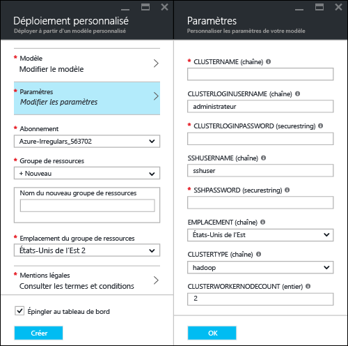
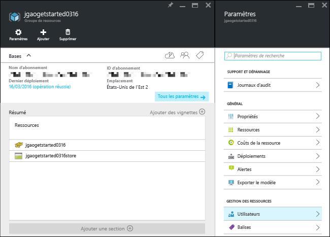
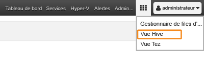

<properties
   	pageTitle="Didacticiel Linux : prise en main de Hadoop et Hive | Microsoft Azure"
   	description="Suivez ce didacticiel Linux pour apprendre à utiliser Hadoop dans HDInsight. Découvrez comment approvisionner des clusters Linux et interroger des données avec Hive."
   	services="hdinsight"
   	documentationCenter=""
   	authors="mumian"
   	manager="jhubbard"
   	editor="cgronlun"
	tags="azure-portal"/>

<tags
   	ms.service="hdinsight"
   	ms.devlang="na"
   	ms.topic="hero-article"
   	ms.tgt_pltfrm="na"
   	ms.workload="big-data"
   	ms.date="09/14/2016"
   	ms.author="jgao"/>

# Didacticiel Hadoop : prise en main de Hadoop sous Linux dans HDInsight

> [AZURE.SELECTOR]
- [Linux](hdinsight-hadoop-linux-tutorial-get-started.md)
- [Windows](hdinsight-hadoop-tutorial-get-started-windows.md)

Apprenez à créer des clusters [Hadoop](http://hadoop.apache.org/) dans HDInsight et à exécuter des tâches Hive dans HDInsight. [Apache Hive](https://hive.apache.org/) est le composant le plus populaire de l’écosystème Hadoop. HDInsight est actuellement fourni avec 4 types de clusters différents : [Hadoop](hdinsight-hadoop-introduction.md), [Spark](hdinsight-apache-spark-overview.md), [HBase](hdinsight-hbase-overview.md) et [Storm](hdinsight-storm-overview.md). Chaque type de cluster prend en charge un ensemble de composants bien spécifiques. Les 4 types de cluster prennent en charge Hive. Pour obtenir la liste des composants pris en charge dans HDInsight, consultez [Nouveautés des versions de cluster Hadoop fournies par HDInsight](hdinsight-component-versioning.md).

[AZURE.INCLUDE [delete-cluster-warning](../../includes/hdinsight-delete-cluster-warning.md)]

## Composants requis

Avant de commencer ce didacticiel, vous devez disposer des éléments suivants :

- **Abonnement Azure** : pour créer un compte d’essai gratuit d’une durée d’un mois, accédez à [azure.microsoft.com/free](https://azure.microsoft.com/free).

### Exigences de contrôle d’accès

[AZURE.INCLUDE [access-control](../../includes/hdinsight-access-control-requirements.md)]

## Créer un cluster

La plupart des tâches Hadoop sont des tâches de traitements par lots. Vous créez un cluster, exécutez certaines tâches, puis supprimez le cluster. Dans cette section, vous allez créer un cluster Hadoop sous Linux dans HDInsight à l’aide du [modèle Azure Resource Manager](../resource-group-template-deploy.md). Le modèle Resource Manager est entièrement personnalisable ; il facilite la création de ressources Azure, telles que HDInsight. Aucune expérience avec le modèle Resource Manager n’est requise pour ce didacticiel. Pour obtenir d’autres méthodes de création de cluster et comprendre les propriétés utilisées dans ce didacticiel, consultez [Création de clusters HDInsight](hdinsight-hadoop-provision-linux-clusters.md). Le modèle Resource Manager utilisé dans ce didacticiel se trouve dans un conteneur d’objets blob public, disponible à l’adresse [https://hditutorialdata.blob.core.windows.net/armtemplates/create-linux-based-hadoop-cluster-in-hdinsight.json](https://hditutorialdata.blob.core.windows.net/armtemplates/create-linux-based-hadoop-cluster-in-hdinsight.json).

1. Cliquez sur l’image suivante pour vous connecter à Azure et ouvrir le modèle Resource Manager dans le portail Azure.

	

2. À partir du panneau **Paramètres**, saisissez les informations suivantes :

    .

    - **ClusterName** : entrez un nom pour le cluster Hadoop que vous allez créer.
    - **Nom d’utilisateur et mot de passe de cluster** : le nom de connexion par défaut est **admin**.
    - **Nom d’utilisateur SSH et mot de passe** : le nom d’utilisateur par défaut est **sshuser**. Vous pouvez le renommer.
    
    Les autres paramètres ne sont pas nécessaires dans le cadre de ce didacticiel. Vous pouvez les laisser tels quels.
    
    Chaque cluster possède une dépendance de compte Azure Blob Storage. Il est habituellement désigné comme compte de stockage par défaut. Le cluster HDInsight et son compte de stockage par défaut doivent figurer dans la même région Azure. La suppression de clusters n’a pas pour effet de supprimer le compte de stockage. Dans le modèle, le nom du compte de stockage par défaut est défini comme le nom du cluster suivi du suffixe « store ».
    
3. Cliquez sur **OK** pour enregistrer les paramètres.
4. Dans le panneau **Déploiement personnalisé**, entrez le **Nom du nouveau groupe de ressources** pour créer un groupe de ressources. Le groupe de ressources est un conteneur qui regroupe le cluster, le compte de stockage dépendant et une autre ressource liée. L’emplacement du groupe de ressources peut être différent de celui du cluster.
5. Cliquez sur **Conditions juridiques**, puis sur **Créer**.
6. Vérifiez que la case **Épingler au tableau de bord** est cochée, puis cliquez sur **Créer**. Vous verrez une nouvelle vignette intitulée **Déploiement du déploiement de modèle**. La création d’un cluster prend environ 20 minutes.
7.  Une fois le cluster créé, la vignette change de légende pour afficher le nom du groupe de ressources que vous avez spécifié. Le portail ouvre automatiquement deux panneaux dédiés au cluster et aux paramètres du cluster.

    .

    Deux ressources sont répertoriées : le cluster et le compte de stockage par défaut.

##Exécuter des requêtes Hive

[Apache Hive](hdinsight-use-hive.md) est le composant le plus populaire utilisé dans HDInsight. Il existe de nombreuses façons d’exécuter des tâches Hive dans HDInsight. Dans ce didacticiel, vous allez utiliser l’affichage Ambari Hive à partir du portail pour exécuter certaines tâches Hive. Pour d’autres méthodes d’envoi de tâches Hive, consultez la page [Utilisation de Hive et HiveQL avec Hadoop dans HDInsight pour l’analyse d’un exemple de fichier Apache log4j](hdinsight-use-hive.md).

1. Accédez à **https://&lt;ClusterName>.azurehdinsight.net**, où &lt;ClusterName> désigne le cluster que vous avez créé dans la section précédente pour ouvrir Ambari.
2. Entrez le nom d’utilisateur Hadoop et le mot de passe que vous avez spécifiés dans la section précédente. Le nom d’utilisateur par défaut est **admin**.
3. Ouvrez l’**affichage Hive** comme illustré dans la capture d’écran suivante.

    .
4. Dans la section __Éditeur de requête__ de la page, collez les instructions HiveQL suivantes dans la feuille de calcul :

		SHOW TABLES;

    >[AZURE.NOTE] Hive requiert l’utilisation d’un point-virgule.
        
5. Cliquez sur __Exécuter__. Une section __Résultats du processus de requête__ doit apparaître en dessous de l’éditeur de requête et afficher des informations sur la tâche.

    Une fois la requête terminée, la section __Résultats du processus de requête__ affiche les résultats de l’opération. Vous devriez voir une table appelée **hivesampletable**. Cet exemple de table Hive est fourni avec les clusters HDInsight.

    .

6. Répétez les étapes 4 et 5 pour exécuter la requête suivante :

        SELECT * FROM hivesampletable;

    > [AZURE.TIP] Notez la présence du menu déroulant __Enregistrer les résultats__ en haut à gauche de la section __Résultats du processus de requête__ ; vous pouvez ce menu pour télécharger les résultats ou pour les enregistrer dans un stockage HDInsight sous la forme d’un fichier CSV.

7. Cliquez sur **Historique** pour obtenir la liste des tâches.

Une fois que vous avez terminé une tâche Hive, vous pouvez [exporter les résultats dans une base de données SQL Azure ou SQL Server](hdinsight-use-sqoop-mac-linux.md). Vous pouvez également [visualiser les résultats à l’aide d’Excel](hdinsight-connect-excel-power-query.md). Pour plus d’informations sur l’utilisation de Hive dans HDInsight, consultez [Utilisation de Hive et HiveQL avec Hadoop dans HDInsight pour l’analyse d’un exemple de fichier Apache log4j](hdinsight-use-hive.md).

##Nettoyage du didacticiel

Après avoir terminé ce didacticiel, vous souhaiterez peut-être supprimer le cluster. Avec HDInsight, vos données sont stockées Azure Storage, pour que vous puissiez supprimer un cluster en toute sécurité s’il n’est pas en cours d’utilisation. Vous devez également payer pour un cluster HDInsight, même lorsque vous ne l’utilisez pas. Étant donné que les frais pour le cluster sont bien plus élevés que les frais de stockage, économique, mieux vaut supprimer les clusters lorsqu’ils ne sont pas utilisés.

>[AZURE.NOTE] À l’aide d’[Azure Data Factory](hdinsight-hadoop-create-linux-clusters-adf.md), vous pouvez créer des clusters HDInsight à la demande et configurer un paramètre TimeToLive pour supprimer automatiquement des clusters.

**Pour supprimer le cluster et/ou le compte de stockage par défaut**

1. Connectez-vous au [portail Azure](https://portal.azure.com).
2. À partir du tableau de bord du portail, cliquez sur la vignette portant le nom du groupe de ressources que vous avez utilisé lors de la création du cluster.
3. Cliquez sur **Supprimer** dans le panneau Ressources pour supprimer le groupe de ressources contenant le cluster et le compte de stockage par défaut ; sinon, cliquez sur le nom du cluster dans la vignette **Ressources**, puis cliquez sur **Supprimer** dans le panneau du cluster. Notez que la suppression du groupe de ressources aura pour effet de supprimer le compte de stockage. Si vous souhaitez conserver le compte de stockage, choisissez de supprimer uniquement le cluster.

## Étapes suivantes

Dans ce didacticiel, vous avez appris à créer un cluster HDInsight Linux à l’aide d’un modèle Resource Manager et à effectuer des requêtes Hive de base.

Pour en savoir plus sur l’analyse des données avec HDInsight, consultez les articles suivants :

- Pour en savoir plus sur l’utilisation de Hive avec HDInsight, y compris comment exécuter des requêtes Hive à partir de Visual Studio, consultez la page [Utilisation de Hive avec HDInsight][hdinsight-use-hive].

- Pour en savoir plus sur Pig, un langage utilisé pour transformer les données, consultez la page [Utilisation de Pig avec HDInsight][hdinsight-use-pig].

- Pour en savoir plus sur MapReduce, un moyen d’écrire des programmes pour traiter les données sur Hadoop, consultez la page [Utilisation de MapReduce avec HDInsight][hdinsight-use-mapreduce].

- Pour en savoir plus sur l’utilisation des outils HDInsight pour Visual Studio pour analyser les données sur HDInsight, consultez la page [Prise en main des outils Hadoop de Visual Studio pour HDInsight](hdinsight-hadoop-visual-studio-tools-get-started.md).

Si vous êtes prêt à commencer à utiliser vos propres données et que vous avez besoin d’en savoir plus sur la façon dont HDInsight stocke les données ou sur l’ajout de données dans HDInsight, consultez les articles suivants :

- Pour plus d’informations sur la façon dont HDInsight utilise le stockage d’objets blob Azure, consultez la page [Utilisation du stockage d’objets blob Azure avec HDInsight](hdinsight-hadoop-use-blob-storage.md).

- Pour plus d’informations sur le téléchargement de données dans HDInsight, consultez la page [Téléchargement de données dans HDInsight][hdinsight-upload-data].

Si vous voulez en savoir plus sur la création ou la gestion d’un cluster HDInsight, consultez les rubriques suivantes :

- Pour en savoir plus sur la gestion de votre cluster HDInsight Linux, consultez la page [Gestion des clusters HDInsight à l’aide d’Ambari](hdinsight-hadoop-manage-ambari.md).

- Pour en savoir plus sur les options que vous pouvez sélectionner pendant la création d’un cluster HDInsight, consultez la page [Création de clusters Hadoop basés sur Linux dans HDInsight](hdinsight-hadoop-provision-linux-clusters.md).

- Si vous maîtrisez Linux et Hadoop, mais que vous souhaitez connaître les spécificités de Hadoop sur HDInsight, consultez la page [Utilisation de HDInsight sur Linux](hdinsight-hadoop-linux-information.md). Cette rubrique vous fournit des informations telles que :

	* les URL correspondant aux services hébergés sur le cluster, tels qu'Ambari et WebHCat
	* l'emplacement des fichiers Hadoop et des exemples sur le système de fichiers local
	* l'utilisation de stockage d'Azure Storage (WASB) au lieu de HDFS, en tant que stockage de données par défaut

[1]: ../HDInsight/hdinsight-hadoop-visual-studio-tools-get-started.md

[hdinsight-provision]: hdinsight-provision-clusters.md
[hdinsight-admin-powershell]: hdinsight-administer-use-powershell.md
[hdinsight-upload-data]: hdinsight-upload-data.md
[hdinsight-use-mapreduce]: hdinsight-use-mapreduce.md
[hdinsight-use-hive]: hdinsight-use-hive.md
[hdinsight-use-pig]: hdinsight-use-pig.md

[powershell-download]: http://go.microsoft.com/fwlink/p/?linkid=320376&clcid=0x409
[powershell-install-configure]: powershell-install-configure.md
[powershell-open]: powershell-install-configure.md#Install

[img-hdi-dashboard]: ./media/hdinsight-hadoop-tutorial-get-started-windows/HDI.dashboard.png
[img-hdi-dashboard-query-select]: ./media/hdinsight-hadoop-tutorial-get-started-windows/HDI.dashboard.query.select.png
[img-hdi-dashboard-query-select-result]: ./media/hdinsight-hadoop-tutorial-get-started-windows/HDI.dashboard.query.select.result.png
[img-hdi-dashboard-query-select-result-output]: ./media/hdinsight-hadoop-tutorial-get-started-windows/HDI.dashboard.query.select.result.output.png
[img-hdi-dashboard-query-browse-output]: ./media/hdinsight-hadoop-tutorial-get-started-windows/HDI.dashboard.query.browse.output.png
[image-hdi-clusterstatus]: ./media/hdinsight-hadoop-tutorial-get-started-windows/HDI.ClusterStatus.png
[image-hdi-gettingstarted-powerquery-importdata]: ./media/hdinsight-hadoop-tutorial-get-started-windows/HDI.GettingStarted.PowerQuery.ImportData.png
[image-hdi-gettingstarted-powerquery-importdata2]: ./media/hdinsight-hadoop-tutorial-get-started-windows/HDI.GettingStarted.PowerQuery.ImportData2.png

<!---HONumber=AcomDC_1005_2016-->