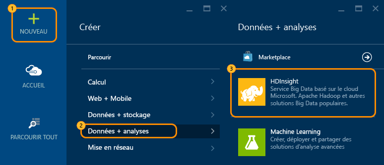
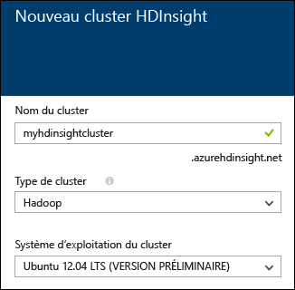
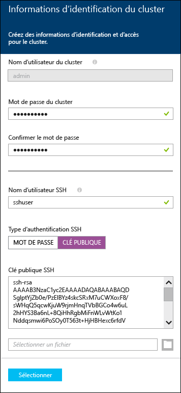
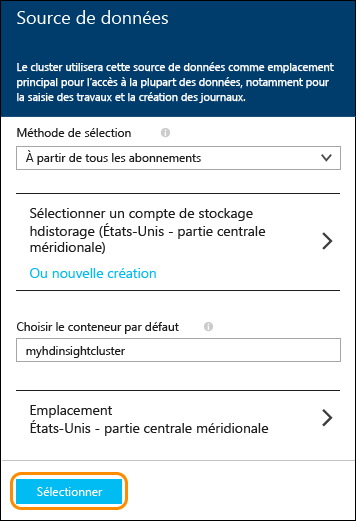
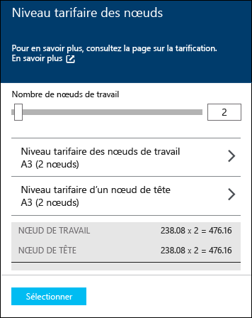

<properties
   	pageTitle="Didacticiel Linux : prise en main de Hadoop et Hive | Microsoft Azure"
   	description="Suivez ce didacticiel Linux pour apprendre à utiliser Hadoop dans HDInsight. Découvrez comment approvisionner des clusters Linux et interroger des données avec Hive."
   	services="hdinsight"
   	documentationCenter=""
   	authors="nitinme"
   	manager="paulettm"
   	editor="cgronlun"
	tags="azure-portal"/>

<tags
   	ms.service="hdinsight"
   	ms.devlang="na"
   	ms.topic="hero-article"
   	ms.tgt_pltfrm="na"
   	ms.workload="big-data"
   	ms.date="01/13/2016"
   	ms.author="nitinme"/>

# Didacticiel Hadoop : prise en main de Hadoop avec Hive dans HDInsight sur Linux

> [AZURE.SELECTOR]
- [Windows](hdinsight-hadoop-tutorial-get-started-windows.md)
- [Linux](hdinsight-hadoop-linux-tutorial-get-started.md)

Ce document vous permet de vous familiariser rapidement avec Azure HDInsight sous Linux en vous expliquant la procédure à suivre pour créer un cluster Hadoop sous Linux, ouvrir l’interface utilisateur Web d’Ambari, puis exécuter une requête Hive à l’aide de la vue Hive Ambari.

> [AZURE.NOTE]Si vous ne connaissez pas Hadoop et le Big Data, vous pouvez en savoir plus sur les termes [Apache Hadoop](http://go.microsoft.com/fwlink/?LinkId=510084), [MapReduce](http://go.microsoft.com/fwlink/?LinkId=510086), [HDFS (Hadoop Distributed File System)](http://go.microsoft.com/fwlink/?LinkId=510087) et [Hive](http://go.microsoft.com/fwlink/?LinkId=510085). Pour comprendre la manière dont HDInsight prend en charge Hadoop dans Azure, consultez la rubrique [Présentation de Hadoop dans HDInsight](hdinsight-hadoop-introduction.md).

## Composants requis

Avant de commencer ce didacticiel Linux pour Hadoop, vous devez disposer des éléments suivants :

- **Un abonnement Azure** : consultez [Obtention d’un essai gratuit Azure](http://azure.microsoft.com/documentation/videos/get-azure-free-trial-for-testing-hadoop-in-hdinsight/).

## Approvisionnement d’un cluster HDInsight sous Linux

Quand vous approvisionnez un cluster, vous créez les ressources de calcul Azure qui contiennent les services et ressources Hadoop. Dans cette section, vous approvisionnez un cluster HDInsight version 3.2, qui contient la version 2.2 de Hadoop. Pour en savoir plus sur les différentes versions de HDInsight et leurs contrats SLA, consultez la page [Contrôle de version des composants HDInsight](hdinsight-component-versioning.md). Pour plus d’informations sur la création d’un cluster HDInsight, consultez [Approvisionnement de clusters HDInsight à l’aide d’options personnalisées][hdinsight-provision].

>[AZURE.NOTE]Vous pouvez également créer des clusters Hadoop exécutant le système d'exploitation Windows Server. Pour obtenir des instructions, consultez [Prise en main de HDInsight sur Windows](hdinsight-hadoop-tutorial-get-started-windows.md).

Procédez comme suit pour créer un cluster :

1. Connectez-vous au [portail Azure](https://ms.portal.azure.com/).
2. Cliquez sur **NOUVEAU**, sur **Analyse des données**, puis sur **HDInsight**.

    

3. Entrez un **Nom de cluster**, sélectionnez **Hadoop** comme **Type de cluster** et, dans le menu déroulant **Système d’exploitation de cluster**, sélectionnez **Ubuntu**. Une coche verte apparaît en regard du nom de cluster s'il est disponible.

	

4. Si vous avez plusieurs abonnements, cliquez sur l’entrée **Abonnement** pour sélectionner l’abonnement Azure qui sera utilisé pour le cluster.

5. Cliquez sur **Groupe de ressources** pour afficher une liste des groupes de ressources existants, puis sélectionnez celui dans lequel créer le cluster. Vous pouvez également cliquer sur **CRÉER UN NOUVEAU**, puis saisir le nom du nouveau groupe de ressources. Une coche verte s’affiche pour indiquer si le nouveau nom de groupe est disponible.

	> [AZURE.NOTE]Cette entrée ira par défaut dans l'un des groupes de ressources existants, si l'un d'eux est disponible.

6. Cliquez sur **Informations d’identification**, puis entrez un mot de passe pour l’utilisateur admin. Vous devez également entrer un **Nom d’utilisateur SSH**. Pour **Type d’authentification SSH**, cliquez sur **MOT DE PASSE** et spécifiez un mot de passe pour l’utilisateur SSH. Cliquez sur **Sélectionner** au bas de l’écran pour enregistrer la configuration des informations d’identification.

	

    > [AZURE.NOTE]SSH permet d’accéder à distance au cluster HDInsight à l’aide d’une ligne de commande. Le nom d’utilisateur et le mot de passe que vous employez ici sont utilisés pour la connexion au cluster via SSH.

	Pour plus d’informations sur l’utilisation de SSH avec HDInsight, consultez l’un des articles suivants :

	* [Utilisation de SSH avec Hadoop Linux sur HDInsight à partir de Linux, Unix ou OS X](hdinsight-hadoop-linux-use-ssh-unix.md)
	* [Utilisation de SSH avec Hadoop Linux sur HDInsight à partir de Windows](hdinsight-hadoop-linux-use-ssh-windows.md)

7. Cliquez sur **Source de données** pour choisir une source de données existante pour le cluster ou en créer une. Lors de l'approvisionnement d'un cluster Hadoop dans HDInsight, vous spécifiez un compte Azure Storage. Un conteneur de stockage d'objets blob spécifique de ce compte est désigné en tant que système de fichiers par défaut, comme dans un système de fichiers distribués Hadoop (HDFS). Par défaut, le cluster HDInsight est approvisionné dans le même centre de données que le compte de stockage que vous spécifiez. Pour plus d'informations, consultez [Utilisation du stockage d'objets blob Azure avec HDInsight](hdinsight-use-blob-storage.md).

	

	Actuellement, vous pouvez sélectionner un compte de stockage Azure comme source de données pour un cluster HDInsight. Lisez ce qui suit pour comprendre à quoi correspondent les entrées du panneau **Source de données**.

	- **Méthode de sélection** : définissez cette propriété sur la valeur **De tous les abonnements** pour permettre l’exploration des comptes de stockage de tous vos abonnements. Affectez-lui la valeur **Clé d’accès** si vous souhaitez saisir le **Nom de stockage** et la **Clé d’accès** d’un compte de stockage existant.

	- **Sélectionner le compte de stockage / Créer un nouveau** : cliquez sur **Sélectionner le compte de stockage** pour parcourir et sélectionner un compte de stockage existant à associer au cluster. Vous pouvez également cliquer sur **Créer un nouveau** pour créer un nouveau compte de stockage. Utilisez le champ qui s’affiche pour saisir le nom du compte de stockage. Une coche verte s’affiche si le nom est disponible.

	- **Choisir le conteneur par défaut** : utilisez cette option pour saisir le nom du conteneur par défaut à utiliser pour le cluster. Vous pouvez saisir n’importe quel nom, mais nous vous conseillons d’utiliser le même nom que le cluster pour pouvoir facilement reconnaître le conteneur utilisé pour ce cluster spécifique.

	- **Emplacement** : zone géographique dans laquelle le compte de stockage se trouve ou dans laquelle il sera créé.

		> [AZURE.IMPORTANT]La sélection de l’emplacement de la source de données par défaut définira également l’emplacement du cluster HDInsight. Le cluster et la source de données par défaut doivent se trouver dans la même région.

	Cliquez sur **Sélectionner** pour enregistrer la configuration de source de données.

8. Cliquez sur **Niveaux tarifaires de nœud** pour afficher des informations sur les nœuds qui seront créés pour ce cluster. Définissez le nombre de nœuds worker dont vous avez besoin pour le cluster. Le coût estimé du cluster s’affiche dans le panneau.

	
    
    > [AZURE.IMPORTANT]Si vous envisagez d’utiliser plus de 32 nœuds worker lors de la création du cluster ou en faisant évoluer le cluster après sa création, vous devez sélectionner une taille de nœud principal avec au moins 8 cœurs et 14 Go de RAM.
    >
    > Pour plus d’informations sur les tailles de nœud et les coûts associés, consultez [Tarification HDInsight](https://azure.microsoft.com/pricing/details/hdinsight/).

	Cliquez sur **Sélectionner** pour enregistrer la configuration de la tarification du nœud.

9. Dans le panneau **Nouveau cluster HDInsight**, assurez-vous que l’option **Épingler au tableau d’accueil** est sélectionnée, puis cliquez sur **Créer**. Le cluster est créé et la vignette correspondante ajoutée au tableau d’accueil de votre portail Azure. L'icône indique que le cluster est en cours de configuration et sera modifiée pour représenter l'icône HDInsight une fois la configuration terminée.

Pendant l’approvisionnement|Approvisionnement terminé
------------------|---------------------
	|

> [AZURE.NOTE]La création du cluster prend un certain temps (en règle générale, environ 15 minutes). Utilisez la mosaïque du tableau d’accueil ou l’entrée **Notifications** à gauche de la page pour vérifier le processus d’approvisionnement.

Une fois la configuration terminée, cliquez sur la vignette du cluster dans le tableau d'accueil pour lancer le panneau du cluster.

##Connexion à la vue Hive

Ambari Views met à votre disposition plusieurs utilitaires via une page web. Dans les sections suivantes, vous utiliserez la vue Hive pour exécuter des requêtes Hive sur votre cluster HDInsight.

> [AZURE.NOTE]Ambari est un utilitaire de gestion et de surveillance fourni avec les clusters HDInsight sous Linux. Ambari offre de nombreuses fonctionnalités qui ne seront pas traitées dans ce document. Pour plus d’informations, consultez [Gérer des clusters HDInsight à l’aide de l’interface utilisateur web d’Ambari](hdinsight-hadoop-manage-ambari.md).

Pour accéder à Ambari Views à partir du portail Azure, sélectionnez votre cluster HDInsight, puis sélectionnez __Vues Ambari__ dans la section __Liens rapides__.

Vous pouvez également accéder directement à Ambari en accédant à https://CLUSTERNAME.azurehdinsight.net dans un navigateur web (où __CLUSTERNAME__ est le nom de votre cluster HDInsight), puis sélectionner l’ensemble de carrés dans le menu de la page (en regard du lien __Admin__ et du bouton à gauche de la page) pour dresser la liste des vues disponibles. Sélectionnez la __vue Hive__.

.

> [AZURE.NOTE]En accédant à Ambari, vous êtes invité à vous authentifier sur le site : Saisissez l’administrateur (`admin` par défaut), le nom du compte et le mot de passe que vous avez utilisés lors de la création du cluster.

Une page similaire à celle ci-dessous doit s'afficher :

##Exécution d’une requête Hive

Pour exécuter une requête Hive sur les données incluses avec le cluster, suivez la procédure décrite ci-dessous à partir de la vue Hive.

1. Dans la section __Éditeur de requête__ de la page, collez les instructions HiveQL suivantes dans la feuille de calcul :

		DROP TABLE log4jLogs;
		CREATE EXTERNAL TABLE log4jLogs(t1 string, t2 string, t3 string, t4 string, t5 string, t6 string, t7 string)
		ROW FORMAT DELIMITED FIELDS TERMINATED BY ' '
		STORED AS TEXTFILE LOCATION 'wasb:///example/data/';
		SELECT t4 AS sev, COUNT(*) AS cnt FROM log4jLogs WHERE t4 = '[ERROR]' GROUP BY t4;

	Ces instructions effectuent les opérations suivantes :

	- **DROP TABLE** : supprime la table et le fichier de données, au cas où la table existe déjà.
	- **CREATE EXTERNAL TABLE** : crée une nouvelle table « externe » dans Hive. Les tables externes stockent uniquement la définition de table dans Hive ; les données restent dans l'emplacement d'origine.
	- **ROW FORMAT** : indique à Hive comment les données mises en forme. Dans ce cas, les champs de chaque journal sont séparés par un espace.
	- **STORED AS TEXTFILE LOCATION** : indique à Hive où sont stockées les données (répertoire example/data) et qu'elles sont stockées sous forme de texte.
	- **SELECT** : sélectionne toutes les lignes dont la colonne t4 contient la valeur [ERROR].

	>[AZURE.NOTE]Les tables externes doivent être utilisées lorsque les données sous-jacentes sont censées être mises à jour par une source externe (comme, par exemple, dans le cas d’un processus de téléchargement automatique des données) ou par une autre opération MapReduce, mais vous souhaitez toujours que les requêtes Hive utilisent les données les plus récentes. La suppression d'une table externe ne supprime *pas* les données, mais seulement la définition de table.

2. Utilisez le bouton __Exécuter__ au bas de l’éditeur de requête pour démarrer la requête. Le bouton doit s’afficher en orange et indiquer le libellé __Arrêter l’exécution__. Une section __Résultats du processus de requête__ doit apparaître en dessous de l’éditeur de requête et afficher des informations sur la tâche.

    > [AZURE.IMPORTANT]Certains navigateurs peuvent ne pas actualiser correctement le fichier journal ou les informations de résultats. Si vous exécutez une tâche et que celle-ci semble s’exécuter indéfiniment sans mettre à jour le journal ou renvoyer des résultats, essayez d’utiliser Mozilla FireFox ou Google Chrome.
    
3. Une fois la requête terminée, la section __Résultats du processus de requête__ affiche les résultats de l’opération. Le bouton __Arrêter l’exécution__ s’affichera de nouveau en vert avec le libellé __Exécuter__. Les informations suivantes devraient s’afficher dans l’onglet __Résultats__ :

        sev       cnt
        [ERROR]   3

    L’onglet __Journaux__ peut être utilisé pour afficher les informations de journalisation créées par la tâche. Vous pouvez les utiliser résoudre des problèmes sur une requête.
    
    > [AZURE.TIP]Notez la présence du menu déroulant __Enregistrer les résultats__ en haut à gauche de la section __Résultats du processus de requête__ ; vous pouvez ce menu pour télécharger les résultats ou pour les enregistrer dans un stockage HDInsight sous la forme d’un fichier CSV.

3. Sélectionnez les quatre premières lignes de cette requête, puis sélectionnez __Exécuter__. Notez qu’aucun résultat n’est renvoyé à la fin de la tâche. En effet, si vous utilisez le bouton __Exécuter__ alors que vous avez sélectionné une partie de la requête, seules les instructions sélectionnées seront exécutées. Dans ce cas, la sélection n’inclut pas l’instruction finale qui consiste à extraire des lignes de la table. Si vous sélectionnez uniquement cette ligne et que vous utilisez le bouton __Exécuter__, vous devriez obtenir les résultats attendus.

3. Utilisez le bouton __Nouvelle feuille de calcul__ au bas de l’__Éditeur de requête__ pour créer une feuille de calcul. Dans la nouvelle feuille de calcul, entrez les instructions HiveQL suivantes :

		CREATE TABLE IF NOT EXISTS errorLogs (t1 string, t2 string, t3 string, t4 string, t5 string, t6 string, t7 string) STORED AS ORC;
		INSERT OVERWRITE TABLE errorLogs SELECT t1, t2, t3, t4, t5, t6, t7 FROM log4jLogs WHERE t4 = '[ERROR]';

	Ces instructions effectuent les opérations suivantes :

	- **CREATE TABLE IF NOT EXISTS** : crée une table, si elle n'existe pas déjà. Le mot-clé **EXTERNAL** n’étant pas utilisé, il s’agit d’une table interne, stockée dans l’entrepôt de données Hive et gérée intégralement par Hive. Contrairement aux tables externes, la suppression d’une table interne entraîne également la suppression des données sous-jacentes.
	- **STORED AS ORC** : stocke les données dans un format ORC (Optimized Row Columnar). Il s'agit d'un format particulièrement efficace et optimisé pour le stockage de données Hive.
	- **INSERT OVERWRITE ... SELECT** : sélectionne les lignes de la table **log4jLogs** qui contiennent [ERROR], puis insère les données dans la table **errorLogs**.
    
    Utilisez le bouton __Exécuter__ pour exécuter cette requête. L’onglet __Résultats__ ne contiendra aucune information puisque cette requête ne renvoie aucune ligne. En revanche, elle devrait afficher l’état __SUCCEEDED__.
    
4. À droite de l’Éditeur de requête se trouve une ligne d’icônes. Sélectionnez celle qui ressemble à une chaîne.

    
    
    Il s’agit de la vue __Visual Explain__ de la requête, qui peut être utile pour comprendre le déroulement de requêtes complexes. Vous pouvez afficher un équivalent textuel de cette vue à l’aide du bouton __Expliquer__ de l’éditeur de requête.
    
    
    
    Autres icônes disponibles :
    
	* Paramètres : l’icône d’engrenage vous permet de modifier les paramètres Ruche, tels que la configuration des paramètres `hive.execution.engine` ou Tez.
	* Tez : affiche le graphe orienté acyclique utilisé par Tez pour effectuer la requête. Si vous souhaitez afficher le DAG pour les requêtes que vous avez exécutées par le passé, utilisez plutôt la __vue Tez__.
	* Notifications : affiche des notifications, telles que « La requête a bien été soumise », ou indique si une erreur s’est produite lors de la requête.

5. Sélectionnez l’icône __SQL__ pour revenir à l’éditeur de requête, puis créez une nouvelle feuille de calcul et entrez la requête suivante :

        SELECT * from errorLogs;
    
    Cliquez sur le bouton __Enregistrer sous__ au bas de l’éditeur. Nommez cette requête __Errorlogs__ et sélectionnez __OK__. Notez que la feuille de calcul prend le nom __Errorlogs__.
    
    Les requêtes enregistrées apparaissent également dans l’onglet __Requêtes enregistrées__ en haut de la page. Sélectionnez cette option pour afficher la requête __Errorlogs__. Sélectionnez le nom pour ouvrir la requête dans l’éditeur de requête.

4. Exécutez la requête __Errorlogs__. Vous obtenez les résultats suivants :

        errorlogs.t1 	errorlogs.t2 	errorlogs.t3 	errorlogs.t4 	errorlogs.t5 	errorlogs.t6 	errorlogs.t7
        2012-02-03 	18:35:34 	SampleClass0 	[ERROR] 	incorrect 	id 	
        2012-02-03 	18:55:54 	SampleClass1 	[ERROR] 	incorrect 	id 	
        2012-02-03 	19:25:27 	SampleClass4 	[ERROR] 	incorrect 	id

## Étapes suivantes

Dans ce document, vous avez appris à créer un cluster HDInsight Linux à l’aide du portail Azure, à vous connecter au cluster à l’aide de SSH et à effectuer des requêtes Hive de base.

Pour en savoir plus sur l’analyse des données avec HDInsight, consultez les articles suivants :

- Pour en savoir plus sur l’utilisation de Hive avec HDInsight, y compris comment exécuter des requêtes Hive à partir de Visual Studio, consultez la page [Utilisation de Hive avec HDInsight][hdinsight-use-hive].

- Pour en savoir plus sur Pig, un langage utilisé pour transformer les données, consultez la page [Utilisation de Pig avec HDInsight][hdinsight-use-pig].

- Pour en savoir plus sur MapReduce, un moyen d’écrire des programmes pour traiter les données sur Hadoop, consultez la page [Utilisation de MapReduce avec HDInsight][hdinsight-use-mapreduce].

- Pour en savoir plus sur l’utilisation des outils HDInsight pour Visual Studio pour analyser les données sur HDInsight, consultez la page [Prise en main des outils Hadoop de Visual Studio pour HDInsight](hdinsight-hadoop-visual-studio-tools-get-started.md).

Si vous êtes prêt à commencer à utiliser vos propres données et que vous avez besoin d’en savoir plus sur la façon dont HDInsight stocke les données ou sur l’ajout de données dans HDInsight, consultez les articles suivants :

- Pour plus d’informations sur la façon dont HDInsight utilise le stockage d’objets blob Azure, consultez la page [Utilisation du stockage d’objets blob Azure avec HDInsight](hdinsight-use-blob-storage.md).

- Pour plus d’informations sur le téléchargement de données dans HDInsight, consultez la page [Téléchargement de données dans HDInsight][hdinsight-upload-data].

Si vous voulez en savoir plus sur la création ou la gestion d’un cluster HDInsight, consultez les rubriques suivantes :

- Pour en savoir plus sur la gestion de votre cluster HDInsight Linux, consultez la page [Gestion des clusters HDInsight à l’aide d’Ambari](hdinsight-hadoop-manage-ambari.md).

- Pour en savoir plus sur les options que vous pouvez sélectionner pendant la création d’un cluster HDInsight, consultez la page [Approvisionnement de HDInsight sur Linux à l’aide des options personnalisées](hdinsight-hadoop-provision-linux-clusters.md).

- Si vous maîtrisez Linux et Hadoop, mais que vous souhaitez connaître les spécificités de Hadoop sur HDInsight, consultez la page [Utilisation de HDInsight sur Linux](hdinsight-hadoop-linux-information.md). Cette rubrique vous fournit des informations telles que :

	* les URL correspondant aux services hébergés sur le cluster, tels qu'Ambari et WebHCat
	* l'emplacement des fichiers Hadoop et des exemples sur le système de fichiers local
	* l'utilisation de stockage d'Azure Storage (WASB) au lieu de HDFS, en tant que stockage de données par défaut

[1]: ../HDInsight/hdinsight-hadoop-visual-studio-tools-get-started.md

[hdinsight-provision]: hdinsight-provision-clusters.md
[hdinsight-admin-powershell]: hdinsight-administer-use-powershell.md
[hdinsight-upload-data]: hdinsight-upload-data.md
[hdinsight-use-mapreduce]: hdinsight-use-mapreduce.md
[hdinsight-use-hive]: hdinsight-use-hive.md
[hdinsight-use-pig]: hdinsight-use-pig.md

[powershell-download]: http://go.microsoft.com/fwlink/p/?linkid=320376&clcid=0x409
[powershell-install-configure]: ../install-configure-powershell.md
[powershell-open]: ../install-configure-powershell.md#Install

[img-hdi-dashboard]: ./media/hdinsight-hadoop-tutorial-get-started-windows/HDI.dashboard.png
[img-hdi-dashboard-query-select]: ./media/hdinsight-hadoop-tutorial-get-started-windows/HDI.dashboard.query.select.png
[img-hdi-dashboard-query-select-result]: ./media/hdinsight-hadoop-tutorial-get-started-windows/HDI.dashboard.query.select.result.png
[img-hdi-dashboard-query-select-result-output]: ./media/hdinsight-hadoop-tutorial-get-started-windows/HDI.dashboard.query.select.result.output.png
[img-hdi-dashboard-query-browse-output]: ./media/hdinsight-hadoop-tutorial-get-started-windows/HDI.dashboard.query.browse.output.png
[image-hdi-clusterstatus]: ./media/hdinsight-hadoop-tutorial-get-started-windows/HDI.ClusterStatus.png
[image-hdi-gettingstarted-powerquery-importdata]: ./media/hdinsight-hadoop-tutorial-get-started-windows/HDI.GettingStarted.PowerQuery.ImportData.png
[image-hdi-gettingstarted-powerquery-importdata2]: ./media/hdinsight-hadoop-tutorial-get-started-windows/HDI.GettingStarted.PowerQuery.ImportData2.png

<!---HONumber=AcomDC_0114_2016-->