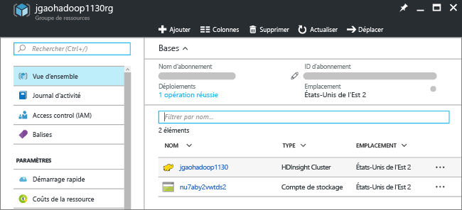

# Didacticiel Hadoop : prise en main de Hadoop dans HDInsight

Apprenez à créer des clusters [Hadoop](http://hadoop.apache.org/) et exécuter des tâches Hive dans HDInsight. [Apache Hive](https://hive.apache.org/) est le composant le plus populaire de l’écosystème Hadoop. Actuellement, HDInsight est fourni avec six types de cluster différents : [Hadoop](hdinsight-hadoop-introduction.md), [Spark](hdinsight-apache-spark-overview.md), [HBase](hdinsight-hbase-overview.md), [Storm](hdinsight-storm-overview.md), [Hive Interactif (version préliminaire)](hdinsight-hadoop-use-interactive-hive.md) et [R server](hdinsight-hadoop-r-server-overview.md).  Chaque type de cluster prend en charge un ensemble de composants bien spécifiques. Les&6; types de cluster prennent en charge Hive. Pour obtenir la liste des composants pris en charge dans HDInsight, consultez [Nouveautés des versions de cluster Hadoop fournies par HDInsight](hdinsight-component-versioning.md)  

[!INCLUDE [delete-cluster-warning](../../includes/hdinsight-delete-cluster-warning.md)]
## Composants requis
Avant de commencer ce didacticiel, vous devez disposer des éléments suivants :

* **Abonnement Azure**: pour créer un compte d’essai gratuit d’une durée d’un mois, accédez à [azure.microsoft.com/free](https://azure.microsoft.com/free).

### Exigences de contrôle d’accès
[!INCLUDE [access-control](../../includes/hdinsight-access-control-requirements.md)]

## Créer un cluster

La plupart des tâches Hadoop sont des tâches de traitements par lots. Vous créez un cluster, exécutez certaines tâches, puis supprimez le cluster. Cette section vous permet de créer un cluster Hadoop dans HDInsight à l’aide d’un [modèle Azure Resource Manager](../azure-resource-manager/resource-group-template-deploy.md). Le modèle Resource Manager est entièrement personnalisable ; il facilite la création de ressources Azure, telles que HDInsight. Aucune expérience avec le modèle Resource Manager n’est requise pour ce didacticiel. Pour obtenir d’autres méthodes de création de cluster et comprendre les propriétés utilisées dans ce didacticiel, consultez [Création de clusters HDInsight](hdinsight-hadoop-provision-linux-clusters.md). Utilisez le sélecteur en haut de la page pour choisir les options de création de votre cluster.

Le modèle Resource Manager utilisé dans ce didacticiel se trouve dans [GitHub](https://azure.microsoft.com/resources/templates/101-hdinsight-linux-ssh-password/). 

1. Cliquez sur l’image suivante pour vous connecter à Azure et ouvrir le modèle Resource Manager dans le portail Azure. 
   
    
2. Entrez ou sélectionnez les valeurs suivantes :
   
    .
   
    * **Abonnement** : sélectionnez votre abonnement Azure.
    * **Groupe de ressources** : créez un groupe de ressources ou sélectionnez un groupe de ressources existant.  Un groupe de ressources est un conteneur de composants Azure.  Dans ce cas, le groupe de ressources contient le cluster HDInsight et le compte de stockage Azure dépendant. 
    * **Emplacement** : sélectionnez l’emplacement Azure où vous souhaitez créer votre cluster.  Choisissez un emplacement proche de vous pour obtenir des performances optimales. 
    * **Type du cluster** : pour les besoins de ce didacticiel, sélectionnez **hadoop**.
    * **Nom de cluster** : saisissez le nom du cluster Hadoop.
    * **Nom d’utilisateur et mot de passe de cluster** : le nom de connexion par défaut est **admin**.
    * **Nom d’utilisateur SSH et mot de passe** : le nom d’utilisateur par défaut est **sshuser**.  Vous pouvez le renommer. 
     
    Certaines propriétés ont été codées en dur dans le modèle.  Vous pouvez configurer ces valeurs à partir du modèle.

    * **Emplacement** : le cluster et le compte de stockage dépendant utilisent le même emplacement que le groupe de ressources.
    * **Version de cluster** : 3.5
    * **Type de système d’exploitation** : Linux
    * **Nombre de nœuds de travail** : 2

     Chaque cluster possède une dépendance de compte de stockage Azure. Il est habituellement désigné comme compte de stockage par défaut. Le cluster HDInsight et son compte de stockage par défaut doivent figurer dans la même région Azure. La suppression de clusters n’a pas pour effet de supprimer le compte de stockage. 
     
     Pour consulter une présentation de ces propriétés, voir [Création de clusters Hadoop basés sur Linux dans HDInsight](hdinsight-hadoop-provision-linux-clusters.md).

3. Sélectionnez **J’accepte les termes et conditions mentionnés ci-dessus** et **Épingler au tableau de bord**, puis cliquez sur **Acheter**. Vous verrez une nouvelle vignette intitulée **Déploiement du déploiement de modèle** sur le tableau de bord du portail. La création d’un cluster prend environ 20 minutes. Une fois le cluster créé, la vignette change de légende pour afficher le nom du groupe de ressources que vous avez spécifié. Le portail ouvre automatiquement le groupe de ressources dans un nouveau panneau. Le cluster et le stockage par défaut sont répertoriés.
   
    .

4. Cliquez sur le nom du cluster pour ouvrir celui-ci dans un nouveau panneau.

   

## Exécuter des requêtes Hive
[Apache Hive](hdinsight-use-hive.md) est le composant le plus populaire utilisé dans HDInsight. Il existe de nombreuses façons d’exécuter des tâches Hive dans HDInsight. Dans ce didacticiel, vous allez utiliser l’affichage Ambari Hive à partir du portail pour exécuter certaines tâches Hive. Pour d’autres méthodes d’envoi de tâches Hive, consultez la page [Utilisation de Hive et HiveQL avec Hadoop dans HDInsight pour l’analyse d’un exemple de fichier Apache log4j](hdinsight-use-hive.md).

1. Dans la capture d’écran précédente, cliquez sur **Tableau de bord du cluster**, puis sur **Tableau de bord du cluster HDInsight**.  Vous pouvez également accéder à **https://&lt;ClusterName>.azurehdinsight.net**, où &lt;ClusterName> désigne le cluster que vous avez créé dans la section précédente pour ouvrir Ambari.
2. Entrez le nom d’utilisateur Hadoop et le mot de passe que vous avez spécifiés dans la section précédente. Le nom d’utilisateur par défaut est **admin**.
3. Ouvrez l’ **affichage Hive** comme illustré dans la capture d’écran suivante.
   
    .
4. Dans la section **Éditeur de requêtes** de la page, collez les instructions HiveQL suivantes dans la feuille de calcul :
   
        SHOW TABLES;
   
   > [!NOTE]
   > Hive requiert l’utilisation d’un point-virgule.       
   > 
   > 
5. Cliquez sur **Exécuter**. Une section de **résultats du processus de requête** doit apparaître en dessous de l’éditeur de requêtes et afficher des informations sur la tâche. 
   
    Une fois la requête terminée, la section de **résultats du processus de requête** affiche les résultats de l’opération. Vous devriez voir une table appelée **hivesampletable**. Cet exemple de table Hive est fourni avec les clusters HDInsight.
   
    .
6. Répétez les étapes 4 et 5 pour exécuter la requête suivante :
   
        SELECT * FROM hivesampletable;
   
   > [!TIP]
   > Notez la présence du menu déroulant **Enregistrer les résultats** en haut à gauche de la section **Résultats du processus de requête**. Vous pouvez utiliser ce menu pour télécharger les résultats ou pour les enregistrer dans un stockage HDInsight sous la forme d’un fichier CSV.
   > 
   > 
7. Cliquez sur **Historique** pour obtenir la liste des tâches.

Une fois que vous avez terminé une tâche Hive, vous pouvez [exporter les résultats dans une base de données SQL Azure ou SQL Server](hdinsight-use-sqoop-mac-linux.md). Vous pouvez également [visualiser les résultats à l’aide d’Excel](hdinsight-connect-excel-power-query.md). Pour plus d’informations sur l’utilisation de Hive dans HDInsight, consultez [Utilisation de Hive et HiveQL avec Hadoop dans HDInsight pour l’analyse d’un exemple de fichier Apache log4j](hdinsight-use-hive.md).

## Nettoyage du didacticiel
Après avoir terminé ce didacticiel, vous souhaiterez peut-être supprimer le cluster. Avec HDInsight, vos données sont stockées Azure Storage, pour que vous puissiez supprimer un cluster en toute sécurité s’il n’est pas en cours d’utilisation. Vous devez également payer pour un cluster HDInsight, même lorsque vous ne l’utilisez pas. Étant donné que les frais pour le cluster sont bien plus élevés que les frais de stockage, économique, mieux vaut supprimer les clusters lorsqu’ils ne sont pas utilisés. 

> [!NOTE]
> À l’aide [d’Azure Data Factory](hdinsight-hadoop-create-linux-clusters-adf.md), vous pouvez créer des clusters HDInsight à la demande et configurer un paramètre TimeToLive pour supprimer automatiquement les clusters. 
> 
> 

**Pour supprimer le cluster et/ou le compte de stockage par défaut**

1. Connectez-vous au [portail Azure](https://portal.azure.com).
2. À partir du tableau de bord du portail, cliquez sur la vignette portant le nom du groupe de ressources que vous avez utilisé lors de la création du cluster.
3. Cliquez sur **Supprimer** dans le panneau de ressources pour supprimer le groupe de ressources contenant le cluster et le compte de stockage par défaut. Sinon, cliquez sur le nom du cluster dans la vignette **Ressources**, puis cliquez sur **Supprimer** dans le panneau du cluster. Notez que la suppression du groupe de ressources aura pour effet de supprimer le compte de stockage. Si vous souhaitez conserver le compte de stockage, choisissez de supprimer uniquement le cluster.

## Étapes suivantes
Dans ce didacticiel, vous avez appris à créer un cluster HDInsight Linux à l’aide d’un modèle Resource Manager et à effectuer des requêtes Hive de base.

Pour en savoir plus sur l’analyse des données avec HDInsight, consultez les articles suivants :

* Pour en savoir plus sur l’utilisation de Hive avec HDInsight, y compris comment exécuter des requêtes Hive à partir de Visual Studio, consultez la page [Utilisation de Hive avec HDInsight][hdinsight-use-hive].
* Pour en savoir plus sur Pig, un langage utilisé pour transformer les données, consultez la page [Utilisation de Pig avec HDInsight][hdinsight-use-pig].
* Pour en savoir plus sur MapReduce, un moyen d’écrire des programmes pour traiter les données sur Hadoop, consultez la page [Utilisation de MapReduce avec HDInsight][hdinsight-use-mapreduce].
* Pour en savoir plus sur l’utilisation des outils HDInsight pour Visual Studio pour analyser les données sur HDInsight, consultez la page [Prise en main des outils Hadoop de Visual Studio pour HDInsight](hdinsight-hadoop-visual-studio-tools-get-started.md).

Si vous êtes prêt à commencer à utiliser vos propres données et que vous avez besoin d’en savoir plus sur la façon dont HDInsight stocke les données ou sur l’ajout de données dans HDInsight, consultez les articles suivants :

* Pour plus d’informations sur la façon dont HDInsight utilise le stockage Azure, consultez la page [Use Azure Storage with HDInsight](hdinsight-hadoop-use-blob-storage.md) (Utilisation du stockage Azure avec HDInsight).
* Pour plus d’informations sur le téléchargement de données dans HDInsight, consultez la page [Téléchargement de données dans HDInsight][hdinsight-upload-data].

Si vous voulez en savoir plus sur la création ou la gestion d’un cluster HDInsight, consultez les rubriques suivantes :

* Pour en savoir plus sur la gestion de votre cluster HDInsight Linux, consultez la page [Gestion des clusters HDInsight à l’aide d’Ambari](hdinsight-hadoop-manage-ambari.md).
* Pour en savoir plus sur les options que vous pouvez sélectionner pendant la création d’un cluster HDInsight, consultez la page [Création de clusters Hadoop basés sur Linux dans HDInsight](hdinsight-hadoop-provision-linux-clusters.md).
* Si vous maîtrisez Linux et Hadoop, mais que vous souhaitez connaître les spécificités de Hadoop sur HDInsight, consultez la page [Utilisation de HDInsight sur Linux](hdinsight-hadoop-linux-information.md). Cette rubrique vous fournit des informations telles que :
  
  * les URL correspondant aux services hébergés sur le cluster, tels qu'Ambari et WebHCat
  * l'emplacement des fichiers Hadoop et des exemples sur le système de fichiers local
  * l'utilisation de stockage d'Azure Storage (WASB) au lieu de HDFS, en tant que stockage de données par défaut

[1]: ../HDInsight/hdinsight-hadoop-visual-studio-tools-get-started.md

[hdinsight-provision]: hdinsight-provision-linux-clusters.md
[hdinsight-upload-data]: hdinsight-upload-data.md
[hdinsight-use-mapreduce]: hdinsight-use-mapreduce.md
[hdinsight-use-hive]: hdinsight-use-hive.md
[hdinsight-use-pig]: hdinsight-use-pig.md

