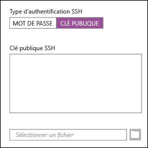
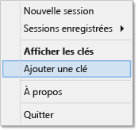

# Utilisation de SSH avec Hadoop Linux sur HDInsight depuis Windows
> [!div class="op_single_selector"]
> * [Windows](hdinsight-hadoop-linux-use-ssh-windows.md)
> * [Linux, Unix, OS X](hdinsight-hadoop-linux-use-ssh-unix.md)
> 
> 

[SSH (Secure Shell)](https://en.wikipedia.org/wiki/Secure_Shell) vous permet d’effectuer des opérations à distance sur des clusters HDInsight sous Linux à l’aide d’une interface de ligne de commande. Ce document fournit des informations relatives à la connexion à HDInsight depuis les clients Windows à l’aide du client SSH PuTTY.

> [!NOTE]
> Les étapes de cet article partent du principe que vous utilisez un client Windows. Si vous utilisez un client Linux, Unix ou OS X, consultez la rubrique [Utilisation de SSH avec Hadoop Linux sur HDInsight depuis Linux, Unix ou OS X](hdinsight-hadoop-linux-use-ssh-unix.md).
> 
> Si vous avez Windows 10 et que vous utilisez [Bash sur Ubuntu sur Windows](https://msdn.microsoft.com/commandline/wsl/about), vous pouvez suivre la procédure du document [Utilisation de SSH avec Hadoop Linux sur HDInsight depuis Linux, Unix ou OS X](hdinsight-hadoop-linux-use-ssh-unix.md).
> 
> 

## Composants requis
* **PuTTY** et **PuTTYGen** pour les clients Windows. Ces utilitaires sont disponibles à l’adresse suivante : [http://www.chiark.greenend.org.uk/~sgtatham/putty/download.html](http://www.chiark.greenend.org.uk/~sgtatham/putty/download.html).
* Un navigateur web moderne qui prend en charge HTML5.

OU

* [Interface de ligne de commande Azure](../xplat-cli-install.md).
  
    [!INCLUDE [use-latest-version](../../includes/hdinsight-use-latest-cli.md)]

## Qu'est-ce que SSH ?
SSH est un utilitaire permettant de se connecter et d'exécuter à distance des commandes sur un serveur distant. Avec HDInsight sous Linux, SSH établit une connexion chiffrée avec le nœud principal du cluster et fournit une ligne de commande que vous utilisez pour taper les commandes. Les commandes sont ensuite exécutées directement sur le serveur.

### Nom d'utilisateur du SSH
Un nom d’utilisateur SSH est le nom que vous utilisez pour vous authentifier auprès du cluster HDInsight. Quand vous spécifiez un nom d’utilisateur SSH lors de la création du cluster, cet utilisateur est créé sur tous les nœuds du cluster. Une fois le cluster créé, vous pouvez utiliser ce nom d’utilisateur pour vous connecter aux nœuds principaux du cluster HDInsight. À partir des nœuds principaux, vous pouvez ensuite vous connecter aux nœuds de travail individuels.

### Clé publique ou mot de passe SSH
Un utilisateur SSH peut utiliser un mot de passe ou une clé publique à des fins d’authentification. Un mot de passe est simplement une chaîne de texte que vous créez, tandis qu’une clé publique fait partie d’une paire de clés de chiffrement générées pour vous identifier de manière unique.

Une clé offre davantage de protection qu’un mot de passe, mais sa génération nécessite des étapes supplémentaires et les fichiers contenant la clé doivent être conservés dans un emplacement sécurisé. Si quelqu’un parvient à accéder aux fichiers de la clé, il peut alors accéder à votre compte. Par ailleurs, si vous perdez les fichiers de la clé, vous ne pouvez plus vous connecter à votre compte.

Une paire de clés se compose d’une clé publique (envoyée au serveur HDInsight) et d’une clé privée (conservée sur votre ordinateur client). Quand vous vous connectez au serveur HDInsight à l’aide de SSH, le client SSH utilise la clé privée contenue sur votre ordinateur pour s’authentifier auprès du serveur.

## Création d’une clé SSH
Utilisez les informations suivantes si vous envisagez d'utiliser les clés SSH avec votre cluster. Si vous prévoyez d’utiliser un mot de passe, vous pouvez ignorer cette section.

1. Ouvrez PuTTYGen.
2. Pour le **Type de clé à générer**, sélectionnez **SSH-2 RSA**, puis cliquez sur **Générer**.
   
    
3. Déplacez la souris dans la zone sous la barre de progression jusqu'à ce la barre soit remplie. Le déplacement de la souris génère des données aléatoires qui sont utilisées pour générer la clé.
   
    
   
    Lorsque la clé est générée, la clé publique s'affiche.
4. Pour plus de sécurité, vous pouvez entrer une phrase secrète dans le champ **Phrase secrète de la clé**, puis taper la même valeur dans le champ **Confirmer la phrase secrète**.
   
    
   
   > [!NOTE]
   > Nous vous recommandons vivement d'utiliser une phrase secrète sûre pour cette clé. Toutefois, si vous oubliez cette phrase secrète, il sera impossible de la récupérer.
   > 
   > 
5. Cliquez sur **Enregistrer la clé privée** pour enregistrer la clé dans un fichier **.ppk**. Cela sera utilisé pour l'authentification à votre cluster HDInsight sous Linux.
   
   > [!NOTE]
   > Stockez cette clé dans un emplacement sûr car elle peut être utilisée pour accéder à votre cluster HDInsight sous Linux.
   > 
   > 
6. Cliquez sur **Enregistrer la clé publique** pour enregistrer la clé en fichier **.txt**. Cela vous permet de réutiliser la clé publique par la suite lorsque vous créez des clusters supplémentaires HDInsight sous Linux.
   
   > [!NOTE]
   > La clé publique est également affiché en haut de PuTTYGen. Vous pouvez cliquer avec le bouton droit dans ce champ, copier la valeur, puis la coller dans un formulaire au moment de la création d'un cluster dans le portail Azure.
   > 
   > 

## Création d'un cluster HDInsight sous Linux
À la création d'un cluster HDInsight sous Linux, vous devez fournir la clé publique précédemment créée. À partir des clients Windows, il existe deux façons de créer un cluster HDInsight sous Linux :

* **Portail Azure** : utilise un portail web pour créer le cluster.
* **Interface de ligne de commande Azure pour Mac, Linux et Windows** : utilise des commandes de ligne de commande pour créer le cluster.

Chacune de ces méthodes nécessite une clé publique. Pour plus d’informations sur la création d’un cluster HDInsight sous Linux, consultez [Approvisionner des clusters HDInsight sous Linux](hdinsight-hadoop-provision-linux-clusters.md).

### Portail Azure
Quand vous utilisez le [portail Azure][preview-portal] pour créer un cluster HDInsight sous Linux, vous devez saisir un **Nom d’utilisateur SSH**, puis entrer un **MOT DE PASSE** ou une **CLÉ PUBLIQUE SSH**.

Si vous sélectionnez **CLÉ PUBLIQUE SSH**, vous pouvez coller la clé publique (affichée dans le champ **Clé publique à coller dans le fichier OpenSSH authorized\_keys** dans PuttyGen) dans le champ **Clé publique SSH** ou choisir **Sélectionner un fichier** pour rechercher et sélectionner le fichier contenant la clé publique.

Cela crée une connexion pour l'utilisateur indiqué et active l'authentification par mot de passe ou l'authentification par clé SSH.

### Interface de ligne de commande Azure pour Mac, Linux et Windows
Vous pouvez utiliser l’[interface de ligne de commande Azure pour Mac, Linux et Windows](../xplat-cli-install.md) afin de créer un cluster en utilisant la commande `azure hdinsight cluster create`.

Pour plus d’informations sur l’utilisation de cette commande, consultez [Approvisionner des clusters Hadoop sous Linux dans HDInsight à l’aide d’options personnalisées](hdinsight-hadoop-provision-linux-clusters.md).

## Connexion à un cluster HDInsight sous Linux
1. Ouvrez PuTTY.
   
    
2. Si vous avez fourni une clé SSH lors de la création de votre compte d’utilisateur, vous devez effectuer l’étape suivante pour sélectionner la clé privée à utiliser lors de l’authentification au cluster :
   
    Dans **Catégorie**, développez **Connexion**, puis **SSH** et sélectionnez **Auth**. Enfin, cliquez sur **Parcourir**, puis sélectionnez le fichier .ppk qui contient votre clé privée.
   
    
3. Dans **Catégorie**, cliquez sur **Session**. À partir de l’écran **Options de base pour votre session PuTTY**, entrez l’adresse SSH de votre serveur HDInsight dans le champ **Nom d’hôte (ou adresse IP)**. Vous pouvez utiliser deux adresses SSH lorsque vous vous connectez à un cluster :
   
   * **Adresse du nœud principal** : pour vous connecter au nœud principal du cluster, utilisez le nom de votre cluster suivi de **-ssh.azurehdinsight.net**. Par exemple **mycluster-ssh.azurehdinsight.net**
   * **Adresse du nœud de périphérie** : si vous vous connectez à un serveur R sur un cluster HDInsight, vous pouvez vous connecter au nœud de périphérie du serveur R en utilisant l’adresse **RServer.CLUSTERNAME.ssh.azurehdinsight.net**, où CLUSTERNAME désigne le nom de votre cluster. Par exemple, **RServer.mycluster.ssh.azurehdinsight.net**.
     
     
4. Pour enregistrer les identifiants de connexion en vue d’une utilisation future, entrez un nom pour cette connexion sous **Sessions enregistrées**, puis cliquez sur **Enregistrer**. La connexion sera ajoutée à la liste des sessions enregistrées.
5. Cliquez sur **Ouvrir** pour vous connecter au cluster.
   
   > [!NOTE]
   > Si c'est la première fois que vous vous connectez au cluster, vous allez recevoir une alerte de sécurité. C’est normal. Sélectionnez **Oui** pour mettre en cache la clé du serveur RSA2 et continuer.
   > 
   > 
6. Lorsque vous y êtes invité, entrez le nom d'utilisateur que vous avez entré lors la création du cluster. Si vous avez donné un mot de passe pour le compte d'utilisateur, il vous sera demandé d'entrer le mot de passe.

> [!NOTE]
> Les étapes ci-dessus supposent que vous utilisez le port 22, qui se connecte au nœud principal sur le cluster HDInsight. Si vous utilisez le port 23, vous allez vous connecter au nœud secondaire. Pour plus d’informations sur les nœuds principaux, consultez [Disponibilité et fiabilité des clusters Hadoop dans HDInsight](hdinsight-high-availability-linux.md).
> 
> 

### Connexion à des nœuds de travail
Les nœuds de travail ne sont pas directement accessibles de l’extérieur du centre de données Azure, mais ils sont accessibles à partir du nœud principal du cluster via le protocole SSH.

Si vous avez fourni une clé SSH lors de la création de votre compte d’utilisateur, vous devez effectuer les étapes suivantes pour utiliser la clé privée lors de l’authentification au cluster si vous souhaitez vous connecter aux nœuds de travail.

1. Installez Pageant à partir de l’adresse suivante : [http://www.chiark.greenend.org.uk/~sgtatham/putty/download.html](http://www.chiark.greenend.org.uk/~sgtatham/putty/download.html). Cet utilitaire permet de mettre en cache des clés SSH pour PuTTY.
2. Exécutez Pageant. Il est réduit à une icône dans la barre d’état. Cliquez avec le bouton droit sur l’icône et sélectionnez **Ajouter une clé**.
   
    
3. Lorsque la boîte de dialogue s’affiche, sélectionnez le fichier .ppk qui contient la clé, puis cliquez sur **Ouvrir**. La clé est ainsi ajoutée à Pageant, qui la fournira à PuTTY lors de la connexion au cluster.
   
   > [!IMPORTANT]
   > Si vous avez utilisé une clé SSH pour sécuriser votre compte, vous devez effectuer les étapes précédentes avant de pouvoir vous connecter aux nœuds de travail.
   > 
   > 
4. Ouvrez PuTTY.
5. Si vous utilisez une clé SSH pour vous authentifier, dans la section **Catégorie**, développez **Connexion**, puis **SSH** et sélectionnez **Auth**.
   
    Dans la section **Paramètres d’authentification**, activez le paramètre **Autoriser le transfert de l’agent**. Vous autorisez ainsi PuTTY à transmettre automatiquement l’authentification par certificat via la connexion au nœud principal du cluster, lors de la connexion aux nœuds de travail.
   
    
6. Connectez-vous au cluster, comme décrit précédemment. Si vous utilisez une clé SSH pour vous authentifier, vous n’avez pas besoin de la sélectionner : la clé SSH ajoutée à Pageant est utilisée pour s’authentifier auprès du cluster.
7. Une fois la connexion établie, utilisez les éléments suivants pour récupérer une liste des nœuds dans votre cluster. Remplacez *ADMINPASSWORD* par le mot de passe de votre compte d’administrateur de cluster. Remplacez *CLUSTERNAME* par le nom de votre cluster.
   
        curl --user admin:ADMINPASSWORD https://CLUSTERNAME.azurehdinsight.net/api/v1/hosts
   
    Cette commande renvoie des informations au format JSON pour les nœuds du cluster, notamment `host_name`, qui contient le nom de domaine complet (FQDN) pour chaque nœud. Voici l’exemple d’une entrée `host_name` renvoyée par la commande **curl** :
   
        "host_name" : "workernode0.workernode-0-e2f35e63355b4f15a31c460b6d4e1230.j1.internal.cloudapp.net"
8. Une fois que vous avez obtenu la liste des nœuds de travail auxquels vous souhaitez vous connecter, utilisez la commande suivante à partir de la session PuTTY pour ouvrir une connexion à un nœud de travail :
   
        ssh USERNAME@FQDN
   
    Remplacez *USERNAME* par votre nom d’utilisateur SSH et *FQDN* par le nom de domaine complet du nœud de travail. Par exemple : `workernode0.workernode-0-e2f35e63355b4f15a31c460b6d4e1230.j1.internal.cloudapp.net`.
   
   > [!NOTE]
   > Si vous utilisez un mot de passe pour l’authentification de votre session SSH, vous devez entrer à nouveau le mot de passe. Si vous utilisez une clé SSH, la connexion doit se terminer sans invite de commandes.
   > 
   > 
9. Une fois la session établie, l’invite de commandes de votre session PuTTY passe de `username@hn#-clustername` à `username@wn#-clustername` pour indiquer que vous êtes connecté au nœud de travail. Les commandes que vous exécutez à ce stade sont exécutées sur le nœud de travail.
10. Une fois les actions sur le nœud de travail terminées, utilisez la commande `exit` pour fermer la session sur le nœud de travail. Vous revenez à l’invite de commandes `username@hn#-clustername`.

## Ajout d’autres comptes
Si vous devez ajouter des comptes à votre cluster, procédez comme suit :

1. Générez une nouvelle clé publique et une clé privée pour le nouveau compte d'utilisateur comme décrit précédemment.
2. Depuis une session SSH vers le cluster, ajoutez le nouvel utilisateur avec la commande suivante :
   
        sudo adduser --disabled-password <username>
   
    Cela créera un nouveau compte d'utilisateur mais désactivera l'authentification par mot de passe.
3. Créez le répertoire et les fichiers d’enregistrement de la clé en utilisant les commandes suivantes :
   
        sudo mkdir -p /home/<username>/.ssh
        sudo touch /home/<username>/.ssh/authorized_keys
        sudo nano /home/<username>/.ssh/authorized_keys
4. Lorsque l'éditeur nano s'ouvre, copiez et collez les contenus de la clé publique pour le nouveau compte d'utilisateur. Enfin, utilisez **Ctrl-X** pour enregistrer le fichier et quitter l’éditeur.
   
    
5. Utilisez la commande suivante pour modifier la propriété du dossier .ssh et son contenu vers le nouveau compte d’utilisateur :
   
        sudo chown -hR <username>:<username> /home/<username>/.ssh
6. Vous devriez maintenant pouvoir vous authentifier au serveur avec le nouveau compte d'utilisateur et la clé privée.

## Tunneling SSH
Vous pouvez utiliser SSH pour transférer des requêtes locales, telles que des demandes web, vers le cluster HDInsight. La requête sera ensuite acheminée vers la ressource demandée comme si elle provenait du nœud principal du cluster HDInsight.

> [!IMPORTANT]
> Un tunnel SSH est requis pour accéder à l’interface utilisateur web de certains services Hadoop. Par exemple, l'interface utilisateur de l'historique des travaux ou de l'interface utilisateur du Gestionnaire de ressources est uniquement accessible à l'aide d'un tunnel SSH.
> 
> 

Pour plus d’informations sur la création et l’utilisation d’un tunnel SSH, consultez [Utiliser le tunneling SSH pour accéder à l’interface utilisateur web Ambari, ResourceManager, JobHistory, NameNode, Oozie et d’autres interfaces utilisateur web](hdinsight-linux-ambari-ssh-tunnel.md).

## Étapes suivantes
Maintenant que vous savez comment vous authentifier avec une clé SSH, apprenez à utiliser MapReduce avec Hadoop dans HDInsight.

* [Utilisation de Hive avec HDInsight](hdinsight-use-hive.md)
* [Utilisation de Pig avec HDInsight](hdinsight-use-pig.md)
* [Utilisation des tâches MapReduce avec HDInsight](hdinsight-use-mapreduce.md)

[preview-portal]: https://portal.azure.com/

<!---HONumber=AcomDC_0921_2016-->