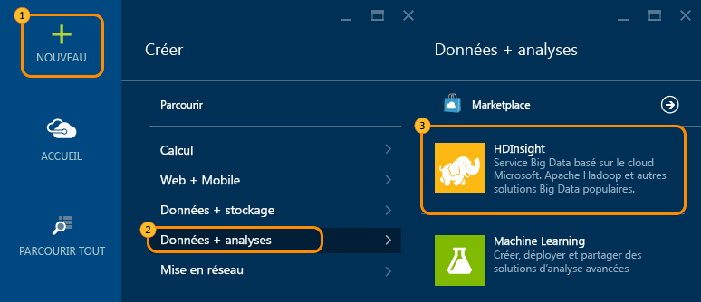
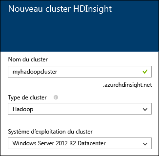
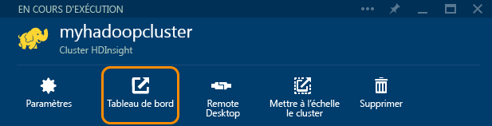

<properties
   pageTitle="Didacticiel Hadoop : prise en main de Hadoop sur Windows | Microsoft Azure"
   description="Prise en main de Hadoop dans HDInsight. Apprenez à créer des clusters Hadoop sur Windows, à exécuter une requête Hive sur des données et à en analyser les résultats dans Excel."
   keywords="didacticiel Hadoop,hadoop sur windows,cluster hadoop,découverte de hadoop,requête hive"
   services="hdinsight"
   documentationCenter=""
   authors="nitinme"
   manager="paulettm"
   editor="cgronlun"
   tags="azure-portal"/>

<tags
   ms.service="hdinsight"
   ms.devlang="na"
   ms.topic="article"
   ms.tgt_pltfrm="na"
   ms.workload="big-data"
   ms.date="03/07/2016"
   ms.author="nitinme"/>

# Didacticiel Hadoop : prise en main de Hadoop dans HDInsight sur Windows

> [AZURE.SELECTOR]
- [Linux](../hdinsight-hadoop-linux-tutorial-get-started.md)
- [Windows](../hdinsight-hadoop-tutorial-get-started-windows.md)

Pour vous familiariser plus facilement à Hadoop sur Windows et commencer à utiliser HDInsight, ce didacticiel vous montre comment exécuter une requête Hive sur des données non structurées dans un cluster Hadoop, puis comment analyser les résultats dans Microsoft Excel.

>[AZURE.NOTE] Les informations de ce document sont spécifiques aux clusters HDInsight sous Windows. Pour plus d’informations sur les clusters Linux, consultez [Didacticiel Hadoop : prise en main de Hadoop sous Linux dans HDInsight](hdinsight-hadoop-linux-tutorial-get-started.md).

Partons du principe que vous avez un vaste jeu de données non structurées et que vous voulez exécuter une requête Hive sur ces données pour en extraire des informations pertinentes. C’est exactement ce que vous allez faire dans ce didacticiel. Voici comment obtenir ce résultat :

   ![Didacticiel Hadoop : création d’un compte ; création d’un cluster Hadoop ; envoi d’une requête Hive ; analyse de données dans Excel.][image-hdi-getstarted-flow]

Visionnez une vidéo de démonstration de ce didacticiel pour vous familiariser avec Hadoop sur HDInsight :

![Vidéo d'un premier didacticiel Hadoop : envoi d'une requête Hive sur un cluster Hadoop et analyse des résultats dans Excel.][img-hdi-getstarted-video]

**[Regarder le didacticiel Hadoop pour HDInsight sur YouTube](https://www.youtube.com/watch?v=Y4aNjnoeaHA&list=PLDrz-Fkcb9WWdY-Yp6D4fTC1ll_3lU-QS)**

Parallèlement à la mise à disposition générale d'Azure HDInsight, Microsoft fournit également l'émulateur HDInsight pour Azure, connu auparavant sous le nom de *Microsoft HDInsight Developer Preview*. L'émulateur cible les scénarios de développement et ne prend en charge que les déploiements sur un seul nœud. Pour plus d'informations sur l'utilisation de l'émulateur HDInsight, consultez la rubrique [Prise en main de l'émulateur HDInsight][hdinsight-emulator].

[AZURE.INCLUDE [delete-cluster-warning](../../includes/hdinsight-delete-cluster-warning.md)]

### Composants requis

Avant de commencer ce didacticiel pour Hadoop sur Windows, vous devez disposer des éléments suivants :

- **Un abonnement Azure**. Consultez [Obtenir une version d'évaluation gratuite d'Azure](https://azure.microsoft.com/documentation/videos/get-azure-free-trial-for-testing-hadoop-in-hdinsight/).
- **Un poste de travail** avec Office Professionnel Plus 2013, Office 365 ProPlus, l'édition autonome d'Excel 2013 ou Office Professionnel Plus 2010.

##Création de clusters Hadoop

Lorsque vous créez un cluster, vous créez les ressources de calcul Azure contenant Hadoop et ses applications associées. Dans cette section, vous allez créer un cluster HDInsight version 3.2. Vous pouvez également créer des clusters Hadoop pour d'autres versions. Pour plus d’informations, consultez la rubrique [Création de clusters HDInsight au moyen d’options personnalisées][hdinsight-provision]. Pour en savoir plus sur les différentes versions de HDInsight et leurs contrats SLA, consultez la page [Contrôle de version des composants HDInsight](hdinsight-component-versioning.md).

**Pour créer un cluster Hadoop**

1. Connectez-vous au [portail Azure](https://ms.portal.azure.com/).
2. Cliquez sur **NOUVEAU**, sur **Analyse des données**, puis sur **HDInsight**. Le portail ouvre un panneau **Nouveau cluster HDInsight**.

    

3. Entrez ou sélectionnez les valeurs suivantes :

	
	
	|Nom du champ| Valeur|
	|----------|------|
	|Nom du cluster| Nom unique permettant d’identifier le cluster|
	|Type du cluster| Sélectionnez **Hadoop** pour ce didacticiel. |
	|Système d’exploitation du cluster| Sélectionnez **Windows Server 2012 R2 Datacenter** pour ce didacticiel.|
	|Version de HDInsight| Sélectionnez la version la plus récente de ce didacticiel.|
	|Abonnement| Sélectionnez l’abonnement Azure qui sera utilisé le cluster.|
	|Groupe de ressources | Sélectionnez un groupe de ressources Azure existant ou créez-en un. Un cluster HDInsight de base contient un cluster et le compte de stockage par défaut qui lui est associé. À des fins de simplicité de gestion, vous pouvez regrouper les deux dans un groupe de ressources.|
	|Informations d'identification| Entrez le nom d’utilisateur et le mot de passe du cluster. Les clusters basés sur Windows peuvent avoir deux comptes d’utilisateur. L’utilisateur du cluster (ou l’utilisateur HTTP) est utilisé pour gérer le cluster et soumettre des tâches. Vous pouvez éventuellement créer un compte d’utilisateur de bureau à distance (RDP) pour vous connecter au cluster. Si vous choisissez d’activer le bureau à distance, vous devrez créer le compte d’utilisateur RDP.|
	|Source de données| Cliquez sur Créer un nouveau pour créer un nouveau compte de stockage Azure par défaut. Utilisez le nom du cluster comme nom de conteneur par défaut. Chaque cluster HDinsight possède un conteneur d’objets Blob par défaut sur un compte de stockage Azure. L’emplacement du compte de stockage Azure par défaut détermine l’emplacement du cluster HDInsight.|
	|Niveaux de tarification du nœud| Pour ce didacticiel, utilisez 1 ou 2 nœuds de travail avec le niveau de tarification du nœud de travail par défaut et de la note de tête.|
	|Configuration facultative| Ignorez cette partie.|

9. Dans le panneau **Nouveau cluster HDInsight**, assurez-vous que l’option **Épingler au tableau d’accueil** est sélectionnée, puis cliquez sur **Créer**. Le cluster est créé et la vignette correspondante ajoutée au tableau d’accueil de votre portail Azure. L’icône indique que le cluster est en cours de création et sera modifiée pour représenter l’icône HDInsight une fois la création terminée.

	| En cours de création | Création terminée |
	| ------------------ | --------------------- |
	|  |  |

	> [AZURE.NOTE] La création du cluster prend un certain temps (en règle générale, environ 15 minutes). Utilisez la vignette du tableau d’accueil ou l’entrée **Notifications** à gauche de la page pour vérifier le processus de création.

10. Une fois la création terminée, cliquez sur la vignette du cluster dans le tableau d'accueil pour lancer le panneau du cluster.

## Exécution d’une requête Hive à partir du portail
À présent qu’un cluster HDInsight a été créé, la prochaine étape consiste à exécuter un travail Hive afin d’interroger un exemple de table Hive. Nous allons utiliser *hivesampletable*, qui est fournie avec les clusters HDInsight. Cette table contient des données sur des fabricants, des plateformes et des modèles d'appareils mobiles. Une requête Hive exécutée sur cette table permet d'extraire les données relatives aux appareils mobiles d'un fabricant spécifique.

> [AZURE.NOTE] HDInsight Hadoop Tools pour Visual Studio est fourni avec le Kit de développement logiciel (SDK) Azure pour .NET version 2.5 ou ultérieure. L'utilisation des outils de Visual Studio vous permet de vous connecter à un cluster HDInsight, de créer des tables Hive et d'exécuter des requêtes Hive. Pour plus d'informations, consultez la page [Prise en main de HDInsight Hadoop Tools pour Visual Studio][1].

**Exécution d'un travail Hive à partir d'un tableau de bord du cluster**

1. Connectez-vous au [portail Azure](https://ms.portal.azure.com/).
2. Cliquez sur **PARCOURIR TOUT**, puis sur **Clusters HDInsight**. La liste des clusters s’affiche, avec celui que vous avez créé dans la section précédente.
3. Cliquez sur le nom du cluster que vous voulez utiliser pour l’exécution du travail Hive, puis cliquez sur **Tableau de bord** en haut du panneau.
4. Une page web s'ouvre dans un autre onglet du navigateur. Entrez le compte et le mot de passe de l'utilisateur Hadoop. Le nom d’utilisateur par défaut est **admin**, le mot de passe est celui que vous avez entré pendant la création du cluster.
5. Dans le tableau de bord, cliquez sur l’onglet **Éditeur Hive**. La page web suivante s’ouvre.

	![Onglet Éditeur Hive dans le tableau de bord du cluster HDInsight.][img-hdi-dashboard]

	Le haut de la page contient plusieurs onglets. L'onglet par défaut est **Éditeur Hive**, tandis que les autres onglets sont **Historique des travaux** et **Explorateur de fichiers**. À l'aide du tableau de bord, vous pouvez envoyer des requêtes Hive, vérifier les fichiers journaux Hadoop et parcourir les fichiers du stockage.

	> [AZURE.NOTE] Notez que l'URL de la page web est *&lt;ClusterName&gt;.azurehdinsight.net*. Ainsi, au lieu d'ouvrir le tableau de bord à partir du portail, vous pouvez également l'ouvrir à partir d'un navigateur web à l'aide de l'URL.

6. Dans l'onglet **Éditeur Hive**, pour **Nom de requête**, entrez **HTC20**. Le nom de la requête correspond au nom de la tâche. Dans le volet de requête, entrez la requête Hive, comme indiqué dans l'image :

	![Requête Hive entrée dans le volet de requête de l'éditeur Hive.][img-hdi-dashboard-query-select]

4. Cliquez sur **Envoyer**. Il faut quelques instants pour obtenir les résultats. L'écran est actualisé toutes les 30 secondes. Vous pouvez également cliquer sur **Actualiser** pour actualiser l'écran.

    ![Résultats d'une requête Hive répertoriés en bas du tableau de bord du cluster.][img-hdi-dashboard-query-select-result]

5. Une fois que l'état indique que la tâche est terminée, cliquez sur le nom de la requête à l'écran pour afficher le résultat. Notez **l'heure de début de la tâche (UTC)**. Vous en aurez besoin ultérieurement.

    ![Heure de début du travail répertoriée sous l'onglet Historique des travaux du tableau de bord du cluster HDInsight.][img-hdi-dashboard-query-select-result-output]

    La page indique également le **Résultat de la tâche** et le **Journal de la tâche**. Vous avez également la possibilité de télécharger le fichier de sortie (\_stdout) et le fichier journal (\_stderr).

**Accès au fichier de sortie**

1. Dans le tableau de bord du cluster, cliquez sur **Explorateur de fichiers**.
2. Cliquez sur le nom de votre compte de stockage, sur le nom de votre conteneur (qui est le même que le nom de votre cluster), puis sur **utilisateur**.
3. Cliquez sur **admin**, puis sur le GUID dont l'heure de dernière modification est légèrement postérieure à l'heure de début de tâche que vous avez notée précédemment. Copiez ce GUID. Vous en aurez besoin dans la prochaine section.

   	![GUID du fichier de sortie de la requête Hive, répertorié sous l'onglet Explorateur de fichiers.][img-hdi-dashboard-query-browse-output]

##Connexion aux outils décisionnels Microsoft pour Excel

Vous pouvez utiliser le complément Power Query pour Microsoft Excel afin d'importer le résultat de la tâche depuis HDInsight dans Excel, où des outils décisionnels Microsoft peuvent être utilisés afin d'effectuer une analyse plus approfondie des résultats.

Vous devez avoir installé Excel 2013 ou 2010 pour mener à bien cette partie du didacticiel.

**Téléchargement de Microsoft Power Query pour Excel**

- Téléchargez Microsoft Power Query pour Microsoft Excel depuis le [Centre de téléchargement Microsoft](http://www.microsoft.com/download/details.aspx?id=39379) et installez-le.

**Pour importer des données HDInsight**

1. Ouvrez Excel et créez un classeur.
3. Cliquez dans le menu **Power Query**, cliquez sur **À partir d'autres sources**, puis sur **Depuis Microsoft Microsoft Azure HDInsight**.

	![Menu Importation Excel PowerQuery ouvert pour Azure HDInsight.][image-hdi-gettingstarted-powerquery-importdata]

3. Entrez le **Nom de compte** du compte de stockage d'objets blob Azure associé à votre cluster, puis cliquez sur **OK**. Il s'agit du compte de stockage que vous avez créé plus tôt dans le didacticiel.
4. Entrez la **Clé du compte** du compte de stockage d’objets blob Azure, puis cliquez sur **Enregistrer**.
5. Dans le volet droit, double-cliquez sur le nom de l'objet blob. Par défaut, le nom de l'objet blob est identique à celui du cluster.

6. Localisez **stdout** dans la colonne **Nom**. Vérifiez que le GUID de la colonne** Chemin du dossier** correspond au GUID que vous avez copié précédemment. Une correspondance suggère que les données de sortie correspondent à la tâche que vous avez envoyée. Cliquez sur **Fichier binaire** dans la colonne à gauche de **stdout**.

	![Recherche des données produites par le GUID dans la liste du contenu.][image-hdi-gettingstarted-powerquery-importdata2]

9. Cliquez sur **Fermer et charger** dans le coin supérieur gauche pour importer le résultat de la tâche Hive dans Excel.

##Exécuter des exemples

Un cluster HDInsight fournit une console de requête incluant une galerie de prise en main permettant d’exécuter les exemples directement à partir du portail. Vous pouvez utiliser les exemples pour apprendre à utiliser HDInsight en parcourant quelques scénarios de base. Ces exemples sont fournis avec tous les composants requis, tels que les données à analyser et les requêtes à exécuter sur les données. Pour plus d’informations sur les exemples de la galerie de prise en main, consultez la page [Découverte de Hadoop à l’aide de la galerie de prise en main de HDInsight](hdinsight-learn-hadoop-use-sample-gallery.md).

**Exécution de l'exemple**

1. Dans le tableau d’accueil du portail Azure, cliquez sur la vignette du cluster que vous venez de créer.
 
2. Dans le nouveau volet de cluster, cliquez sur **Tableau de bord**. Lorsque vous y êtes invité, entrez le nom d'utilisateur administrateur et le mot de passe correspondant au cluster HDInsight.

	
 
3. Dans la page web qui s’ouvre, cliquez sur l’onglet**Galerie de prise en main**, puis sous la catégorie **Solutions avec des exemples de données**, cliquez sur l’exemple que vous souhaitez exécuter. Suivez les instructions de la page web pour terminer l'exemple. Le tableau suivant répertorie quelques exemples et fournit plus d’informations sur les chaque exemple.

Exemple | Fonction
------ | ---------------
[Analyse des données de capteur][hdinsight-sensor-data-sample] | Découvrez comment utiliser HDInsight pour traiter les données d’historique produites par les systèmes de chauffage, de ventilation et de climatisation, et ainsi identifier les systèmes qui ne sont pas en mesure de maintenir de façon fiable une température donnée.
[Analyse du journal de site web][hdinsight-weblogs-sample] | Découvrez comment utiliser HDInsight pour analyser des fichiers journaux de site web afin d’obtenir des informations sur la fréquence des accès au site web en une journée à partir de sites web externes, ainsi qu’un résumé des erreurs de site web rencontrées par les utilisateurs.
[Analyse de tendances Twitter](hdinsight-analyze-twitter-data.md) | Apprenez à utiliser HDInsight pour analyser les tendances dans Twitter.

##Suppression du cluster

[AZURE.INCLUDE [delete-cluster-warning](../../includes/hdinsight-delete-cluster-warning.md)]

##Étapes suivantes
Dans ce didacticiel Hadoop, vous avez appris à créer un cluster Hadoop sur Windows dans HDInsight, à exécuter une requête Hive sur des données et à importer les résultats dans Excel, où ils peuvent faire l’objet d’un traitement plus poussé et être affichés sous forme de graphique avec des outils décisionnels. Pour plus d'informations, consultez les didacticiels suivants :

- [Prise en main de HDInsight Hadoop Tools pour Visual Studio][1]
- [Prise en main de l'émulateur HDInsight][hdinsight-emulator]
- [Utilisation du stockage d’objets blob Azure avec HDInsight][hdinsight-storage]
- [Administration de HDInsight à l'aide de PowerShell][hdinsight-admin-powershell]
- [Téléchargement de données vers HDInsight][hdinsight-upload-data]
- [Utilisation de MapReduce avec HDInsight][hdinsight-use-mapreduce]
- [Utilisation de Hive avec HDInsight][hdinsight-use-hive]
- [Utilisation de Pig avec HDInsight][hdinsight-use-pig]
- [Utilisation d’Oozie avec HDInsight][hdinsight-use-oozie]
- [Développement de programmes MapReduce en Java pour HDInsight][hdinsight-develop-mapreduce]

[1]: ../HDInsight/hdinsight-hadoop-visual-studio-tools-get-started.md

[hdinsight-versions]: hdinsight-component-versioning.md

[hdinsight-provision]: hdinsight-provision-clusters.md
[hdinsight-admin-powershell]: hdinsight-administer-use-powershell.md
[hdinsight-upload-data]: hdinsight-upload-data.md
[hdinsight-use-mapreduce]: hdinsight-use-mapreduce.md
[hdinsight-use-hive]: hdinsight-use-hive.md
[hdinsight-use-pig]: hdinsight-use-pig.md
[hdinsight-use-oozie]: hdinsight-use-oozie.md
[hdinsight-storage]: hdinsight-hadoop-use-blob-storage.md
[hdinsight-emulator]: hdinsight-hadoop-emulator-get-started.md
[hdinsight-develop-mapreduce]: hdinsight-develop-deploy-java-mapreduce.md
[hadoop-hdinsight-intro]: hdinsight-hadoop-introduction.md
[hdinsight-weblogs-sample]: hdinsight-hive-analyze-website-log.md
[hdinsight-sensor-data-sample]: hdinsight-hive-analyze-sensor-data.md

[azure-purchase-options]: http://azure.microsoft.com/pricing/purchase-options/
[azure-member-offers]: http://azure.microsoft.com/pricing/member-offers/
[azure-free-trial]: http://azure.microsoft.com/pricing/free-trial/
[azure-management-portal]: https://ms.portal.azure.com/
[azure-create-storageaccount]: ../storage-create-storage-account.md

[apache-hadoop]: http://go.microsoft.com/fwlink/?LinkId=510084
[apache-hive]: http://go.microsoft.com/fwlink/?LinkId=510085
[apache-mapreduce]: http://go.microsoft.com/fwlink/?LinkId=510086
[apache-hdfs]: http://go.microsoft.com/fwlink/?LinkId=510087
[hdinsight-hbase-custom-provision]: hdinsight-hbase-tutorial-get-started.md

[powershell-download]: http://go.microsoft.com/fwlink/p/?linkid=320376&clcid=0x409
[powershell-install-configure]: powershell-install-configure.md
[powershell-open]: powershell-install-configure.md#step-1-install

[img-hdi-dashboard]: ./media/hdinsight-hadoop-tutorial-get-started-windows/HDI.dashboard.png
[img-hdi-dashboard-query-select]: ./media/hdinsight-hadoop-tutorial-get-started-windows/HDI.dashboard.query.select.png
[img-hdi-dashboard-query-select-result]: ./media/hdinsight-hadoop-tutorial-get-started-windows/HDI.dashboard.query.select.result.png
[img-hdi-dashboard-query-select-result-output]: ./media/hdinsight-hadoop-tutorial-get-started-windows/HDI.dashboard.query.select.result.output.png
[img-hdi-dashboard-query-browse-output]: ./media/hdinsight-hadoop-tutorial-get-started-windows/HDI.dashboard.query.browse.output.png

[img-hdi-getstarted-video]: ./media/hdinsight-hadoop-tutorial-get-started-windows/hdi-get-started-video.png

[image-hdi-storageaccount-quickcreate]: ./media/hdinsight-hadoop-tutorial-get-started-windows/HDI.StorageAccount.QuickCreate.png
[image-hdi-clusterstatus]: ./media/hdinsight-hadoop-tutorial-get-started-windows/HDI.ClusterStatus.png
[image-hdi-quickcreatecluster]: ./media/hdinsight-hadoop-tutorial-get-started-windows/HDI.QuickCreateCluster.png
[image-hdi-getstarted-flow]: ./media/hdinsight-hadoop-tutorial-get-started-windows/HDI.GetStartedFlow.png

[image-hdi-gettingstarted-powerquery-importdata]: ./media/hdinsight-hadoop-tutorial-get-started-windows/HDI.GettingStarted.PowerQuery.ImportData.png
[image-hdi-gettingstarted-powerquery-importdata2]: ./media/hdinsight-hadoop-tutorial-get-started-windows/HDI.GettingStarted.PowerQuery.ImportData2.png
 

<!---HONumber=AcomDC_0330_2016-->