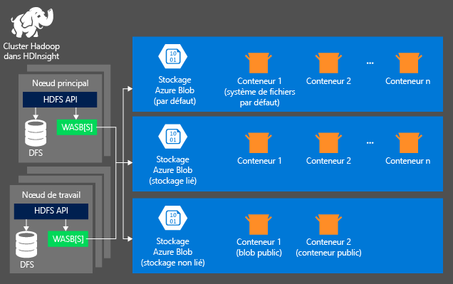
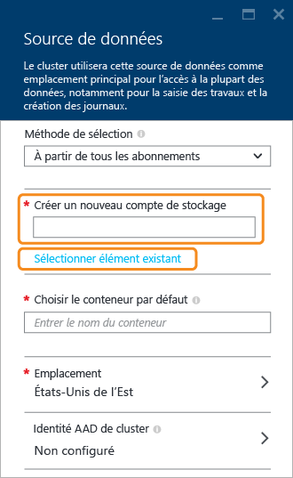

<properties
	pageTitle="Interrogation des données depuis un stockage d’objets blob compatible avec HDFS | Microsoft Azure"
	description="HDInsight utilise le stockage d’objets blob comme magasin de données volumineuses pour HDFS. Apprenez à interroger des données depuis un stockage d’objets blob et à stocker les résultats de votre analyse."
	keywords="blob storage,hdfs,structured data,unstructured data"
	services="hdinsight,storage"
	documentationCenter=""
	tags="azure-portal"
	authors="mumian"
	manager="paulettm"
	editor="cgronlun"/>

<tags
	ms.service="hdinsight"
	ms.workload="big-data"
	ms.tgt_pltfrm="na"
	ms.devlang="na"
	ms.topic="article"
	ms.date="07/28/2015"
	ms.author="jgao"/>

# Utilisation du stockage d’objets blob Azure compatible avec HDFS avec Hadoop dans HDInsight

Ce didacticiel permet d’apprendre à utiliser le stockage d’objets blob Azure à faible coût avec HDInsight, à créer un compte de stockage Azure et un conteneur de stockage d’objets blob, puis à y envoyer des données.

Le stockage d’objets blob Azure est une solution de stockage à la fois robuste et polyvalente qui s’intègre en toute transparence à HDInsight. Grâce à une interface HDFS (Hadoop Distributed File System), l’ensemble des composants de HDInsight peut fonctionner directement sur les données structurées ou non structurées dans le stockage d’objets blob.

Le stockage de données dans le stockage d’objets blob vous permet de supprimer les clusters HDInsight servant aux calculs, sans perte de données utilisateur.

> [AZURE.NOTE]La syntaxe **asv://* n’est pas prise en charge dans les clusters HDInsight version 3.0. Cela signifie que toutes les tâches envoyées vers un cluster HDInsight version 3.0 utilisant explicitement la syntaxe **asv://* échoueront. Vous devez plutôt utiliser la syntaxe **wasb://*. De même, les tâches créées avec un metastore existant contenant des références explicites aux ressources utilisant la syntaxe asv:// et envoyées vers un cluster HDInsight version  3.0 échoueront également. Vous devez recréer ces metastores en utilisant la syntaxe « wasb:// » pour adresser les ressources.

> HDInsight prend uniquement en charge les objets blob de blocs pour le moment.

> La plupart des commandes HDFS (par exemple <b>ls</b>, <b>copyFromLocal</b> et <b>mkdir</b>) fonctionnent toujours comme prévu. Seules les commandes propres à l'implémentation HDFS native (nommée DFS), telles que <b>fschk</b> et <b>dfsadmin</b> se comporteront différemment dans le stockage d'objets blob Azure.

Pour plus d'informations sur la configuration d'un cluster HDInsight, consultez la rubrique [Prise en main de HDInsight][hdinsight-get-started] ou [Configuration des clusters HDInsight][hdinsight-provision].

## Architecture de stockage HDInsight
Le schéma suivant résume l'architecture de stockage HDInsight :

HDInsight permet d'accéder au système de fichiers distribués (DFS) connecté localement aux nœuds de calcul. Vous pouvez accéder à ce système de fichiers en utilisant l'URI complet, par exemple :

	hdfs://<namenodehost>/<path>

De plus, HDInsight permet d'accéder aux données du stockage d'objets blob Azure. La syntaxe est :

	wasb[s]://<containername>@<accountname>.blob.core.windows.net/<path>

Hadoop prend en charge une notion de système de fichiers par défaut. Le système de fichiers par défaut implique un schéma et une autorité par défaut. Il peut également être utilisé pour résoudre les chemins d'accès relatifs. Durant la configuration de HDInsight, un compte de stockage Azure et un conteneur de stockage d'objets blob Azure spécifique de ce compte sont désignés en tant que système de fichiers par défaut.

En plus de ce compte de stockage, durant la configuration, vous pouvez ajouter des comptes de stockage supplémentaires à partir du même abonnement Azure ou à partir d'autres abonnements Azure. Pour plus d'instructions sur l’ajout des comptes de stockage supplémentaires, consultez la rubrique [Approvisionnement de clusters HDInsight][hdinsight-provision].

- **Conteneurs des comptes de stockage connectés à un cluster :** comme le nom et la clé du compte sont associés avec le cluster durant l’approvisionnement, vous disposez d’un accès complet aux objets blob de ces conteneurs.

- **Conteneurs publics ou objets blob publics dans les comptes de stockage qui ne sont PAS connectés à un cluster :** vous avez l’autorisation en lecture seule pour les objets blob dans les conteneurs.

	> [AZURE.NOTE]> Des conteneurs publics vous permettent d'obtenir une liste de tous ses objets blob disponibles, ainsi que ses métadonnées. Vous pouvez accéder aux objets blob d'un objet blob public uniquement si vous connaissez leur URL exacte. Pour plus d'informations, consultez la page <a href="http://msdn.microsoft.com/library/windowsazure/dd179354.aspx">Limiter l'accès aux conteneurs et aux objets blob</a>.

- **Conteneurs privés dans les comptes de stockage qui ne sont PAS connectés à un cluster :** non accessibles dans les conteneurs d’objets blob, sauf si vous définissez le compte de stockage lorsque vous envoyez des tâches WebHCat. Une explication sera fournie plus loin dans cet article.

Les comptes de stockage définis durant la configuration et leurs clés sont stockés dans %HADOOP\_HOME%/conf/core-site.xml sur les nœuds du cluster. Le comportement par défaut de HDInsight consiste à utiliser les comptes de stockage définis dans le fichier core-site.xml. Il est déconseillé de modifier le fichier core-site.xml, car le nœud principal du cluster peut à tout moment être recréé ou migrer, et toutes les modifications apportées à ces fichiers seront perdues.

Plusieurs tâches WebHCat, notamment Hive, MapReduce, la diffusion en continu Hadoop et Pig, peuvent véhiculer avec elles une description des comptes de stockage et des métadonnées. (cela fonctionne actuellement pour Pig, pour les comptes de stockage, mais pas pour les métadonnées.) La section [Accès à un objet blob avec Azure PowerShell](#powershell) de cet article contient un exemple de cette fonctionnalité. Pour plus d'informations, consultez la page [Utilisation d'un cluster HDInsight avec des comptes de stockage et des metastores secondaires](http://social.technet.microsoft.com/wiki/contents/articles/23256.using-an-hdinsight-cluster-with-alternate-storage-accounts-and-metastores.aspx).

Le stockage d’objets blob peut être utilisé pour les données structurées et non structurées. Les conteneurs de stockage d'objets blob stockent des données en tant que paires clé/valeur et sans hiérarchie de répertoires. Cependant, vous pouvez utiliser la barre oblique (« / ») dans le nom de la clé pour la faire apparaître comme un fichier stocké dans une structure de répertoires. Par exemple, une clé d'objet blob peut être *input/log1.txt*. Il n'existe pas de répertoire *input*, mais la barre oblique figurant dans le nom de la clé lui donne l'aspect d'un chemin d'accès de fichier.

###Avantages du stockage d’objets blob
La réduction des performances entraînée par la séparation des emplacements de stockage et de calcul est compensée par le fait que les clusters de calcul sont configurés à proximité des ressources du compte de stockage dans le centre de données Azure, où le réseau à haut débit permet aux nœuds de calcul d'accéder plus efficacement aux données dans le stockage d'objets blob Azure.

Voici les avantages offerts par le stockage de données dans un stockage d'objets blob Azure au lieu d'un système HDFS :

* **Réutilisation et partage des données :** les données du système HDFS sont situées dans le cluster de calcul. Seules les applications pouvant accéder au cluster de calcul peuvent utiliser les données avec l'API HDFS. Vous pouvez accéder aux données du stockage d'objets blob Azure via les API HDFS ou les [API REST de stockage d'objets blob][blob-storage-restAPI]. Vous pouvez donc utiliser un plus grand nombre d'applications (notamment d'autres clusters HDInsight) et d'outils pour produire et consommer des données.
* **Archivage des données** : le stockage de données dans le stockage d'objets blob Azure permet de supprimer les clusters HDInsight ayant servi aux calculs, sans perte de données utilisateur.
* **Coût de stockage des données :** le stockage à long terme des données dans DFS est plus coûteux que le stockage des données dans un stockage d'objets blob Azure, car le coût d'un cluster de calcul est plus élevé que celui d'un conteneur de stockage d'objets blob Azure. De plus, comme vous n'avez pas à recharger les données pour chaque génération de cluster de calcul, vous faites également des économies sur les chargements de données.
* **Montée en charge élastique :** même si le système HDFS offre un système de fichiers monté en charge, cette capacité est déterminée par le nombre de nœuds que vous configurez pour votre cluster. Au lieu de procéder ainsi, il est parfois plus simple de profiter des capacités d'évolution flexible que vous obtenez automatiquement dans le stockage d’objets blob Azure.
* **Géo-réplication :** vous pouvez géo-répliquer vos conteneurs de stockage d’objets blob Azure. Si cette fonctionnalité permet la récupération géographique et la redondance des données, un basculement vers un emplacement géo-répliqué affecte sérieusement les performances et peut entraîner des frais supplémentaires. Nous vous recommandons donc de peser sérieusement le pour et le contre avant de choisir la géo-réplication.

Certains packages et tâches MapReduce peuvent créer des résultats intermédiaires que vous ne voulez pas stocker dans un stockage d'objets blob Azure. Dans ce cas, vous pouvez choisir de stocker les données dans un système HDFS local. En fait, HDInsight utilise DFS pour plusieurs de ces résultats intermédiaires dans les tâches Hive et d'autres processus.

## Création d’un conteneur d’objets blob

Pour utiliser des objets blob, commencez par créer un [compte de stockage Azure][azure-storage-create]. Durant cette opération, vous devez indiquer un centre de données Azure qui stockera les objets que vous créez en utilisant ce compte. Le cluster et le compte de stockage doivent être hébergés dans le même centre de données. La base de données SQL Server de metastore Hive et la base de données SQL Server de metastore Oozie doivent également se trouver dans le même centre de données.

Où qu’il réside, chaque objet blob que vous créez appartient à un conteneur de votre compte de stockage Azure. Ce conteneur peut être un objet blob existant créé hors de HDInsight ou un conteneur créé pour un cluster HDInsight.

Ne partagez pas un conteneur de stockage par défaut avec plusieurs clusters HDInsight. Si vous devez utiliser un conteneur partagé pour fournir l'accès aux données à plusieurs clusters HDInsight, vous devez l'ajouter comme compte de stockage supplémentaire dans la configuration du cluster. Pour plus d’informations, consultez la rubrique [Configuration de clusters HDInsight][hdinsight-provision]. Vous pouvez, toutefois, réutiliser un conteneur de stockage par défaut une fois le cluster HDInsight d'origine supprimé. Pour les clusters HBase, vous pouvez conserver le schéma de la table HBase et les données en configurant un nouveau cluster HBase à l'aide du conteneur de stockage d’objets blob par défaut qui est utilisé par un cluster HBase qui a été supprimé.

### Utilisation de la version préliminaire du portail Azure

Lorsque vous configurez un cluster HDInsight à partir de la version préliminaire du portail, vous avez la possibilité d'utiliser un compte de stockage existant ou de créer un nouveau compte de stockage :

###Utilisation de l’interface de ligne de commande Azure

Si vous avez [installé et configuré l’interface de ligne de commande Azure](../xplat-cli-install.md), la commande suivante peut être utilisée sur un compte de stockage et un conteneur.

	azure storage account create <storageaccountname> --type LRS

> [AZURE.NOTE]Le paramètre `--type` indique la méthode de réplication du compte de stockage. Pour plus d’informations, consultez [Réplication Azure Storage](../storage-redundancy.md).

Vous devez spécifier la région géographique dans laquelle se trouve le compte de stockage. Vous devez créer le compte de stockage dans la région où vous envisagez de créer votre cluster HDInsight.

Une fois le compte de stockage créé, utilisez la commande suivante pour récupérer les clés du compte de stockage :

	azure storage account keys list <storageaccountname>

Pour créer un conteneur, utilisez la commande suivante :

	azure storage container create <containername> --account-name <storageaccountname> --account-key <storageaccountkey>

### Utilisation de Microsoft Azure PowerShell

Si vous avez [installé et configuré Azure PowerShell][powershell-install], vous pouvez utiliser la commande suivante dans l’invite Azure PowerShell pour créer un compte de stockage et un conteneur :

	$subscriptionName = "<SubscriptionName>"	# Azure subscription name
	$storageAccountName = "<AzureStorageAccountName>" # The storage account that you will create
	$containerName="<BlobContainerToBeCreated>" # The Blob container name that you will create

	# Connect to your Azure account and selec the current subscription
	Add-AzureAccount # The connection will expire in 12 hours.
	Select-AzureSubscription $subscriptionName #only required if you have multiple subscriptions

	# Create a storage context object
	$storageAccountkey = get-azurestoragekey $storageAccountName | %{$_.Primary}
	$destContext = New-AzureStorageContext -StorageAccountName $storageAccountName -StorageAccountKey $storageAccountKey  

	# Create a Blob storage container
	New-AzureStorageContainer -Name $containerName -Context $destContext

## Adressage des fichiers dans le stockage d’objets blob

Le modèle d’URI pour accéder aux fichiers du stockage d’objets blob à partir de HDInsight est le suivant :

	wasb[s]://<BlobStorageContainerName>@<StorageAccountName>.blob.core.windows.net/<path>

> [AZURE.NOTE]La syntaxe pour l'adressage des fichiers sur un émulateur de stockage (HDInsight) est <i>wasb://&lt;ContainerName&gt;@storageemulator</i>.

Le modèle d'URI offre à la fois un accès non chiffré (avec le préfixe *wasb:*) et un accès chiffré SSL (avec *wasbs*). Dans la mesure du possible, nous vous recommandons d'utiliser *wasbs*, même lorsqu'il s'agit d'accéder à des données qui résident dans le même centre de données d’Azure.

&lt;BlobStorageContainerName&gt; identifie le nom du conteneur de stockage d'objets blob Azure. &lt;StorageAccountName&gt; identifie le nom de compte de stockage Azure. Un nom de domaine complet (FQDN) est requis.

Si ni &lt;BlobStorageContainerName&gt; ni &lt;StorageAccountName&gt n'a été spécifié, le système de fichiers par défaut est utilisé. Pour les fichiers du système de fichiers par défaut, vous pouvez utiliser un chemin d'accès relatif ou absolu. Par exemple, le fichier *hadoop-mapreduce-examples.jar* fourni avec les clusters HDInsight peut être désigné pour l'une des utilisations suivantes :

	wasb://mycontainer@myaccount.blob.core.windows.net/example/jars/hadoop-mapreduce-examples.jar
	wasb:///example/jars/hadoop-mapreduce-examples.jar
	/example/jars/hadoop-mapreduce-examples.jar

> [AZURE.NOTE]Le nom du fichier est <i>hadoop-examples.jar</i> sur les clusters HDInsight version 2.1 et 1.6.

&lt;path&gt correspond au nom du chemin d'accès du fichier ou du répertoire HDFS. Comme les conteneurs dans le stockage d'objets blob Azure constituent simplement un magasin de clé-valeur, il n'y a pas de système de fichiers hiérarchique. Une barre oblique (« / ») à l'intérieur d'une clé d'objet blob est interprétée comme un séparateur de répertoire. Par exemple, le nom d'objet blob pour *hadoop-mapreduce-examples.jar* est :

	example/jars/hadoop-mapreduce-examples.jar

> [AZURE.NOTE]Lorsque vous utilisez des objets blob hors de HDInsight, la plupart des utilitaires ne reconnaissent pas le format WASB et attendent plutôt un format de chemin d’accès basique, comme `example/jars/hadoop-mapreduce-examples.jar`.

## Accès aux objets blob avec l’interface de ligne de commande Azure

Utilisez la commande suivante pour répertorier les commandes relatives aux objets blob :

	azure storage blob

**Exemple d’utilisation de l’interface de ligne de commande Azure pour charger un fichier**

	azure storage blob upload <sourcefilename> <containername> <blobname> --account-name <storageaccountname> --account-key <storageaccountkey>

**Exemple d’utilisation de l’interface de ligne de commande Azure pour télécharger un fichier**

	azure storage blob download <containername> <blobname> <destinationfilename> --account-name <storageaccountname> --account-key <storageaccountkey>

**Exemple d’utilisation de l’interface de ligne de commande Azure pour supprimer un fichier**

	azure storage blob delete <containername> <blobname> --account-name <storageaccountname> --account-key <storageaccountkey>

**Exemple d’utilisation de l’interface de ligne de commande Azure pour répertorier des fichiers**

	azure storage blob list <containername> <blobname|prefix> --account-name <storageaccountname> --account-key <storageaccountkey>

## Accès aux objets blob avec Azure PowerShell

> [AZURE.NOTE]Les commandes de cette section présentent des exemples basiques d’utilisation de PowerShell pour accéder aux données stockées dans des objets blob. Pour un exemple plus complet personnalisé pour une utilisation avec HDInsight, consultez la section [Outils HDInsight](https://github.com/Blackmist/hdinsight-tools).

Utilisez la commande suivante pour répertorier les cmdlets relatives aux objets blob :

	Get-Command *blob*

![Liste des cmdlets PowerShell relatives aux objets blob.][img-hdi-powershell-blobcommands]

**Exemple d'utilisation d'Azure PowerShell pour charger un fichier**

Consultez la rubrique [Téléchargement de données vers HDInsight][hdinsight-upload-data].

**Exemple d'utilisation d'Azure PowerShell pour télécharger un fichier**

Le script suivant télécharge un objet blob de blocs vers le dossier actuel. Avant d'exécuter le script, remplacez le répertoire par un dossier sur lequel vous disposez d'accès en écriture.

	$storageAccountName = "<AzureStorageAccountName>"   # The storage account used for the default file system specified at provision.
	$containerName = "<BlobStorageContainerName>"  # The default file system container has the same name as the cluster.
	$blob = "example/data/sample.log" # The name of the blob to be downloaded.

	# Use Add-AzureAccount if you haven't connected to your Azure subscription
	#Add-AzureAccount # The connection is good for 12 hours

	# Use these two commands if you have multiple subscriptions
	#$subscriptionName = "<SubscriptionName>"
	#Select-AzureSubscription $subscriptionName

	Write-Host "Create a context object ... " -ForegroundColor Green
	$storageAccountKey = Get-AzureStorageKey $storageAccountName | %{ $_.Primary }
	$storageContext = New-AzureStorageContext -StorageAccountName $storageAccountName -StorageAccountKey $storageAccountKey  

	Write-Host "Download the blob ..." -ForegroundColor Green
	Get-AzureStorageBlobContent -Container $ContainerName -Blob $blob -Context $storageContext -Force

	Write-Host "List the downloaded file ..." -ForegroundColor Green
	cat "./$blob"

**Exemple d'utilisation d'Azure PowerShell pour supprimer un fichier**

Le script suivant indique comment supprimer un fichier.

	$storageAccountName = "<AzureStorageAccountName>"   # The storage account used for the default file system specified at provision.
	$containerName = "<BlobStorageContainerName>"  # The default file system container has the same name as the cluster.
	$blob = "example/data/sample.log" # The name of the blob to be downloaded.

	# Use Add-AzureAccount if you haven't connected to your Azure subscription
	#Add-AzureAccount # The connection is good for 12 hours

	# Use these two commands if you have multiple subscriptions
	#$subscriptionName = "<SubscriptionName>"
	#Select-AzureSubscription $subscriptionName

	Write-Host "Create a context object ... " -ForegroundColor Green
	$storageAccountKey = Get-AzureStorageKey $storageAccountName | %{ $_.Primary }
	$storageContext = New-AzureStorageContext -StorageAccountName $storageAccountName -StorageAccountKey $storageAccountKey  

	Write-Host "Delete the blob ..." -ForegroundColor Green
	Remove-AzureStorageBlob -Container $containerName -Context $storageContext -blob $blob

**Exemple d'utilisation d'Azure PowerShell pour lister des fichiers dans un dossier**

Le script suivant indique comment créer une liste des fichiers à l'intérieur d'un dossier. (L'exemple suivant montre comment utiliser la cmdlet **Invoke-Hive** pour exécuter la commande **dfs ls** afin de lister le contenu d'un dossier.

	$storageAccountName = "<AzureStorageAccountName>"   # The storage account used for the default file system specified at provision.
	$containerName = "<BlobStorageContainerName>"  # The default file system container has the same name as the cluster.
	$blobPrefix = "example/data/"

	# Use Add-AzureAccount if you haven't connected to your Azure subscription
	#Add-AzureAccount # The connection is good for 12 hours

	# Use these two commands if you have multiple subscriptions
	#$subscriptionName = "<SubscriptionName>"
	#Select-AzureSubscription $subscriptionName

	Write-Host "Create a context object ... " -ForegroundColor Green
	$storageAccountKey = Get-AzureStorageKey $storageAccountName | %{ $_.Primary }
	$storageContext = New-AzureStorageContext -StorageAccountName $storageAccountName -StorageAccountKey $storageAccountKey  

	Write-Host "List the files in $blobPrefix ..."
	Get-AzureStorageBlob -Container $containerName -Context $storageContext -prefix $blobPrefix

**Exemple d’utilisation d’Azure PowerShell pour exécuter une requête Hive à l’aide d’un compte de stockage non défini**

Cet exemple montre comment lister le contenu d'un dossier d'un compte de stockage non défini durant la configuration.$clusterName = « <HDInsightClusterName> »

	$undefinedStorageAccount = "<UnboundedStorageAccountUnderTheSameSubscription>"
	$undefinedContainer = "<UnboundedBlobContainerAssociatedWithTheStorageAccount>"

	$undefinedStorageKey = Get-AzureStorageKey $undefinedStorageAccount | %{ $_.Primary }

	Use-AzureHDInsightCluster $clusterName

	$defines = @{}
	$defines.Add("fs.azure.account.key.$undefinedStorageAccount.blob.core.windows.net", $undefinedStorageKey)

	Invoke-Hive -Defines $defines -Query "dfs -ls wasb://$undefinedContainer@$undefinedStorageAccount.blob.core.windows.net/;"

## Étapes suivantes

Dans cet article, vous avez appris comment utiliser le stockage d’objets blob Azure compatible avec HDFS avec HDInsight, mais aussi, que le stockage d’objets blob Azure est un élément essentiel de HDInsight. Ceci vous permet de créer des solutions à long terme et évolutives pour acquérir des données d’archivage avec le stockage d’objets blob Azure et d’utiliser HDInsight pour déverrouiller les informations des données structurées et non structurées stockées.

Pour plus d'informations, consultez les pages suivantes :

* [Prise en main d'Azure HDInsight][hdinsight-get-started]
* [Téléchargement de données vers HDInsight][hdinsight-upload-data]
* [Utilisation de Hive avec HDInsight][hdinsight-use-hive]
* [Utilisation de Pig avec HDInsight][hdinsight-use-pig]

[powershell-install]: ../install-configure-powershell.md
[hdinsight-provision]: hdinsight-provision-clusters.md
[hdinsight-get-started]: hdinsight-hadoop-tutorial-get-started-windows.md
[hdinsight-upload-data]: hdinsight-upload-data.md
[hdinsight-use-hive]: hdinsight-use-hive.md
[hdinsight-use-pig]: hdinsight-use-pig.md

[blob-storage-restAPI]: http://msdn.microsoft.com/library/windowsazure/dd135733.aspx
[azure-storage-create]: ../storage-create-storage-account.md

[img-hdi-powershell-blobcommands]: ./media/hdinsight-hadoop-use-blob-storage/HDI.PowerShell.BlobCommands.png
[img-hdi-quick-create]: ./media/hdinsight-hadoop-use-blob-storage/HDI.QuickCreateCluster.png
[img-hdi-custom-create-storage-account]: ./media/hdinsight-hadoop-use-blob-storage/HDI.CustomCreateStorageAccount.png

<!---HONumber=Oct15_HO3-->