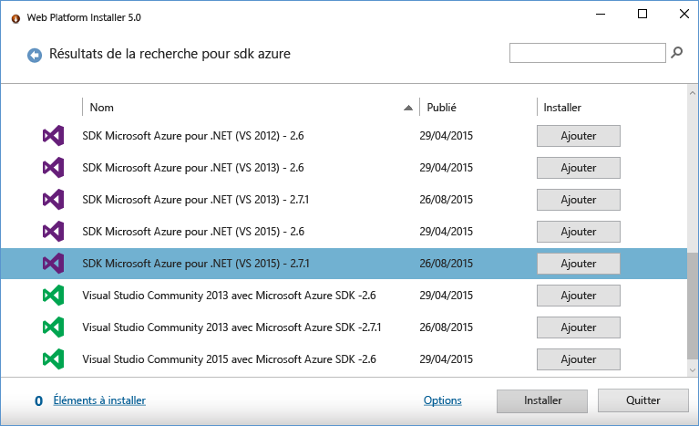
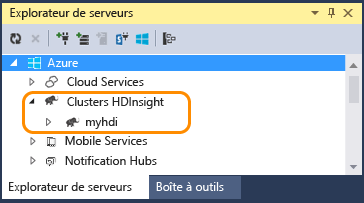
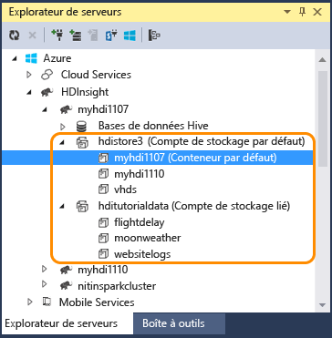
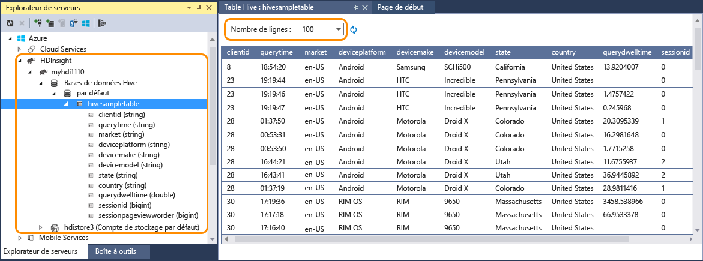
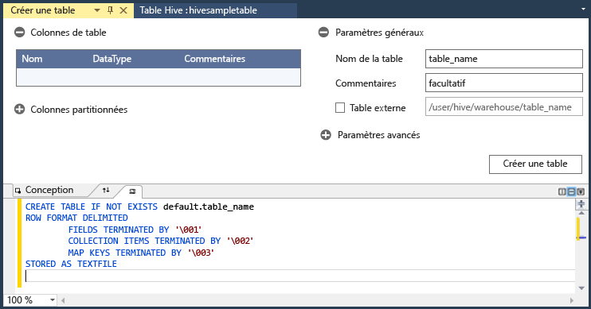
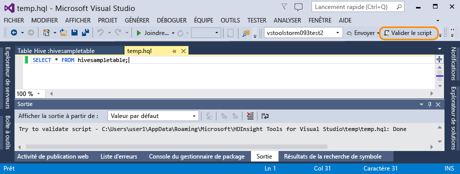
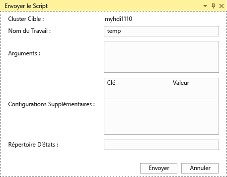
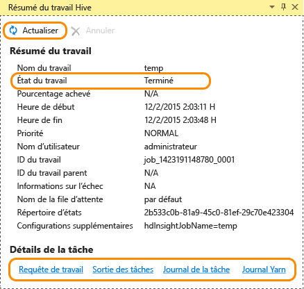
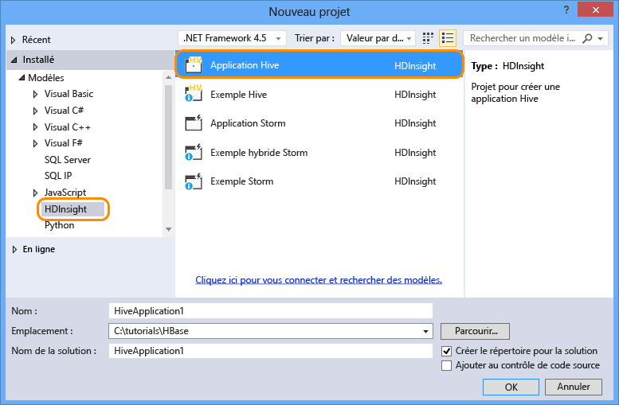
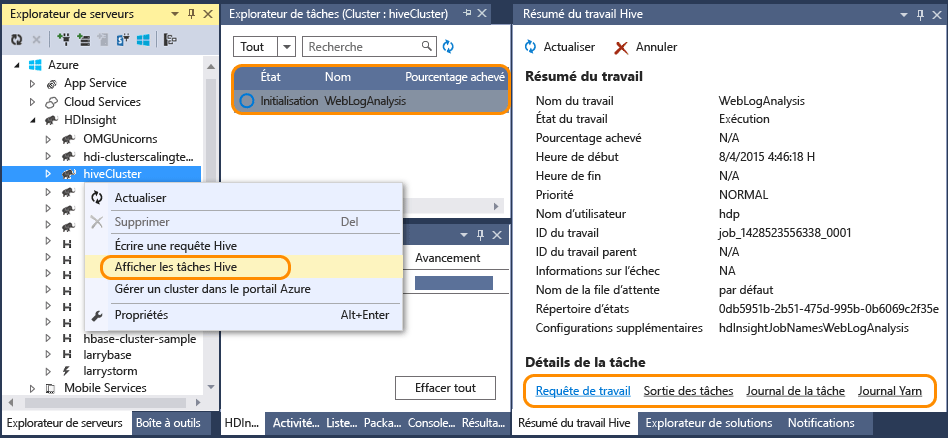

# Se connecter à Azure HDInsight et exécuter des requêtes Hive avec Data Lake Tools pour Visual Studio | Microsoft Docs

Découvrez comment utiliser Data Lake Tools pour Visual Studio pour vous connecter aux clusters Hadoop dans [Azure HDInsight](hdinsight-hadoop-introduction.md) et envoyer des requêtes Hive. Pour plus d’informations sur l’utilisation de HDInsight, consultez les rubriques [Présentation de HDInsight](hdinsight-hadoop-introduction.md) et [Prise en main de HDInsight](hdinsight-hadoop-linux-tutorial-get-started.md). Pour plus d’informations sur la connexion au cluster Storm, consultez [Développement de topologies C# pour Apache Storm sur HDInsight à l’aide de Visual Studio](hdinsight-storm-develop-csharp-visual-studio-topology.md).

Data Lake Tools pour Visual Studio peut être utilisé pour accéder à Data Lake Analytics et à HDInsight.  Pour plus d’informations sur Data Lake Tools, consultez le [Didacticiel : Développer des scripts U-SQL avec les outils Data Lake pour Visual Studio](../data-lake-analytics/data-lake-analytics-data-lake-tools-get-started.md).

**Configuration requise**

Pour suivre ce didacticiel et utiliser Data Lake Tools dans Visual Studio, vous avez besoin des éléments suivants :

* Un cluster Azure HDInsight : pour en créer un, consultez [Prise en main HDInsight sous Linux](hdinsight-hadoop-linux-tutorial-get-started.md)
* une station de travail avec les logiciels suivants :
  
  * Windows 10, Windows 8.1, Windows 8 ou Windows 7.
  * Visual Studio 2013/2015/2017.
    
    > [!NOTE]
    > Actuellement, Data Lake Tools pour Visual Studio n’est fourni qu’avec la version anglaise.
    > 
    > 

## Installation de Data Lake Tools pour Visual Studio

Data Lake Tools est installé par défaut pour Visual Studio 2017. Pour les versions antérieures, vous pouvez l’installer via [Web Platform Installer](https://www.microsoft.com/web/downloads/). Vous devez choisir celui qui correspond à votre version de Visual Studio. Si vous n’avez pas installé Visual Studio, vous pouvez installer la dernière version de Visual Studio Community et le Kit de développement logiciel (SDK) Azure à l’aide de [Web Platform Installer](https://www.microsoft.com/web/downloads/) :

## Se connecter aux abonnements Azure
Avec Data Lake Tools pour Visual Studio, vous pouvez vous connecter à vos clusters HDInsight, effectuer des opérations de gestion de base et exécuter des requêtes Hive.

> [!NOTE]
> Pour plus d’informations sur la connexion à un cluster Hadoop générique, consultez [Écriture et soumission de requêtes Hive à l’aide de Visual Studio](http://blogs.msdn.com/b/xiaoyong/archive/2015/05/04/how-to-write-and-submit-hive-queries-using-visual-studio.aspx).
> 
> 

**Pour vous connecter à votre abonnement Azure**

1. Ouvrez Visual Studio.
2. Dans le menu **Affichage**, cliquez sur **Explorateur de serveurs** pour ouvrir la fenêtre du même nom.
3. Développez **Azure**, puis **HDInsight**.
   
   > [!NOTE]
   > Notez que la fenêtre **Liste des tâches HDInsight** doit s’ouvrir. Si vous ne la voyez pas, cliquez sur **Autres fenêtres** dans le menu **Affichage**, puis cliquez sur **Fenêtre de liste des tâches HDInsight**.  
   > 
   > 
4. Entrez les informations d’identification de votre abonnement Azure, puis cliquez sur **Se connecter**. Cette étape n’est obligatoire que si vous ne vous êtes jamais connecté à l’abonnement Azure à partir de Visual Studio sur ce poste de travail.
5. Dans l’explorateur de serveurs, vous verrez une liste des clusters HDInsight existants. Si vous ne possédez aucun cluster, vous pouvez en créer un dans le portail Azure, avec Azure PowerShell ou à l’aide du Kit de développement logiciel (SDK) HDInsight. Pour plus d’informations, consultez la rubrique [Création de clusters HDInsight](hdinsight-hadoop-provision-linux-clusters.md).
   
   
6. Développez un cluster HDInsight. Vous devez voir les **bases de données Hive**, un compte de stockage par défaut, les comptes de stockage liés et le **journal Hadoop Service**. Vous pouvez développer davantage les entités.

Une fois connecté à votre abonnement Azure, vous serez en mesure d’effectuer les opérations suivantes :

**Pour vous connecter au Portail de gestion à partir de Visual Studio**

* Dans l’Explorateur de serveurs, développez **Azure** > **HDInsight**, cliquez avec le bouton droit sur un cluster HDInsight, puis cliquez sur **Gérer le cluster dans le portail Azure**.

**Pour poser des questions et envoyer des commentaires à partir de Visual Studio**

* Dans le menu **Outils**, cliquez sur **HDInsight**, puis sur **Forum MSDN** pour poser des questions ou sur **Envoyer des commentaires**.

## Accéder aux ressources liées
Dans l’Explorateur de serveurs, vous pouvez voir le compte de stockage par défaut et les éventuels comptes de stockage liés. Développez le compte de stockage par défaut pour afficher les conteneurs dans le compte de stockage. Le compte de stockage par défaut et le conteneur par défaut sont marqués. Vous pouvez aussi cliquer avec le bouton droit sur n’importe quel conteneur pour afficher son contenu.

Après l’ouverture d’un conteneur, vous pouvez utiliser les boutons suivants pour charger, supprimer et télécharger des objets blob :

## Exécution d'une tâche Hive
[Apache Hive](http://hive.apache.org) est une infrastructure d’entrepôt de données basée sur Hadoop qui permet de synthétiser, d’interroger et d’analyser des données. Data Lake Tools pour Visual Studio prend en charge l’exécution de requêtes Hive à partir de Visual Studio. Pour plus d’informations sur Hive, consultez l’article [Utilisation de Hive avec HDInsight](hdinsight-use-hive.md).

Le test du script Hive sur un cluster HDInsight est chronophage. Il peut durer plusieurs minutes. Data Lake Tools pour Visual Studio est capable de valider le script Hive localement, sans connexion à un cluster activé.

Data Lake Tools pour Visual Studio permet également aux utilisateurs de consulter le contenu de la tâche Hive en collectant et en exposant les journaux YARN de tâches Hive données.

### Afficher la table Hive **hivesampletable**
Les clusters HDInsight sont fournis avec un exemple de table Hive qui porte le nom *hivesampletable*. Nous allons utiliser ce tableau pour vous montrer comment répertorier des tables Hive, afficher des schémas de table et répertorier les lignes de la table Hive.

**Pour répertorier les tables Hive et afficher le schéma de la table Hive**

1. À partir de **l’Explorateur de serveurs**, développez**Azure** > **HDInsight** > le cluster de votre choix > **Bases de données Hive** > **Par défaut** > **hivesampletable** pour afficher le schéma de table.
2. Cliquez avec le bouton droit sur **hivesampletable**, puis cliquez sur **Afficher les 100 premières lignes** pour répertorier les lignes. Cela revient à exécuter la requête Hive suivante à l’aide du pilote ODBC Hive :
   
     SELECT * FROM hivesampletable LIMIT 100
   
   Vous pouvez personnaliser le nombre de lignes.
   
   

### Créer des tables Hive
Vous pouvez utiliser des requêtes Hive ou utiliser la GUI pour créer une table Hive. Pour plus d’informations relatives à l’utilisation de requêtes Hive, consultez [Exécution de requêtes Hive](#run.queries).

**Pour créer une table Hive**

1. Dans **l’Explorateur de serveurs**, développez successivement **Azure** > **Clusters HDInsight** un cluster HDInsight > **Bases de données Hive**, puis cliquez avec le bouton droit sur **Par défaut** et cliquez sur **Créer une table**.
2. Configurez la table.
3. Cliquez sur **Créer une table** pour envoyer la tâche de création d’une table Hive.
   
    

### Validation et exécution de requêtes Hive
Vous pouvez créer et exécuter des requêtes Hive de deux manières :

* Création de requêtes ad hoc
* Création d’une application Hive

**Pour créer, valider et exécuter des requêtes ad hoc**

1. Dans **l’Explorateur de serveurs**, développez **Azure**, puis **Clusters HDInsight**.
2. Cliquez avec le bouton droit sur le cluster dans lequel vous souhaitez exécuter la requête, puis cliquez sur **Écrire une requête Hive**.
3. Entrez les requêtes Hive. Notez que l’éditeur Hive prend en charge IntelliSense. Data Lake Tools pour Visual Studio prend en charge le chargement des métadonnées distantes pendant la modification d’un script Hive. Par exemple, lorsque vous tapez « SELECT * FROM », IntelliSense répertorie tous les noms de table suggérés. Lorsqu’un nom de table est spécifié, les noms de colonne sont répertoriés par IntelliSense. Les outils prennent en charge quasiment toutes les instructions DML, sous-requêtes et fonctions définies par l’utilisateur intégrées de Hive.
   
    
   
    
   
   > [!NOTE]
   > Seules les métadonnées des clusters sélectionnés dans la barre d'outils HDInsight sont proposées.
   > 
   > 
4. (Facultatif) : cliquez sur **Valider le script** pour vérifier l’absence d’erreurs de syntaxe dans le script.
   
    
5. Cliquez sur **Envoyer** ou sur **Envoyer (Avancé)**. Avec l’option d’envoi avancé, vous allez configurer les éléments **Nom de la tâche**, **Arguments**, **Configurations supplémentaires** et **Répertoire d’état** pour le script :
   
    
   
    Une fois la tâche soumise, la fenêtre **Résumé de tâche Hive** s’affiche.
   
    
6. Utilisez le bouton **Actualiser** pour mettre à jour l’état jusqu’à ce qu’il passe à **Terminé**.
7. Cliquez sur les liens situés dans la partie inférieure pour afficher les éléments suivants : la **requête de tâche**, la **sortie de la tâche**, le **journal de la tâche** ou le **Journal Yarn**.

**Pour créer et exécuter une solution Hive**

1. Dans le menu **FICHIER**, cliquez sur **Nouveau**, puis sur **Projet**.
2. Sélectionnez **HDInsight** dans le volet gauche, sélectionnez **Application Hive** dans le volet central, entrez les propriétés, puis cliquez sur **OK**.
   
    
3. Dans **l’Explorateur de solutions**, double-cliquez sur **Script.hql** pour l’ouvrir.
4. Pour valider le script Hive, vous pouvez cliquer sur le bouton **Valider le script**, ou cliquer avec le bouton droit sur le script dans l’éditeur Hive, puis sur **Valider le script** dans le menu contextuel.

### Afficher les tâches Hive
Vous pouvez afficher les requêtes, la sortie, le journal et le journal Yarn des tâches Hive. Pour plus d'informations, consultez la capture d’écran précédente.

La version la plus récente des outils permet de consulter le contenu de vos tâches Hive en collectant et en exposant les journaux YARN. Le journal YARN peut vous aider à examiner les problèmes de performances. Pour plus d’informations sur la collection des journaux YARN par HDInsight, consultez [Accès par programme aux journaux des applications HDInsight](hdinsight-hadoop-access-yarn-app-logs.md).

**Pour afficher les tâches Hive**

1. Dans **l’Explorateur de serveurs**, développez **Azure**, puis **HDInsight**.
2. Cliquez avec le bouton droit sur un cluster HDInsight, puis cliquez sur **Afficher les tâches**. Vous verrez une liste des tâches Hive exécutées sur le cluster.
3. Cliquez sur une tâche dans la liste des tâches pour la sélectionner, puis utilisez la fenêtre **Résumé des tâches Hive** pour ouvrir **Requête de tâche**, **Sortie de la tâche**, **Journal de la tâche** ou **Journal Yarn**.
   
    

### Plus grande rapidité d’exécution de Hive via HiveServer2
> [!NOTE]
> Cette fonctionnalité n’est disponible qu’avec le cluster HDInsight versions 3.2 et ultérieures.
> 
> 

L’application Data Lake Tools utilisée pour envoyer des tâches Hive par le biais de [WebHCat](https://cwiki.apache.org/confluence/display/Hive/WebHCat) (également appelé Templeton). Il fallait auparavant beaucoup de temps pour renvoyer les détails d’une tâche et les informations d’erreur.
Pour résoudre ce problème de performances, Data Lake Tools exécute dorénavant les tâches Hive directement dans le cluster par le biais de HiveServer2, de manière à contourner RDP/SSH.
En plus de bénéficier de meilleures performances, les utilisateurs peuvent afficher Hive sur des graphiques Tez et consulter les détails de la tâche.

Pour le cluster HDInsight version 3.2 ou ultérieure, vous pouvez voir un bouton **Exécuter par le biais de HiveServer2** :

Les journaux sont également diffusés en temps réel et les graphiques de tâches s’affichent si la requête Hive et exécutée dans Tez.

**Différence entre l’exécution de requêtes via HiveServer2 et l’envoi de requêtes via WebHCat**

Même si l’exécution de requêtes via HiveServer2 présente de nombreux avantages en termes de performances, elle s’accompagne également de certaines restrictions. Certaines de ces restrictions ne conviennent pas pour une utilisation en production. Le tableau suivant répertorie les différences :

|  | Exécution via HiveServer2 | Envoi via WebHCat |
| --- | --- | --- |
| Exécuter des requêtes |Élimine la surcharge de WebHCat (qui lance une tâche MapReduce nommée « TempletonControllerJob »). |Tant qu’une requête est exécutée via WebHCat, WebHCat lancera une tâche MapReduce qui introduira une latence supplémentaire. |
| Diffuser des journaux en continu |En temps quasi-réel. |Les journaux d’exécution de la tâche sont disponibles uniquement une fois la tâche terminée. |
| Afficher l’historique des tâches |Si une requête est exécutée par le biais de HiveServer2, son historique des tâches (journal des tâches, résultat de la tâche) n’est pas conservé. L’application est consultable dans l’interface utilisateur YARN, mais avec des informations limitées. |Si une requête est exécutée via WebHCat, son historique des tâches (journal des tâches, résultat de la tâche) est conservé et peut être affiché à l’aide de Visual Studio, du Kit de développement logiciel HDInsight ou de PowerShell. |
| Fermer la fenêtre |L’exécution par le biais de HiveServer2 repose sur un mode « synchrone ». Vous devez laisser les fenêtres ouvertes. Si les fenêtres sont fermées, l’exécution de la requête sera annulée. |L’envoi via WebHCat repose sur un mode « asynchrone » ce qui vous permet de soumettre la requête via WebHCat et de fermer Visual Studio. Vous pouvez y revenir et consulter les résultats à tout moment. |

### Graphique de performances des travaux Hive sur Tez
Les Data Lake Tools prennent en charge l’affichage des graphiques de performances pour les tâches Hive exécutées par le moteur d’exécution Tez. Pour plus d’informations sur l’activation de Tez, voir [Utilisation de Hive dans HDInsight](hdinsight-use-hive.md). Après avoir soumis une tâche Hive dans Visual Studio, ce dernier affiche le graphique lorsque cette tâche est terminée.  Il se peut que vous deviez cliquer sur le bouton **Actualiser** pour obtenir le dernier état de la tâche.

> [!NOTE]
> Cette fonctionnalité est disponible uniquement pour le cluster HDInsight à partir de la version 3.2.4.593 et ne peut fonctionner que pour les tâches terminées (si vous avez envoyé votre tâche via WebHCat ; ce graphique s’affichera lorsque vous exécuterez votre requête via HiveServer2). Elle fonctionne pour les clusters basés sur Windows et Linux.
> 
> 

Pour vous aider à mieux comprendre votre requête Hive, l’affichage de l’opérateur Hive a été ajouté à cette version. Double-cliquez simplement sur les vertex du graphique de la tâche pour voir tous les opérateurs à l’intérieur du vertex. Vous pouvez également pointer sur un opérateur spécifique pour afficher plus d’informations sur un cet opérateur.

### Vue Exécution de la tâche pour Hive sur les tâches Tez
Cette vue peut être utilisée pour obtenir des informations structurées et visualisées sur les tâches Hive et pour obtenir davantage de détails sur la tâche. En cas de problèmes de performances, vous pouvez utiliser cette vue pour obtenir des détails supplémentaires. Par exemple, vous pouvez voir comment fonctionne chaque tâche et obtenir des informations détaillées sur chaque tâche (lecture/écriture de données, heure de planification/début/fin, etc.) de manière à pouvoir adapter les configurations de tâches ou l’architecture système en fonction des informations visualisées.

## Exécuter des scripts Pig
Data Lake Tools pour Visual Studio prennent en charge la création et la soumission de scripts Pig aux clusters HDInsight. Les utilisateurs peuvent créer un projet Pig à partir d’un modèle, puis soumettre le script à des clusters HDInsight.

## Commentaires et problèmes connus
* Actuellement, les résultats HiveServer2 sont affichés en mode texte pur, ce qui n'est pas idéal. Nous y travaillons actuellement.
* Actuellement, si les résultats sont lancés avec des valeurs NULL, ils ne sont pas affichés. Nous avons résolu ce problème. Si vous êtes bloqué sur ce problème, n'hésitez pas à nous envoyer un e-mail ou à contacter l'équipe du support technique.
* Le script HQL créé par Visual Studio est encodé selon le paramètre de région locale de l’utilisateur. Il peut ne pas s’exécuter correctement si l’utilisateur charge le script dans le cluster sous forme binaire.

## Étapes suivantes
Dans cet article, vous avez appris à établir une connexion à des clusters HDInsight à partir de Visual Studio à l’aide du package Data Lake (HDInsight) Tools et à exécuter des requêtes Hive. Pour plus d'informations, consultez les pages suivantes :

* [Utilisation de Hadoop Hive dans HDInsight](hdinsight-use-hive.md)
* [Prise en main de Hadoop dans HDInsight](hdinsight-hadoop-linux-tutorial-get-started.md)
* [Envoi de tâches Hadoop dans HDInsight](hdinsight-submit-hadoop-jobs-programmatically.md)
* [Analyse des données Twitter avec Hadoop dans HDInsight](hdinsight-analyze-twitter-data.md)

