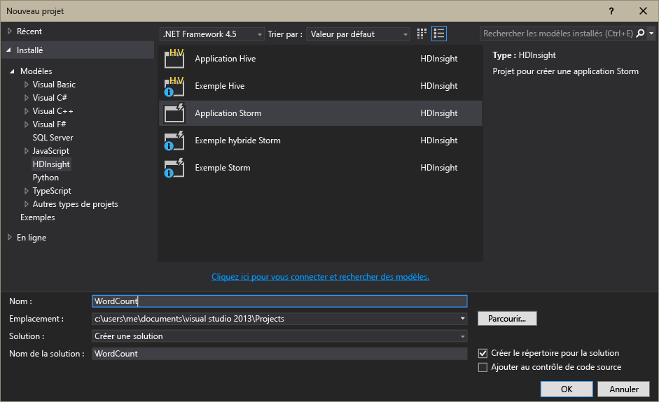

<properties
	pageTitle="Présentation d’Apache Storm sur HDInsight | Microsoft Azure"
	description="Accédez à une présentation d‘Apache Storm et découvrez comment utiliser Storm sur HDInsight pour créer des solutions d‘analyse de données en temps réel dans le cloud."
	services="hdinsight"
	documentationCenter=""
	authors="Blackmist"
	manager="paulettm"
	editor="cgronlun"/>

<tags
   ms.service="hdinsight"
   ms.devlang="na"
   ms.topic="article"
   ms.tgt_pltfrm="na"
   ms.workload="big-data"
   ms.date="07/24/2015"
   ms.author="larryfr"/>

#Présentation d’Apache Storm sur HDInsight : analyse en temps réel pour Haddop

Apache Storm sur HDInsight offre la possibilité de créer des solutions d‘analyse distribuée et en temps réel dans l‘environnement Azure à l‘aide d’[Apache Hadoop](http://hadoop.apache.org).

##Qu’est-ce qu’Apache Storm ?

Apache Storm est un système de calcul distribué, open source et tolérant aux pannes qui permet de traiter les données en temps réel avec Hadoop. Les solutions Storm peuvent également permettre un traitement garanti des données, ainsi que la possibilité de relire les données dont le traitement a échoué une première fois.

##Pourquoi utiliser Storm sur HDInsight ?

Apache Storm sur HDInsight est un cluster géré intégré dans l‘environnement Azure. Il vous permet de bénéficier des avantages suivants :

* Agir comme un service géré avec un contrat de niveau de service (SLA) garantissant un taux de disponibilité de 99,9 %

* Utiliser le langage de votre choix : il prend en charge les composants Storm écrits en **Java**, en **C#** et en **Python**

	* Prendre en charge une combinaison de plusieurs langages de programmation : il peut lire des données à l‘aide de Java, puis les traiter en utilisant le C#

	* Utiliser l’interface Java **Trident** pour créer des topologies Storm qui prennent en charge « exactement une fois » le traitement des messages, la persistance de magasin de données « transactionnels » et un ensemble d‘opérations d‘analyses courantes de flux de données

* Il inclut des fonctionnalités intégrées permettant d’augmenter ou de diminuer en puissance : mettez un cluster HDInsight à l’échelle sans aucun impact sur les topologies Storm en cours d‘exécution

* S’intégrer avec d‘autres services Azure, notamment le concentrateur d‘événements, le réseau virtuel Azure, la base de données SQL, le stockage d‘objets blob et DocumentDB

	* Combiner les fonctionnalités de plusieurs clusters HDInsight à l‘aide d‘un réseau virtuel Azure : créer des pipelines analytiques qui utilisent des clusters HDInsight, HBase ou Hadoop

Pour obtenir une liste des entreprises qui utilisent Apache Storm pour leurs solutions d‘analyse en temps réel, consultez la rubrique [Entreprises utilisant Apache Storm](https://storm.apache.org/documentation/Powered-By.html).

Pour découvrir Storm, consultez la rubrique [Prise en main de Storm sur HDInsight][gettingstarted].

###Facilité d’approvisionnement

Vous pouvez approvisionner un nouveau cluster Storm sur HDInsight en quelques minutes. Précisez le nom du cluster, sa taille, le compte d‘administrateur et le compte de stockage. Azure créera le cluster, y compris des exemples de topologies et un tableau de bord de gestion web.

> [AZURE.NOTE]Vous pouvez également configurer des clusters Storm en utilisant l’[interface de ligne de commande](../xplat-cli.md) ou [Azure PowerShell](../powershell-install-configure.md).

Dans les 15 minutes qui suivent l‘envoi de la demande, vous disposerez d’un nouveau cluster actif et prêt pour votre première analyse en temps réel.

###Simplicité d'utilisation

Si vous utilisez Visual Studio, HDInsight Tools pour Visual Studio vous offre la possibilité de créer des topologies C# et hybrides C#/Java pour les envoyer à votre cluster Storm sur HDInsight.

HDInsight Tools pour Visual Studio fournit également une interface permettant de surveiller et de gérer des topologies Storm sur un cluster.

Pour obtenir un exemple d‘utilisation de HDInsight Tools afin de créer une application Storm, consultez la rubrique [Développement de topologies Storm C# avec HDInsight Tools pour Visual Studio](hdinsight-storm-develop-csharp-visual-studio-topology.md).

Pour plus d‘informations sur HDInsight Tools pour Visual Studio, consultez la rubrique [Prise en main de HDInsight Tools pour Visual Studio](../HDInsight/hdinsight-hadoop-visual-studio-tools-get-started.md).

Chaque cluster Storm sur HDInsight permet également d’accéder à un tableau de bord Storm Web qui permet d‘envoyer, de surveiller et de gérer des topologies Storm qui s’exécutent sur le cluster.

Pour plus d‘informations sur l‘utilisation du tableau de bord Storm, consultez la rubrique [Déploiement et gestion des topologies Apache Storm sur HDInsight](hdinsight-storm-deploy-monitor-topology.md).

Storm sur HDInsight s’intègre également sans difficulté avec Azure Event Hubs via le **spout de concentrateur d’événement**. Cette option est disponible sur chaque cluster Storm à **%STORM\_HOME%\\examples\\eventhubspout\\eventhubs-storm-spout-0.9-jar-with-dependencies.jar**. Pour obtenir des exemples d‘utilisation de ce spout dans une topologie Storm, consultez les rubriques [Prise en main de Event Hubs](service-bus-event-hubs-c-storm-getstarted.MD) et [Analyse des données de capteur avec Storm et HBase](hdinsight-storm-sensor-data-analysis.MD).

###Fiabilité

Apache Storm garantit toujours que chaque message entrant sera entièrement traité, même lorsque l‘analyse de données est répartie sur des centaines de nœuds.

Le **nœud Nimbus** offre une fonctionnalité similaire à Hadoop JobTracker et affecte des tâches à d‘autres nœuds du cluster via **Zookeeper**. Les nœuds Zookeeper permettent de coordonner le cluster et facilitent la communication entre Nimbus et le processus **Superviseur** sur les nœuds de travail. Si un nœud de traitement tombe en panne, le nœud Nimbus est informé et affecte la tâche et les données associées à un autre nœud.

Par défaut, Apache Storm est configuré pour n’avoir un seul nœud Nimbus. Storm sur HDInsight exécute deux nœuds Nimbus. Si le nœud principal tombe en panne, le cluster HDInsight bascule vers le nœud secondaire tandis que le nœud principal est récupéré.

###Mise à l'échelle

Bien que vous puissiez spécifier le nombre de nœuds dans votre cluster lors de sa création, vous pourriez souhaiter augmenter ou réduire la taille du cluster pour l’adapter à votre charge de travail. Tous les clusters HDInsight permettent de modifier le nombre de nœuds du cluster, même lors du traitement des données.

> [AZURE.NOTE]Pour tirer parti des nouveaux nœuds ajoutés via la mise à l'échelle, vous devrez rééquilibrer les topologies démarrées avant l’augmentation de la taille du cluster.

###Support

Storm sur HDInsight bénéficie d’une assistance professionnelle complète 24h/24 7j/7. Storm sur HDInsight possède également un contrat SLA garantissant un taux de disponibilité de 99,9 %. Cela signifie que nous garantissons une disponibilité de la connectivité externe du cluster au moins 99,9 % du temps.

##Scénarios d‘utilisation courants d’analyse en temps réel

Voici quelques scénarios courants dans lesquels vous pouvez utiliser Apache Storm sur HDInsight. Pour plus d‘informations sur les scénarios réels, consultez la rubrique [Comment les entreprises utilisent-elles Storm ?](https://storm.incubator.apache.org/documentation/Powered-By.html).

* Internet des objets (IoT)
* Détection des fraudes
* Analyse des réseaux sociaux
* Extraire, transformer, charger (ETL)
* Analyse du réseau
* Recherche
* Engagement mobile

##Mode de gestion des données Storm HDInsight

Apache Storm exécute des**topologies** au lieu de tâches MapReduce que vous connaissez peut-être si vous utilisez HDInsight ou Hadoop. Un cluster Storm sur HDInsight contient deux types de nœuds : les nœuds principaux qui exécutent **Nimbus** et les nœuds de travail qui exécutent **Supervisor**.

* **Nimbus** : tout comme JobTracker dans Hadoop, il est chargé de la distribution du code dans l‘ensemble du cluster, de l’attribution des tâches aux machines virtuelles et de l’analyse des défaillances. HDInsight fournit deux nœuds Nimbus, de sorte que Storm sur HDInsight ne présente pas de point de défaillance unique.

* **Superviseur** : le superviseur de chaque nœud de travail est responsable du démarrage et de l’arrêt du **processus de travail** sur le nœud.

* **Processus de travail** : exécute un sous-ensemble d’une **topologie**. Une topologie en cours d'exécution est distribuée entre plusieurs processus de travail via le cluster.

* **Topologie** : définit un graphique de calcul qui traite les **flux** de données. Contrairement aux tâches MapReduce, les topologies continuent de s‘exécuter jusqu‘à ce que vous les arrêtiez.

* **Flux** : une collection non liée de **tuples**. Les flux sont produits par des **spouts** et des **bolts**, et consommés par des **bolts**.

* **Tuple** : une liste nommée de valeurs saisies de manière dynamique.

* **Spout** : consomme des données à partir d‘une source de données et émet un ou plusieurs **flux**.

	> [AZURE.NOTE]Dans de nombreux cas, les données sont lues à partir d‘une file d‘attente telle que Kafka, les files d‘attente Azure Service Bus ou les concentrateurs d‘événements. Les files d‘attente garantissent la conservation des données en cas de panne.

* **Bolt** : consomme des **flux**, effectue le traitement des **tuples** et peut émettre des **flux**. Les bolts sont également chargés d‘écrire des données vers le stockage externe, comme une file d‘attente, HDInsight, HBase, un objet blob ou autre magasin de données.

* **Apache Thrift** : infrastructure logicielle permettant un développement de service évolutif interlangage. Il vous permet de développer des services fonctionnant entre C++, Java, Python, PHP, Ruby, Erlang, Perl, Haskell, C#, Cocoa, JavaScript, Node.js, Smalltalk et d'autres langages.

	* **Nimbus** est un service de Thrift et une **topologie** est une définition de Thrift. Il est donc possible de développer des topologies en utilisant plusieurs langages de programmation.

Pour plus d‘informations sur les composants de Storm, consultez le [didacticiel Storm][apachetutorial] sur le site apache.org.

##Quels langages de programmation utiliser ?

Le cluster Storm sur HDInsight prend en charge C#, Java et Python.

### C&#35;

HDInsight Tools pour Visual Studio permet aux développeurs .NET de concevoir et d‘implémenter une topologie en C#. Vous pouvez également créer des topologies hybrides qui utilisent des composants Java et C#.

Pour plus d‘informations, consultez la rubrique [Développer des topologies C# pour Apache Storm sur HDInsight en utilisant Visual Studio](hdinsight-storm-develop-csharp-visual-studio-topology.md).

###Java

La plupart des exemples Java que vous allez rencontrer sont entièrement rédigés en Java ou en Trident. Trident est une abstraction globale facilitant le déroulement des tâches telles que les jointures, les agrégations, le regroupement et le filtrage. Toutefois, Trident agit sur les lots de tuples, tandis qu‘une solution Java brute traite un flux à raison d’un tuple à la fois.

Pour plus d‘informations sur Trident, consultez le [didacticiel Trident](https://storm.incubator.apache.org/documentation/Trident-tutorial.html) sur le site apache.org.

Pour obtenir des exemples de topologies Java et Trident brutes, consultez le répertoire **%storm\_home%\\contrib\\storm-starter** situé sur votre cluster Storm HDInsight.

##Quels sont les modèles de développement courants ?

###Traitement de message garanti

Storm peut fournir différents niveaux de traitement de message garanti. Par exemple, une application Storm de base peut garantir un traitement « Une fois au minimum », tandis que Trident peut garantir un traitement Exactement une fois.

Pour plus d‘informations, consultez la rubrique [Garanties sur le traitement des données](https://storm.apache.org/about/guarantees-data-processing.html) sur le site apache.org.

###IBasicBolt

Le modèle de lecture d'une entrée tuple, qui émet entre zéro et plusieurs tuples, puis le mécanisme d'accusé de réception de l'entrée tuple appliqué dès la fin de la méthode d'exécution, sont si courants que Storm fournit l'interface [IBasicBolt](https://storm.apache.org/apidocs/backtype/storm/topology/IBasicBolt.html) pour automatiser ce modèle.

###Jointures

Les jonctions de deux flux de données varient selon les applications. Vous pouvez, par exemple, joindre chaque tuple provenant de plusieurs flux dans un nouveau flux, ou joindre uniquement des lots de tuples pour une fenêtre spécifique. Dans tous les cas, la jointure s'effectue en utilisant [fieldsGrouping](http://javadox.com/org.apache.storm/storm-core/0.9.1-incubating/backtype/storm/topology/InputDeclarer.html#fieldsGrouping%28java.lang.String,%20backtype.storm.tuple.Fields%29), une méthode permettant de définir la façon dont les tuples sont acheminés vers les bolts.

Dans l‘exemple Java suivant, fieldsGrouping est utilisé pour acheminer les tuples qui proviennent des composants « 1 », « 2 » et « 3 » vers le bolt **MyJoiner**.

	builder.setBolt("join", new MyJoiner(), parallelism) .fieldsGrouping("1", new Fields("joinfield1", "joinfield2")) .fieldsGrouping("2", new Fields("joinfield1", "joinfield2")) .fieldsGrouping("3", new Fields("joinfield1", "joinfield2"));

###Traitement par lot

Il existe plusieurs façons d'effectuer un traitement par lot. Avec une topologie Java Storm de base, vous pouvez utiliser un simple compteur pour traiter par lot un nombre X de tuples avant de les émettre, ou utiliser un mécanisme de synchronisation interne nommé « tick tuple » pour émettre un lot toutes les X secondes.

Pour consulter un exemple d‘utilisation de « tick tuples », consultez la page [Analyse des données de capteur avec Storm et HBase sur HDInsight](hdinsight-storm-sensor-data-analysis.md).

Si vous utilisez Trident, ce dernier est basé sur le traitement par lot des tuples.

###Mise en cache

La mise en cache en mémoire est souvent utilisée pour accélérer le traitement, car elle garde en mémoire les éléments les plus utilisés. Comme une topologie est distribuée entre plusieurs nœuds et que plusieurs processus sont menés dans chaque nœud, nous vous conseillons d‘utiliser [fieldsGrouping](http://javadox.com/org.apache.storm/storm-core/0.9.1-incubating/backtype/storm/topology/InputDeclarer.html#fieldsGrouping%28java.lang.String,%20backtype.storm.tuple.Fields%29) pour être sûr que les tuples contenant des champs utilisés pour la recherche dans le cache sont toujours acheminés vers le même processus. Ceci permet d'éviter la duplication des entrées de cache à travers les processus.

###Diffusion des N premiers

Lorsque votre topologie est basée sur le calcul d‘une valeur des « N premiers », comme les 5 premières tendances sur Twitter, nous vous conseillons de calculer la valeur N premiers en parallèle, puis de fusionner les résultats de ces calculs dans une valeur globale. Pour ce faire, utilisez [fieldsGrouping](http://javadox.com/org.apache.storm/storm-core/0.9.1-incubating/backtype/storm/topology/InputDeclarer.html#fieldsGrouping%28java.lang.String,%20backtype.storm.tuple.Fields%29) pour procéder à l‘acheminement par champ vers les bolts parallèles (qui partitionne les données par valeur de champ) avant de les acheminer vers un bolt qui détermine la valeur N premiers de façon globale.

L'exemple [RollingTopWords](https://github.com/nathanmarz/storm-starter/blob/master/src/jvm/storm/starter/RollingTopWords.java) présente cette méthode.

##Étapes suivantes

En savoir plus sur les solutions d‘analyse en temps réel avec Apache Storm dans HDInsight :

* [Prise en main de Storm sur HDInsight][gettingstarted]

* [Exemples de topologies pour Storm dans HDInsight](hdinsight-storm-example-topology.md)

[stormtrident]: https://storm.incubator.apache.org/documentation/Trident-API-Overview.html
[samoa]: http://yahooeng.tumblr.com/post/65453012905/introducing-samoa-an-open-source-platform-for-mining
[apachetutorial]: https://storm.incubator.apache.org/documentation/Tutorial.html
[gettingstarted]: ../hdinsight-storm-getting-started.md

<!---HONumber=July15_HO5-->