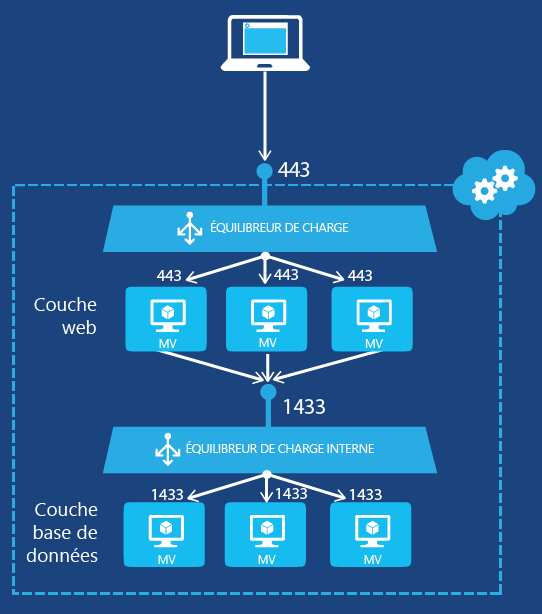

# Prise en main de la création d’un équilibreur de charge interne (classique) à l’aide de PowerShell
[!INCLUDE [load-balancer-get-started-ilb-classic-selectors-include.md](../../includes/load-balancer-get-started-ilb-classic-selectors-include.md)]

[!INCLUDE [load-balancer-get-started-ilb-intro-include.md](../../includes/load-balancer-get-started-ilb-intro-include.md)]

[!INCLUDE [azure-arm-classic-important-include](../../includes/learn-about-deployment-models-classic-include.md)]

Découvrez comment [effectuer ces étapes à l’aide du modèle Resource Manager](load-balancer-get-started-ilb-arm-ps.md).

[!INCLUDE [load-balancer-get-started-ilb-scenario-include.md](../../includes/load-balancer-get-started-ilb-scenario-include.md)]

[!INCLUDE [azure-ps-prerequisites-include.md](../../includes/azure-ps-prerequisites-include.md)]

## Créer un jeu d’équilibrage de charge interne pour les machines virtuelles
Pour créer un jeu d’équilibrage de charge interne et les serveurs qui y enverront leur trafic, vous devez procéder comme suit :

1. Créez une instance d’équilibrage de charge qui sera le point de terminaison du trafic entrant qui devra être équilibré entre les serveurs d’un jeu d’équilibrage de charge.
2. Ajoutez des points de terminaison correspondants aux machines virtuelles qui recevront le trafic entrant.
3. Configurez les serveurs qui enverront le trafic avec une charge équilibrée pour envoyer leur trafic à l’adresse IP virtuelle (VIP) de l’instance d’équilibrage de charge interne.

### Étape 1 : Créer une instance d’équilibrage de charge interne
Pour un service cloud existant ou un service cloud déployé dans un réseau virtuel régional, vous pouvez créer une instance d’équilibrage de charge interne avec les commandes Windows PowerShell suivantes :

    $svc="<Cloud Service Name>"
    $ilb="<Name of your ILB instance>"
    $subnet="<Name of the subnet within your virtual network>"
    $IP="<The IPv4 address to use on the subnet-optional>"

    Add-AzureInternalLoadBalancer -ServiceName $svc -InternalLoadBalancerName $ilb –SubnetName $subnet –StaticVNetIPAddress $IP

Notez que l’utilisation de cette cmdlet [Add-AzureEndpoint](https://msdn.microsoft.com/library/dn495300.aspx) Windows PowerShell utilise le jeu de paramètres DefaultProbe. Pour plus d'informations sur les jeux de paramètres supplémentaires, consultez [Add-AzureEndpoint](https://msdn.microsoft.com/library/dn495300.aspx).

### Étape 2 : Ajouter des points de terminaison à l’instance d’équilibrage de charge interne
Voici un exemple :

    $svc="mytestcloud"
    $vmname="DB1"
    $epname="TCP-1433-1433"
    $lbsetname="lbset"
    $prot="tcp"
    $locport=1433
    $pubport=1433
    $ilb="ilbset"
    Get-AzureVM –ServiceName $svc –Name $vmname | Add-AzureEndpoint -Name $epname -Lbset $lbsetname -Protocol $prot -LocalPort $locport -PublicPort $pubport –DefaultProbe -InternalLoadBalancerName $ilb | Update-AzureVM

### Étape 3 : Configurer vos serveurs pour envoyer leur trafic vers le nouveau point de terminaison d’équilibrage de charge interne
Vous devez configurer les serveurs dont la charge du trafic sera équilibrée pour utiliser la nouvelle adresse IP virtuelle de l’instance d’équilibrage de charge interne. Il s’agit de l’adresse sur laquelle l’instance d’équilibrage de charge interne est en train d’écouter. Dans la plupart des cas, il vous suffit d’ajouter ou de modifier un enregistrement DNS pour l’adresse IP virtuelle de l’instance d’équilibrage de charge interne.

Si vous avez spécifié l’adresse IP lors de la création de l’instance d’équilibrage de charge interne, vous avez déjà l’adresse IP virtuelle. Autrement, vous pouvez afficher l'adresse IP virtuelle à partir des commandes suivantes :

    $svc="<Cloud Service Name>"
    Get-AzureService -ServiceName $svc | Get-AzureInternalLoadBalancer

Pour utiliser ces commandes, renseignez les valeurs et supprimez < et >. Voici un exemple :

    $svc="mytestcloud"
    Get-AzureService -ServiceName $svc | Get-AzureInternalLoadBalancer

À partir de l'affichage de la commande Get-AzureInternalLoadBalancer, notez l'adresse IP et apportez les modifications nécessaires à vos serveurs ou à vos enregistrements DNS pour vous assurer que le trafic est envoyé à l'adresse IP virtuelle.

> [!NOTE]
> La plateforme Microsoft Azure utilise une adresse IPv4 statique routable publiquement pour divers scénarios d’administration. L’adresse IP est 168.63.129.16. Cette adresse IP ne doit pas être bloquée par les pare-feu, car cela peut entraîner un comportement inattendu. En ce qui concerne l’équilibrage de charge Azure, cette adresse IP est utilisée par les sondes de l’équilibreur de charge, pour déterminer l’état de santé pour les machines virtuelles dans un jeu d’équilibrage de charge interne. Si un groupe de sécurité réseau est utilisé pour limiter le trafic vers les machines virtuelles Azure dans un jeu d’équilibrage de charge interne, ou est appliqué à un sous-réseau de réseau virtuel, vérifiez qu’une règle de sécurité de réseau est ajoutée pour autoriser le trafic à partir de 168.63.129.16.
> 
> 

## Exemple d’équilibrage de charge interne
Pour vous guider dans le processus de bout en bout de la création d'un jeu d'équilibrage de charge pour deux exemples de configuration, consultez les sections suivantes.

### Une application multi-niveau sur Internet
Vous souhaitez fournir un service de base de données à charge équilibrée pour un ensemble de serveurs web sur Internet. Les deux ensembles de serveurs sont hébergés dans un seul service cloud Azure. Le trafic du serveur web vers le port TCP 1433 doit être réparti entre deux machines virtuelles au niveau de la base de données. La Figure 1 montre la configuration.

La configuration se compose des éléments suivants :

* Le service cloud existant qui héberge les machines virtuelles s’appelle mytestcloud.
* Les deux serveurs de base de données existants sont nommés DB1 et DB2.
* Les serveurs web au niveau du web se connectent aux serveurs de base de données au niveau de la base de données à l’aide d’une adresse IP privée. Une autre option consiste à utiliser votre propre serveur DNS pour le réseau virtuel et à inscrire manuellement un enregistrement A pour le jeu d’équilibrage de charge interne.

Les commandes suivantes configurent une nouvelle instance d’équilibrage de charge interne appelée **ILBset** et ajoutent des points de terminaison aux machines virtuelles correspondant aux deux serveurs de base de données :

    $svc="mytestcloud"
    $ilb="ilbset"
    Add-AzureInternalLoadBalancer -ServiceName $svc -InternalLoadBalancerName $ilb
    $prot="tcp"
    $locport=1433
    $pubport=1433
    $epname="TCP-1433-1433"
    $lbsetname="lbset"
    $vmname="DB1"
    Get-AzureVM –ServiceName $svc –Name $vmname | Add-AzureEndpoint -Name $epname -LbSetName $lbsetname -Protocol $prot -LocalPort $locport -PublicPort $pubport –DefaultProbe -InternalLoadBalancerName $ilb | Update-AzureVM

    $epname="TCP-1433-1433-2"
    $vmname="DB2"
    Get-AzureVM –ServiceName $svc –Name $vmname | Add-AzureEndpoint -Name $epname -LbSetName $lbsetname -Protocol $prot -LocalPort $locport -PublicPort $pubport –DefaultProbe -InternalLoadBalancerName $ilb | Update-AzureVM

## Supprimer une configuration d’équilibrage de charge interne
Pour supprimer une machine virtuelle en tant que point de terminaison d’une instance d’équilibreur de charge interne, utilisez les commandes suivantes :

    $svc="<Cloud service name>"
    $vmname="<Name of the VM>"
    $epname="<Name of the endpoint>"
    Get-AzureVM -ServiceName $svc -Name $vmname | Remove-AzureEndpoint -Name $epname | Update-AzureVM

Pour utiliser ces commandes, renseignez les valeurs et supprimez < et >.

Voici un exemple :

    $svc="mytestcloud"
    $vmname="DB1"
    $epname="TCP-1433-1433"
    Get-AzureVM -ServiceName $svc -Name $vmname | Remove-AzureEndpoint -Name $epname | Update-AzureVM

Pour supprimer une instance d’équilibreur de charge interne depuis un service cloud, utilisez les commandes suivantes :

    $svc="<Cloud service name>"
    Remove-AzureInternalLoadBalancer -ServiceName $svc

Pour utiliser ces commandes, renseignez les valeurs et supprimez < et >.

Voici un exemple :

    $svc="mytestcloud"
    Remove-AzureInternalLoadBalancer -ServiceName $svc

## Informations supplémentaires sur les applets de commande de l’équilibreur de charge interne
Pour obtenir plus d’informations sur les applets de commande d’équilibrage de charge interne, exécutez les commandes suivantes à l’invite Azure Windows PowerShell :

* Get-help New-AzureInternalLoadBalancerConfig -full
* Get-help Add-AzureInternalLoadBalancer -full
* Get-help Get-AzureInternalLoadbalancer -full
* Get-help Remove-AzureInternalLoadBalancer -full

## Étapes suivantes
[Configurer le mode de distribution d’équilibreur de charge à l’aide de l’affinité d’IP source](load-balancer-distribution-mode.md)

[Configuration des paramètres de délai d’expiration TCP inactif pour votre équilibrage de charge](load-balancer-tcp-idle-timeout.md)

<!---HONumber=AcomDC_0824_2016-->