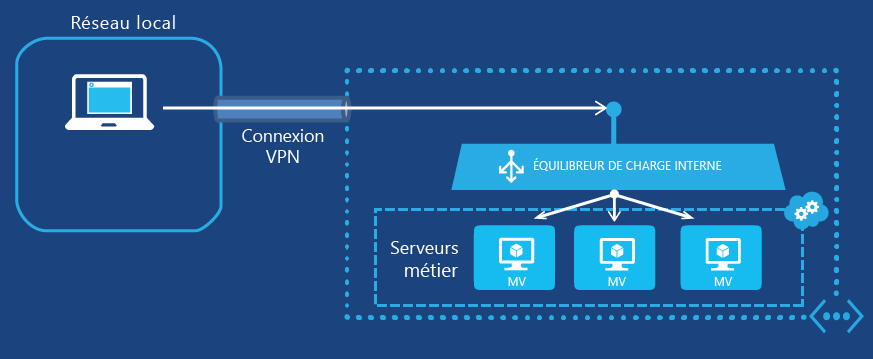

<properties
   pageTitle="Prise en main de l’équilibrage de charge interne | Microsoft Azure"
   description="Configuration de l'équilibrage de charge interne et procédure d’implémentation pour les machines virtuelles et les déploiements de cloud"
   services="load-balancer"
   documentationCenter="na"
   authors="joaoma"
   manager="adinah"
   editor="tysonn" />
<tags
   ms.service="load-balancer"
   ms.devlang="na"
   ms.topic="get-started-article"
   ms.tgt_pltfrm="na"
   ms.workload="infrastructure-services"
   ms.date="07/10/2015"
   ms.author="joaoma" />

# Prise en main de la configuration d’un équilibrage de charge interne

L’équilibrage de charge interne (ILB) d’Azure fournit un équilibrage de charge entre les machines virtuelles qui résident dans un service cloud ou un réseau virtuel avec une portée régionale. Pour plus d'informations sur l'utilisation et la configuration des réseaux virtuels avec une portée régionale, consultez [Réseaux virtuels régionaux](../regional-virtual-networks.md) sur le blog Azure. Les réseaux virtuels existants qui ont été configurés pour un groupe d'affinités ne peuvent pas utiliser l'ILB.

## Création d'un jeu d'équilibrage de charge interne pour les machines virtuelles

Pour créer un jeu d'équilibrage de charge interne Azure et les serveurs qui y enverront leur trafic, vous devez procéder comme suit :

1. Créez une instance ILB qui sera le point de terminaison du trafic entrant dont la charge devra être équilibrée entre les serveurs d'un jeu d'équilibrage de charge.

1. Ajoutez des points de terminaison correspondants aux machines virtuelles qui recevront le trafic entrant.

1. Configurez les serveurs qui enverront le trafic avec une charge équilibrée pour envoyer leur trafic à l'adresse IP virtuelle (VIP) de l'instance ILB.

### Étape 1 : création d’une instance ILB

Pour un service cloud existant ou un service cloud déployé dans un réseau virtuel régional, vous pouvez créer une instance ILB avec les commandes Windows PowerShell suivantes :

	$svc="<Cloud Service Name>"
	$ilb="<Name of your ILB instance>"
	$subnet="<Name of the subnet within your virtual network>"
	$IP="<The IPv4 address to use on the subnet-optional>"

	Add-AzureInternalLoadBalancer -ServiceName $svc -InternalLoadBalancerName $ilb –SubnetName $subnet –StaticVNetIPAddress $IP

Pour utiliser ces commandes, renseignez les valeurs et supprimez les < and >. Voici un exemple :

	$svc="WebCloud-NY"
	$ilb="SQL-BE"
	$subnet="Farm1"
	$IP="192.168.98.10"
	Add-AzureInternalLoadBalancer -ServiceName $svc -InternalLoadBalancerName $ilb –SubnetName $subnet –StaticVNetIPAddress $IP

### Étape 2 : ajout de points de terminaison à l'instance ILB

Pour les machines virtuelles existantes, vous pouvez ajouter des points de terminaison à l'instance ILB avec les commandes suivantes :

	$svc="<Cloud service name>"
	$vmname="<Name of the VM>"
	$epname="<Name of the endpoint>"
	$lbsetname="<Name of the load balancer set>"
	$prot="tcp" or "udp"
	$locport=<local port number>
	$pubport=<public port number>
	$ilb="<Name of your ILB instance>"
	Get-AzureVM –ServiceName $svc –Name $vmname | Add-AzureEndpoint -Name $epname -LbsetName $lbsetname -Protocol $prot -LocalPort $locport -PublicPort $pubport –DefaultProbe -InternalLoadBalancerName $ilb | Update-AzureVM

Pour utiliser ces commandes, renseignez les valeurs et supprimez les < and >.

Notez que l’utilisation de cette cmdlet [Add-AzureEndpoint](https://msdn.microsoft.com/library/dn495300.aspx) Windows PowerShell utilise le jeu de paramètres DefaultProbe. Pour plus d'informations sur les jeux de paramètres supplémentaires, consultez [Add-AzureEndpoint](https://msdn.microsoft.com/library/dn495300.aspx).

Voici un exemple :

	$svc="AZ-LOB1"
	$vmname="SQL-LOBAZ1"
	$epname="SQL1"
	$lbsetname="SQL-LB"
	$prot="tcp"
	$locport=1433
	$pubport=1433
	$ilb="SQL ILB"
	Get-AzureVM –ServiceName $svc –Name $vmname | Add-AzureEndpoint -Name $epname -Lbset $lbsetname -Protocol $prot -LocalPort $locport -PublicPort $pubport –DefaultProbe -InternalLoadBalancerName $ilb | Update-AzureVM

### Étape 3 : configuration de vos serveurs pour envoyer leur trafic vers le nouveau point de terminaison d’ILB

Vous devez configurer les serveurs dont la charge du trafic sera équilibrée pour utiliser la nouvelle adresse IP virtuelle de l'instance ILB. Il s'agit de l'adresse sur laquelle l'instance ILB est en train d’écouter. Dans la plupart des cas, il vous suffit d'ajouter ou de modifier un enregistrement DNS pour l'adresse IP virtuelle de l'instance ILB.

Si vous avez spécifié l'adresse IP lors de la création de l'instance ILB, vous avez déjà l'adresse IP virtuelle. Autrement, vous pouvez afficher l'adresse IP virtuelle à partir des commandes suivantes :

	$svc="<Cloud Service Name>"
	Get-AzureService -ServiceName $svc | Get-AzureInternalLoadBalancer

Pour utiliser ces commandes, renseignez les valeurs et supprimez les < and >. Voici un exemple :

	$svc="WebCloud-NY"
	Get-AzureService -ServiceName $svc | Get-AzureInternalLoadBalancer

À partir de l'affichage de la commande Get-AzureInternalLoadBalancer, notez l'adresse IP et apportez les modifications nécessaires à vos serveurs ou à vos enregistrements DNS pour vous assurer que le trafic est envoyé à l'adresse IP virtuelle.

>[AZURE.NOTE]La plateforme Microsoft Azure utilise une adresse IPv4 statique routable publiquement pour divers scénarios d’administration. L’adresse IP est 168.63.129.16. Cette adresse IP ne doit pas être bloquée par les pare-feu, car cela peut entraîner un comportement inattendu. En ce qui concerne l’équilibrage de charge Azure, cette adresse IP est utilisée par l’analyse des sondes d’équilibrage de charge, pour déterminer l’état d'intégrité pour les machines virtuelles dans un jeu d’équilibrage de charge interne. Si un groupe de sécurité réseau est utilisé pour limiter le trafic vers les machines virtuelles Azure dans un jeu d’équilibrage de charge interne, ou est appliqué à un sous-réseau de réseau virtuel, vérifiez qu’une règle de sécurité de réseau est ajoutée pour autoriser le trafic à partir de 168.63.129.16.

## Exemples de bout en bout de l'équilibrage de charge interne

Pour vous guider dans le processus de bout en bout de la création d'un jeu d'équilibrage de charge pour deux exemples de configuration, consultez les sections suivantes.

### Une application multiniveau sur Internet

La société Contoso Corporation souhaite fournir un équilibrage de charge entre un ensemble de serveurs web sur Internet et un ensemble de serveurs de base de données. Les deux ensembles de serveurs sont hébergés dans un seul service cloud Azure. Le trafic du serveur web vers le port TCP 1433 doit être réparti entre trois machines virtuelles au niveau de la base de données. La Figure 1 montre la configuration.

Figure 1 : exemple d’une application multiniveau sur Internet

La configuration se compose des éléments suivants :

- Le service cloud existant qui héberge les machines virtuelles s’appelle Contoso-PartnerSite.

- Les trois serveurs de base de données existants s’appellent PARTNER-SQL-1, PARTNER-SQL-2 et PARTNER-SQL-3.

- Les serveurs web au niveau du web se connectent aux serveurs de base de données au niveau de la base de données à l'aide du nom DNS partner-SQL.External.contoso.com.

Les commandes suivantes configurent une nouvelle instance ILB appelée PARTNER-DBTIER et ajoutent des points de terminaison aux machines virtuelles correspondant aux trois serveurs de base de données :

	$svc="Contoso-PartnerSite"
	$ilb="PARTNER-DBTIER"
	Add-AzureInternalLoadBalancer -ServiceName $svc -InternalLoadBalancerName $ilb

	$prot="tcp"
	$locport=1433
	$pubport=1433
	$epname="DBTIER1"
	$lbsetname="SQL-LB"
	$vmname="PARTNER-SQL-1"
	Get-AzureVM –ServiceName $svc –Name $vmname | Add-AzureEndpoint -Name $epname -LbSetName $lbsetname -Protocol $prot -LocalPort $locport -PublicPort $pubport –DefaultProbe -InternalLoadBalancerName $ilb | Update-AzureVM

	$epname="DBTIER2"
	$vmname="PARTNER-SQL-2"
	Get-AzureVM –ServiceName $svc –Name $vmname | Add-AzureEndpoint -Name $epname -LbSetName $lbsetname -Protocol $prot -LocalPort $locport -PublicPort $pubport –DefaultProbe -InternalLoadBalancerName $ilb | Update-AzureVM

	$epname="DBTIER3"
	$vmname="PARTNER-SQL-3"
	Get-AzureVM –ServiceName $svc –Name $vmname | Add-AzureEndpoint -Name $epname -LbSetName $lbsetname -Protocol $prot -LocalPort $locport -PublicPort $pubport –DefaultProbe -InternalLoadBalancerName $ilb | Update-AzureVM

Ensuite, Contoso a déterminé l'adresse IP virtuelle de l'instance ILB PARTNER-DBTIER avec la commande suivante :

	Get-AzureService -ServiceName $svc | Get-AzureInternalLoadBalancer

Depuis l'affichage de cette commande, Contoso a noté l'adresse VIP de 100.64.65.211 et a configuré l'enregistrement (A) de l'adresse DNS pour le nom partner-sql.external.contoso.com afin d’utiliser cette nouvelle adresse.

### Une application cœur de métier hébergée dans Azure

La société Contoso Corporation souhaite héberger une application cœur de métier sur un ensemble de serveurs web dans Azure. Le trafic client vers le port TCP 80 doit avoir un équilibrage de charge entre trois machines virtuelles exécutées dans un réseau virtuel entre différents locaux. La Figure 2 montre la configuration.

Figure 2  exemple d’une application cœur de métier hébergée dans Azure

La configuration se compose des éléments suivants :

- Le service cloud existant qui héberge les machines virtuelles s’appelle Contoso-Legal.

- Le sous-réseau sur lequel se trouvent les serveurs cœur de métier s’appelle LOB-LEGAL et Contoso a choisi 198.168.99.145 comme adresse IP virtuelle de l'équilibrage de charge interne.

- Les trois serveurs cœur de métier existants s’appellent LEGAL-1, LEGAL-2 et LEGAL-3.

- Les clients web intranet se connectent à ces serveurs avec le nom DNS legalnet.corp.contoso.com.

Les commandes suivantes créent une instance ILB appelée LEGAL-ILB et ajoutent des points de terminaison aux machines virtuelles correspondant aux trois serveurs de cœur de métier :

	$svc="Contoso-Legal"
	$ilb="LEGAL-ILB"
	$subnet="LOB-LEGAL"
	$IP="198.168.99.145"
	Add-AzureInternalLoadBalancer –ServiceName $svc -InternalLoadBalancerName $ilb –SubnetName $subnet –StaticVNetIPAddress $IP

	$prot="tcp"
	$locport=80
	$pubport=80
	$epname="LOB1"
	$lbsetname="LOB-LB"
	$vmname="LEGAL-1"
	Get-AzureVM –ServiceName $svc –Name $vmname | Add-AzureEndpoint -Name $epname-LbSetName $lbsetname -Protocol $prot -LocalPort $locport -PublicPort $pubport –DefaultProbe -InternalLoadBalancerName $ilb | Update-AzureVM

	$epname="LOB2"
	$vmname="LEGAL2"
	Get-AzureVM –ServiceName $svc –Name $vmname | Add-AzureEndpoint -Name $epname -LbSetName $lbsetname -Protocol $prot -LocalPort $locport -PublicPort $pubport –DefaultProbe -InternalLoadBalancerName $ilb | Update-AzureVM

	$epname="LOB3"
	$vmname="LEGAL3"
	Get-AzureVM –ServiceName $svc –Name $vmname | Add-AzureEndpoint -Name $epname -LbSetName $lbsetname -Protocol $prot -LocalPort $locport -PublicPort $pubport –DefaultProbe -InternalLoadBalancerName $ilb | Update-AzureVM

Ensuite, Contoso a configuré l'enregistrement A DNS pour le nom legalnet.corp.contoso.com pour utiliser 198.168.99.145.

## Ajout d’une machine virtuelle à l’ILB

Pour ajouter une machine virtuelle à une instance ILB lorsqu’elle est créée, vous pouvez utiliser les cmdlets New-AzureInternalLoadBalancerConfig et New-AzureVMConfig.

Voici un exemple :

	$svc="AZ-LOB1"
	$ilb="LOB-ILB"
	$vnet="LOBNet_Azure"
	$subnet="LOBServers"
	$vmname="LOB-WEB1"
	$adminuser="Lando"
	$adminpw="Platform327"
	$regionname="North Central US"

	$myilbconfig=New-AzureInternalLoadBalancerConfig -InternalLoadBalancerName $ilb -SubnetName $subnet
	$images = Get-AzureVMImage
	New-AzureVMConfig -Name $vmname -InstanceSize Small -ImageName $images[50].ImageName | Add-AzureProvisioningConfig -Windows -AdminUsername $adminuser -Password $adminpw | New-AzureVM -ServiceName $svc -InternalLoadBalancerConfig $myilbconfig -Location $regionname –VNetName $vnet

## Configuration de l’ILB pour les services cloud

L’ILB est pris en charge pour les machines virtuelles et le service cloud. Un point de terminaison ILB créé dans un service cloud en dehors d'un réseau virtuel régional sera accessible uniquement dans le service cloud.

La configuration de l'ILB doit être définie lors de la création du premier déploiement dans le service cloud, comme illustré dans l'exemple ci-dessous.

>[AZURE.IMPORTANT]Un réseau virtuel déjà créé pour le déploiement de cloud est requis pour exécuter les étapes ci-dessous. Pour créer l'ILB, vous aurez besoin du nom du sous-réseau et du nom du réseau virtuel.

### Étape 1

Ouvrez le fichier de configuration du service (.cscfg) pour votre déploiement cloud dans Visual Studio et ajoutez la section suivante pour créer l'ILB sous le dernier élément « </Role> » pour la configuration du réseau.

	<NetworkConfiguration>
	  <LoadBalancers>
	    <LoadBalancer name="name of the load balancer">
	      <FrontendIPConfiguration type="private" subnet="subnet-name" staticVirtualNetworkIPAddress="static-IP-address"/>
	    </LoadBalancer>
	  </LoadBalancers>
	</NetworkConfiguration>
 

À titre d'exemple, nous allons ajouter les valeurs pour le fichier de configuration du réseau. Dans l'exemple, supposons que vous avez créé un sous-réseau appelé « test_vnet » avec un sous-réseau 10.0.0.0/24 appelé test_subnet et une adresse IP statique 10.0.0.4. L'équilibrage de charge sera nommé testLB.

	<NetworkConfiguration>
	  <LoadBalancers>
	    <LoadBalancer name="testLB">
	      <FrontendIPConfiguration type="private" subnet="test_subnet" staticVirtualNetworkIPAddress="10.0.0.4"/>
	    </LoadBalancer>
	  </LoadBalancers>
	</NetworkConfiguration>

Vous trouverez plus d'informations sur le schéma d'équilibrage de charge sous [Ajouter un équilibrage de charge](https://msdn.microsoft.com/library/azure/dn722411.aspx).

### Étape 2

Modifiez le fichier de définition de service (.csdef) pour ajouter des points de terminaison à l'ILB. Au moment où une instance de rôle est créée, le fichier de définition de service ajoute les instances de rôle à l'ILB.

	<WorkerRole name="worker-role-name" vmsize="worker-role-size" enableNativeCodeExecution="[true|false]">
	  <Endpoints>
	    <InputEndpoint name="input-endpoint-name" protocol="[http|https|tcp|udp]" localPort="local-port-number" port="port-number" certificate="certificate-name" loadBalancerProbe="load-balancer-probe-name" loadBalancer="load-balancer-name" />
	  </Endpoints>
	</WorkerRole>

En conservant les valeurs de l'exemple ci-dessus, ajoutons les valeurs au fichier de définition de service

	<WorkerRole name=WorkerRole1" vmsize="A7" enableNativeCodeExecution="[true|false]">
	  <Endpoints>
	    <InputEndpoint name="endpoint1" protocol="http" localPort="80" port="80" loadBalancer="testLB" />
	  </Endpoints>
	</WorkerRole>

Le trafic réseau est équilibré à l'aide de l'équilibrage de charge testLB utilisant le port 80 pour les requêtes entrantes, avec envoi aux instances de rôle de travail sur le port 80 également.

## Suppression de la configuration de l’ILB

Pour supprimer une machine virtuelle en tant que point de terminaison à partir d'une instance ILB, utilisez les commandes suivantes :

	$svc="<Cloud service name>"
	$vmname="<Name of the VM>"
	$epname="<Name of the endpoint>"
	Get-AzureVM -ServiceName $svc -Name $vmname | Remove-AzureEndpoint -Name $epname | Update-AzureVM

Pour utiliser ces commandes, renseignez les valeurs et supprimez les < and >.

Voici un exemple :

	$svc="AZ-LOB1"
	$vmname="SQL-LOBAZ1"
	$epname="SQL1"
	Get-AzureVM -ServiceName $svc -Name $vmname | Remove-AzureEndpoint -Name $epname | Update-AzureVM

Pour supprimer une instance ILB depuis un service cloud, utilisez les commandes suivantes :

	$svc="<Cloud service name>"
	Remove-AzureInternalLoadBalancer -ServiceName $svc

Pour utiliser ces commandes, renseignez les valeurs et supprimez les < and >.

Voici un exemple :

	$svc="AZ-LOB1"
	Remove-AzureInternalLoadBalancer -ServiceName $svc

## Plus d'informations sur les cmdlets ILB

Pour obtenir plus d'informations sur les cmdlets ILB, exécutez les commandes suivantes dans l’invite Azure Windows PowerShell :

- Get-help New-AzureInternalLoadBalancerConfig -full

- Get-help Add-AzureInternalLoadBalancer -full

- Get-help Get-AzureInternalLoadbalancer -full

- Get-help Remove-AzureInternalLoadBalancer -full

## Voir aussi

[Configuration d’un mode de distribution d’équilibrage de charge](load-balancer-distribution-mode.md)

[Configuration des paramètres du délai d’expiration TCP inactif pour votre équilibrage de charge](load-balancer-tcp-idle-timeout.md)
 

<!---HONumber=July15_HO4-->