# Prise en main d’un espace de travail Log Analytics
Vous pouvez devenir rapidement opérationnel avec Azure Log Analytics, qui vous aide à évaluer l’intelligence opérationnelle collectée à partir de votre infrastructure informatique. Grâce à cet article, vous pouvez facilement commencer à découvrir, analyser et agir sur les données que vous collectez, et cela *gratuitement*.

Cet article sert d’introduction à Log Analytics à l’aide d’un bref didacticiel qui vous guide dans un déploiement minimal dans Azure afin que vous puissiez commencer à utiliser le service. Le conteneur logique dans lequel sont stockées vos données de gestion dans Azure est appelé un espace de travail. Après avoir passé en revue ces informations et effectué l’évaluation, vous pouvez supprimer l’espace de travail d’évaluation. Étant donné que cet article est un didacticiel, il ne fournit aucune information sur la configuration requise, la planification ou l’architecture.

>[!NOTE]
>Si vous utilisez le cloud Microsoft Azure Government, utilisez la [documentation de Surveillance et gestion d’Azure Government](https://docs.microsoft.com/azure/azure-government/documentation-government-services-monitoringandmanagement#log-analytics) à la place.

Voici un aperçu du processus utilisé pour la prise en main :

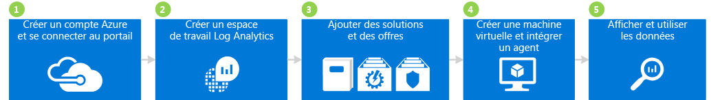

## 1 Créer un compte Azure et se connecter

Si vous n’avez pas de compte Azure, vous devez en créer un pour utiliser Log Analytics. Vous pouvez créer un [compte gratuit](https://azure.microsoft.com/free/) vous permettant d’accéder à n’importe quel service Azure pendant 30 jours.

### Pour créer un compte gratuit et se connecter
1. Suivez les instructions indiquées dans [Créer votre compte Azure gratuit](https://azure.microsoft.com/free/).
2. Accédez au [portail Azure](https://portal.azure.com) et connectez-vous.

## 2 Créer un espace de travail

L’étape suivante consiste à créer un espace de travail.

1. Dans le portail Azure, recherchez *Log Analytics* dans la liste des services du Marketplace, puis sélectionnez **Log Analytics**.  
    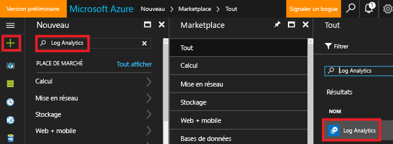
2. Cliquez sur **Créer**, puis sélectionnez les options pour les éléments suivants :
   * **Espace de travail OMS** : entrez un nom pour votre espace de travail.
   * **Abonnement** : si vous possédez plusieurs abonnements, choisissez celui que vous souhaitez associer au nouvel espace de travail.
   * **Groupe de ressources**
   * **Emplacement**
   * **Niveau de tarification**  
       
3. Cliquez sur **OK** pour afficher la liste de vos espaces de travail.
4. Sélectionnez un espace de travail pour en visualiser les détails dans le Portail Azure.       
             

## 3 Mettre à niveau l’espace de travail vers la nouvelle fonctionnalité Recherche dans les journaux
Un nouveau langage de requête Log Analytics a été mis en production. Pour en bénéficier, vous devez convertir votre espace de travail.  Si la région qui héberge votre espace de travail a été mise à niveau, une bannière violette doit apparaître dans la partie supérieure de votre espace de travail pour vous inviter à effectuer cette conversion. La mise à niveau est totalement facultative et n’a aucune incidence sur votre utilisation de Log Analytics ou des solutions que vous pourriez ajouter.  

Pour plus d’informations sur les avantages, les points à prendre en compte et le processus de mise à niveau, consultez l’article [Mise à niveau d’Azure Log Analytics pour la nouvelle fonctionnalité de recherche dans les journaux](log-analytics-log-search-upgrade.md).  

## 4 Ajouter des solutions et des offres de solutions

Ajoutez ensuite des solutions de gestion et des offres de solutions. Les solutions de gestion représentent une collection de règles logiques, de visualisation et d'acquisition des données qui fournissent des mesures cernant un domaine problématique en particulier. Une offre de solution est un ensemble de solutions de gestion.

L’ajout de solutions à votre espace de travail permet à Log Analytics de collecter différents types de données à partir d’ordinateurs connectés à votre espace de travail à l’aide d’agents. Nous aborderons l’intégration des agents ultérieurement.

### Pour ajouter des solutions et des offres de solutions

1. Dans le portail Azure, cliquez sur **Nouveau** puis, dans la zone **Rechercher dans le marketplace** , entrez **Log Analytics des activités**, puis appuyez sur ENTRÉE.
2. Dans le panneau Tout, sélectionnez **Log Analytics des activités**, puis cliquez sur **Créer**.  
    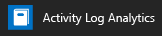  
3. Dans le panneau *Nom de la solution gestion*, sélectionnez un espace de travail à associer à la solution de gestion.
4. Cliquez sur **Create**.  
    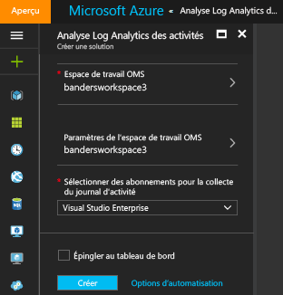  
5. Répétez les étapes 1 à 4 pour ajouter :
    - L’offre de service **Security & Compliance** avec les solutions Analyse anti-programme malveillant et Sécurité et solution d’audit.
    - L’offre de service **Automation & Control** avec les solutions Automation Hybrid Worker, Suivi des modifications et Évaluation des mises à jour du système (également appelée Gestion des mises à jour). Vous devez créer un compte Automation lorsque vous ajoutez l’offre de solution.  
        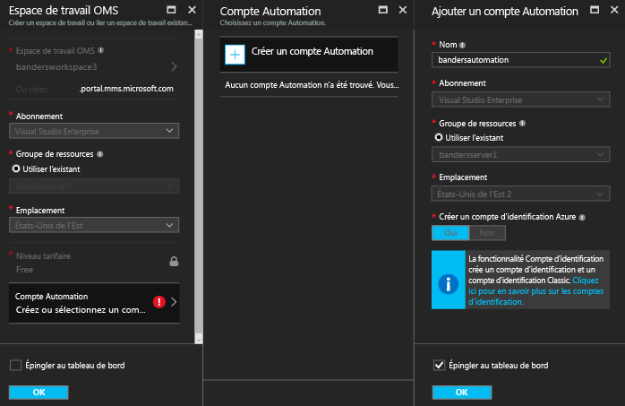  
6. Vous pouvez afficher les solutions de gestion que vous avez ajoutées à votre espace de travail en accédant à **Log Analytics** > **Abonnements** > ***nom de l’espace de travail*** > **Vue d’ensemble**. Les mosaïques des solutions de gestion que vous avez ajoutées sont affichées.  
    >[!NOTE]
    >Étant donné que nous n’avons pas encore connecté d’agents à l’espace de travail, vous ne voyez pas de données pour les solutions que vous avez ajoutées.  

    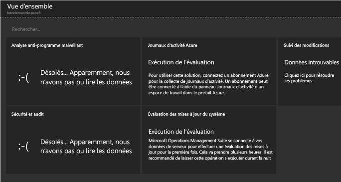

## 4 Créer une machine virtuelle et intégrer un agent

Créez ensuite une machine virtuelle simple dans Azure. Après avoir créé une machine virtuelle, intégrez l’agent OMS pour l’activer. L’activation de l’agent lance la collecte de données à partir de la machine virtuelle et envoie les données à Log Analytics.

### Création d’une machine virtuelle

- Suivez les instructions indiquées dans [Créer votre première machine virtuelle Windows dans le portail Azure](../virtual-machines/virtual-machines-windows-hero-tutorial.md) et démarrez la nouvelle machine virtuelle.

### Connecter la machine virtuelle à Log Analytics

- Suivez les instructions indiquées dans [Connecter des machines virtuelles Azure à Log Analytics](log-analytics-azure-vm-extension.md) pour connecter la machine virtuelle à Log Analytics à l’aide du portail Azure.

## 6 Visualiser et manipuler les données

Précédemment, vous avez activé la solution Log Analytics des activités et les offres de services Security & Compliance et Automation & Control. Nous observons ensuite les données collectées par les solutions et les résultats des recherches dans les journaux.

Pour commencer, examinez les données des solutions qui s’affichent. Examinez ensuite certaines recherches dans les journaux accessibles à partir de recherches dans les journaux. Les recherches de journal vous permettent de combiner et de mettre en corrélation toutes les données de l’ordinateur à partir de plusieurs sources dans votre environnement. Pour plus d’informations, consultez l’article [Trouver des données avec les recherches de journaux dans Log Analytics](log-analytics-log-searches.md) ou, si vous avez converti votre espace de travail dans le nouveau langage de requête, l’article [Présentation des recherches dans les journaux dans Log Analytics](log-analytics-log-search-new.md). 

### Pour afficher les données de logiciel anti-programme malveillant

1. Dans le portail Azure, accédez à **Log Analytics** > ***votre espace de travail***.
2. Dans le panneau de votre espace de travail, sous **Général**, cliquez sur **Vue d’ensemble**.  
    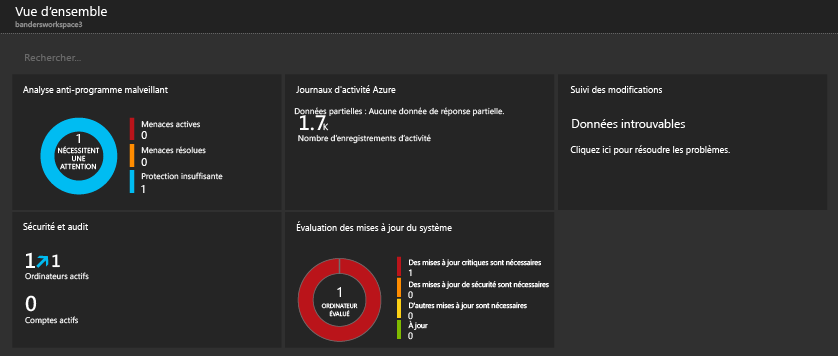
3. Cliquez sur la mosaïque **Analyse anti-programme malveillant**. Dans cet exemple, vous pouvez voir que Windows Defender est installé sur un ordinateur, mais que sa signature est obsolète.  
    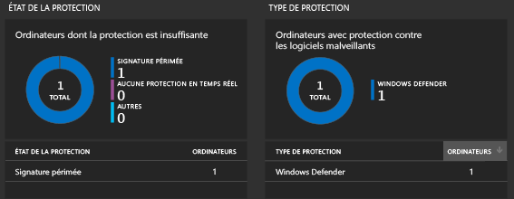
4. Pour cet exemple, sous **État de la protection**, cliquez sur **Signature obsolète** pour ouvrir la recherche dans les journaux et afficher des détails sur les ordinateurs dont les signatures sont obsolètes. Dans cet exemple, notez que l’ordinateur est nommé *getstarted*. Si plusieurs ordinateurs ont des signatures obsolètes, ils doivent tous apparaître dans les résultats de la recherche dans les journaux.  
    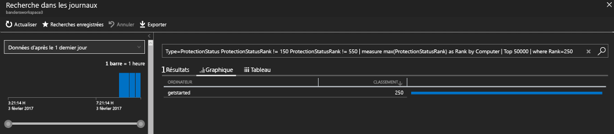

### Pour afficher les données de sécurité et d’audit

1. Dans le panneau de votre espace de travail, sous **Général**, cliquez sur **Vue d’ensemble**.  
2. Cliquez sur la mosaïque **Sécurité et audit**. Dans cet exemple, vous pouvez voir deux problèmes importants : des mises à jour critiques sont manquantes sur un ordinateur et la protection est insuffisante sur un autre ordinateur.  
    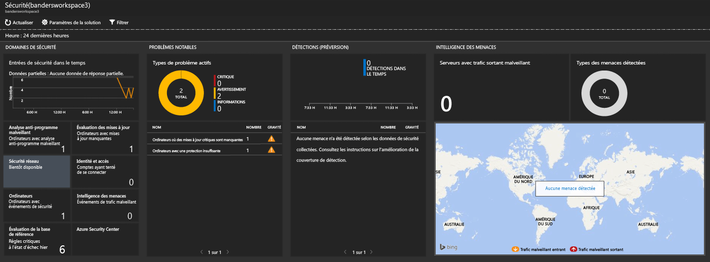
3. Pour cet exemple, sous **Problèmes notables**, cliquez sur **Ordinateurs avec mises à jour critiques manquantes** pour ouvrir la recherche dans les journaux et afficher des détails sur les ordinateurs avec des mises à jour critiques manquantes. Dans cet exemple, une mise à jour critique est manquante et 63 autres mises à jour sont manquantes.  
    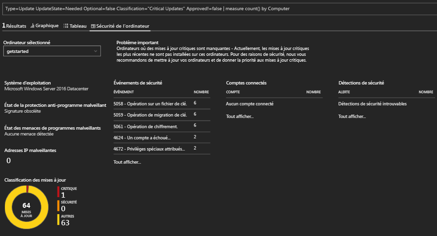

### Pour afficher et agir sur les données de mise à jour du système

1. Dans le panneau de votre espace de travail, sous **Général**, cliquez sur **Vue d’ensemble**.  
2. Cliquez sur la mosaïque **Évaluation des mises à jour du système**. Dans cet exemple, vous pouvez voir qu’il existe un ordinateur Windows nommé *getstarted* nécessitant des mises à jour critiques et un qui nécessite des mises à jour de définition.  
    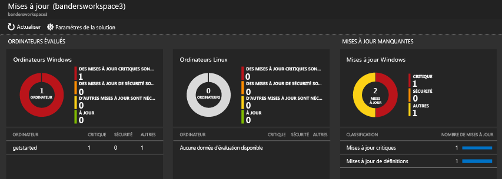
3. Pour cet exemple, sous **Mises à jour manquantes**, cliquez sur **Mises à jour critiques** pour ouvrir la recherche dans les journaux et afficher des détails sur les ordinateurs avec des mises à jour critiques manquantes. Dans cet exemple, une mise à jour est manquante et une mise à jour est obligatoire.  
    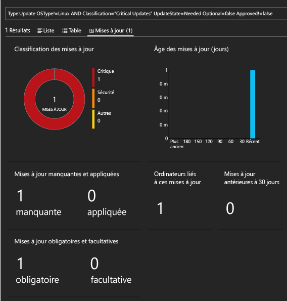
4. Accédez au site web [Operations Management Suite](http://microsoft.com/oms) et connectez-vous avec votre compte Azure. Lorsque vous êtes connecté, notez que les informations sur les solutions sont semblables à ce que vous avez vu dans le portail Azure.  
    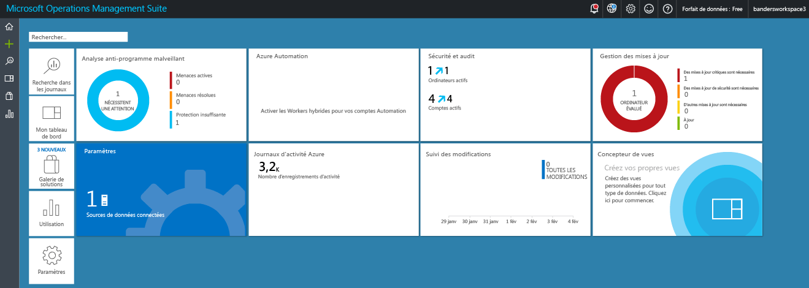
5. Cliquez sur la mosaïque **Gestion des mises à jour**.
6. Dans le tableau de bord Gestion des mises à jour, notez que les informations de mise à jour du système sont semblables aux informations de mise à jour du système que vous avez vues dans le portail Azure. Toutefois, la mosaïque **Gérer les déploiements de mises à jour** est une nouveauté. Cliquez sur la mosaïque **Gérer les déploiements de mises à jour**.  
    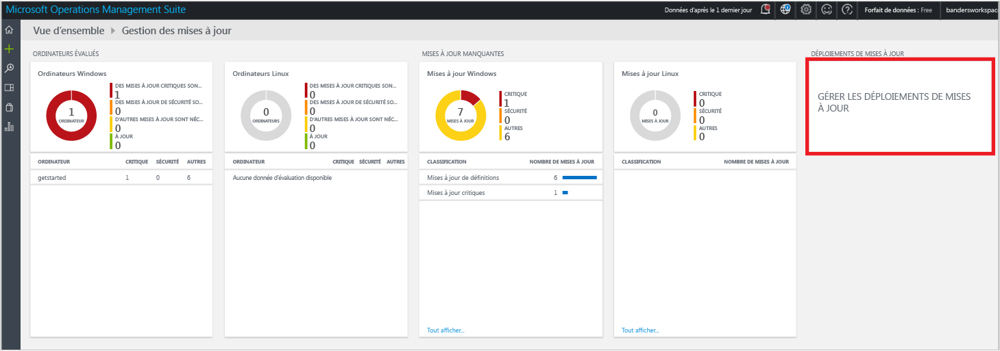
7. Dans la page **Déploiements de mises à jour**, cliquez sur **Ajouter** pour créer une *exécution de la mise à jour*.  
     (Déploiements de mises à jour)
8.  Dans la page **Nouveau déploiement de mises à jour**, donnez un nom au déploiement de mises à jour, sélectionnez les ordinateurs à mettre à jour (dans cet exemple, *getstarted*), sélectionnez une planification, puis cliquez sur **Enregistrer**.  
    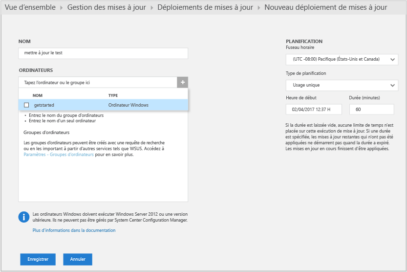  
    Après avoir enregistré le déploiement de mises à jour, vous voyez la mise à jour planifiée.  
    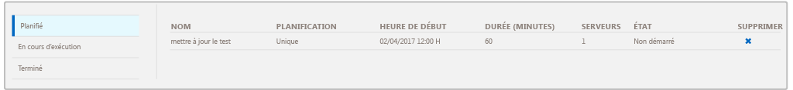  
    Une fois l’exécution de la mise à jour terminée, l’état affiche **Terminé**.
    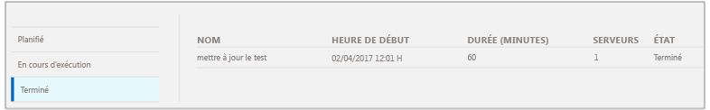
9. Une fois l’exécution de la mise à jour terminée, vous pouvez voir si l’exécution a réussi ou non, et vous pouvez afficher des détails sur les mises à jour qui ont été appliquées.

## Après l’évaluation

Dans ce didacticiel, vous avez installé un agent sur une machine virtuelle et vous avez démarré rapidement. Les étapes que vous avez suivies ont été rapides et simples. Toutefois, la plupart des grandes organisations et entreprises ont des infrastructures informatiques locales complexes. Par conséquent, la collecte de données à partir de ces environnements complexes demande une planification et des efforts supplémentaires à ceux présentés dans le didacticiel. Passez en revue les informations contenues dans la section Étapes suivantes ci-dessous pour obtenir des liens vers des articles utiles.

Vous pouvez éventuellement supprimer l’espace de travail que vous avez créé avec ce didacticiel.

## Étapes suivantes
* En savoir plus sur la connexion d’[agents Windows](log-analytics-windows-agents.md) à Log Analytics.
* En savoir plus sur la connexion d’[agents Operations Manager](log-analytics-om-agents.md) à Log Analytics.
* [Ajoutez des solutions Log Analytics à partir de la galerie de solutions](log-analytics-add-solutions.md) pour ajouter des fonctionnalités et collecter des données.
* Familiarisez-vous avec les [recherches de journal](log-analytics-log-searches.md) pour afficher les informations détaillées collectées par les solutions.

