# Prise en main de Log Analytics
Vous pouvez en quelques minutes être opérationnel avec Log Analytics dans Microsoft Operations Management Suite (OMS). Deux options sont disponibles lorsque vous choisissez de créer un espace de travail OMS, qui est similaire à un compte :

* Site Web Microsoft Operations Management Suite
* Abonnement Microsoft Azure

Vous pouvez créer un espace de travail OMS gratuit à l’aide du site web OMS. Vous pouvez également utiliser un abonnement Microsoft Azure pour créer un espace de travail Log Analytics gratuit. Les espaces de travail créés dans les deux cas sont équivalents sur le plan fonctionnel. Les espaces de travail gratuits ne peuvent envoyer que 500 Mo de données par jour au service OMS. Tous les espaces de travail nécessitant un abonnement Azure, vous pouvez également utiliser votre abonnement pour accéder à d’autres services Azure. Quelle que soit la méthode utilisée pour créer l’espace de travail, vous allez le créer avec un compte Microsoft ou un compte professionnel.

Voici le processus :

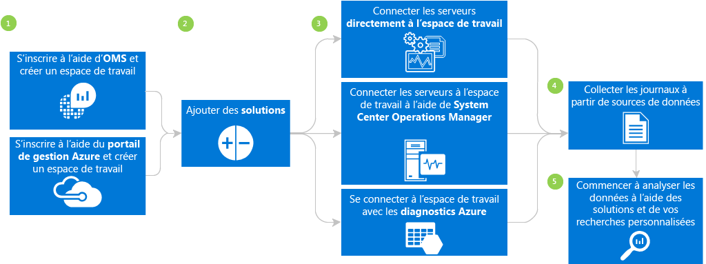

## Conditions préalables et considérations relatives au déploiement de Log Analytics
* Pour utiliser toutes les fonctionnalités de Log Analytics, vous devez souscrire à un abonnement Microsoft Azure payant. Si vous ne disposez pas d’un abonnement Azure, créez un [compte gratuit](https://azure.microsoft.com/free/) vous permettant d’accéder à n’importe quel service Azure pendant 30 jours. Vous pouvez également créer un compte OMS gratuit sur le site web [Operations Management Suite](http://microsoft.com/oms).
* Vous devez créer un espace de travail.
* Chaque ordinateur Windows à partir duquel vous souhaitez collecter des données doit exécuter Windows Server 2008 SP1 ou version ultérieure.
* [Pare-feu](log-analytics-proxy-firewall.md) aux adresses du service web OMS.
* Déterminez si vos ordinateurs ont un accès direct à Internet. Dans le cas contraire, ils ont besoin d’un serveur passerelle pour accéder aux sites de service web OMS. Tous les accès s’effectuent par le biais du protocole HTTPS. Vous pouvez configurer un serveur [passerelle OMS](log-analytics-oms-gateway.md) pour transférer le trafic des serveurs à OMS si les ordinateurs n’ont pas accès à Internet.
* Si vous utilisez Operations Manager, Log Analytics prend en charge Operations Manager 2012 SP1 UR6 et versions ultérieures et Operations Manager 2012 R2 UR2 et versions ultérieures. La prise en charge du proxy a été ajoutée dans Operations Manager 2012 SP1 UR7 et Operations Manager 2012 R2 UR3. Déterminez son intégration à OMS.
* Déterminez les technologies et les serveurs qui envoient des données à OMS. Par exemple : des contrôleurs de domaine, SQL Server, etc.
* Accordez l’autorisation aux utilisateurs dans OMS et Azure.
* Si l’utilisation des données vous préoccupe, déployez chaque solution individuellement et testez l’impact sur les performances avant d’ajouter d’autres solutions.
* Passez en revue les performances et l’utilisation de vos données au fur et à mesure que vous ajoutez des solutions et des fonctionnalités à Log Analytics, notamment la collecte d’événements, la collecte de journaux, la collecte des données de performances, etc. Nous vous recommandons de minimiser la collecte des données jusqu’à ce que vous ayez identifié son impact sur l’utilisation ou les performances des données.
* Vérifiez que les agents Windows ne sont pas gérés par Operations Manager ; sinon, vous obtiendrez des données en double. Cela s’applique également aux agents Azure avec les diagnostics Azure activés.
* Après avoir installé les agents, vérifiez qu’ils fonctionnent correctement. Sinon, vérifiez que le service d’isolation de clé CNG (Cryptography API: Next Generation) n’est pas désactivé par la stratégie de groupe.
* Certaines solutions Log Analytics ont des exigences supplémentaires.

## S’inscrire en 3 étapes à l’aide d’OMS
1. Accédez au site web [Operations Management Suite](http://microsoft.com/oms). Connectez-vous avec votre compte Microsoft, par exemple Outlook.com, ou avec un compte professionnel fourni par votre société ou établissement d’enseignement à utiliser avec Office 365 ou d’autres services Microsoft.
2. Fournissez un nom d’espace de travail unique. Un espace de travail est un conteneur logique où sont stockées vos données de gestion. Il permet de partitionner les données entre les différentes équipes de votre organisation, car les données sont réservées à son espace de travail. Spécifiez une adresse de messagerie et la région dans laquelle vous souhaitez stocker vos données.  
    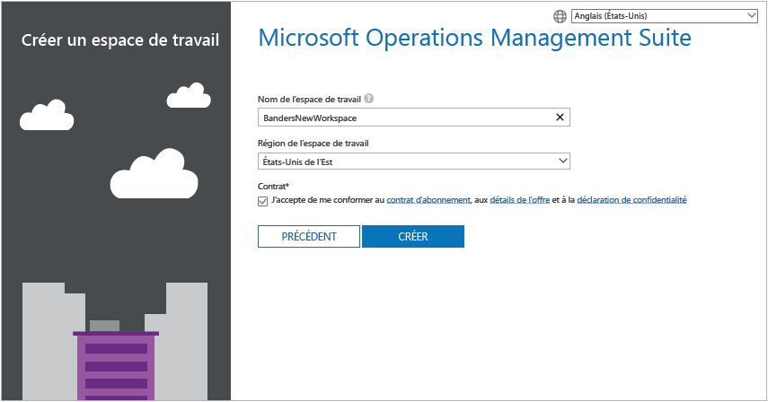
3. Ensuite, créez un abonnement Azure gratuit ou un lien vers un abonnement Azure existant.  
   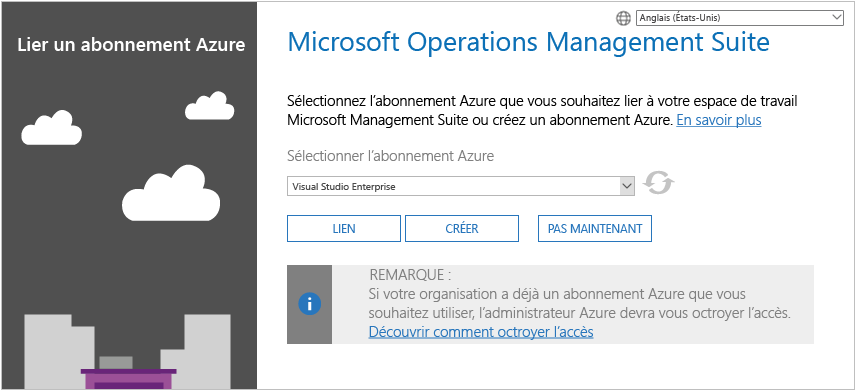

Vous êtes prêt à utiliser le portail Operations Management Suite.

Pour plus d’informations sur la configuration de votre espace de travail et la liaison de comptes Azure existants à des espaces de travail créés avec Operations Management Suite, consultez l’article [Gérer les espaces de travail](log-analytics-manage-access.md).

## S’inscrire rapidement à l’aide de Microsoft Azure
1. Accédez au [Portail Azure](https://portal.azure.com) , connectez-vous, parcourez la liste des services, puis sélectionnez **Log Analytics**.  
    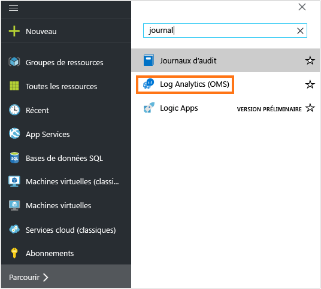
2. Cliquez sur **Ajouter**, puis sélectionnez les options pour les éléments suivants :
   * **Espace de travail OMS**
   * **Abonnement** : si vous possédez plusieurs abonnements, choisissez celui que vous souhaitez associer au nouvel espace de travail.
   * **Groupe de ressources**
   * **Emplacement**
   * **Niveau de tarification**  
       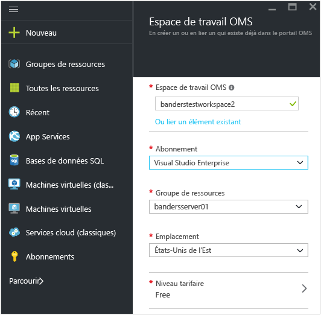
3. Cliquez sur **OK**. Une liste de vos espaces de travail s’affiche.
4. Sélectionnez un espace de travail pour en visualiser les détails dans le Portail Azure.       
    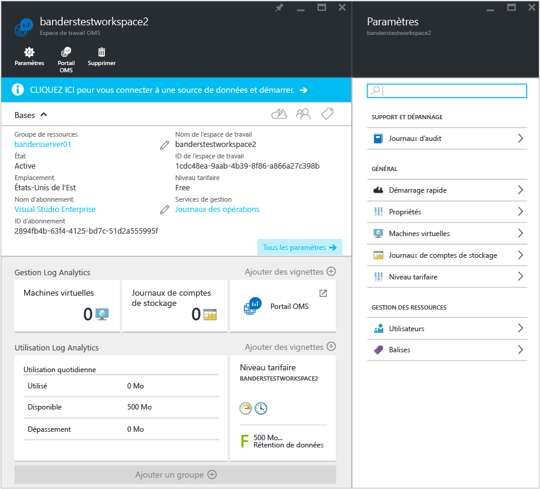         
5. Cliquez sur le lien **Portail OMS** pour ouvrir le site web Operations Management Suite avec votre nouvel espace de travail.

Vous êtes prêt à utiliser le portail Operations Management Suite.

Pour plus d’informations sur la configuration de votre espace de travail et la liaison des espaces de travail existants créés à l’aide d’Operations Management Suite à des abonnements Azure, consultez [Gérer l’accès à Log Analytics](log-analytics-manage-access.md).

## Prise en main du portail Operations Management Suite
Pour choisir des solutions et connecter les serveurs que vous souhaitez gérer, cliquez sur la vignette **Paramètres** , puis procédez comme suit.  

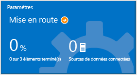  

1. **Ajouter des solutions** : affichez les solutions installées.  
    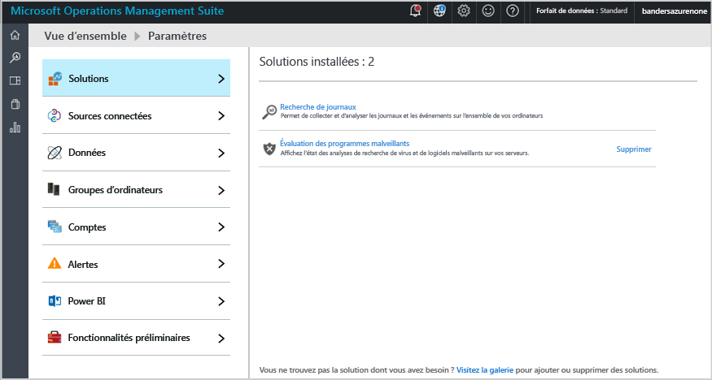  
    Cliquez sur **Visiter la galerie** pour ajouter d’autres solutions.  
    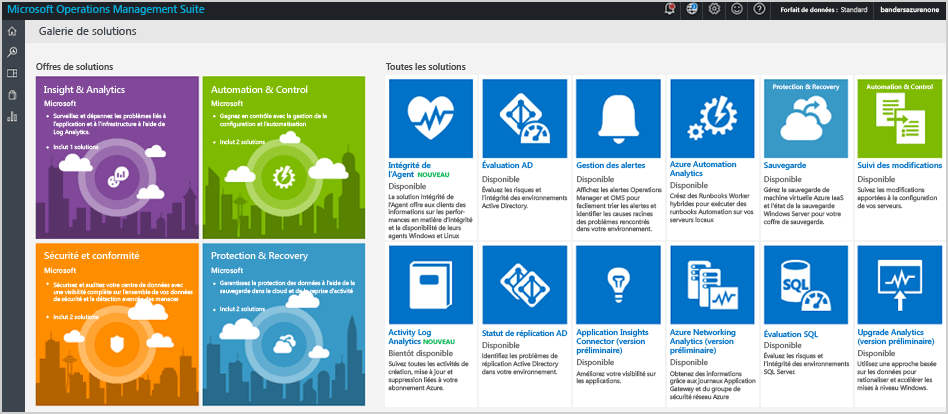  
    Sélectionnez une solution, puis cliquez sur **Ajouter**.
2. **Connecter une source de données** : choisissez un mode de connexion à votre environnement de serveur pour la collecte des données.

   * Connectez directement un serveur ou un client Windows Server en installant un agent.
   * Connectez des serveurs Linux à l’Agent OMS pour Linux.
   * Utilisez un compte de stockage Azure configuré avec l’extension de machine virtuelle de diagnostic Azure Windows ou Linux.
   * Utilisez System Center Operations Manager pour joindre vos groupes d’administration ou tout votre déploiement d’Operations Manager.
   * Activez la télémétrie Windows pour utiliser la fonction Upgrade Analytics.
       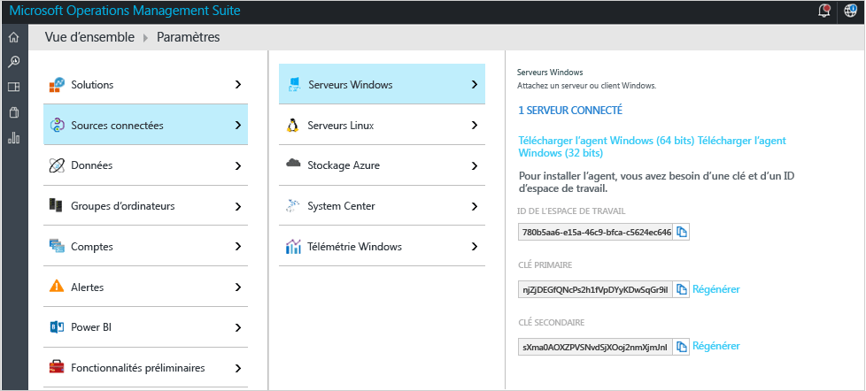    
3. **Collecter des données** : configurez au moins une source de données pour remplir votre espace de travail avec des données. Une fois que vous avez terminé, cliquez sur **Enregistrer**.    

    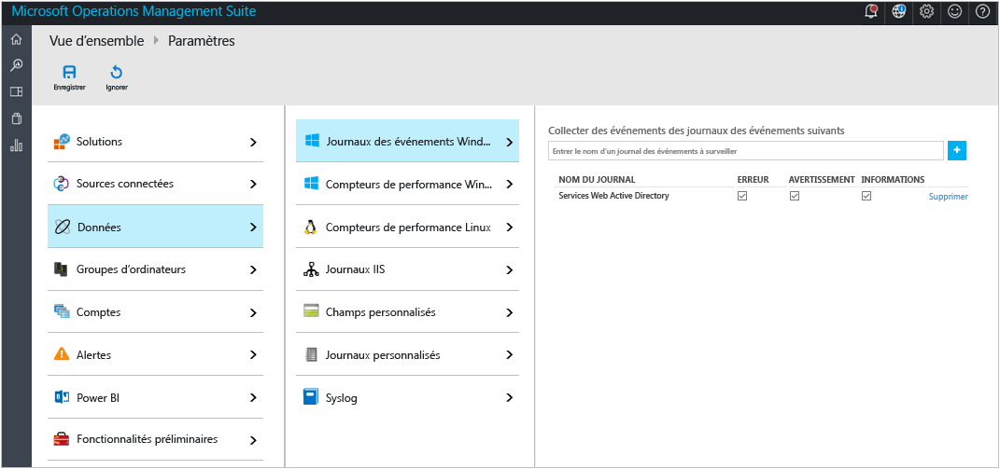    

## Connecter en option des ordinateurs Windows en installant un agent
L’exemple suivant indique comment définir un agent Windows.

1. Cliquez sur la mosaïque **Paramètres**, sur l’onglet **Sources connectées**, puis sur l’onglet correspondant au type de source que vous souhaitez ajouter, puis téléchargez un agent ou obtenez des informations sur la marche à suivre pour activer un agent. Vous pouvez par exemple cliquer sur **Télécharger l’agent Windows (64 bits)**. Dans le cas des agents Windows, vous ne pouvez installer l’agent que sur Windows Server 2008 SP 1 ou versions ultérieures, ou sur Windows 7 SP1 ou versions ultérieures.
2. Installez l’agent sur un ou plusieurs serveurs. Vous pouvez installer les agents un par un ou à l’aide d’une méthode plus automatisée, avec un [script personnalisé](log-analytics-windows-agents.md). Vous pouvez également utiliser une solution de distribution de logiciels existante.
3. Après avoir accepté le contrat de licence et choisi votre dossier d’installation, sélectionnez **Connect the agent to Azure Log Analytics (OMS)** (Connecter l’agent à Azure Log Analytics (OMS)).   
    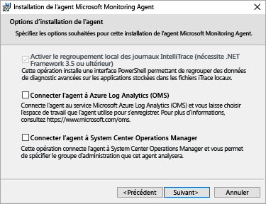
4. Dans la page suivante, vous êtes invité à entrer votre ID d’espace de travail et votre clé d’espace de travail. Votre ID et votre clé d’espace de travail sont indiqués dans l’écran où vous avez téléchargé le fichier de l’agent.  
    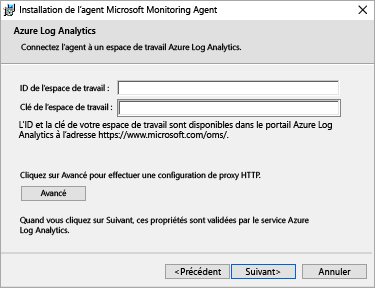  

    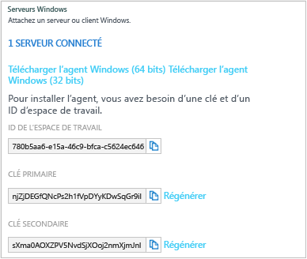
5. Pendant l’installation, vous pouvez cliquer sur **Avancé** pour configurer votre serveur proxy et fournir des informations d’authentification. Cliquez sur le bouton **Suivant** pour revenir à l’écran d’informations sur l’espace de travail.
6. Cliquez sur **Suivant** pour valider votre ID et votre clé d’espace de travail. Si des erreurs sont détectées, vous pouvez cliquer sur **Précédent** pour apporter des corrections. Une fois que votre ID et votre clé d’espace de travail sont validés, cliquez sur **Installer** pour terminer l’installation de l’agent.
7. Dans le Panneau de configuration, cliquez sur l’onglet Microsoft Monitoring Agent, puis cliquez sur l’onglet Azure Log Analytics (OMS). Une icône de coche verte s’affiche lorsque les agents communiquent avec le service Operations Management Suite. Au départ, cela prend environ 5 à 10 minutes.

> [!NOTE]
> Les solutions d’évaluation de la configuration et de la gestion de capacité ne sont actuellement pas prises en charge par les serveurs connectés directement à Operations Management Suite.

Vous pouvez également connecter l’agent à System Center Operations Manager 2012 SP1 et ultérieur. Pour ce faire, sélectionnez **Connecter l’agent à System Center Operations Manager**. Si vous choisissez cette option, vous envoyez des données au service sans besoin de matériel supplémentaire ni charge sur vos groupes d’administration.

Pour plus d’informations sur la connexion d’agents à Operations Management Suite, consultez [Connecter des ordinateurs Windows à Log Analytics](log-analytics-windows-agents.md).

## Si vous le souhaitez, connectez les serveurs à l’aide de System Center Operations Manager.
1. Dans la console Operations Manager, sélectionnez **Administration**.
2. Développez le nœud **Operational Insights** et sélectionnez **Connexion à Operational Insights**.

   > [!NOTE]
   > Selon le correctif cumulatif SCOM que vous utilisez, vous pouvez voir un nœud pour *System Center Advisor*, *Operational Insights* ou *Operations Management Suite*.
   >
   >
3. Cliquez sur le lien **S’inscrire à Operational Insights** en haut à droite, et suivez les instructions affichées.
4. Après avoir terminé l’Assistant Inscription, cliquez sur le lien **Ajouter un ordinateur/groupe** .
5. Vous pouvez rechercher des ordinateurs ou des groupes surveillés par Operations Manager dans la boîte de dialogue **Recherche d’ordinateurs** . Sélectionnez les ordinateurs ou les groupes à intégrer à Log Analytics, cliquez sur **Ajouter**, puis sur **OK**. Vous pouvez vérifier que le service OMS reçoit des données en accédant à la vignette **Utilisation** dans le portail Operations Management Suite. Des données doivent apparaître dans 5 à 10 minutes environ.

Pour en savoir plus sur la connexion d’Operations Manager à Operations Management Suite, voir [Connexion d’Operations Manager à Log Analytics](log-analytics-om-agents.md).

## Si vous le souhaitez, analysez les données des services cloud dans Microsoft Azure.
Avec Operations Management Suite, vous pouvez rechercher rapidement les journaux des événements et les journaux IIS pour les services cloud et les machines virtuelles en activant les diagnostics dans Azure Cloud Services. Vous pouvez également recevoir des informations supplémentaires relatives à vos machines virtuelles Azure en installant Microsoft Monitoring Agent. Pour plus d’informations sur la configuration de votre environnement Azure pour qu’il utilise Operations Management Suite, consultez [Connecter Azure Storage à Log Analytics](log-analytics-azure-storage.md).

## Étapes suivantes
* [Ajoutez des solutions Log Analytics à partir de la galerie de solutions](log-analytics-add-solutions.md) pour ajouter des fonctionnalités et collecter des données.
* Familiarisez-vous avec les [recherches de journal](log-analytics-log-searches.md) pour afficher les informations détaillées collectées par les solutions.
* Utilisez les [tableaux de bord](log-analytics-dashboards.md) pour enregistrer et afficher vos propres recherches personnalisées.

<!--HONumber=Dec16_HO2-->

