# Gestion des espaces de travail

Pour gérer l’accès à Log Analytics, effectuez diverses tâches administratives liées aux espaces de travail. Cet article fournit des conseils pratiques et des procédures pour gérer les espaces de travail. Un espace de travail est en fait un conteneur qui inclut des informations de compte et des informations de configuration simple pour le compte. Vous ou d’autres membres de votre organisation pouvez utiliser plusieurs espaces de travail pour gérer différents ensembles de données provenant de tout ou partie de votre infrastructure informatique.

Pour créer un espace de travail, vous devez :

1. J’ai un abonnement Azure.
2. Choisissez un nom d’espace de travail.
3. Associez l’espace de travail à votre abonnement.
4. Choisissez un emplacement géographique.

## Définition du nombre d’espaces de travail nécessaires
Un espace de travail est une ressource Azure et un conteneur dans lequel les données sont collectées, agrégées, analysées et présentées dans le portail Azure.

Vous pouvez disposer de plusieurs espaces de travail par abonnement Azure et vous pouvez avoir accès à plus d’un espace de travail. La réduction du nombre d’espaces de travail vous permet d’interroger et de mettre en corrélation la plupart des données, car il n’est pas possible d’exécuter des requêtes dans plusieurs espaces de travail. Cette section décrit dans quelles conditions il peut être utile de créer plusieurs espaces de travail.

Aujourd'hui, un espace de travail fournit :

* un emplacement géographique pour le stockage des données ;
* des données granulaires pour la facturation ;
* l’isolation des données.
* Étendue de la configuration

Compte tenu des caractéristiques précédentes, vous pouvez créer plusieurs espaces de travail si :

* Vous travaillez pour une entreprise globale et vous avez besoin de stocker vos données dans des régions spécifiques pour des raisons de conformité ou de souveraineté des données.
* Vous utilisez Azure et vous souhaitez éviter les frais liés au transfert de données sortantes en configurant un espace de travail dans la même région que les ressources Azure qu’il gère.
* Vous souhaitez allouer les frais à différents services ou groupes d’entreprise en fonction de leur utilisation. Lorsque vous créez un espace de travail pour chaque service ou groupe d’entreprise, votre relevé de facturation ou d’utilisation Azure indique séparément les frais liés à chaque espace de travail.
* Vous êtes un fournisseur de services gérés et vous devez isoler les données Log Analytics des autres données de vos clients.
* Vous gérez plusieurs clients et vous souhaitez que chaque client/service/groupe d’entreprise ait uniquement accès à ses propres données.

Lorsque vous utilisez des agents pour collecter des données, vous pouvez [configurer chacun d’entre eux pour qu’il fournisse des rapports à un ou plusieurs espaces de travail](log-analytics-windows-agents.md).

Si vous utilisez System Center Operations Manager, chaque groupe d’administration Operations Manager ne peut être connecté qu’à un seul espace de travail. Vous pouvez installer Microsoft Monitoring Agent sur les ordinateurs gérés par Operations Manager et configurer l’agent pour qu’il fournisse des rapports à Operations Manager et à un espace de travail Log Analytics différent.

### Informations sur l’espace de travail

Vous pouvez afficher des détails sur votre espace de travail dans le portail Azure. Vous pouvez également afficher les détails dans le portail OMS.

#### Affichage des informations de l’espace de travail dans le portail Azure

1. Si ce n’est pas déjà fait, connectez-vous au [portail Azure](https://portal.azure.com) à l’aide de votre abonnement Azure.
2. Dans le menu **Hub**, cliquez sur **Plus de services** et, dans la liste des ressources, tapez **Log Analytics**. Au fur et à mesure de la saisie, la liste est filtrée. Cliquez sur **Log Analytics**.  
    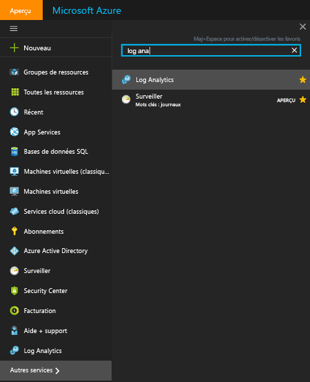  
3. Dans le panneau d’abonnements de Log Analytics, sélectionnez un espace de travail.
4. Le panneau Espace de travail affiche des détails sur l’espace de travail et des liens vers des informations supplémentaires.  
    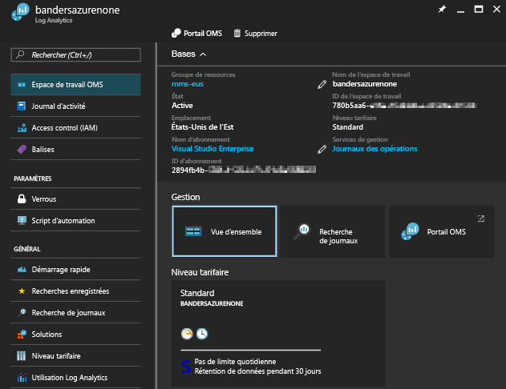  

## Gérer les comptes et les utilisateurs
Chaque espace de travail peut être associé à plusieurs comptes et chaque compte (compte Microsoft ou compte professionnel) peut également avoir accès à plusieurs espaces de travail.

Par défaut, le compte Microsoft ou le compte professionnel qui crée l’espace de travail devient l’administrateur de l’espace de travail.

Il existe deux modèles d’autorisation qui contrôlent l’accès à un espace de travail Log Analytics :

1. Rôles d’utilisateur Log Analytics hérités
2. [Accès en fonction du rôle Azure](../active-directory/role-based-access-control-configure.md)

Le tableau suivant résume l’accès qui peut être défini à l’aide de chaque modèle d’autorisation :

|                          | Portail Log Analytics | Portail Azure | API (y compris PowerShell) |
|--------------------------|----------------------|--------------|----------------------------|
| Rôles d’utilisateur Log Analytics | Oui                  | Non           | Non                         |
| Accès en fonction du rôle Azure  | Oui                  | Oui          | Oui                        |

> [!NOTE]
> Log Analytics est déplacé pour utiliser l’accès en fonction du rôle Azure en tant que modèle d’autorisation, à la place des rôles d’utilisateur Log Analytics.
>
>

Les rôles d’utilisateur Log Analytics hérités contrôlent uniquement l’accès aux opérations effectuées dans le [portail Log Analytics](https://mms.microsoft.com).

Les activités suivantes nécessitent également des autorisations Azure :

| Action                                                          | Autorisations Azure nécessaires | Remarques |
|-----------------------------------------------------------------|--------------------------|-------|
| Ajout et suppression de solutions de gestion                        | `Microsoft.Resources/deployments/*`   `Microsoft.OperationalInsights/*`   `Microsoft.OperationsManagement/*`   `Microsoft.Automation/*`   `Microsoft.Resources/deployments/*/write` | |
| Modification du niveau tarifaire                                       | `Microsoft.OperationalInsights/workspaces/*/write` | |
| Affichage des données dans les mosaïques de solution *Sauvegarde* et *Site Recovery* | Administrateur/coadministrateur | Accède aux ressources déployées à l’aide du modèle de déploiement Classic |
| Gestion d’un espace de travail dans le portail Azure                        | `Microsoft.Resources/deployments/*`   `Microsoft.OperationalInsights/workspaces/*` ||

### Gestion de l’accès à Log Analytics à l’aide des autorisations Azure
Pour accorder l’accès à l’espace de travail Log Analytics à l’aide des autorisations Azure, suivez les étapes de la page [Utiliser les attributions de rôle pour gérer l’accès à vos ressources d’abonnement Azure](../active-directory/role-based-access-control-configure.md).

Si vous disposez au moins de l’autorisation en lecture Azure sur l’espace de travail Log Analytics, vous pouvez ouvrir le portail OMS en cliquant sur la tâche **Portail OMS** lors de l’affichage de l’espace de travail Log Analytics.

Lorsque vous ouvrez le portail Log Analytics, vous passez à l’utilisation des rôles d’utilisateur Log Analytics hérités. Si vous ne disposez pas d’une affectation de rôle dans le portail Log Analytics, le service [vérifie les autorisations Azure dont vous disposez sur l’espace de travail](https://docs.microsoft.com/rest/api/authorization/permissions#Permissions_ListForResource).
Votre affectation de rôle dans le portail Log Analytics est déterminée en utilisant les éléments suivants :

| Conditions                                                   | Rôle d’utilisateur Log Analytics affecté | Remarques |
|--------------------------------------------------------------|----------------------------------|-------|
| Votre compte appartient à un rôle d’utilisateur Log Analytics hérité     | Rôle d’utilisateur Log Analytics spécifié | |
| Votre compte n’appartient pas à un rôle d’utilisateur Log Analytics hérité   Autorisations Azure complètes pour l’espace de travail (`*`autorisation 1) | Administrateur ||
| Votre compte n’appartient pas à un rôle d’utilisateur Log Analytics hérité   Autorisations Azure complètes pour l’espace de travail (`*`autorisation 1)   *non-actions* de `Microsoft.Authorization/*/Delete` et `Microsoft.Authorization/*/Write` | Collaborateur ||
| Votre compte n’appartient pas à un rôle d’utilisateur Log Analytics hérité   Autorisation d’accès en lecture Azure | Lecture seule ||
| Votre compte n’appartient pas à un rôle d’utilisateur Log Analytics hérité   Les autorisations Azure ne sont pas comprises | Lecture seule ||
| Pour les abonnements gérés par le fournisseur de solutions Cloud (CSP)   Le compte auquel vous êtes connecté est dans l’instance Azure Active Directory associée à l’espace de travail | Administrateur | En général, il s’agit du client d’un fournisseur de solutions Cloud |
| Pour les abonnements gérés par le fournisseur de solutions Cloud (CSP)   Le compte auquel vous êtes connecté n’est pas dans l’instance Azure Active Directory associée à l’espace de travail | Collaborateur | En général, il s’agit du fournisseur de solutions Cloud |

1 Pour plus d’informations sur les définitions de rôles, reportez-vous à [Autorisations Azure](../active-directory/role-based-access-control-custom-roles.md). Lors de l’évaluation des rôles, une action de `*` n’est pas équivalente à `Microsoft.OperationalInsights/workspaces/*`.

Tenez compte des considérations suivantes concernant le portail Azure :

* Lorsque vous vous connectez dans le portail OMS à l’aide de http://mms.microsoft.com, vous voyez s’afficher la liste **Sélectionner un espace de travail**. Cette liste contient uniquement des espaces de travail dans lesquels vous avez un rôle d’utilisateur Log Analytics. Pour afficher les espaces de travail auxquels vous pouvez accéder avec un abonnement Azure, vous devez indiquer un locataire dans l’URL. Par exemple : `mms.microsoft.com/?tenant=contoso.com`. L’identificateur du locataire représente souvent la dernière partie de l’adresse e-mail avec laquelle vous vous connectez.
* Si vous souhaitez accéder directement à un portail auquel vous avez accès par le biais d’autorisations Azure, vous devez spécifier la ressource dans l’URL. Il est possible d’obtenir cette URL à l’aide de PowerShell.

  Par exemple, `(Get-AzureRmOperationalInsightsWorkspace).PortalUrl`.

  L’URL a l’aspect suivant : `https://eus.mms.microsoft.com/?tenant=contoso.com&resource=%2fsubscriptions%2faaa5159e-dcf6-890a-a702-2d2fee51c102%2fresourcegroups%2fdb-resgroup%2fproviders%2fmicrosoft.operationalinsights%2fworkspaces%2fmydemo12`

### Gestion des utilisateurs dans le portail OMS
Vous pouvez gérer les utilisateurs et les groupes sur l’onglet **Gérer les utilisateurs** sous l’onglet **Comptes** de la page Paramètres.   

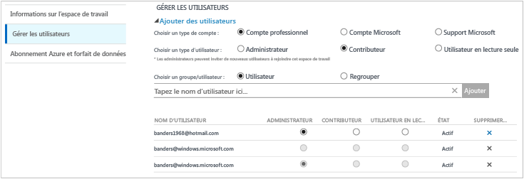

#### Ajout d’un utilisateur à un espace de travail existant
Procédez comme suit pour ajouter un utilisateur ou un groupe à un espace de travail.

1. Dans le portail OMS, cliquez sur la vignette **Paramètres**.
2. Cliquez sur l’onglet **Comptes**, puis sur l’onglet **Gérer les utilisateurs**.
3. Dans la section **Gérer les utilisateurs**, sélectionnez le type de compte à ajouter : **Compte d’organisation**, **Compte Microsoft** ou **Support Microsoft**.

   * Si vous choisissez Compte Microsoft, saisissez l’adresse électronique de l’utilisateur associé au compte Microsoft.
   * Si vous choisissez Compte d’organisation, saisissez une partie du nom de l’utilisateur/du groupe ou l’alias de messagerie électronique. Une liste d’utilisateurs et de groupes s’affiche alors dans une zone déroulante. Sélectionnez un utilisateur ou un groupe.
   * Utilisez Support Microsoft pour donner à un ingénieur du support technique Microsoft ou à un autre employé de Microsoft un accès temporaire à votre espace de travail dans le but de faciliter le dépannage.

     > [!NOTE]
     > Pour obtenir de meilleurs résultats, limitez à trois le nombre de groupes Active Directory associés à un seul compte OMS : un pour les administrateurs, un pour les collaborateurs et un pour les utilisateurs en lecture seule. L’utilisation d’un plus grand nombre de groupes peut avoir une incidence sur les performances de Log Analytics.
     >
     >
4. Choisissez le type d’utilisateur ou de groupe à ajouter : **Administrateur**, **Collaborateur**, ou **Utilisateur en lecture seule**.  
5. Cliquez sur **Add**.

   Si vous ajoutez un compte Microsoft, une invitation à joindre l’espace de travail est envoyée à l’adresse électronique que vous avez fournie. Une fois que l’utilisateur a suivi les instructions figurant dans l’invitation à rejoindre OMS, il peut accéder à cet espace de travail.
   Si vous ajoutez un compte d’organisation, l’utilisateur peut accéder à Log Analytics immédiatement.  

#### Modification d’un type d’utilisateur existant
Vous pouvez modifier le rôle de compte pour un utilisateur associé à votre compte OMS. Vous pouvez choisir parmi les rôles suivants :

* *Administrateur*: peut gérer les utilisateurs, afficher et agir sur toutes les alertes, ainsi qu’ajouter et supprimer des serveurs.
* *Collaborateur*: peut afficher toutes les alertes et agir sur celles-ci, ainsi qu’ajouter et supprimer des serveurs.
* *Utilisateur en lecture seule* : les utilisateurs marqués comme étant en lecture seule ne peuvent pas :

  1. Ajouter ou supprimer des solutions. La galerie de solutions est masquée.
  2. Ajouter/modifier/supprimer des mosaïques sur **Mon tableau de bord**.
  3. Afficher les pages **Paramètres**. Les pages sont masquées.
  4. Dans la vue de recherche, la configuration de Power BI, les recherches enregistrées et les tâches relatives aux alertes sont masquées.

#### Pour modifier un compte
1. Dans le portail OMS, cliquez sur la vignette **Paramètres**.
2. Cliquez sur l’onglet **Comptes**, puis sur l’onglet **Gérer les utilisateurs**.
3. Sélectionnez le rôle de l’utilisateur que vous souhaitez modifier.
4. Cliquez sur **Oui** dans la boîte de dialogue de confirmation.

### Supprimer un utilisateur d’un espace de travail
Procédez comme suit pour supprimer un utilisateur d’un espace de travail. Notez que cela ne ferme pas l’espace de travail. Au lieu de cela, cela supprime l’association entre cet utilisateur et l’espace de travail. Si un utilisateur est associé à plusieurs espaces de travail, il peut encore se connecter à OMS et afficher les autres espaces de travail.

1. Dans le portail OMS, cliquez sur la vignette **Paramètres**.
2. Cliquez sur l’onglet **Comptes**, puis sur l’onglet **Gérer les utilisateurs**.
3. Cliquez sur l’option **Supprimer** située en regard du nom d’utilisateur à supprimer.
4. Cliquez sur **Oui** dans la boîte de dialogue de confirmation.

### Ajout d’un groupe à un espace de travail existant
1. Dans la section précédente, « Ajout d’un utilisateur à un espace de travail existant », suivez les étapes 1 à 4.
2. Sous **Choisir un utilisateur/groupe**, sélectionnez **Groupe**.  
   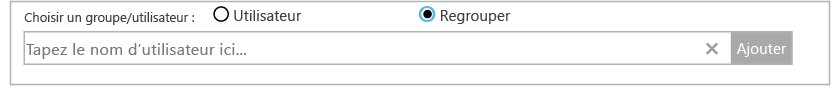
3. Entrez le nom d’affichage ou l’adresse électronique du groupe que vous souhaitez ajouter.
4. Sélectionnez le groupe parmi les résultats, puis cliquez sur **Ajouter**.

## Liaison d’un espace de travail existant à un abonnement Azure
Tous les espaces de travail créés après le 26 septembre 2016 doivent être liés à un abonnement Azure lors de la création. Vous devez lier les espaces de travail créés avant cette date lors de votre prochaine connexion. Lorsque vous créez l’espace de travail à partir du portail Azure ou que vous liez votre espace de travail à un abonnement Azure, votre répertoire Azure Active Directory est lié en tant que compte d’organisation.

### Pour lier un espace de travail à un abonnement Azure dans le portail OMS

- Lorsque vous vous connectez au portail OMS, vous êtes invité à sélectionner un abonnement Azure. Sélectionnez l’abonnement que vous souhaitez lier à votre espace de travail, puis cliquez sur **Lier**.  
    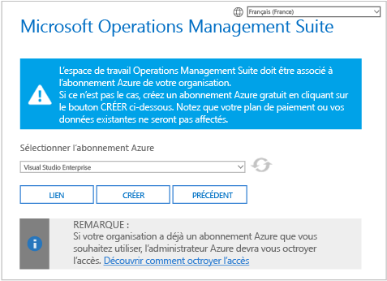

    > [!IMPORTANT]
    > Pour que vous puissiez lier un espace de travail, votre compte Azure doit déjà y avoir accès.  En d’autres termes, le compte que vous utilisez pour accéder au portail Azure doit être **le même** que celui que vous utilisez pour accéder à votre espace de travail. Si ce n’est pas le cas, consultez [Ajout d’un utilisateur à un espace de travail existant](#add-a-user-to-an-existing-workspace).

### Pour lier un espace de travail à un abonnement Azure dans le portail Azure
1. Connectez-vous au [portail Azure](http://portal.azure.com).
2. Recherchez **Log Analytics** et sélectionnez-le.
3. Vous voyez la liste des espaces de travail existants. Cliquez sur **Add**.  
   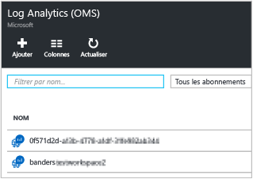
4. Sous **Espace de travail OMS**, cliquez sur **Ou liez**.  
   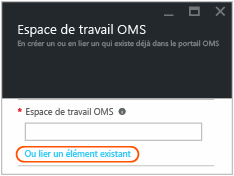
5. Cliquez sur **Configurer les paramètres requis**.  
   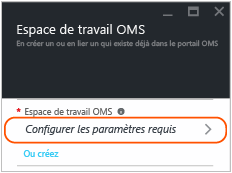
6. Vous voyez la liste des espaces de travail qui ne sont pas encore liés à votre compte Azure. Sélectionnez un espace de travail.  
   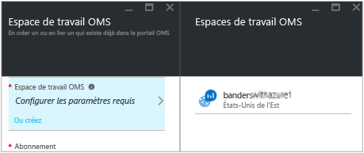
7. Si nécessaire, vous pouvez modifier les valeurs correspondant aux éléments suivants :
   * Abonnement
   * Groupe de ressources
   * Emplacement
   * Niveau tarifaire   
     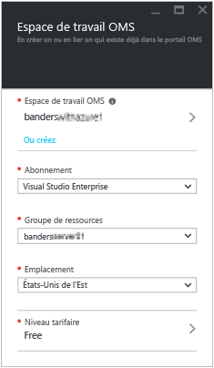
8. Cliquez sur **OK**. L’espace de travail est maintenant lié à votre compte Azure.

> [!NOTE]
> Si l’espace de travail que vous souhaitez lier ne s’affiche pas, cela signifie que votre abonnement Azure n’a pas accès à l’espace de travail que vous avez créé sur le portail OMS.  Pour accorder l’accès à ce compte à partir du portail OMS, consultez [Ajout d’un utilisateur à un espace de travail existant](#add-a-user-to-an-existing-workspace).
>
>

## Mise à niveau de l’espace de travail vers un plan payant
Il existe trois types de plan pour les espaces de travail OMS : **Gratuit**, **Autonome** et **OMS**.  Si vous êtes abonné au niveau *Gratuit*, vous pouvez envoyer au maximum 500 Mo de données par jour à Log Analytics.  Si vous dépassez ce volume, vous devez migrer votre espace de travail vers un plan payant pour pouvoir collecter des données au-delà de cette limite. Vous pouvez convertir votre type de plan à tout moment.  Pour en savoir plus sur la tarification d’OMS, consultez la rubrique relative aux [détails de tarification](https://www.microsoft.com/en-us/cloud-platform/operations-management-suite-pricing).

### Utilisation de droits dans le cadre d’un abonnement OMS
Pour utiliser les droits que vous obtenez à l’achat d’un plan OMS E1, OMS E2 ou Complément OMS pour System Center, choisissez le plan *OMS* d’OMS Log Analytics.

Lorsque vous achetez un abonnement OMS, les droits sont ajoutés à votre Contrat Entreprise. Tout abonnement Azure créé dans le cadre de ce contrat peut faire valoir ces droits. Tous les espaces de travail sur ces abonnements utilisent les droits OMS.

Pour vous assurer que l’utilisation d’un espace de travail est appliquée à vos droits à partir de l’abonnement OMS, vous devez :

1. Créer votre espace de travail dans un abonnement Azure qui fait partie du Contrat Entreprise incluant l’abonnement OMS
2. Sélectionner le plan *OMS* pour l’espace de travail

> [!NOTE]
> Si votre espace de travail a été créé avant le 26 septembre 2016 et que votre plan de tarification Log Analytics est *Premium*, cet espace de travail utilise les droits du complément OMS pour System Center. Vous pouvez également utiliser vos droits en migrant au niveau de tarification *OMS*.
>
>

Les droits de l’abonnement OMS ne sont pas visibles dans le portail Azure ou OMS. Vous pouvez les consulter, ainsi que l’utilisation, dans le portail Enterprise Portal.  

Si vous devez modifier l’abonnement Azure auquel votre espace de travail est lié, vous pouvez utiliser l’applet de commande Azure PowerShell [Move-AzureRMResource](https://msdn.microsoft.com/library/mt652516.aspx) .

### Utilisation de l’engagement Azure d’un Contrat Entreprise
Si vous n’avez pas d’abonnement OMS, vous payez séparément pour chaque composant OMS et l’utilisation apparaît sur votre facture Azure.

Si vous disposez d’un engagement monétaire Azure dans le cadre de l’inscription d’entreprise à laquelle vos abonnements Azure sont liés, l’utilisation de Log Analytics est automatiquement débitée de votre engagement monétaire restant.

Si vous devez modifier l’abonnement Azure auquel l’espace de travail est lié, vous pouvez utiliser l’applet de commande Azure PowerShell [Move-AzureRMResource](https://msdn.microsoft.com/library/mt652516.aspx) .  

### Migrer un espace de travail vers un niveau tarifaire payant dans le portail Azure
1. Connectez-vous au [portail Azure](http://portal.azure.com).
2. Recherchez **Log Analytics** et sélectionnez-le.
3. Vous voyez la liste des espaces de travail existants. Sélectionnez un espace de travail.  
4. Dans le panneau Espace de travail sous **Général**, cliquez sur **Niveau tarifaire**.  
5. Sous **Niveau tarifaire**, sélectionnez un niveau tarifaire, puis cliquez sur **Sélectionner**.  
    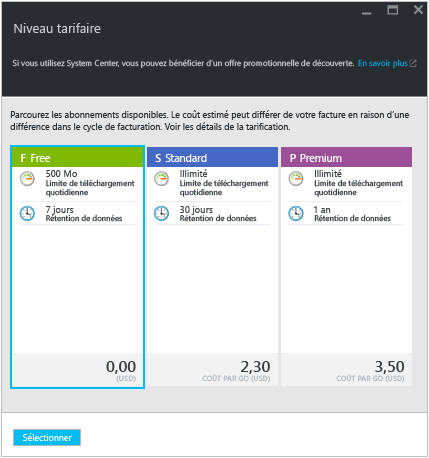
6. Quand vous actualisez l’affichage dans le portail Azure, le **niveau tarifaire** mis à jour s’affiche pour le niveau sélectionné.  
    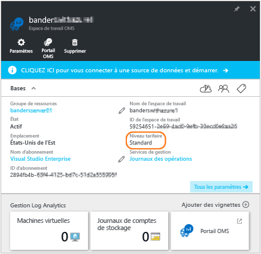

> [!NOTE]
> Si votre espace de travail est lié à un compte Automation, avant de pouvoir sélectionner le niveau tarifaire *Autonome (par Go)*, vous devez supprimer les solutions **Automation and Control** et annuler la liaison avec le compte Automation. Dans le panneau Espace de travail sous **Général**, cliquez sur **Solutions** pour afficher et supprimer des solutions. Pour annuler la liaison avec le compte Automation, cliquez sur le nom du compte Automation dans le panneau **Niveau tarifaire**.
>
>

### Migrer un espace de travail vers un niveau tarifaire payant dans le portail OMS

Pour modifier le niveau tarifaire à l’aide du portail OMS, vous devez posséder un abonnement Azure.

1. Dans le portail OMS, cliquez sur la vignette **Paramètres**.
2. Cliquez sur l’onglet **Comptes**, puis sur l’onglet **Azure Subscription & Data Plan** (Forfait de données et abonnement Azure).
3. Cliquez sur le niveau tarifaire que vous souhaitez utiliser.
4. Cliquez sur **Save**.  
   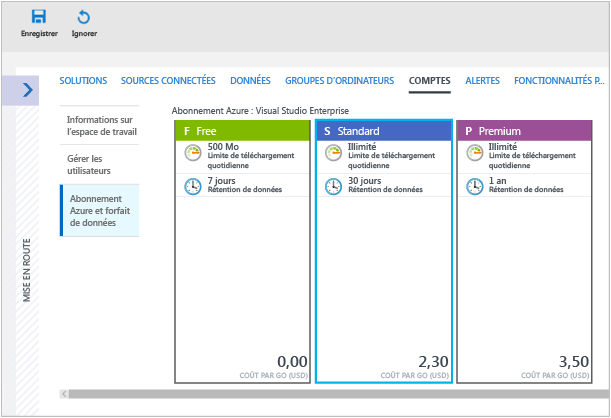

Votre nouveau forfait de données s’affiche dans le ruban du portail OMS, en haut de votre page web.

## Modifier la durée de stockage des données par Log Analytics

Au niveau tarifaire Gratuit, Log Analytics propose les sept derniers jours de données.
Au niveau tarifaire Standard, Log Analytics propose les 30 derniers jours de données.
Au niveau tarifaire Premium, Log Analytics propose les 365 derniers jours de données.
Aux niveaux tarifaires Autonome et OMS, Log Analytics propose par défaut les 31 derniers jours de données.

Lorsque vous utilisez les niveaux tarifaires Autonome et OMS, vous pouvez conserver jusqu’à 2 ans de données (730 jours). Les données stockées pendant une durée supérieure à la durée par défaut de 31 jours entraînent des frais de conservation des données. Pour plus d’informations sur la tarification, reportez-vous aux [frais de dépassement](https://azure.microsoft.com/pricing/details/log-analytics/).

Pour modifier la durée de conservation des données :

1. Connectez-vous au [portail Azure](http://portal.azure.com).
2. Recherchez **Log Analytics** et sélectionnez-le.
3. Vous voyez la liste des espaces de travail existants. Sélectionnez un espace de travail.  
4. Dans le panneau Espace de travail, sous **Général**, cliquez sur **Rétention**.  
5. Utilisez le curseur pour augmenter ou diminuer le nombre de jours de rétention, puis cliquez sur **Enregistrer**.  
    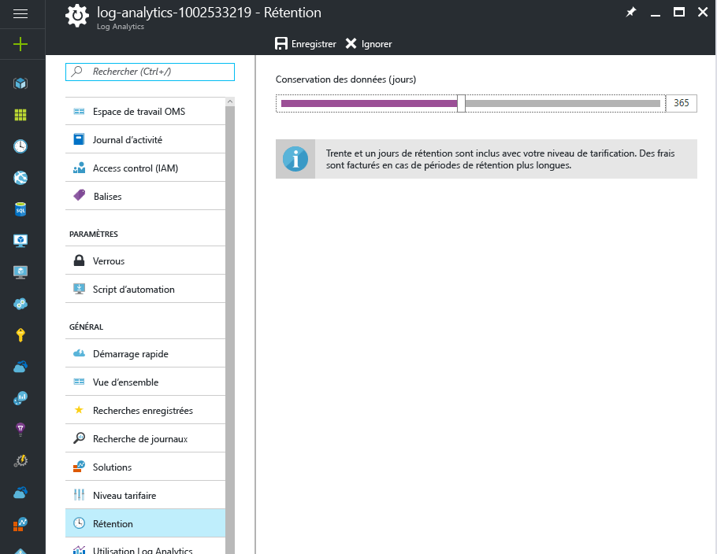

## Modifier une organisation Azure Active Directory pour un espace de travail

Vous pouvez modifier l’organisation Azure Active Directory d’un espace de travail. La modification dune organisation Azure Active Directory vous permet d’ajouter des utilisateurs et groupes de ce répertoire vers l’espace de travail.

### Pour modifier l’organisation Azure Active Directory d’un espace de travail

1. Dans la page Paramètres du portail OMS, cliquez sur **Comptes**, puis sur l’onglet **Gérer les utilisateurs**.  
2. Consultez les informations sur les comptes d’organisation, puis cliquez sur **Ajouter une organisation**.  
    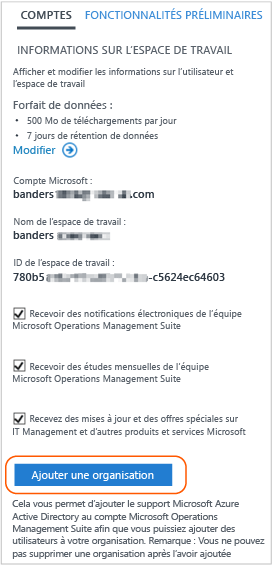
3. Entrez les informations d’identité de l’administrateur de votre domaine Azure Active Directory. Ensuite, une confirmation indiquant que votre espace de travail est lié à votre domaine Azure Active Directory s’affiche.  
    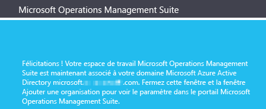

## Supprimer un espace de travail Log Analytics
Lorsque vous supprimez un espace de travail Log Analytics, toutes les données relatives à votre espace de travail sont supprimées du service OMS dans les 30 jours.

Si vous êtes administrateur et que plusieurs utilisateurs sont associés à l’espace de travail, l’association entre les utilisateurs et l’espace de travail est rompue. Si les utilisateurs sont associés à d’autres espaces de travail, ils peuvent continuer à utiliser OMS avec ces autres espaces de travail. Toutefois, s’ils ne sont pas associés à des espaces de travail, ils doivent créer un espace de travail pour utiliser OMS.

### Pour supprimer un espace de travail
1. Connectez-vous au [portail Azure](http://portal.azure.com).
2. Recherchez **Log Analytics** et sélectionnez-le.
3. Vous voyez la liste des espaces de travail existants. Sélectionnez l’espace de travail que vous souhaitez supprimer.
4. Dans le panneau Espace de travail, cliquez sur **Supprimer**.  
    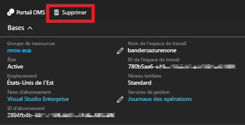
5. Dans la boîte de dialogue de confirmation Supprimer espace de travail, cliquez sur **Oui**.

## Étapes suivantes
* Consultez [Connecter des ordinateurs Windows à Log Analytics](log-analytics-windows-agents.md) pour ajouter des agents et collecter des données.
* [Ajoutez des solutions Log Analytics à partir de la galerie de solutions](log-analytics-add-solutions.md) pour ajouter des fonctionnalités et collecter des données.
* [Configurez les paramètres de proxy et de pare-feu dans Log Analytics](log-analytics-proxy-firewall.md) si votre organisation utilise un serveur proxy ou un pare-feu pour que les agents puissent communiquer avec le service Log Analytics.

