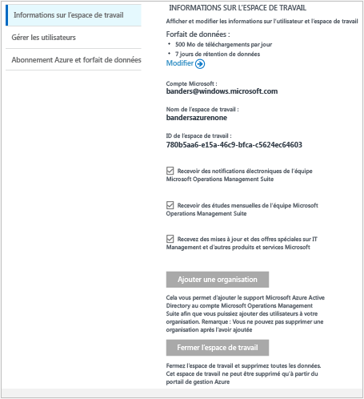
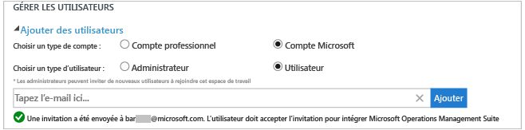
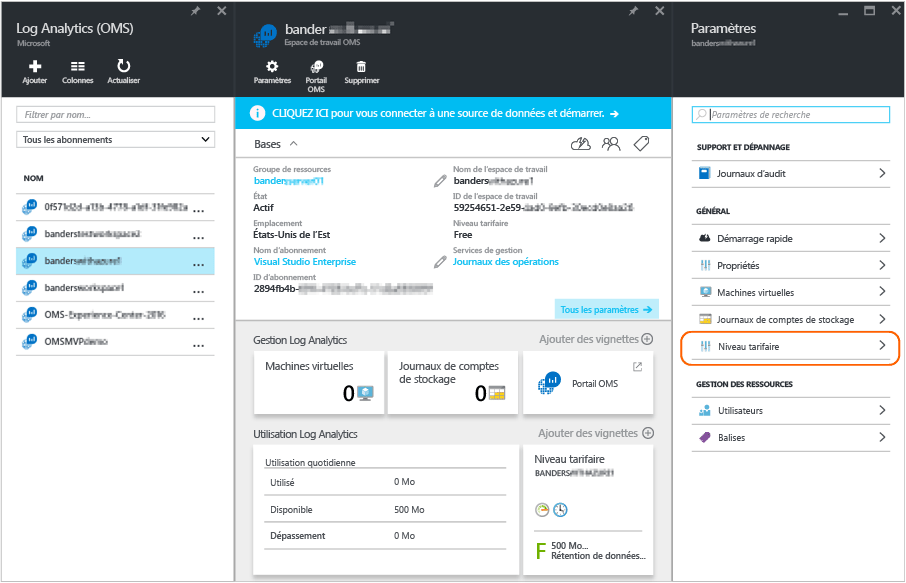

# Gestion de l’accès à Log Analytics
Pour gérer l’accès à Log Analytics, vous allez utiliser diverses tâches administratives sur les utilisateurs, les comptes, les espaces de travail OMS et les comptes Azure. Pour créer un nouvel espace de travail dans OMS (Operations Management Suite), vous choisissez un nom d’espace de travail et l’associez à votre compte, puis vous choisissez un emplacement géographique. Un espace de travail est en fait un conteneur qui inclut des informations de compte et des informations de configuration simple pour le compte. Vous ou d’autres membres de votre organisation pouvez utiliser plusieurs espaces de travail OMS pour gérer différents ensembles de données provenant de tout ou partie de votre infrastructure informatique.

L’article [Prise en main de Log Analytics](log-analytics-get-started.md) vous explique comment procéder rapidement à l’installation et l’exécution. Le reste de l’article décrit de manière détaillée les actions nécessaires pour gérer l’accès à OMS.

Même si, dans un premier temps, vous ne devrez peut-être pas effectuer chaque tâche de gestion, nous aborderons toutes les tâches courantes que vous êtes susceptible d’utiliser dans les sections suivantes :

* Définition du nombre d’espaces de travail nécessaires
* Gérer les comptes et les utilisateurs
* Ajout d’un groupe à un espace de travail existant
* Liaison d’un espace de travail existant à un abonnement Azure
* Mise à niveau d’un espace de travail vers un plan de données payant
* Modification d’un type de plan de données
* Ajout d’une organisation Azure Active Directory à un espace de travail existant
* Fermeture de votre espace de travail OMS

## Définition du nombre d’espaces de travail nécessaires
Un espace de travail est une ressource Azure et un conteneur dans lequel les données sont collectées, agrégées, analysées et présentées dans le portail OMS.

Il est possible de créer plusieurs espaces de travail OMS Log Analytics et d’autoriser les utilisateurs à accéder à un ou plusieurs d’entre eux. Toutefois, nous vous recommandons de minimiser le nombre d’espaces de travail pour que vous puissiez interroger et mettre en corrélation le plus de données. Cette section décrit dans quelles conditions il peut être utile de créer plusieurs espaces de travail.

Aujourd’hui, un espace de travail Log Analytics offre les avantages suivants :

* un emplacement géographique pour le stockage des données ;
* des données granulaires pour la facturation ;
* l’isolation des données.

Compte tenu des caractéristiques ci-dessus, vous pouvez créer plusieurs espaces de travail si :

* Vous travaillez pour une entreprise globale et vous avez besoin de stocker vos données dans des régions spécifiques pour des raisons de conformité ou de souveraineté des données.
* Vous utilisez Azure et vous souhaitez éviter les frais liés au transfert de données sortantes en configurant un espace de travail Log Analytics dans la même région que les ressources Azure qu’il gère.
* Vous souhaitez allouer les frais à différents services ou groupes d’entreprise en fonction de leur utilisation. Lorsque vous créez un espace de travail pour chaque service ou groupe d’entreprise, votre relevé de facturation ou d’utilisation Azure indique séparément les frais liés à chaque espace de travail.
* Vous êtes un fournisseur de services gérés et vous devez isoler les données Log Analytics des autres données de vos clients.
* Vous gérez plusieurs clients et vous souhaitez que chaque client, service ou groupe d’entreprise ait uniquement accès à ses propres données.

Lorsque vous utilisez des agents pour collecter des données, vous pouvez configurer chacun d’entre eux pour qu’il fournisse des rapports à l’espace de travail requis.

Si vous utilisez System Center Operations Manager, chaque groupe d’administration Operations Manager ne peut être connecté qu’à un seul espace de travail. Vous pouvez installer Microsoft Monitoring Agent sur les ordinateurs gérés par Operations Manager et configurer l’agent pour qu’il fournisse des rapports à Operations Manager et à un espace de travail Log Analytics différent.

### Informations sur l’espace de travail
Dans le portail OMS, vous pouvez afficher les informations sur votre espace de travail et décider si vous souhaitez recevoir des informations envoyées par Microsoft.

#### Afficher les informations de l’espace de travail
1. Dans OMS, cliquez sur la vignette **Paramètres** .
2. Cliquez sur l’onglet **Comptes** .
3. Cliquez sur l’onglet **Informations sur l’espace de travail**.  
   

## Gérer les comptes et les utilisateurs
Chaque espace de travail peut être associé à plusieurs comptes utilisateur et chaque compte utilisateur (compte Microsoft ou compte professionnel) peut également avoir accès à plusieurs espaces de travail OMS.

Par défaut, le compte Microsoft ou le compte professionnel utilisé pour créer l’espace de travail devient l’administrateur de l’espace de travail. L’administrateur peut ensuite inviter d’autres comptes Microsoft ou choisir des utilisateurs à partir de Microsoft Azure Active Directory.

Deux emplacements permettent de contrôler l’accès à l’espace de travail OMS :

* Dans Microsoft Azure, le contrôle d’accès basé sur les rôles permet de donner accès à l’abonnement Azure et aux ressources Azure associées. Il sert aussi à donner accès à l’API REST et à PowerShell.
* Dans le portail OMS, vous pouvez accéder au portail OMS uniquement, et non à l’abonnement Azure.

Si vous octroyez à certaines personnes un accès au portail OMS, mais non à l’abonnement Azure auquel il est lié, les mosaïques des solutions Automation, Backup et Site Recovery n’affichent aucune donnée lorsque les utilisateurs se connectent au portail OMS.

Pour permettre à tous les utilisateurs de voir les données de ces solutions, vérifiez qu’ils disposent au moins d’un accès **Lecteur** au compte Automation, au coffre Backup Vault et au coffre Site Recovery liés à l’espace de travail OMS.   

### Gestion de l’accès à Log Analytics à l’aide du portail Azure
Si vous octroyez à certaines personnes un accès à l’espace de travail Log Analytics au moyen d’autorisations Azure, dans le portail Azure par exemple, ces mêmes utilisateurs peuvent accéder au portail Log Analytics. Si des utilisateurs se trouvent dans le portail Azure, ils peuvent accéder au portail OMS en cliquant sur la tâche **Portail OMS** lors de l’affichage de la ressource d’espace de travail Log Analytics.

Tenez compte des considérations suivantes concernant le portail Azure :

* Il ne s’agit pas d’un *contrôle d’accès basé sur les rôles*. Si vous disposez d’autorisations d’accès *Lecteur* dans le portail Azure pour l’espace de travail Log Analytics, vous pouvez apporter des modifications à l’aide du portail OMS. Le portail OMS est associé aux concepts suivants : Administrateur, Collaborateur et Utilisateur en lecture seule. Si le compte avec lequel vous êtes connecté figure dans le service Azure Active Directory lié à l’espace de travail, vous avez le rôle d’administrateur dans le portail OMS ; sinon, vous disposez d’un rôle de collaborateur.
* Lorsque vous vous connectez dans le portail OMS à l’aide de http://mms.microsoft.com, par défaut, vous voyez s’afficher la liste **Sélectionner un espace de travail**. Elle contient uniquement les espaces de travail qui ont été ajoutés à l’aide du portail OMS. Pour afficher les espaces de travail auxquels vous pouvez accéder avec un abonnement Azure, vous devez indiquer un locataire dans l’URL. Par exemple : 
  
  `mms.microsoft.com/?tenant=contoso.com` L’identificateur du locataire représente souvent cette dernière partie de l’adresse e-mail avec laquelle vous vous connectez.
* Si le compte avec lequel vous êtes connecté est un compte dans le service Azure Active Directory du locataire (ce qui est généralement le cas, sauf si vous vous connectez en tant que CSP), vous bénéficiez d’un rôle *Administrator* dans le portail OMS. Si votre compte ne figure pas dans le service Azure Active Directory du locataire, vous bénéficiez du rôle *Utilisateur* dans le portail OMS.
* Si vous souhaitez accéder directement à un portail auquel vous avez accès par le biais d’autorisations Azure, vous devez spécifier la ressource dans l’URL. Il est possible d’obtenir cette URL à l’aide de PowerShell.
  
  Par exemple : `(Get-AzureRmOperationalInsightsWorkspace).PortalUrl`.
  
  L’URL doit ressembler à ce qui suit : `https://eus.mms.microsoft.com/?tenant=contoso.com&resource=%2fsubscriptions%2faaa5159e-dcf6-890a-a702-2d2fee51c102%2fresourcegroups%2fdb-resgroup%2fproviders%2fmicrosoft.operationalinsights%2fworkspaces%2fmydemo12`

### Gestion des utilisateurs dans le portail OMS
Vous pouvez gérer les utilisateurs et les groupes sur l’onglet **Gérer les utilisateurs** sous l’onglet **Comptes** de la page Paramètres. Vous pouvez alors exécuter les tâches des sections suivantes.  

#### Ajout d’un utilisateur à un espace de travail existant
Procédez comme suit pour ajouter un utilisateur ou un groupe à un espace de travail OMS. L’utilisateur ou le groupe sera en mesure d’afficher et d’agir sur toutes les alertes associées à cet espace de travail.

> [!NOTE]
> Si vous souhaitez ajouter un utilisateur ou un groupe à partir de votre compte professionnel Azure Active Directory, vous devez vous assurer que vous avez associé votre compte OMS à votre domaine Active Directory. Voir [Ajout d’une organisation Azure Active Directory à un espace de travail existant](#add-an-azure-active-directory-organization-to-an-existing-workspace).
> 
> 

1. Dans OMS, cliquez sur la vignette **Paramètres** .
2. Cliquez sur l’onglet **Comptes**, puis sur l’onglet **Gérer les utilisateurs**.
3. Dans la section **Gérer les utilisateurs**, sélectionnez le type de compte à ajouter : **Compte d’organisation**, **Compte Microsoft** ou **Support Microsoft**.
   
   * Si vous choisissez Compte Microsoft, saisissez l’adresse électronique de l’utilisateur associé au compte Microsoft.
   * Si vous choisissez Compte d’organisation, saisissez une partie du nom de l’utilisateur ou du groupe ou l’alias de messagerie électronique. Une liste d’utilisateurs et de groupes s’affiche alors. Sélectionnez un utilisateur ou un groupe.
   * Utilisez Support Microsoft pour donner à un ingénieur du support technique Microsoft un accès temporaire à votre espace de travail dans le but de faciliter le dépannage.
     
     > [!NOTE]
     > Pour obtenir de meilleurs résultats, limitez à trois le nombre de groupes Active Directory associés à un seul compte OMS : un pour les administrateurs, un pour les collaborateurs et un pour les utilisateurs en lecture seule. L’utilisation d’un plus grand nombre de groupes peut avoir une incidence sur les performances de Log Analytics.
     > 
     > 
4. Choisissez le type d’utilisateur ou de groupe à ajouter : **Administrateur**, **Collaborateur**, ou **Utilisateur en lecture seule**.  
5. Cliquez sur **Ajouter**.
   
   Si vous ajoutez un compte Microsoft, une invitation à joindre l’espace de travail est envoyée à l’adresse électronique que vous avez fournie. Après avoir suivi les instructions contenues dans l’invitation pour rejoindre OMS, l’utilisateur peut visualiser les alertes et les informations du compte OMS, et vous pouvez afficher les informations de l’utilisateur sous l’onglet **Comptes** de la page **Paramètres**.
   Si vous ajoutez un compte d’organisation, l’utilisateur peut accéder à Log Analytics immédiatement.  
   

#### Modification d’un type d’utilisateur existant
Vous pouvez modifier le rôle de compte pour un utilisateur associé à votre compte OMS. Vous pouvez choisir parmi les rôles suivants :

* *Administrateur*: peut gérer les utilisateurs, afficher et agir sur toutes les alertes, ainsi qu’ajouter et supprimer des serveurs.
* *Collaborateur*: peut afficher toutes les alertes et agir sur celles-ci, ainsi qu’ajouter et supprimer des serveurs.
* *Utilisateur en lecture seule*: les utilisateurs marqués comme étant en lecture seule ne peuvent pas :
  
  1. Ajouter ou supprimer des solutions. La galerie de solutions est masquée.
  2. Ajouter/modifier/supprimer des mosaïques sur **Mon tableau de bord**.
  3. Afficher les pages **Paramètres**. Les pages sont masquées.
  4. Dans la vue de recherche, la configuration de Power BI, les recherches enregistrées et les tâches relatives aux alertes sont masquées.

#### Pour modifier un compte
1. Dans OMS, cliquez sur la vignette **Paramètres** .
2. Cliquez sur l’onglet **Comptes**, puis sur l’onglet **Gérer les utilisateurs**.
3. Sélectionnez le rôle de l’utilisateur que vous souhaitez modifier.
4. Cliquez sur **Oui** dans la boîte de dialogue de confirmation.

### Suppression d’un utilisateur d’un espace de travail OMS
Procédez comme suit pour supprimer un utilisateur d’un espace de travail OMS. Notez que cela ne ferme pas l’espace de travail de l’utilisateur. Au lieu de cela, cela supprime l’association entre cet utilisateur et l’espace de travail. Si un utilisateur est associé à plusieurs espaces de travail, il peut encore se connecter à OMS et afficher les autres espaces de travail.

1. Dans OMS, cliquez sur la vignette **Paramètres** .
2. Cliquez sur l’onglet **Comptes**, puis sur l’onglet **Gérer les utilisateurs**.
3. Cliquez sur l’option **Supprimer** située en regard du nom d’utilisateur à supprimer.
4. Cliquez sur **Oui** dans la boîte de dialogue de confirmation.

### Ajout d’un groupe à un espace de travail existant
1. Suivez les étapes 1 à 4 ci-dessus pour ajouter un utilisateur à un espace de travail existant.
2. Sous **Choisir un utilisateur/groupe**, sélectionnez **Groupe**.
   
3. Entrez le nom d’affichage ou l’adresse électronique du groupe que vous souhaitez ajouter.
4. Sélectionnez le groupe parmi les résultats, puis cliquez sur **Ajouter**.

## Liaison d’un espace de travail existant à un abonnement Azure
Il est possible de créer un espace de travail à partir du site web [microsoft.com/oms](https://microsoft.com/oms) .  Toutefois, ces espaces de travail disposent de certaines limites, la plus notable étant celle de 500 Mo de téléchargement de données par jour si vous utilisez un compte gratuit. Pour apporter des modifications à cet espace de travail, vous devez *lier votre espace de travail existant à un abonnement Azure*.

> [!IMPORTANT]
> Pour lier un espace de travail, votre compte Azure doit déjà avoir accès à l’espace de travail que vous souhaitez lier.  En d’autres termes, le compte que vous utilisez pour accéder au portail Azure doit être **le même** que celui que vous utilisez pour accéder à votre espace de travail OMS. Si ce n’est pas le cas, consultez [Ajout d’un utilisateur à un espace de travail existant](#add-a-user-to-an-existing-workspace).
> 
> 

### Pour lier un espace de travail à un abonnement Azure dans le portail OMS
Pour lier un espace de travail à un abonnement Azure dans le portail OMS, l’utilisateur connecté doit disposer d’un compte Azure payant. L’espace de travail que vous utilisez activement est lié au compte Azure.

1. Dans OMS, cliquez sur la vignette **Paramètres**.
2. Cliquez sur l’onglet **Comptes**, puis sur l’onglet **Azure Subscription & Data Plan** (Forfait de données et abonnement Azure).
3. Cliquez sur le forfait de données que vous voulez utiliser.
4. Cliquez sur **Save**.  
   

Votre nouveau forfait de données s’affiche dans le ruban du portail OMS, en haut de votre page web.

### Pour lier un espace de travail à un abonnement Azure dans le portail Azure
1. Connectez-vous au [portail Azure](http://portal.azure.com).
2. Recherchez **Log Analytics (OMS)** et sélectionnez-le.
3. Vous verrez la liste des espaces de travail existants. Cliquez sur **Add**.  
   
4. Sous **Espace de travail OMS**, cliquez sur **Ou liez**.  
   
5. Cliquez sur **Configurer les paramètres requis**.  
   
6. Vous verrez la liste des espaces de travail qui ne sont pas encore liés à votre compte Azure. Sélectionnez un espace de travail.  
   
7. Si nécessaire, vous pouvez modifier les valeurs correspondant aux éléments suivants :
   * Abonnement
   * Groupe de ressources
   * Emplacement
   * Niveau tarifaire   
       
8. Cliquez sur **Créer**. L’espace de travail est maintenant lié à votre compte Azure.

> [!NOTE]
> Si l’espace de travail que vous souhaitez lier ne s’affiche pas, cela signifie que votre abonnement Azure n’a pas accès à l’espace de travail OMS que vous avez créé sur le site web OMS.  Vous devez accorder l’accès à ce compte à partir de votre espace de travail OMS via le site web OMS. Pour ce faire, consultez [Ajout d’un utilisateur à un espace de travail existant](#add-a-user-to-an-existing-workspace).
> 
> 

## Mise à niveau d’un espace de travail vers un plan de données payant
Il existe trois types de forfait de données d’espace de travail pour OMS : **Gratuit**, **Standard** et **Premium**.  Si vous utilisez un plan *gratuit* , vous avez peut-être atteint votre plafond de données de 500 Mo.  Vous devez mettre à niveau votre espace de travail vers un ***plan avec paiement à l’utilisation*** afin de collecter des données au-delà de cette limite. Vous pouvez convertir votre type de plan à tout moment.  Pour en savoir plus sur la tarification d’OMS, consultez la rubrique relative aux [détails de tarification](https://www.microsoft.com/en-us/server-cloud/operations-management-suite/pricing.aspx).

> [!IMPORTANT]
> Les plans d’espace de travail peuvent uniquement être modifiés s’ils sont *liés* à un abonnement Azure.  Si vous avez créé votre espace de travail dans Azure ou si vous avez *déjà* lié votre espace de travail, vous pouvez ignorer ce message.  Si vous avez créé votre espace de travail avec le [site web OMS](http://www.microsoft.com/oms), vous devez suivre les étapes de la rubrique [Liaison d’un espace de travail existant à un abonnement Azure](#link-an-existing-workspace-to-an-azure-subscription).
> 
> 

### Utilisation des droits du module complémentaire OMS pour System Center
Le module complémentaire OMS pour System Center donne droit au plan Premium d’OMS Log Analytics, tel que décrit dans la rubrique relative à la [tarification d’OMS](https://www.microsoft.com/en-us/server-cloud/operations-management-suite/pricing.aspx).

Quand vous achetez le module complémentaire OMS pour System Center, celui-ci est ajouté en tant que droit à votre contrat System Center. Tout abonnement Azure créé dans le cadre de ce contrat peut faire valoir ce droit. Cela vous permet, par exemple, de disposer de plusieurs espaces de travail OMS qui utilisent le droit du module complémentaire OMS.

Pour vous assurer que l’utilisation d’un espace de travail OMS est appliquée à vos droits à partir du module complémentaire OMS, vous devez :

1. Lier votre espace de travail OMS à un abonnement Azure qui fait partie du Contrat Entreprise incluant à la fois l’achat du module complémentaire OMS et l’utilisation de l’abonnement Azure
2. Sélectionner le plan Premium pour l’espace de travail

Lorsque vous examinez votre utilisation du portail Azure ou OMS, vous ne verrez pas les droits correspondant au module complémentaire OMS. Toutefois, vous pouvez voir les droits sur le portail Enterprise.  

Si vous devez modifier l’abonnement Azure auquel votre espace de travail OMS est lié, vous pouvez utiliser l’applet de commande Azure PowerShell [Move-AzureRMResource](https://msdn.microsoft.com/library/mt652516.aspx) .

### Utilisation de l’engagement Azure d’un Contrat Entreprise
Si vous choisissez d’utiliser une tarification autonome pour les composants OMS, vous payez séparément pour chaque composant OMS et l’utilisation figure sur votre facture Azure.

Si vous disposez d’un engagement monétaire Azure dans le cadre de l’inscription d’entreprise à laquelle vos abonnements Azure sont liés, toute utilisation de Log Analytics est automatiquement débitée de votre engagement monétaire restant.

Si vous devez modifier l’abonnement Azure auquel l’espace de travail OMS est lié, vous pouvez utiliser l’applet de commande Azure PowerShell [Move-AzureRMResource](https://msdn.microsoft.com/library/mt652516.aspx) .  

### Pour transformer un espace de travail vers un plan de données payant
1. Connectez-vous au [portail Azure](http://portal.azure.com).
2. Recherchez **Log Analytics (OMS)** et sélectionnez-le.
3. Vous verrez la liste des espaces de travail existants. Sélectionnez un espace de travail.  
   
4. Sous **Paramètres**, cliquez sur **Niveau tarifaire**.  
   
5. Sous **Niveau tarifaire** sélectionnez un plan de données, puis cliquez sur **Sélectionner**.  
   
6. Quand vous actualisez l’affichage dans le portail Azure, le **niveau tarifaire** mis à jour s’affiche pour le plan sélectionné.  
   

Vous pouvez désormais collecter des données au-delà du plafond de données « gratuit ».

## Ajout d’une organisation Azure Active Directory à un espace de travail existant
Vous pouvez associer votre espace de travail Log Analytics (OMS) à un domaine Azure Active Directory. Vous pouvez ainsi ajouter des utilisateurs à partir d’Active Directory directement à votre espace de travail OMS, sans compte Microsoft distinct.

Quand vous créez l’espace de travail à partir du portail Azure ou que vous liez votre espace de travail à un abonnement Azure, votre service Azure Active Directory est lié en tant que compte d’organisation.

Quand vous créez l’espace de travail à partir du portail OMS, vous êtes invité à établir un lien à un abonnement Azure et à un compte d’organisation.

### Pour ajouter une organisation Azure Active Directory à un espace de travail existant
1. Dans la page Paramètres d’OMS, cliquez sur **Comptes**, puis sur l’onglet **Informations sur l’espace de travail**.  
2. Consultez les informations sur les comptes d’organisation, puis cliquez sur **Ajouter une organisation**.  
    
3. Entrez les informations d’identité de l’administrateur de votre domaine Azure Active Directory. Ensuite, une confirmation indiquant que votre espace de travail est lié à votre domaine Azure Active Directory s’affiche.
    

> [!NOTE]
> Une fois que votre compte est lié à un compte d’organisation, il est impossible de supprimer ou de modifier la liaison.
> 
> 

## Fermeture de votre espace de travail OMS
Lorsque vous fermez un espace de travail OMS, toutes les données relatives à votre espace de travail sont supprimées du service OMS dans les 30 jours suivant la fermeture de l’espace de travail.

Si vous êtes administrateur et que plusieurs utilisateurs sont associés à l’espace de travail, l’association entre les utilisateurs et l’espace de travail est rompue. Si les utilisateurs sont associés à d’autres espaces de travail, ils peuvent continuer à utiliser OMS avec ces autres espaces de travail. Toutefois, s’ils ne sont pas associés à des espaces de travail, ils devront créer un espace de travail pour utiliser OMS.

### Pour fermer un espace de travail OMS
1. Dans OMS, cliquez sur la vignette **Paramètres** .
2. Cliquez sur l’onglet **Comptes**, puis sur l’onglet **Informations sur l’espace de travail**.
3. Cliquez sur **Fermer l’espace de travail**.
4. Sélectionnez un des motifs de fermeture de votre espace de travail ou saisissez une autre raison dans la zone de texte.
5. Cliquez sur **Fermer l’espace de travail**.

## Étapes suivantes
* Consultez [Connecter des ordinateurs Windows à Log Analytics](log-analytics-windows-agents.md) pour ajouter des agents et collecter des données.
* [Ajoutez des solutions Log Analytics à partir de la galerie de solutions](log-analytics-add-solutions.md) pour ajouter des fonctionnalités et collecter des données.
* [Configurez les paramètres de proxy et de pare-feu dans Log Analytics](log-analytics-proxy-firewall.md) si votre organisation utilise un serveur proxy ou un pare-feu pour que les agents puissent communiquer avec le service Log Analytics.

<!--HONumber=Oct16_HO2-->

