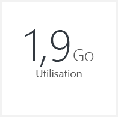
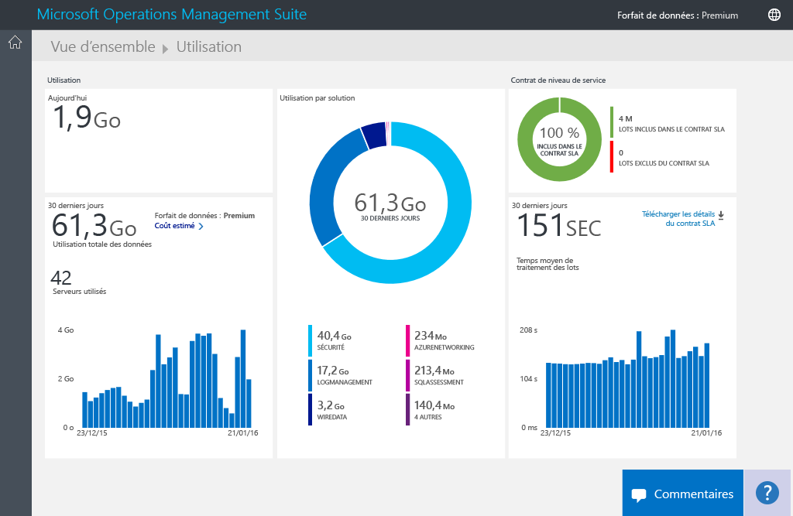
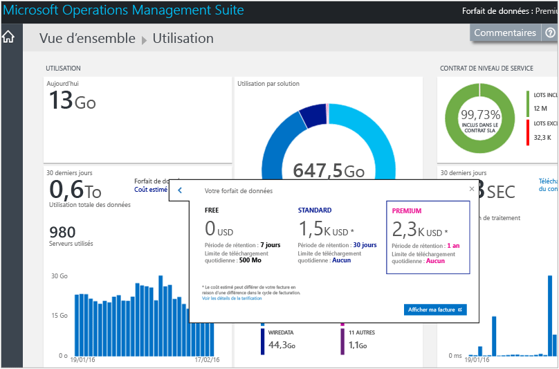
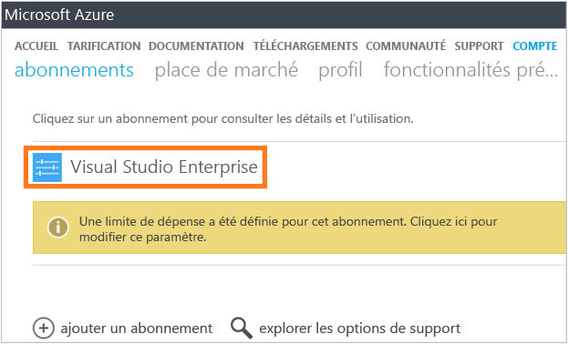
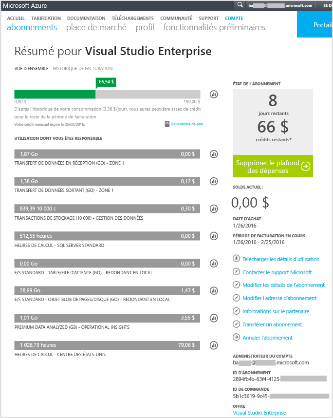
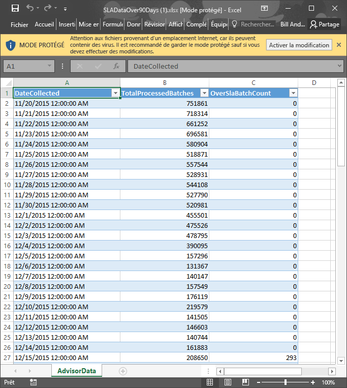

# Analyser l’utilisation des données dans Log Analytics
Log Analytics, qui fait partie de l’Operations Management Suite (OMS), collecte les données et les envoie au service OMS à intervalles réguliers.  Vous pouvez utiliser la page **Utilisation** pour afficher la quantité de données envoyées au service OMS. La page **Utilisation** vous indique également la quantité de données envoyées quotidiennement par les solutions et la fréquence à laquelle vos serveurs envoient des données.

> [!NOTE]
> Si vous disposez d’un compte gratuit créé avec le [site OMS](http://www.microsoft.com/oms), vos envois au service OMS sont limités à 500 Mo de données par jour. Si vous atteignez la limite quotidienne, l’analyse de données s’arrête et reprend le jour suivant. Vous devrez également renvoyer toute donnée n’ayant pas été acceptée ou traitée par OMS.
> 
> 

Vous pouvez consulter votre utilisation à l’aide de la mosaïque **Utilisation** sur le tableau de bord **Aperçu** d’OMS.

Si vous avez dépassé votre limite d’utilisation quotidienne ou si vous en êtes proche, vous pouvez éventuellement supprimer une solution pour réduire la quantité de données que vous envoyez au service OMS. Pour plus d'informations sur la suppression de solutions, consultez [Ajouter des solutions Log Analytics à partir de la galerie de solutions](log-analytics-add-solutions.md).

La page **Utilisation** affiche les informations suivantes :

* Utilisation moyenne par jour
* Utilisation des données pour chaque solution au cours des 30 derniers jours
* Quantité de données envoyées par les serveurs de votre environnement au service OMS au cours des 30 derniers jours
* Niveau tarifaire et coût estimé de votre forfait de données
* Informations sur votre contrat de niveau de service (SLA), y compris le temps nécessaire à OMS pour traiter vos données

## Utilisation des données d’utilisation
1. Sur la page **Aperçu**, cliquez sur la mosaïque **Utilisation**.
2. Sur la page **Utilisation** , affichez les catégories d’utilisation qui montrent les domaines vous intéressant.
3. Si l’une de vos solutions consomme une trop grande partie de votre quota de téléchargement quotidien, vous pouvez envisager la suppression de cette solution.

## Pour afficher votre coût estimé et vos informations de facturation
1. Sur la page **Aperçu**, cliquez sur la mosaïque **Utilisation**.
2. Sur la page **Utilisation**, sous **Utilisation**, cliquez sur le chevron (**>**) situé en regard de la zone **Coût estimé**.
3. Dans les informations détaillées sur **Votre forfait de données** , vous pouvez voir votre estimation de coût mensuel.  
    
4. Si vous souhaitez afficher vos informations de facturation, cliquez sur **Afficher ma facture** pour afficher les informations de votre abonnement.
   * Sur la page Abonnements, cliquez sur votre abonnement pour afficher les détails ainsi qu’une liste d'éléments d'utilisation.  
       
   * Sur la page Résumé de votre abonnement, vous pouvez effectuer diverses tâches pour gérer et afficher plus de détails sur votre abonnement.  
       

## Pour afficher les lots de données de votre contrat SLA
1. Sur la page **Aperçu**, cliquez sur la mosaïque **Utilisation**.
2. Sous **Contrat de niveau de service**, cliquez sur **Télécharger les informations sur le contrat SLA**.
3. Un fichier Excel XLSX se télécharge et peut être consulté.  
    

## Étapes suivantes
* Consultez [Consigner les recherches dans Log Analytics](log-analytics-log-searches.md) pour afficher les informations détaillées collectées par les solutions.

<!--HONumber=Nov16_HO2-->

