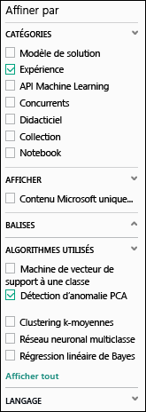
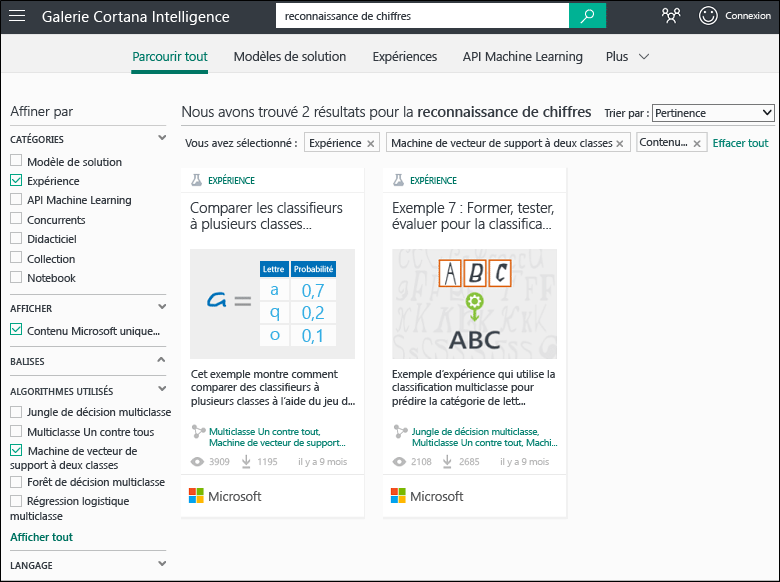
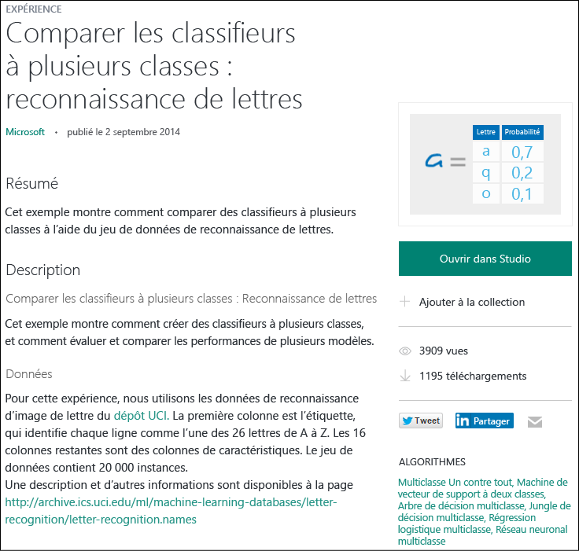

# Copier des exemples d’expérience pour créer des expériences machine Learning
Découvrez comment démarrer avec des exemples d’expérience de la [galerie Cortana Intelligence](http://gallery.cortanaintelligence.com/) au lieu de créer des expériences Machine Learning de toutes pièces. Vous pouvez utiliser les exemples pour créer votre propre solution Machine Learning.

La galerie contient des exemples d’expérience de l’équipe Microsoft Azure Machine Learning, ainsi que des exemples partagés par la communauté Machine Learning. Vous pouvez poser des questions ou publier des commentaires sur les expériences.

Pour voir comment utiliser la galerie, regardez la vidéo de 3 minutes [Copier le travail d’autres personnes pour des projets de science des données](machine-learning-data-science-for-beginners-copy-other-peoples-work-to-do-data-science.md) issue de la série [Science des données pour les débutants](machine-learning-data-science-for-beginners-the-5-questions-data-science-answers.md).

[!INCLUDE [machine-learning-free-trial](../../includes/machine-learning-free-trial.md)]

## Rechercher une expérience à copier dans la galerie Cortana Intelligence
Pour afficher les expériences disponibles dans la galerie, rendez-vous dans la [Galerie](http://gallery.cortanaintelligence.com/), puis cliquez sur **Expériences** en haut de la page.

### Rechercher les expériences les plus récentes ou les plus populaires
Dans cette page, vous pouvez afficher les expériences **récemment ajoutées**, consulter **les plus populaires** ou découvrir les toutes dernières **expériences Microsoft les plus populaires**.

### Rechercher une expérience qui remplit les conditions requises
Pour parcourir toutes les expériences :

1. Cliquez sur **Browse all** (Parcourir tout) en haut de la page.
2. Sous **Refine by** (Affiner par), sélectionnez **Experiment** (Expérience) pour afficher toutes les expériences de la galerie.
3. Vous y trouverez des expériences qui répondent à vos besoins de différentes façons :
   * **Sélectionnez des filtres sur la gauche.** Par exemple, pour parcourir les expériences utilisant un algorithme de détection des anomalies PCA, sélectionnez **Experiment** (Expérience) sous **Catégories**, puis **PCA-Based Anomaly Detection** (Détection des anomalies PCA) sous **Algorithms Used** (Algorithmes utilisés). (Si vous ne voyez pas cet algorithme, cliquez sur **Afficher tout** en bas de la liste.)   
   * **Utilisez la zone de recherche.** Par exemple, pour rechercher les expériences partagées par Microsoft sur la reconnaissance de chiffres et qui utilisent un algorithme de machine à vecteurs de support à deux classes, entrez « reconnaissance de chiffres » dans la zone de recherche. Puis sélectionnez les filtres **Experiment** (Expérience), **Microsoft content only** (Contenu Microsoft uniquement) et **Two-Class Support Vector Machine** (Machine à vecteurs de support à deux classes) : 
4. Cliquez sur une expérience pour en savoir plus à propos de celle-ci.
5. Pour exécuter et/ou modifier l’expérience, cliquez sur **Ouvrir dans Studio** sur la page de l’expérience.
   
   > [!NOTE]
   > Pour ouvrir une expérience dans Machine Learning Studio, vous devez vous connecter avec les informations d’identification de votre compte Microsoft. Si vous n'avez pas encore d'espace de travail Machine Learning, un espace de travail d'essai gratuit est créé. [Que comprend l’essai gratuit de Machine Learning ?](https://azure.microsoft.com/pricing/details/machine-learning/)
   > 
   > 
   
    

## Utiliser un modèle dans Machine Learning Studio
Vous pouvez également créer une expérience dans Machine Learning Studio en prenant un exemple de la galerie comme modèle.

1. Connectez-vous à [Studio](https://studio.azureml.net) avec les informations d’identification de votre compte Microsoft, puis cliquez sur **Nouveau** pour créer une expérience.
2. Parcourez les exemples de contenu, puis cliquez sur l’un d’entre eux.

Une expérience est créée dans votre espace de travail, et l’exemple d’expérience sert de modèle.

## Étapes suivantes
* [Préparez de vos données](machine-learning-data-science-import-data.md)
* [Essayez d'utiliser R dans votre expérience](machine-learning-r-quickstart.md)
* [Passez en revue les exemples d'expériences ](machine-learning-r-csharp-web-service-examples.md)
* [Création d’une API de service web](machine-learning-publish-a-machine-learning-web-service.md)
* [Parcourez des applications prêtes à l'emploi](https://datamarket.azure.com/browse?query=machine+learning)

<!---HONumber=AcomDC_0914_2016-->