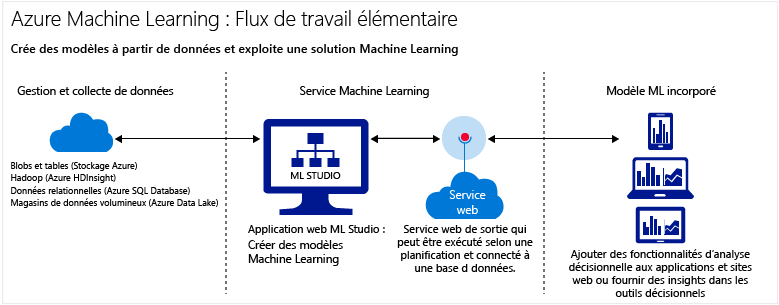

<properties
    pageTitle="Qu’est-ce que Machine Learning sur Azure ? | Microsoft Azure"
    description="Explique les concepts de base du service d’apprentissage automatique entièrement géré, une technologie sur le cloud qui vous permet de créer, de mettre en service et de commercialiser des solutions."
	keywords="qu'est-ce que l'apprentissage automatique,technologie cloud,prédictive,qu'est-ce que l'analyse prédictive,configurer"
	services="machine-learning"
    documentationCenter=""
    authors="cjgronlund"
    manager="paulettm"
    editor="cgronlun"/>

<tags
    ms.service="machine-learning"
    ms.workload="data-services"
    ms.tgt_pltfrm="na"
    ms.devlang="na"
    ms.topic="article"
    ms.date="02/02/2016"
    ms.author="cgronlun;tedway;olgali"/>

# Présentation de l’apprentissage automatique sur Microsoft Azure

## L’apprentissage automatique - De quoi s’agit-il ?

L’apprentissage automatique utilise des ordinateurs pour exécuter des modèles prédictifs qui apprennent à partir de données existantes afin de prévoir les tendances, résultats et comportements futurs.

Ces prévisions ou prédictions générées à partir de l’apprentissage automatique peuvent rendre les applications et les appareils plus intelligents. Lorsque vous faites vos achats en ligne, l’apprentissage automatique permet de recommander d’autres produits que vous êtes susceptible d’aimer, en fonction de ce que vous avez acheté. Lorsque vous utilisez votre carte de crédit, l’apprentissage automatique compare la transaction à une base de données de transactions et aide la banque à détecter des fraudes.

## Qu’est-ce que Machine Learning sur Microsoft Azure ?

Azure Machine Learning est un puissant service d’analyse prédictive sur le cloud qui permet de créer et de déployer rapidement des modèles prédictifs sous forme de solutions d’analyse.

Azure Machine Learning fournit non seulement des outils pour modeler les analyses prédictives, mais également un service entièrement géré que vous pouvez utiliser pour déployer vos modèles prédictifs en tant que services web prêts à l’emploi. Azure Machine Learning fournit des outils pour créer des solutions complètes d’analyse prédictive sur le cloud : créer, tester, mettre en service et gérer rapidement des modèles prédictifs. Vous n’avez pas besoin d’acheter de matériel ni de gérer manuellement des machines virtuelles.

[AZURE.INCLUDE [machine-learning-free-trial](../../includes/machine-learning-free-trial.md)]

## Qu’est-ce qu’une analyse prédictive ?

Les analyses prédictives utilisent diverses techniques statistiques (l’apprentissage automatique, dans ce cas) pour analyser les données collectées ou actuelles des schémas ou des tendances afin de prévoir des événements futurs.

Azure Machine Learning est particulièrement efficace pour effectuer des analyses prédictives : vous pouvez travailler à partir d’une bibliothèque d’algorithmes prête à l’emploi, créer des modèles sur un ordinateur connecté à Internet sans acheter d’équipement ou d’infrastructure supplémentaire et déployer rapidement votre solution prédictive. Vous pouvez également trouver des exemples et des solutions prêts à l’emploi dans [Microsoft Azure Marketplace](https://datamarket.azure.com/browse?query=machine+learning) ou dans la [Galerie Cortana Analytics](http://gallery.azureml.net/) (anciennement, Galerie Azure Machine Learning).

## Génération de solutions complètes d’apprentissage automatique sur le cloud

Azure Machine Learning a tout ce dont vous avez besoin pour créer des solutions d’analyse prédictive sur le cloud, d’une bibliothèque d’algorithmes volumineuse à un studio pour générer des modèles ou à un moyen facile de déployer votre modèle en tant que service web.

### Machine Learning Studio : création de modèles prédictifs

Créez des modèles prédictifs dans [Machine Learning Studio](machine-learning-what-is-ml-studio.md), un outil basé sur un navigateur, en déplaçant les modules et en les connectant les uns aux autres.

* Utilisez une volumineuse bibliothèque d'[algorithmes et de modules Machine Learning](https://msdn.microsoft.com/library/azure/f5c746fd-dcea-4929-ba50-2a79c4c067d7) dans Machine Learning Studio afin de lancer vos modèles prédictifs. À partir d’une bibliothèque d’exemples d’expériences, choisissez les packages R et Python, ainsi que les meilleurs algorithmes Microsoft tels que Xbox et Bing. Développez les modules Studio avec vos propres scripts personnalisés [R](machine-learning-r-quickstart.md) et [Python](machine-learning-execute-python-scripts.md).
* Dans la [Galerie Cortana Analytics](machine-learning-gallery-how-to-use-contribute-publish.md), vous pouvez essayer les solutions d’analyse créées par d’autres personnes ou proposer la vôtre à l’aide des services Azure, notamment Machine Learning, HDInsight (Hadoop), Stream Analytics et Data Lake Analytics, ainsi que les services de gestion de données et les magasins Big Data Azure. Publiez vos questions ou commentaires sur vos expériences à l’intention de la communauté, ou partagez des liens vers des expériences via les réseaux sociaux tels que LinkedIn et Twitter.  

	

### Mise en service de solutions d’analyse prédictive : achat de services web ou publication de vos propres services web

* Achetez des services web prêts à l'emploi à partir de [Microsoft Azure Marketplace](https://datamarket.azure.com/browse?query=machine+learning), comme des recommandations, des analyses de texte ou une détection d'anomalie.

* Mettez en service vos modèles d’analyse prédictive :
    * [Déployez des services web](machine-learning-publish-a-machine-learning-web-service.md)
    * [Formez et reformez des modèles via les API](machine-learning-retrain-models-programmatically.md)
    * [Gérez les points de terminaison des services web](machine-learning-create-endpoint.md)
    * [Mettez à l’échelle des services web](machine-learning-scaling-endpoints.md)
    * [Utilisez des services web](machine-learning-consume-web-services.md)

## Concepts clé et terminologie de l’apprentissage automatique
### Exploration des données, analyse descriptive et analyse prédictive

L'**exploration des données** est le processus de collecte des informations sur un jeu de données volumineux et souvent non structuré, afin d'y trouver des caractéristiques pour une analyse ciblée. Le terme anglais **Data mining** fait référence à l'exploration automatisée des données.

Une **analyse descriptive** est le processus d'analyse d'un jeu de données afin de synthétiser ce qui s'est passé. La majeure partie des analyses commerciales, comme les rapports de ventes, les mesures du web et l’analyse de réseaux sociaux, est descriptive.

Une **analyse prédictive** est le processus de création de modèles à partir de données historiques ou actuelles afin de prévoir les futurs résultats.

### Apprentissage supervisé et non supervisé
 Les algorithmes d'**apprentissage supervisé** sont formés avec des données étiquetées, c'est-à-dire des données composées d'exemples de réponses souhaitées. Par exemple, un modèle qui identifie l’usage frauduleux d’une carte de crédit est formé à partir d’un jeu de données dans lequel les points de données indiquant des utilisations frauduleuses et valides connues ont été étiquetés. La plupart des apprentissages automatiques sont supervisés.

 L'**apprentissage non supervisé** est utilisé sur les données sans étiquette. L'objectif est alors de trouver des relations entre les données. Par exemple, vous voulez trouver des groupes de données démographiques de clients avec des habitudes d’achat similaires.

### Formation et évaluation du modèle
Un modèle d’apprentissage automatique est une abstraction de la question à laquelle vous essayez de répondre ou le résultat que vous souhaitez prédire. Les modèles sont formés et évalués à partir de données existantes.

#### Formation à partir de données
Dans Azure Machine Learning, un modèle est créé à partir d’un module d’algorithme qui traite les données d’apprentissage et à partir de modules fonctionnels, tels qu’un module d’évaluation.

Dans le cadre d’un apprentissage supervisé, si vous formez un modèle de détection des fraudes, vous utilisez un ensemble de transactions étiquetées comme frauduleuses ou valides. Vous allez fractionner votre jeu de données de manière aléatoire et allez en utiliser une partie pour former le modèle et l’autre partie pour tester ou évaluer le modèle.

#### Données d’évaluation
Une fois que votre modèle est formé, évaluez-le en utilisant les autres données de test. Vous utilisez des données dont vous connaissez déjà les résultats afin de pouvoir déterminer si votre modèle prédit correctement.

### Autres termes courants relatifs à l’apprentissage automatique

* **Algorithme** : ensemble de règles autonome utilisé pour résoudre les problèmes de traitement des données, de calcul ou de raisonnement automatisé.
* **Données catégorielles** : données organisées en catégories et pouvant être divisées en groupes. Par exemple, un jeu de données catégorielles relatif à des véhicules peut spécifier l’année, la marque, le modèle et le prix.
* **Classification** : modèle d'organisation des points de données en catégories basées sur un jeu de données dont les groupes de catégorie sont déjà connus.
* **Conception de caractéristiques** : processus d'extraction ou de sélection des caractéristiques liées à un jeu de données afin d'améliorer ce dernier et les résultats. Par exemple, les données relatives aux prix des billets d’avion peuvent être améliorées par jour de la semaine et par période de vacance. Consultez la page [Ingénierie et sélection de caractéristiques dans Azure Machine Learning](machine-learning-feature-selection-and-engineering.md).
* **Module** : élément fonctionnel dans un modèle de Machine Learning Studio, tel que le module Données d’entrée qui permet d’entrer et de modifier de petits jeux de données. Un algorithme est également un type de module dans Machine Learning Studio.
* **Modèle** : dans le cadre d'un apprentissage supervisé, un modèle est le produit d'une expérience d'apprentissage automatique constituée d'un jeu de données formé, d'un module d'algorithme et de modules fonctionnels, tels qu'un module d'évaluation.
* **Données numériques** : données qui ont une signification sous forme de mesures (données continues) ou de compteurs (données discrètes). Également appelées *données quantitatives*.
* **Partition** : méthode permettant de diviser les données en échantillons. Consultez la page [Partition et échantillon](https://msdn.microsoft.com/library/azure/dn905960.aspx) pour plus d'informations.
* **Prédiction** : prévision d'une valeur ou de plusieurs valeurs, à partir d'un modèle d'apprentissage automatique. Le terme « note prédite » peut également être utilisé. Toutefois, les notes prédites ne sont pas le résultat final d’un modèle. L’évaluation du modèle suit la note.
* **Régression** : modèle permettant de prédire une valeur continue en fonction de variables indépendantes, par exemple, la prédiction du prix d'une voiture en fonction de son année et de sa marque.
* **Note** : valeur prédite générée à partir d'un modèle formé de régression ou de classification, à l'aide du module [Noter le modèle](https://msdn.microsoft.com/library/azure/dn905995.aspx) dans Machine Learning Studio. Les modèles de classification retournent également une note pour la probabilité de la valeur prédite. Une fois que vous avez généré les notes à partir d'un modèle, vous pouvez évaluer la précision du modèle à l'aide du module [Évaluer le modèle](https://msdn.microsoft.com/library/azure/dn905915.aspx).
* **Échantillon** : partie d'un jeu de données destinée à être représentative de l'ensemble. Les échantillons peuvent être sélectionnés de manière aléatoire ou sur la base de fonctionnalités spécifiques du jeu de données.

## Étapes suivantes
Vous pouvez apprendre les principes fondamentaux de l’analyse prédictive et de l’apprentissage automatique à l’aide d’un [didacticiel](machine-learning-create-experiment.md) et avec la [génération à partir d’exemples](machine-learning-sample-experiments.md).

<!-- Module References -->
[learning-with-counts]: https://msdn.microsoft.com/library/azure/81c457af-f5c0-4b2d-922c-fdef2274413c/

<!---HONumber=AcomDC_0204_2016-->